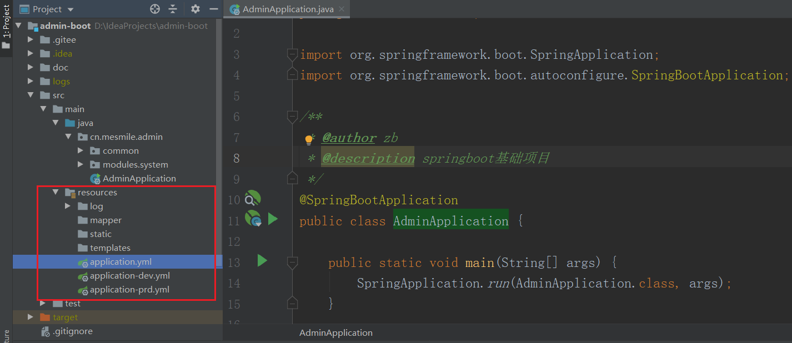
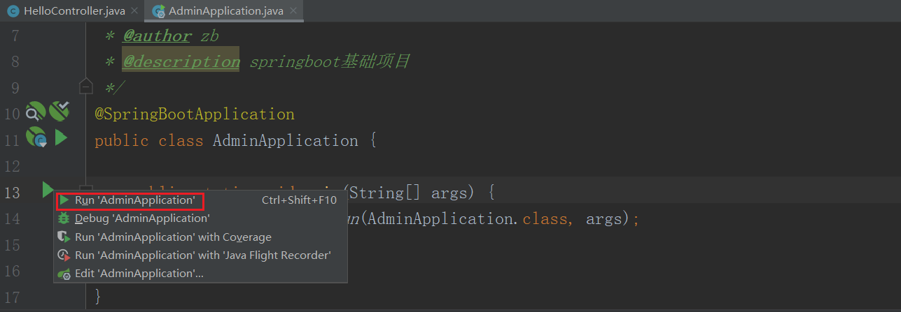
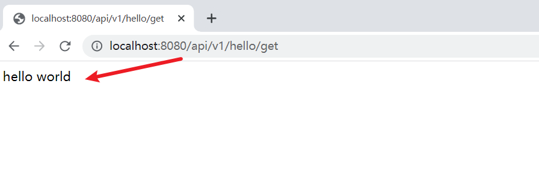

# (一)搭建springboot基础架构

## 目录

*   [一、新建maven项目](#一新建maven项目)

*   [二、编写应用启动类](#二编写应用启动类)

*   [三、新建编写yaml配置文件](#三新建编写yaml配置文件)

*   [四、编写controller类测试项目](#四编写controller类测试项目)

## 一、新建maven项目

pom.xml文件如下:

```xml
<?xml version="1.0" encoding="UTF-8"?>
<project xmlns="http://maven.apache.org/POM/4.0.0"
         xmlns:xsi="http://www.w3.org/2001/XMLSchema-instance"
         xsi:schemaLocation="http://maven.apache.org/POM/4.0.0 http://maven.apache.org/xsd/maven-4.0.0.xsd">
    <modelVersion>4.0.0</modelVersion>

    <groupId>cn.mesmile</groupId>
    <artifactId>admin</artifactId>
    <version>1.0.0-release</version>
    <name>admin</name>
    <description>base admin project for Spring Boot</description>

    <properties>
        <admin.project.id>admin-boot</admin.project.id>
        <project.build.sourceEncoding>UTF-8</project.build.sourceEncoding>
        <project.reporting.outputEncoding>UTF-8</project.reporting.outputEncoding>
        <java.version>1.8</java.version>
        <maven.compiler.source>1.8</maven.compiler.source>
        <maven.compiler.target>1.8</maven.compiler.target>
        <maven-jar-plugin.version>3.1.1</maven-jar-plugin.version>
        <spring.boot.version>2.6.9</spring.boot.version>
        <mybatis.plus.spring.boot>3.5.1</mybatis.plus.spring.boot>
    </properties>

    <!--锁定版本-->
    <dependencyManagement>
        <dependencies>
            <dependency>
                <groupId>org.springframework.boot</groupId>
                <artifactId>spring-boot-dependencies</artifactId>
                <version>${spring.boot.version}</version>
                <type>pom</type>
                <scope>import</scope>
            </dependency>

        </dependencies>
    </dependencyManagement>

    <dependencies>
        <dependency>
            <groupId>org.springframework.boot</groupId>
            <artifactId>spring-boot-starter-web</artifactId>
        </dependency>

        <dependency>
            <groupId>org.springframework.boot</groupId>
            <artifactId>spring-boot-configuration-processor</artifactId>
            <optional>true</optional>
        </dependency>

        <dependency>
            <groupId>org.projectlombok</groupId>
            <artifactId>lombok</artifactId>
            <optional>true</optional>
        </dependency>

        <dependency>
            <groupId>org.springframework.boot</groupId>
            <artifactId>spring-boot-starter-test</artifactId>
            <scope>test</scope>
        </dependency>

    </dependencies>

    <build>
        <finalName>${admin.project.id}</finalName>
        <resources>
            <resource>
                <directory>src/main/resources</directory>
            </resource>
            <resource>
                <directory>src/main/java</directory>
                <includes>
                    <include>**/*.xml</include>
                </includes>
            </resource>
        </resources>
        <plugins>
            <plugin>
                <groupId>org.springframework.boot</groupId>
                <artifactId>spring-boot-maven-plugin</artifactId>
                <version>${spring.boot.version}</version>
                <executions>
                    <!-- repackage： 最主要的是要添加 repackage goal，用来重新打包。-->
                    <execution>
                        <goals>
                            <goal>repackage</goal>
                        </goals>
                    </execution>
                </executions>
                <configuration>
                    <fork>true</fork>
                    <addResources>true</addResources>
                    <excludes>
                        <!--减少打成引入配置提醒类后jar包的大小-->
                        <exclude>
                            <groupId>org.springframework.boot</groupId>
                            <artifactId>spring-boot-configuration-processor</artifactId>
                        </exclude>
                        <exclude>
                            <groupId>org.projectlombok</groupId>
                            <artifactId>lombok</artifactId>
                        </exclude>
                    </excludes>
                </configuration>
            </plugin>
        </plugins>
    </build>

</project>

```

## 二、编写应用启动类

```java
package cn.mesmile.admin;

import org.springframework.boot.SpringApplication;
import org.springframework.boot.autoconfigure.SpringBootApplication;

/**
 * @author zb
 * @description springboot基础项目
 */
@SpringBootApplication
public class AdminApplication {

    public static void main(String[] args) {
        SpringApplication.run(AdminApplication.class, args);
    }

}

```

## 三、新建编写yaml配置文件

以下配置文件均在：\admin-boot\src\main\resources目录下

新建application.yml 内容如下

```yaml
# 指定端口号
server:
  port: 8080
# 激活制定分支
spring:
  profiles:
    active: dev
  # 设置应用名
  application:
    name: admin
```

新建application-dev.yml  开发分支配置文件

新建application-prd.yml  生产分支配置文件



## 四、编写controller类测试项目

```java
package cn.mesmile.admin.modules.system.controller;

import cn.mesmile.admin.common.result.R;
import lombok.extern.slf4j.Slf4j;
import org.springframework.web.bind.annotation.GetMapping;
import org.springframework.web.bind.annotation.RequestMapping;
import org.springframework.web.bind.annotation.RestController;

/**
 * @author zb
 * @Description
 */
@Slf4j
@RequestMapping("/api/v1/hello")
@RestController
public class HelloController {

    @GetMapping("/get")
    public String hello () {
        return "hello world";
    }

}
```

通过应用启动类启动项目：



在浏览器输入：[http://localhost:8080/api/v1/hello/get](http://localhost:8080/api/v1/hello/get "http://localhost:8080/api/v1/hello/get")

获得响应结果说明项目启动成功


