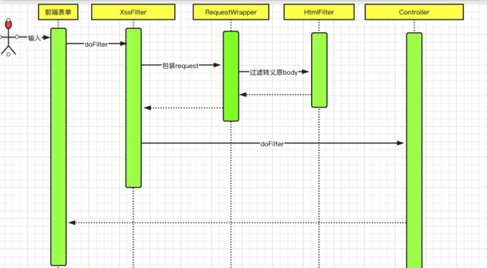
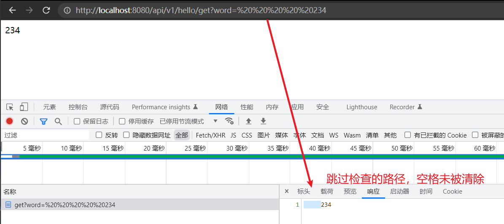
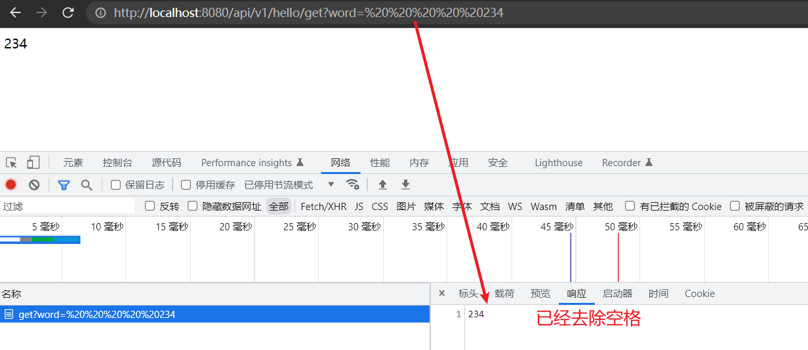

# (七)全局处理字符串两边空格

## 目录

*   [一、相关代码](#一相关代码)

    *   [SpaceProperties 配置属性 ](#spaceproperties-配置属性-)

    *   [SpaceHttpServletRequestWrapper 请求包装器](#spacehttpservletrequestwrapper-请求包装器)

    *   [SpaceRequestFilter 过滤器](#spacerequestfilter-过滤器)

    *   [注册过滤器](#注册过滤器)

*   [二、测试](#二测试)

## 一、相关代码

原理都是利用过滤器，和预防 xss 攻击的原理几乎一致



1、前端请求进入到SpaceFilter

2、包装request

3、过滤转义原来的body

4、进入其他过滤器，后到达controller

5、返回数据给前端

### SpaceProperties 配置属性&#x20;

```java
package cn.mesmile.admin.common.filter.space;

import lombok.Data;
import org.springframework.boot.context.properties.ConfigurationProperties;

import java.util.HashSet;
import java.util.Set;

/**
 * 去除请求中字符串两边空格
 * @author zb
 */
@ConfigurationProperties("security.space")
@Data
public class SpaceProperties {

    /**
     *  是否开启去除空格
     */
    private Boolean enabled = true;

    /**
     *  放行拦截的路径
     */
    private Set<String> skipUrl = new HashSet<>();


}
```

### SpaceHttpServletRequestWrapper 请求包装器

```java
package cn.mesmile.admin.common.filter.space;

import cn.hutool.core.util.StrUtil;
import cn.mesmile.admin.common.filter.xss.StringJsonUtils;
import cn.mesmile.admin.common.utils.WebUtil;
import com.alibaba.fastjson.JSONObject;
import lombok.extern.slf4j.Slf4j;

import javax.servlet.ReadListener;
import javax.servlet.ServletInputStream;
import javax.servlet.http.HttpServletRequest;
import javax.servlet.http.HttpServletRequestWrapper;
import java.io.BufferedReader;
import java.io.ByteArrayInputStream;
import java.io.IOException;
import java.io.InputStreamReader;
import java.util.Iterator;
import java.util.LinkedHashMap;
import java.util.Map;

/**
 * xss过滤包装器
 * @author zb
 */
@Slf4j
public class SpaceHttpServletRequestWrapper extends HttpServletRequestWrapper {
    private final HttpServletRequest orgRequest;
    private byte[] body;

    public SpaceHttpServletRequestWrapper(HttpServletRequest request) {
        super(request);
        this.orgRequest = request;
    }

    @Override
    public BufferedReader getReader() throws IOException {
        return new BufferedReader(new InputStreamReader(this.getInputStream()));
    }

    @Override
    public ServletInputStream getInputStream() throws IOException {
        if (super.getHeader("Content-Type") == null) {
            return super.getInputStream();
        } else if (super.getHeader("Content-Type").startsWith("multipart/form-data")) {
            return super.getInputStream();
        } else {
            if (this.body == null) {
                String requestBody = WebUtil.getRequestBody(super.getInputStream());
                // 去除两边空格
                if (StrUtil.isNotEmpty(requestBody)){
                    // 去除json字符串中所有类型为string两边的空格
                    Map<String, Object> stringObjectMap = StringJsonUtils.
                            jsonStringToMapAndTrim(requestBody, false, true);
                    requestBody = JSONObject.toJSONString(stringObjectMap);
                }else {
                    // 为空则直接返回
                    return super.getInputStream();
                }
                this.body = requestBody.getBytes();
            }
            final ByteArrayInputStream byteArrayInputStream = new ByteArrayInputStream(this.body);
            return new ServletInputStream() {
                @Override
                public int read() {
                    return byteArrayInputStream.read();
                }
                @Override
                public boolean isFinished() {
                    return false;
                }
                @Override
                public boolean isReady() {
                    return false;
                }
                @Override
                public void setReadListener(ReadListener readListener) {
                }
            };
        }
    }

    @Override
    public String getParameter(String name) {
        String value = super.getParameter(this.spaceTrim(name));
        if (StrUtil.isNotBlank(value)) {
            value = this.spaceTrim(value);
        }
        return value;
    }

    @Override
    public String[] getParameterValues(String name) {
        String[] parameters = super.getParameterValues(name);
        if (parameters != null && parameters.length != 0) {
            for(int i = 0; i < parameters.length; ++i) {
                parameters[i] = this.spaceTrim(parameters[i]);
            }
            return parameters;
        } else {
            return null;
        }
    }

    @Override
    public Map<String, String[]> getParameterMap() {
        Map<String, String[]> map = new LinkedHashMap();
        Map<String, String[]> parameters = super.getParameterMap();
        Iterator iterator = parameters.keySet().iterator();
        while(iterator.hasNext()) {
            String key = (String)iterator.next();
            String[] values = (String[])parameters.get(key);
            for(int i = 0; i < values.length; ++i) {
                values[i] = this.spaceTrim(values[i]);
            }
            map.put(key, values);
        }
        return map;
    }

    @Override
    public String getHeader(String name) {
        String value = super.getHeader(this.spaceTrim(name));
        if (StrUtil.isNotBlank(value)) {
            value = this.spaceTrim(value);
        }
        return value;
    }


    private String spaceTrim(String input) {
        // 去除字符串两边空格
        return StrUtil.trim(input);
    }

    public HttpServletRequest getOrgRequest() {
        return this.orgRequest;
    }

    public static HttpServletRequest getOrgRequest(HttpServletRequest request) {
        return request instanceof SpaceHttpServletRequestWrapper ? ((SpaceHttpServletRequestWrapper)request).getOrgRequest() : request;
    }
}

```

### SpaceRequestFilter 过滤器

```java
package cn.mesmile.admin.common.filter.space;

import org.springframework.util.AntPathMatcher;

import javax.servlet.*;
import javax.servlet.http.HttpServletRequest;
import java.io.IOException;

/***
 * 自定义space过滤器
 * @author zb
 */
public class SpaceRequestFilter implements Filter {

    private final SpaceProperties spaceProperties;
    private final AntPathMatcher antPathMatcher = new AntPathMatcher();

    @Override
    public void init(FilterConfig config) {
    }

    @Override
    public void doFilter(ServletRequest request, ServletResponse response, FilterChain chain) throws IOException, ServletException {
        String path = ((HttpServletRequest) request).getServletPath();
        if (this.spaceProperties.getEnabled() && !this.isSpaceSkip(path)) {
            SpaceHttpServletRequestWrapper spaceRequest = new SpaceHttpServletRequestWrapper((HttpServletRequest) request);
            chain.doFilter(spaceRequest, response);
        } else {
            chain.doFilter(request, response);
        }
    }

    private boolean isSpaceSkip(String path) {
        return this.spaceProperties.getSkipUrl().stream().anyMatch((pattern) -> {
            return this.antPathMatcher.match(pattern, path);
        });
    }

    @Override
    public void destroy() {
    }

    public SpaceRequestFilter(final SpaceProperties spaceProperties) {
        this.spaceProperties = spaceProperties;
    }
}
```

### 注册过滤器

```java
package cn.mesmile.admin.common.filter;

import cn.mesmile.admin.common.filter.space.SpaceProperties;
import cn.mesmile.admin.common.filter.space.SpaceRequestFilter;
import cn.mesmile.admin.common.filter.xss.XssProperties;
import cn.mesmile.admin.common.filter.xss.XssRequestFilter;
import org.springframework.boot.context.properties.EnableConfigurationProperties;
import org.springframework.boot.web.servlet.FilterRegistrationBean;
import org.springframework.context.annotation.Bean;
import org.springframework.context.annotation.Configuration;

import javax.servlet.DispatcherType;

/**
 * @author zb
 * @Description 配置注册过滤器
 */
@Configuration(
        proxyBeanMethods = false
)
@EnableConfigurationProperties({XssProperties.class, SpaceProperties.class})
public class RequestConfiguration {

    private final SpaceProperties spaceProperties;
    private final XssProperties xssProperties;

    @Bean
    public FilterRegistrationBean<XssRequestFilter> xssFilterRegistration() {
        FilterRegistrationBean<XssRequestFilter> registration = new FilterRegistrationBean();
        registration.setDispatcherTypes(DispatcherType.REQUEST, new DispatcherType[0]);
        registration.setFilter(new XssRequestFilter(this.xssProperties));
        registration.addUrlPatterns(new String[]{"/*"});
        registration.setName("xssRequestFilter");
        registration.setOrder(Integer.MAX_VALUE);
        return registration;
    }

    @Bean
    public FilterRegistrationBean<SpaceRequestFilter> spaceFilterRegistration() {
        FilterRegistrationBean<SpaceRequestFilter> registration = new FilterRegistrationBean();
        registration.setDispatcherTypes(DispatcherType.REQUEST, new DispatcherType[0]);
        registration.setFilter(new SpaceRequestFilter(this.spaceProperties));
        registration.addUrlPatterns(new String[]{"/*"});
        registration.setName("spaceRequestFilter");
        registration.setOrder(Integer.MAX_VALUE - 1);
        return registration;
    }

    public RequestConfiguration(final XssProperties xssProperties,final SpaceProperties spaceProperties) {
        this.xssProperties = xssProperties;
        this.spaceProperties = spaceProperties;
    }

}

```

## 二、测试

```java
package cn.mesmile.admin.modules.system.controller;

import lombok.extern.slf4j.Slf4j;
import org.springframework.web.bind.annotation.GetMapping;
import org.springframework.web.bind.annotation.RequestMapping;
import org.springframework.web.bind.annotation.RequestParam;
import org.springframework.web.bind.annotation.RestController;

/**
 * @author zb
 * @Description
 */
@Slf4j
@RequestMapping("/api/v1/hello")
@RestController
public class HelloController {

    @GetMapping("/get")
    public String hello (@RequestParam("word") String word) {
        return word;
    }

}

```

修改application-dev.yml里面的配置，先跳过测试路径

```yaml
# 去除空格相关配置
security:
  space:
    enabled: true
    # 先跳过检查路径
    skip-url:
      - /api/v1/hello/**
```



修改application-dev.yml里面的配置,不跳过测试路径

```yaml
# 去除空格相关配置
security:
  space:
    enabled: true
    # 先跳过检查路径
    skip-url:
      - /api
```


