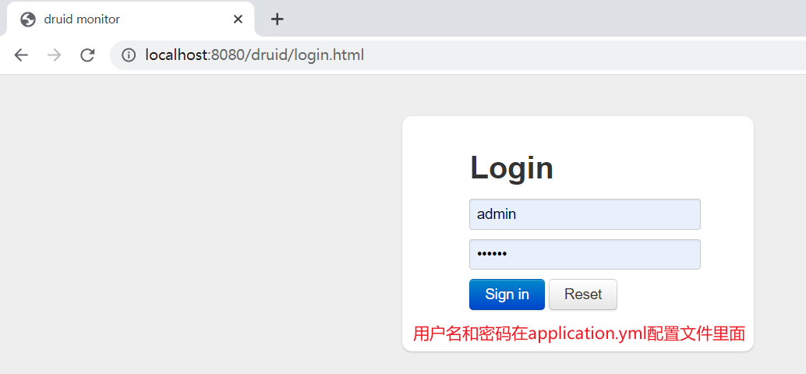

# (三)整合alibaba druid 连接池

## 目录

*   [一、导入druid依赖](#一导入druid依赖)

*   [二、修改项目配置文件](#二修改项目配置文件)

*   [三、启动项目验证](#三启动项目验证)

## 一、导入druid依赖

将druid项目依赖加入到pom.xml文件中

```xml
<!-- 阿里数据库连接池 -->
    <dependency>
        <groupId>com.alibaba</groupId>
        <artifactId>druid-spring-boot-starter</artifactId>
        <version>1.2.8</version>
    </dependency>
```

## 二、修改项目配置文件

配置文件均在  \admin-boot\src\main\resources 目录下

修改 application.yml配置文件

```yaml
server:
  port: 8080

spring:
  profiles:
    active: dev
  application:
    name: admin

  # 数据连接池
  datasource:
    #driver-class-name: com.mysql.cj.jdbc.Driver
    #driver-class-name: org.postgresql.Driver
    #driver-class-name: oracle.jdbc.OracleDriver
    #driver-class-name: com.microsoft.sqlserver.jdbc.SQLServerDriver
    type: com.alibaba.druid.pool.DruidDataSource
    druid:
      # MySql、PostgreSQL、SqlServer校验
      validation-query: select 1
      # Oracle校验
      #validation-query: select 1 from dual
      validation-query-timeout: 2000
      # 初始化连接大小
      initial-size: 5
      # 最大连接数
      max-active: 20
      # 最小空闲连接数
      min-idle: 5
      # 配置获取连接等待超时的时间
      max-wait: 60000
      # 申请连接时执行validationQuery检测连接是否有效，做了这个配置会降低性能
      test-on-borrow: false
      # 归还连接时执行validationQuery检测连接是否有效，做了这个配置会降低性能
      test-on-return: false
      # 建议配置为true，不影响性能，并且保证安全性。申请连接的时候检测，如果空闲时间大于timeBetweenEvictionRunsMillis，执行validationQuery检测连接是否有效
      test-while-idle: true
      # 配置间隔多久才进行一次检测，检测需要关闭的空闲连接，单位是毫秒
      time-between-eviction-runs-millis: 60000
      # 配置一个连接在池中最小生存的时间，单位是毫秒
      min-evictable-idle-time-millis: 300000
      # 登陆
      stat-view-servlet:
        enabled: true
        login-username: admin
        login-password: 123456
      web-stat-filter:
        enabled: true
        # 添加过滤规则.
        url-pattern: /druid/*
        # 添加不需要忽略的格式信息
        exclusions: '*.js,*.gif,*.jpg,*.bmp,*.png,*.css,*.ico,/druid/*'
        session-stat-enable: true
        session-stat-max-count: 10
      # 慢sql 的语句会以日志的形式记录
      filter:
        stat:
          merge-sql: true
          enabled: true
          slow-sql-millis: 5000
          log-slow-sql: true
          db-type: mysql

# 配置 xml 文件所在位置    配置全局的 主键策略，默认为 ASSIGN_ID 默认为 【雪花算法】 , atuo 自增
mybatis-plus:
  mapper-locations: classpath*:/mapper/**/*.xml
  # 搜索指定包别名
  typeAliasesPackage: com.mesmile.**.entity
  global-config:
    # 关闭MP3.0自带的banner
    banner: false
    db-config:
      id-type: ASSIGN_ID
      # 逻辑删除
      logic-not-delete-value: 0
      logic-delete-value: 1
      #字段策略
      insert-strategy: not_null
      update-strategy: not_null
      select-strategy: not_empty
      #驼峰下划线转换
      table-underline: true
  # 开启驼峰命名 默认开启驼峰命名
  # mybatis-plus配置控制台打印完整带参数SQL语句
  configuration:
    map-underscore-to-camel-case: true
    cache-enabled: false
    log-impl: org.apache.ibatis.logging.stdout.StdOutImpl

```

## 三、启动项目验证

启动项目启动类 cn.mesmile.admin.AdminApplication

在浏览器数据： [http://localhost:8080/druid](http://localhost:8080/druid "http://localhost:8080/druid")



若出现以上页面，则证明整合alibaba druid 成功
