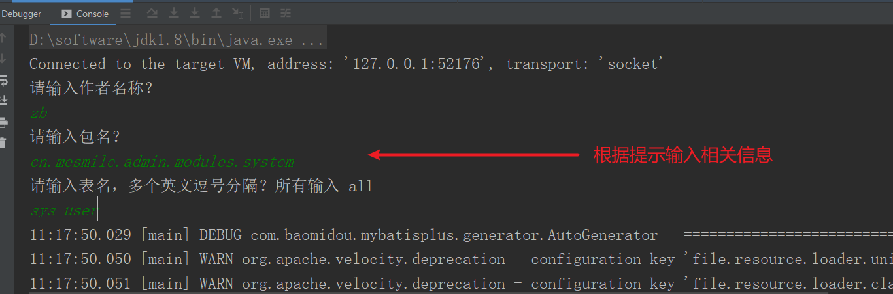
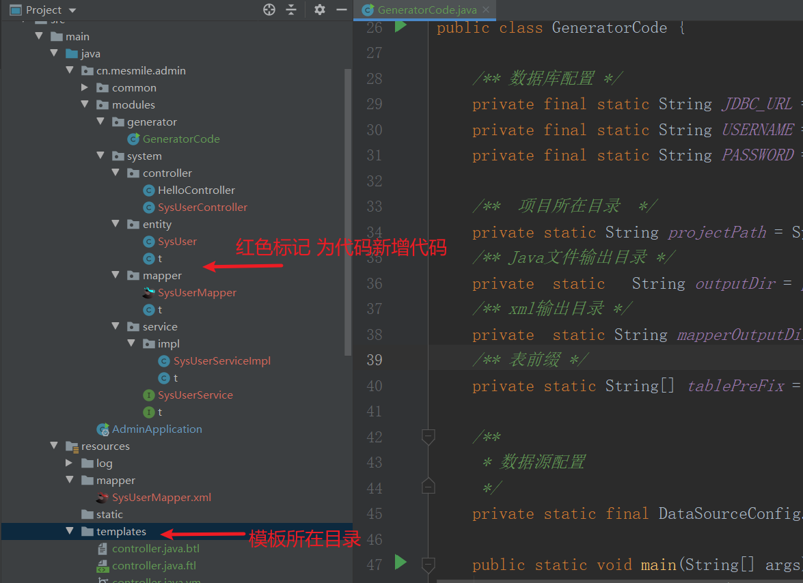

# (九)代码生成器

## 目录

*   [一、引入maven依赖](#一引入maven依赖)

*   [二、编写代码生成器](#二编写代码生成器)

*   [三、在数据库中新建表测试](#三在数据库中新建表测试)

## 一、引入maven依赖

```xml

    <!--代码生成器-->
    <dependency>
        <groupId>com.baomidou</groupId>
        <artifactId>mybatis-plus-generator</artifactId>
        <version>3.5.1</version>
    </dependency>

    <!--模板生成器 velocity-->
    <dependency>
        <groupId>org.apache.velocity</groupId>
        <artifactId>velocity-engine-core</artifactId>
        <version>2.3</version>
    </dependency>
```

## 二、编写代码生成器

```java
package cn.mesmile.admin.modules.generator;

import com.baomidou.mybatisplus.annotation.FieldFill;
import com.baomidou.mybatisplus.annotation.IdType;
import com.baomidou.mybatisplus.core.mapper.BaseMapper;
import com.baomidou.mybatisplus.extension.service.IService;
import com.baomidou.mybatisplus.extension.service.impl.ServiceImpl;
import com.baomidou.mybatisplus.generator.FastAutoGenerator;
import com.baomidou.mybatisplus.generator.config.DataSourceConfig;
import com.baomidou.mybatisplus.generator.config.OutputFile;
import com.baomidou.mybatisplus.generator.config.rules.DateType;
import com.baomidou.mybatisplus.generator.engine.VelocityTemplateEngine;
import com.baomidou.mybatisplus.generator.fill.Column;

import java.util.Arrays;
import java.util.Collections;
import java.util.List;

/**
 * @author zb
 * @Description
 *      相关配置 https://baomidou.com/pages/981406/
 */
public class GeneratorCode {

    /** 数据库配置 */
    private final static String JDBC_URL = "jdbc:mysql://81.69.43.78:3306/admin-boot?useUnicode=true&characterEncoding=utf-8&useSSL=false&serverTimezone=GMT%2B8";
    private final static String USERNAME = "root";
    private final static String PASSWORD = "task,.123";

    /**  项目所在目录  */
    private static String projectPath = System.getProperty("user.dir");
    /** Java文件输出目录 */
    private  static   String outputDir = projectPath + "/src/main/java";
    /** xml输出目录 */
    private  static String mapperOutputDir = projectPath +"/src/main/resources/mapper";
    /** 表前缀 */
    private static String[] tablePreFix = new String[]{};

    /**
     * 数据源配置
     */
    private static final DataSourceConfig.Builder DATA_SOURCE_CONFIG = new DataSourceConfig.Builder(JDBC_URL, USERNAME, PASSWORD);

    public static void main(String[] args) {
        FastAutoGenerator.create(DATA_SOURCE_CONFIG)
                // 全局配置
                .globalConfig((scanner, builder) ->
                        builder.author(scanner.apply("请输入作者名称？"))
                                .outputDir(outputDir)
                                // 禁止打开输出目录
                                .disableOpenDir()
                                // 开启swagger
                                .enableSwagger()
                                // 指定日期类型
                                .dateType(DateType.TIME_PACK)
                                // 覆盖默认配置
                                .fileOverride())
                // 包配置
                .packageConfig((scanner, builder) ->
                        builder.parent(scanner.apply("请输入包名？"))
                        .pathInfo(Collections.singletonMap(OutputFile.mapperXml, mapperOutputDir))
                )
                // 策略配置
                .strategyConfig((scanner, builder) ->

                        builder
                                .addTablePrefix(tablePreFix)
                                .addInclude(getTables(scanner.apply("请输入表名，多个英文逗号分隔？所有输入 all")))
                                // controller配置
                                .controllerBuilder().enableRestStyle().enableHyphenStyle().build()
                                // 实体配置
                                .entityBuilder().enableLombok().addTableFills(
                                new Column("create_time", FieldFill.INSERT),
                                new Column("create_by", FieldFill.INSERT),
                                new Column("update_time", FieldFill.INSERT_UPDATE),
                                new Column("update_by", FieldFill.INSERT_UPDATE)
                                ).idType(IdType.ASSIGN_ID).build()
                                // service配置
                                .serviceBuilder().superServiceClass(IService.class).superServiceImplClass(ServiceImpl.class)
                                .formatServiceFileName("%sService").formatServiceImplFileName("%sServiceImpl")
                                .build()
                                // mapper配置
                                .mapperBuilder().superClass(BaseMapper.class)
                                .enableBaseResultMap()
                                .enableBaseColumnList()
                                .build()
                )
                .templateEngine(new VelocityTemplateEngine())
                /*
                    模板引擎配置，默认 Velocity 可选模板引擎 Beetl 或 Freemarker
                   .templateEngine(new BeetlTemplateEngine())
                   .templateEngine(new FreemarkerTemplateEngine())
                 */
                .execute();
    }

    /**
     * 处理 all 情况
     *
     * @param tables
     * @return
     */
    protected static List<String> getTables(String tables) {
        return "all".equals(tables) ? Collections.emptyList() : Arrays.asList(tables.split(","));
    }
}

```

### 代码模板详见项目：\admin-boot\src\main\resources\templates 目录

## 三、在数据库中新建表测试

在对应的数据库，新建表测试：

启动 cn.mesmile.admin.modules.generator.GeneratorCode 代码生成类




