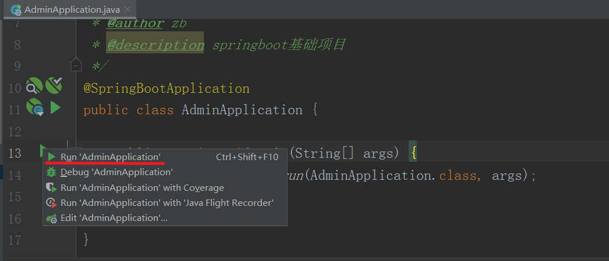

# (二)整合mybatis-plus

## 目录

*   [一、导入依赖](#一导入依赖)

*   [二、编辑配置文件](#二编辑配置文件)

*   [三、编写mybatis-plus配置文件](#三编写mybatis-plus配置文件)

*   [四、启动项目](#四启动项目)

## 一、导入依赖

在pom.xml文件中导入依赖

```xml
<!--mybatis-plus-->
  <dependency>
      <groupId>com.baomidou</groupId>
      <artifactId>mybatis-plus-boot-starter</artifactId>
      <version>3.5.1</version>
  </dependency>
```

这里以mysql数据库为例，还需要在pom.xml文件中导入mysql驱动

```xml
<!--mysql 驱动-->
  <dependency>
      <groupId>mysql</groupId>
      <artifactId>mysql-connector-java</artifactId>
  </dependency>
```

## 二、编辑配置文件

配置文件均在 \admin-boot\src\main\resources 目录下

application.yml

```yaml
server:
  port: 8080

spring:
  profiles:
    active: dev
  application:
    name: admin
    
# 配置 xml 文件所在位置    配置全局的 主键策略，默认为 ASSIGN_ID 默认为 【雪花算法】 , atuo 自增
mybatis-plus:
  mapper-locations: classpath*:/mapper/**/*.xml
  # 搜索指定包别名
  typeAliasesPackage: com.mesmile.**.entity
  global-config:
    # 关闭MP3.0自带的banner
    banner: false
    db-config:
      id-type: ASSIGN_ID
      # 逻辑删除
      logic-not-delete-value: 0
      logic-delete-value: 1
      #字段策略
      insert-strategy: not_null
      update-strategy: not_null
      select-strategy: not_empty
      #驼峰下划线转换
      table-underline: true
  # 开启驼峰命名 默认开启驼峰命名
  # mybatis-plus配置控制台打印完整带参数SQL语句
  configuration:
    map-underscore-to-camel-case: true
    cache-enabled: false
    log-impl: org.apache.ibatis.logging.stdout.StdOutImpl
```

在 resources 目录下新建 mapper 文件夹，用于存放 \*\*.xml文件

application-dev.yml

```yaml
spring:
  datasource:
    # 数据库驱动
    driver-class-name: com.mysql.cj.jdbc.Driver
    # 数据库链接
    url: jdbc:mysql://81.69.43.78:3306/admin-boot?useUnicode=true&characterEncoding=utf-8&useSSL=false&serverTimezone=GMT%2B8
    username: root
    password: task,.123
```

在对应数据库，新建名称为 admin-boot 的mysql 数据库

## 三、编写mybatis-plus配置文件

MybatisPlusConfig.java

```java
package cn.mesmile.admin.common.config.mybatis;

import com.baomidou.mybatisplus.annotation.DbType;
import com.baomidou.mybatisplus.core.incrementer.IKeyGenerator;
import com.baomidou.mybatisplus.extension.incrementer.H2KeyGenerator;
import com.baomidou.mybatisplus.extension.plugins.MybatisPlusInterceptor;
import com.baomidou.mybatisplus.extension.plugins.inner.OptimisticLockerInnerInterceptor;
import com.baomidou.mybatisplus.extension.plugins.inner.PaginationInnerInterceptor;
import org.mybatis.spring.annotation.MapperScan;
import org.springframework.context.annotation.Bean;
import org.springframework.context.annotation.Configuration;

/**
 * @author zb
 * @Description
 */
@MapperScan(basePackages = {"cn.mesmile.**.mapper"})
@Configuration
public class MybatisPlusConfig {

    /**
     *  mybatis-plus 插件的配置
     */
    @Bean
    public MybatisPlusInterceptor mybatisPlusInterceptor() {
        MybatisPlusInterceptor interceptor = new MybatisPlusInterceptor();
        // 分页插件
        interceptor.addInnerInterceptor(new PaginationInnerInterceptor(DbType.MYSQL));
        // 乐观锁插件
        interceptor.addInnerInterceptor(new OptimisticLockerInnerInterceptor());
        return interceptor;
    }

    /**
     * Id 生成器-->
     * 特殊的一些类使用
     * 默认使用
     * @return
     */
    @Bean
    public IKeyGenerator iKeyGenerator(){
        return new H2KeyGenerator();
    }

}

```

## 四、启动项目

启动项目启动类 cn.mesmile.admin.AdminApplication



若无报错，则证明整合mybatis-plus成功
