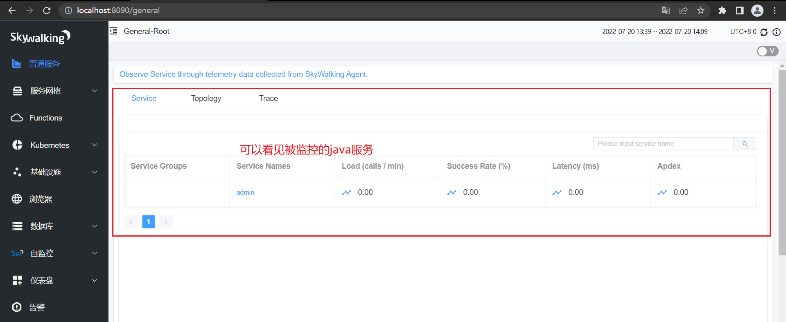

# (二十)分布式应用追踪系统skyWalking

## 目录

*   [一、skyWalking简介](#一skywalking简介)

*   [二、skyWalking下载与启动](#二skywalking下载与启动)

    *   [下载apm端这里使用9.1.0版本：](#下载apm端这里使用910版本)

    *   [下载agent端这里使用8.11.0版本](#下载agent端这里使用8110版本)

    *   [apm启动](#apm启动)

*   [三、监控Java应用](#三监控java应用)

*   [四、自定义业务Skywalking链路追踪](#四自定义业务skywalking链路追踪)

*   [五、性能剖析](#五性能剖析)

## 一、skyWalking简介

skyWalking是一个国产开源框架， 2015年由吴晟开源， 2017年加入Apache孵化器。skyWalking是分布式系统的应用程序性能监视工具， 专为微服务、云原 生架构和基于容器(Docker、K8s、Mesos) 架构而设计。它是一款优秀的APM(Application Performance Management) 工具， 包括了分布式追踪、性能 指标分析、应用和服务依赖分析等。&#x20;

官网：[http://skywalking.apache.org/](http://skywalking.apache.org/ "http://skywalking.apache.org/")&#x20;

下载：[http://skywalking.apache.org/downloads/](http://skywalking.apache.org/downloads/ "http://skywalking.apache.org/downloads/")&#x20;

Git hub：[https://aithub.com/apache/skywalking](https://aithub.com/apache/skywalking "https://aithub.com/apache/skywalking")&#x20;

文档：[https://skywalking.apache.org/docs/main/v8.4.0/readme](https://skywalking.apache.org/docs/main/v8.4.0/readme "https://skywalking.apache.org/docs/main/v8.4.0/readme")&#x20;

中文文档：[https://skyapm.github.io/document-cn-translation-of-skywalking/](https://skyapm.github.io/document-cn-translation-of-skywalking/ "https://skyapm.github.io/document-cn-translation-of-skywalking/")&#x20;


## 二、skyWalking下载与启动

下载：[http://skywalking.apache.org/downloads/](http://skywalking.apache.org/downloads/ "http://skywalking.apache.org/downloads/")

### 下载apm端这里使用9.1.0版本：


[apache-skywalking-apm-9.1.0.tar.gz](file/apache-skywalking-apm-9.1.0.tar_5v3Hx2sGPL.gz)

### 下载agent端这里使用8.11.0版本


[apache-skywalking-java-agent-8.11.0.tgz](file/apache-skywalking-java-agent-8.11.0_p41J-FX_-U.tgz)

### apm启动


启动成功后会启动两个服务，
一个是sky walking-web-ui端口号默认是 8080，可以在webapp/webapp.yml中修改端口号（这里我修改了端口号为：8090）

一个是sky walking-oap-server：skywalking-oap-server服务启动后会暴露11800和12800两个端口， 分别为收集监控数据的端口11800和 接收前端请求的端口12800, 修改端口可以config/applicaiton.yml

webapp/webapp.yml中修改端口号（这里我修改了端口号为：8090）

在浏览器输入：localhost:8090 即可看见 SkyWalking管理界面


## 三、监控Java应用

```java
完整命令：
java -javaagent:C:\Users\CDLX\Desktop\skywalking-agent\skywalking-agent.jar
-DSW_AGENT_NAME=adminBoot -DSW_AGENT_COLLECTOR_BACKEND_SERVICES=127.0.0.1:11800
-jar spring-demo.jar

说明：
# 本地磁盘skywalking-agent.jar的本地磁盘路径,这里使用下载的Java的agent
-javaagent:C:\Users\CDLX\Desktop\skywalking-agent\skywalking-agent.jar
# 在skywalking上显示的服务名
-DSW_AGENT_NAME=adminBoot
# skywalking的collector服务的IP以及端口
-DSW_AGENT_COLLECTOR_BACKEND_SERVICES=127.0.0.1:11800
```

本地监控admin-boot应用:

一：先启动apm

二：idea中添加如下配置

```java
-javaagent:C:\Users\CDLX\Desktop\skywalking-agent\skywalking-agent.jar
-DSW_AGENT_NAME=adminBoot
-DSW_AGENT_COLLECTOR_BACKEND_SERVICES=127.0.0.1:11800

```


启动java服务



## 四、自定义业务Skywalking链路追踪

引入maven依赖：

```xml

  <!--Skywalking工具类, 版本号与java agent一致-->
  <dependency>
      <groupId>org.apache.skywalking</groupId>
      <artifactId>apm-toolkit-trace</artifactId>
      <version>8.11.0</version>
  </dependency>
```

@Trace 监控节点

@Tags监控【入参】和【返回参数】

arg\[0]               取第一个入参

returnedObj    取返回值


查看拦截节点：


## 五、性能剖析

新建采样分析：请求5次，每个10ms采样一次


