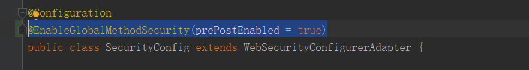

# (二十一)spring-security实现认证与授权

## 目录

*   [springsecurity安全认证授权](#springsecurity安全认证授权)

    *   [登录校验流程](#登录校验流程)

    *   [springSecurity完整流程](#springsecurity完整流程)

    *   [认证流程](#认证流程)

    *   [redis使用fastjson序列化](#redis使用fastjson序列化)

    *   [密码加密存储](#密码加密存储)

*   [Spring Security认证](#spring-security认证)

    *   [自定义登录接口](#自定义登录接口)

    *   [定义认证过滤器](#定义认证过滤器)

    *   [配置认证过滤器](#配置认证过滤器)

    *   [自定义退出登录](#自定义退出登录)

        *   [方式一：自定义接口退出](#方式一自定义接口退出)

        *   [方式二：拦截器方法退出登录](#方式二拦截器方法退出登录)

*   [Spring Security授权权限](#spring-security授权权限)

    *   [基于注解的方式限制访问资源权限](#基于注解的方式限制访问资源权限)

    *   [其他方式进行权限认证](#其他方式进行权限认证)

    *   [自定义权限校验方法](#自定义权限校验方法)

    *   [RBAC权限模型](#rbac权限模型)

*   [自定义失败处理](#自定义失败处理)

    *   [自定义 认证异常 拦截处理](#自定义-认证异常-拦截处理)

    *   [自定义 授权异常 拦截处理](#自定义-授权异常-拦截处理)

    *   [加入到security配置中](#加入到security配置中)

*   [配置支持跨域请求](#配置支持跨域请求)

## springsecurity安全认证授权

```xml
<dependency>
      <groupId>org.springframework.boot</groupId>
      <artifactId>spring-boot-starter-security</artifactId>
  </dependency>
```

第一次引入依赖后，所有的接口访问都需要认证

会默认跳转到登录接口<http://ip:port/login>


默认退出登录接口 [http://ip](http://ip "http://ip"):port/logout

### 登录校验流程


### springSecurity完整流程


**UsernamePasswordAuthenticationFilter**：负责处理我们在登陆页面填写了用户名密码后的登陆请求。入门案例的**认证**工作主要有它负责。

**ExceptionTranslationFilter**：处理过滤器链中抛出的任何AccessDeniedException和AuthenticationException

**FilterSecuritylnterceptor**：负责**权限校验**的过滤器


### 认证流程


自定义UserDetailService从数据库中通过登录账号查询密码，返回后与Authentication对象里面的密码对比


**登录**
①自定义登录接口
调用ProviderManager的方法进行认证如果认证通过生成jwt
把用户信息存入redis中
②自定义UserDetailsService
在这个实现列中去查询数据

**校验**
①定义Jwt认证过滤器
②获取token
③解析token获取其中的userid
④从redis中获取用户信息
⑤存入SecurityContextHolder(定义过滤器存入这里面)

```xml
<dependency>
           <groupId>org.springframework.boot</groupId>
           <artifactId>spring-boot-starter-data-redis</artifactId>
       </dependency>

 <!-- https://mvnrepository.com/artifact/com.alibaba/fastjson -->
 <dependency>
     <groupId>com.alibaba</groupId>
     <artifactId>fastjson</artifactId>
     <version>1.2.83</version>
 </dependency>

 <!--  jwt 认证 -->
 <dependency>
     <groupId>com.auth0</groupId>
     <artifactId>java-jwt</artifactId>
     <version>3.16.0</version>
 </dependency>
```

### redis使用fastjson序列化

```java
import com.alibaba.fastjson.JSON;
import com.alibaba.fastjson.parser.ParserConfig;
import com.alibaba.fastjson.serializer.SerializerFeature;
import com.fasterxml.jackson.databind.JavaType;
import com.fasterxml.jackson.databind.type.TypeFactory;
import org.springframework.data.redis.serializer.RedisSerializer;
import org.springframework.data.redis.serializer.SerializationException;

import java.nio.charset.Charset;
import java.nio.charset.StandardCharsets;

/**
 * @author zb
 * @Description Redis 使用 FastJson 序列化
 */
public class FastJsonRedisSerializer<T> implements RedisSerializer<T> {

    public static final Charset DEFAULT_CHARSET = StandardCharsets.UTF_8;

    private Class<T> tClass;

    static {
        ParserConfig.getGlobalInstance().setAutoTypeSupport(true);
    }

    public FastJsonRedisSerializer(Class<T> tClass){
        super();
        this.tClass = tClass;
    }

    @Override
    public byte[] serialize(T t) throws SerializationException {
        if (t == null) {
            return new byte[0];
        }
        try {
            return JSON.toJSONString(t, SerializerFeature.WriteClassName).getBytes(DEFAULT_CHARSET);
        } catch (Exception e) {
            throw new SerializationException("Could not serialize: " + e.getMessage(), e);
        }
    }

    @Override
    public T deserialize(byte[] bytes) throws SerializationException {
        if (bytes == null || bytes.length <= 0){
            return null;
        }
        String str = new String(bytes, DEFAULT_CHARSET);
        try {
            return JSON.parseObject(str, tClass);
        } catch (Exception e) {
            throw new SerializationException("Could not deserialize: " + e.getMessage(), e);
        }
    }

    protected JavaType getJavaType(Class<?> tClass){
        return TypeFactory.defaultInstance().constructType(tClass);
    }
}

```

```java
import cn.mesmile.system.serializer.FastJsonRedisSerializer;
import org.springframework.context.annotation.Bean;
import org.springframework.context.annotation.Configuration;
import org.springframework.data.redis.connection.RedisConnectionFactory;
import org.springframework.data.redis.core.RedisTemplate;
import org.springframework.data.redis.serializer.StringRedisSerializer;

/**
 * @author zb
 * @Description fastjson序列化
 *              KryoRedisSerializer的压缩率和速度最优，fastJson次之，默认的则最差
 */
@Configuration
public class RedisConfig {

    @Bean
    public RedisTemplate<String,Object> redisTemplate(RedisConnectionFactory connectionFactory){
        RedisTemplate<String,Object> template  = new RedisTemplate<>();
        template.setConnectionFactory(connectionFactory);

        FastJsonRedisSerializer<Object> fastJsonRedisSerializer = new FastJsonRedisSerializer<>(Object.class);

        // 使用 StringRedisSerializer 来序列化和反序列化 Redis 的key
        template.setKeySerializer(new StringRedisSerializer());
        template.setValueSerializer(fastJsonRedisSerializer);

        // hash的key 也使用 StringRedisSerializer 来序列化和反序列化 Redis 的key
        template.setHashKeySerializer(new StringRedisSerializer());
        template.setHashValueSerializer(fastJsonRedisSerializer);

        template.afterPropertiesSet();
        return template;
    }
```

自定义类实现UserDetailsService&#x20;

```java
package cn.mesmile.admin.modules.auth.security;

import cn.mesmile.admin.common.constant.DataStatus;
import cn.mesmile.admin.common.exceptions.ServiceException;
import cn.mesmile.admin.modules.system.entity.SysUser;
import cn.mesmile.admin.modules.system.mapper.SysMenuMapper;
import cn.mesmile.admin.modules.system.service.ISysUserService;
import com.baomidou.mybatisplus.core.conditions.query.LambdaQueryWrapper;
import com.baomidou.mybatisplus.core.toolkit.Wrappers;
import lombok.RequiredArgsConstructor;
import org.springframework.security.core.userdetails.UserDetails;
import org.springframework.security.core.userdetails.UserDetailsService;
import org.springframework.stereotype.Service;

import java.util.List;

/**
 * @author zb
 * @Description
 */
@RequiredArgsConstructor
@Service("userDetailsServiceImpl")
public class UserDetailsServiceImpl implements UserDetailsService {

    private final ISysUserService sysUserService;

    private final SysMenuMapper sysMenuMapper;

    @Override
    public UserDetails loadUserByUsername(String username) {
        LambdaQueryWrapper<SysUser> wrapper = Wrappers.<SysUser>lambdaQuery()
                .eq(SysUser::getUsername, username);
        SysUser sysUser = sysUserService.getOne(wrapper);
        if (sysUser == null){
            throw new ServiceException("用户名或密码错误");
        }
        String status = sysUser.getStatus();
        if (DataStatus.DISABLE.equals(status)){
            throw new ServiceException("账号已经停用，请联系管理员");
        }
        // 查询权限
        List<String> permsList = sysMenuMapper.selectPermsByUserId(sysUser.getId());
        return new LoginUserDetails(sysUser, permsList);
    }

}

```

LoginUserDetails 自定义类实现UserDetails&#x20;

```java
package cn.mesmile.admin.modules.auth.security;

import cn.hutool.core.collection.CollUtil;
import cn.hutool.core.util.StrUtil;
import cn.mesmile.admin.modules.system.entity.SysUser;
import com.alibaba.fastjson.annotation.JSONField;
import lombok.Data;
import org.springframework.security.core.GrantedAuthority;
import org.springframework.security.core.authority.SimpleGrantedAuthority;
import org.springframework.security.core.userdetails.UserDetails;

import java.util.Collection;
import java.util.List;
import java.util.stream.Collectors;

/**
 * @author zb
 * @Description
 */
@Data
public class LoginUserDetails implements UserDetails {

    private static final long serialVersionUID = 1L;

    private SysUser sysUser;

    private List<String> permissionList;

    private String uuid;

    @JSONField(serialize = false)
    private List<SimpleGrantedAuthority> grantedAuthorities;

    public LoginUserDetails(){}

    public LoginUserDetails(SysUser sysUser, List<String> permissionList){
        this.sysUser = sysUser;
        this.permissionList = permissionList;
    }

    /**
     * 返回用户 授权信息
     * @return
     */
    @JSONField(serialize = false)
    @Override
    public Collection<? extends GrantedAuthority> getAuthorities() {
        if (CollUtil.isNotEmpty(grantedAuthorities)){
            return grantedAuthorities;
        }
        if (CollUtil.isNotEmpty(permissionList)){
            grantedAuthorities = permissionList.stream()
                    .filter(StrUtil::isNotEmpty)
                    .map(SimpleGrantedAuthority::new)
                    .collect(Collectors.toList());
        }
        return grantedAuthorities;
    }


    @JSONField(serialize = false)
    @Override
    public String getPassword() {
        if (sysUser != null){
            return sysUser.getPassword();
        }
        return "";
    }

    @Override
    public String getUsername() {
        if (sysUser != null){
            return sysUser.getUsername();
        }
        return "";
    }

    @JSONField(serialize = false)
    @Override
    public boolean isAccountNonExpired() {
        return true;
    }

    @JSONField(serialize = false)
    @Override
    public boolean isAccountNonLocked() {
        return true;
    }

    @JSONField(serialize = false)
    @Override
    public boolean isCredentialsNonExpired() {
        return true;
    }

    @JSONField(serialize = false)
    @Override
    public boolean isEnabled() {
        return true;
    }

}

```

### 密码加密存储

实际项目中我们不会把密码明文存储在数据库中。 **默认使用的Password Encoder要求数据库中的密码格式为：{id} password。** 它会根据id去判断密码的加密方式。但是我们一般不会采用这种方式。所以就需要替换PasswordEncoder。

我们一般使用SpringSecurity为我们提供的BCryptPasswordEncoder我们只需要使用把BCryptPasswordEncoder对象注入Spring容器中， SpringSecurity就会使用该PasswordEncoder来进行密码校验。

我们可以定义一个SpringSecurity的配置类， SpringSecurity要求这个配置类要继承WebSecurityConf gurerAdapter。

```java

/**
 * @author zb
 * @Description 安全相关
 *  @EnableGlobalMethodSecurity(prePostEnabled = true)  开启基于注解的权限授权控制
 */
@EnableGlobalMethodSecurity(prePostEnabled = true)
@EnableConfigurationProperties({AdminBootProperties.class})
@Configuration
@RequiredArgsConstructor
public class SecurityConfig extends WebSecurityConfigurerAdapter {

    private final JwtAuthenticationTokenFilter jwtAuthenticationTokenFilter;
    private final AuthenticationEntryPointImpl authenticationEntryPoint;
    private final AccessDeniedExceptionHandlerImpl accessDeniedHandler;
    private final LogoutSuccessHandlerImpl logoutSuccessHandler;

    /*
     方式一和方式二 密码格式：
        {bcrypt}$2a$10$dXJ3SW6G7P50lGmMkkmwe.20cQQubK3.HZWzG3YB1tlRy.fqvM/BG
        {noop}password
        {pbkdf2}5d923b44a6d129f3ddf3e3c8d29412723dcbde72445e8ef6bf3b508fbf17fa4ed4d6b99ca763d8dc
        {scrypt}$e0801$8bWJaSu2IKSn9Z9kM+TPXfOc/9bdYSrN1oD9qfVThWEwdRTnO7re7Ei+fUZRJ68k9lTyuTeUp4of4g24hHnazw==$OAOec05+bXxvuu/1qZ6NUR+xQYvYv7BeL1QxwRpY5Pc=
        {sha256}97cde38028ad898ebc02e690819fa220e88c62e0699403e94fff291cfffaf8410849f27605abcbc0
     */

    /**
     * 认证方式
     */
    @Bean
    public PasswordEncoder passwordEncoder(AdminBootProperties adminBootProperties){
        // 方式一：创建默认 DelegatingPasswordEncoder，支持多种加密认证的密码，默认 bcrypt
//        return PasswordEncoderFactories.createDelegatingPasswordEncoder();

        // 方式二：创建自定义 DelegatingPasswordEncoder ，以下【过期的类】为不安全的加密方式不推荐使用
        String encodingId = adminBootProperties.getPasswordEncoderType().getIdForEncode();
        Map<String, PasswordEncoder> encoders = new HashMap<>();
        encoders.put("bcrypt", new BCryptPasswordEncoder());
        encoders.put("ldap", new org.springframework.security.crypto.password.LdapShaPasswordEncoder());
        encoders.put("MD4", new org.springframework.security.crypto.password.Md4PasswordEncoder());
        encoders.put("MD5", new org.springframework.security.crypto.password.MessageDigestPasswordEncoder("MD5"));
        encoders.put("noop", org.springframework.security.crypto.password.NoOpPasswordEncoder.getInstance());
        encoders.put("pbkdf2", new Pbkdf2PasswordEncoder());
        encoders.put("scrypt", new SCryptPasswordEncoder());
        encoders.put("SHA-1", new org.springframework.security.crypto.password.MessageDigestPasswordEncoder("SHA-1"));
        encoders.put("SHA-256",new org.springframework.security.crypto.password.MessageDigestPasswordEncoder("SHA-256"));
        encoders.put("sha256", new org.springframework.security.crypto.password.StandardPasswordEncoder());
        encoders.put("argon2", new Argon2PasswordEncoder());
        return new DelegatingPasswordEncoder(encodingId, encoders);

        // 方式三：直接指定加密解密方式
        // 方式三密码格式 $2a$10$dXJ3SW6G7P50lGmMkkmwe.20cQQubK3.HZWzG3YB1tlRy.fqvM/BG
//        return new BCryptPasswordEncoder();
    }
    
 }
```

## Spring Security认证

接下我们需要自定义登陆接口， 然后让SpringSecurity对这个接口放行， 让用户访问这个接口的时候不用登录也能访问。

在接口中我们通过AuthenticationManager的authenticate方法来进行用户认证， 所以需要在SecurityConfig中配置把 AuthenticationManager注入容器

认证成功的话要生成一个jwt， 放入响应中返回。并且为了让用户下回请求时能通过jwt识别出具体的是哪个用户， 我们需要把用户信息存入redis， 可以把用户id作为key。

**登录** ①自定义登录接口 调用ProviderManager的方法进行认证如果认证通过生成jwt 把用户信息存入redis中 ②自定义UserDetailsService 在这个实现列中去查询数据


jwtUtil

```java
package cn.mesmile.admin.modules.auth.security;


import cn.hutool.core.date.DateUtil;
import cn.hutool.core.util.IdUtil;
import cn.hutool.jwt.JWTUtil;
import cn.mesmile.admin.common.utils.AdminRedisTemplate;
import cn.mesmile.admin.modules.auth.config.JwtProperties;
import io.jsonwebtoken.*;
import lombok.RequiredArgsConstructor;
import org.apache.commons.lang3.StringUtils;
import org.springframework.boot.context.properties.EnableConfigurationProperties;
import org.springframework.stereotype.Component;

import javax.annotation.Resource;
import javax.servlet.http.HttpServletRequest;
import java.time.Duration;
import java.util.Date;
import java.util.HashMap;
import java.util.Map;

/**
 * @author zb
 * @Description
 */
@RequiredArgsConstructor
@EnableConfigurationProperties({JwtProperties.class})
@Component
public class TokenService {

    private final JwtProperties jwtProperties;

    private final AdminRedisTemplate adminRedisTemplate;

    /**
     * 创建令牌
     *
     * @param loginUser 用户信息
     * @return 令牌
     */
    public String createToken(LoginUserDetails loginUser) {
        String username = loginUser.getUsername();
        Integer expireTime = jwtProperties.getExpireTime();
        String uuid = IdUtil.fastSimpleUUID();
        loginUser.setUuid(uuid);
        // 存储用户
        adminRedisTemplate.setEx(username+":"+uuid, loginUser, Duration.ofSeconds(expireTime));
        Map<String, Object> claims = new HashMap<>(16);
        claims.put("uuid",uuid);
        claims.put("username", username);
        claims.put("userId",loginUser.getSysUser().getId());
        return createToken(claims);
    }

    /**
     * 从数据声明生成令牌
     *
     * @param claims 数据声明
     * @return 令牌
     */
    private String createToken(Map<String, Object> claims) {
        Date now = new Date();
        return Jwts.builder()
                .setHeaderParam(Header.TYPE, Header.JWT_TYPE)
                .setClaims(claims)
                .setIssuedAt(now)
//                .setExpiration(DateUtil.offsetSecond(now, jwtProperties.getExpireTime()))
                .setIssuer("powered by admin")
                .signWith(SignatureAlgorithm.HS512, jwtProperties.getSecret()).compact();
    }


    /**
     * 从令牌中获取数据声明
     *
     * @param token 令牌
     * @return 数据声明
     */
    public Claims getClaim(String token) {
        return Jwts.parser()
                .setSigningKey(jwtProperties.getSecret())
                .parseClaimsJws(token)
                .getBody();
    }

    /**
     * 获取指定的属性
     * @param token 令牌
     * @param key key
     * @return
     */
    public Object getClaimValue(String token,String key) {
        Claims claim = getClaim(token);
        return claim.get(key);
    }

    /**
     * 获取请求头上的额token
     *
     * @param request 请求
     * @return token
     */
    public String getToken(HttpServletRequest request) {
        String token = request.getHeader(jwtProperties.getTokenHeader());
        String tokenPrefix = jwtProperties.getTokenPrefix();
        if (StringUtils.isNotEmpty(token) && token.startsWith(tokenPrefix)) {
            token = token.replace(tokenPrefix, "").trim();
        }
        return token;
    }

    public boolean deleteToken(String token){
        Claims claim = getClaim(token);
        String uuid = (String) claim.get("uuid");
        String username = (String) claim.get("username");
        return adminRedisTemplate.del(username + ":" + uuid);
    }


}

```

### 自定义登录接口

```java
package cn.mesmile.admin.modules.auth.service.impl;

import cn.mesmile.admin.common.exceptions.BusinessException;
import cn.mesmile.admin.common.exceptions.ServiceException;
import cn.mesmile.admin.common.utils.AdminRedisTemplate;
import cn.mesmile.admin.modules.auth.config.JwtProperties;
import cn.mesmile.admin.modules.auth.domain.request.LoginRequest;
import cn.mesmile.admin.modules.auth.domain.vo.LoginVO;
import cn.mesmile.admin.modules.auth.security.LoginUserDetails;
import cn.mesmile.admin.modules.auth.security.TokenService;
import cn.mesmile.admin.modules.auth.service.ILoginService;
import cn.mesmile.admin.modules.system.entity.SysUser;
import org.springframework.security.authentication.AuthenticationManager;
import org.springframework.security.authentication.BadCredentialsException;
import org.springframework.security.authentication.UsernamePasswordAuthenticationToken;
import org.springframework.security.core.Authentication;
import org.springframework.security.core.context.SecurityContext;
import org.springframework.security.core.context.SecurityContextHolder;
import org.springframework.stereotype.Service;

import javax.annotation.Resource;

/**
 * @author zb
 * @Description
 */
@Service
public class LoginServiceImpl implements ILoginService {

    @Resource
    private AuthenticationManager authenticationManager;
    @Resource
    private TokenService tokenService;
    @Resource
    private JwtProperties jwtProperties;
    @Resource
    private AdminRedisTemplate adminRedisTemplate;

    @Override
    public LoginVO login(LoginRequest loginRequest) {
        String principal = loginRequest.getUsername();
        String credentials = loginRequest.getPassword();
        UsernamePasswordAuthenticationToken authenticationToken = new UsernamePasswordAuthenticationToken(principal, credentials);
        // 用户认证 AuthenticationManager authenticate 进行用户认证
        Authentication authenticate = null;
        try {
            authenticate = authenticationManager.authenticate(authenticationToken);
        } catch (BadCredentialsException e) {
            throw new BusinessException("用户名或密码错误");
        } catch (Exception e){
            throw new ServiceException("登录认证失败",e);
        }
        LoginUserDetails loginUserDetails = (LoginUserDetails) authenticate.getPrincipal();
        String token = tokenService.createToken(loginUserDetails);
        String tokenPrefix = jwtProperties.getTokenPrefix();
        return new LoginVO(tokenPrefix + " " +token, jwtProperties.getExpireTime());
    }

    @Override
    public boolean logout() {
        // 调用注销接口的时候需要携带token
        // 从 SecurityContextHolder 请求中获取认证信息，然后再获取username
        SecurityContext context = SecurityContextHolder.getContext();
        Authentication authentication = context.getAuthentication();
        if (authentication == null){
            return false;
        }
        // 认证之后 principal 里面是 UserDetails 的子类
        // 未认证的时候 principal 里面是 username (登录账号)
        Object principal = authentication.getPrincipal();
        // UserLogin 实现了 UserDetails 接口
        LoginUserDetails userLogin = (LoginUserDetails) principal;
        SysUser user = userLogin.getSysUser();
        String username = user.getUsername();
        String uuid = userLogin.getUuid();
        // 认证设置为空
        context.setAuthentication(null);
        // 删除redis中的token
        return adminRedisTemplate.del(username+":"+uuid);
    }

}

```

配置

```java
package cn.mesmile.admin.modules.auth.config;

import cn.mesmile.admin.common.config.system.AdminBootProperties;
import cn.mesmile.admin.modules.auth.filter.JwtAuthenticationTokenFilter;
import cn.mesmile.admin.modules.auth.security.AccessDeniedExceptionHandlerImpl;
import cn.mesmile.admin.modules.auth.security.AuthenticationEntryPointImpl;
import cn.mesmile.admin.modules.auth.security.LogoutSuccessHandlerImpl;
import lombok.RequiredArgsConstructor;
import org.springframework.boot.context.properties.EnableConfigurationProperties;
import org.springframework.context.annotation.Bean;
import org.springframework.context.annotation.Configuration;
import org.springframework.security.authentication.AuthenticationManager;
import org.springframework.security.config.annotation.method.configuration.EnableGlobalMethodSecurity;
import org.springframework.security.config.annotation.web.builders.HttpSecurity;
import org.springframework.security.config.annotation.web.configuration.WebSecurityConfigurerAdapter;
import org.springframework.security.config.http.SessionCreationPolicy;
import org.springframework.security.crypto.argon2.Argon2PasswordEncoder;
import org.springframework.security.crypto.bcrypt.BCryptPasswordEncoder;
import org.springframework.security.crypto.password.DelegatingPasswordEncoder;
import org.springframework.security.crypto.password.PasswordEncoder;
import org.springframework.security.crypto.password.Pbkdf2PasswordEncoder;
import org.springframework.security.crypto.scrypt.SCryptPasswordEncoder;
import org.springframework.security.web.authentication.UsernamePasswordAuthenticationFilter;

import java.util.HashMap;
import java.util.Map;

/**
 * @author zb
 * @Description 安全相关
 *  @EnableGlobalMethodSecurity(prePostEnabled = true)  开启基于注解的权限授权控制
 */
@EnableGlobalMethodSecurity(prePostEnabled = true)
@EnableConfigurationProperties({AdminBootProperties.class})
@Configuration
@RequiredArgsConstructor
public class SecurityConfig extends WebSecurityConfigurerAdapter {

    private final JwtAuthenticationTokenFilter jwtAuthenticationTokenFilter;
    private final AuthenticationEntryPointImpl authenticationEntryPoint;
    private final AccessDeniedExceptionHandlerImpl accessDeniedHandler;
    private final LogoutSuccessHandlerImpl logoutSuccessHandler;

    /*
     方式一和方式二 密码格式：
        {bcrypt}$2a$10$dXJ3SW6G7P50lGmMkkmwe.20cQQubK3.HZWzG3YB1tlRy.fqvM/BG
        {noop}password
        {pbkdf2}5d923b44a6d129f3ddf3e3c8d29412723dcbde72445e8ef6bf3b508fbf17fa4ed4d6b99ca763d8dc
        {scrypt}$e0801$8bWJaSu2IKSn9Z9kM+TPXfOc/9bdYSrN1oD9qfVThWEwdRTnO7re7Ei+fUZRJ68k9lTyuTeUp4of4g24hHnazw==$OAOec05+bXxvuu/1qZ6NUR+xQYvYv7BeL1QxwRpY5Pc=
        {sha256}97cde38028ad898ebc02e690819fa220e88c62e0699403e94fff291cfffaf8410849f27605abcbc0
     */

    /**
     * 认证方式
     */
    @Bean
    public PasswordEncoder passwordEncoder(AdminBootProperties adminBootProperties){
        // 方式一：创建默认 DelegatingPasswordEncoder，支持多种加密认证的密码，默认 bcrypt
//        return PasswordEncoderFactories.createDelegatingPasswordEncoder();

        // 方式二：创建自定义 DelegatingPasswordEncoder ，以下【过期的类】为不安全的加密方式不推荐使用
        String encodingId = adminBootProperties.getPasswordEncoderType().getIdForEncode();
        Map<String, PasswordEncoder> encoders = new HashMap<>();
        encoders.put("bcrypt", new BCryptPasswordEncoder());
        encoders.put("ldap", new org.springframework.security.crypto.password.LdapShaPasswordEncoder());
        encoders.put("MD4", new org.springframework.security.crypto.password.Md4PasswordEncoder());
        encoders.put("MD5", new org.springframework.security.crypto.password.MessageDigestPasswordEncoder("MD5"));
        encoders.put("noop", org.springframework.security.crypto.password.NoOpPasswordEncoder.getInstance());
        encoders.put("pbkdf2", new Pbkdf2PasswordEncoder());
        encoders.put("scrypt", new SCryptPasswordEncoder());
        encoders.put("SHA-1", new org.springframework.security.crypto.password.MessageDigestPasswordEncoder("SHA-1"));
        encoders.put("SHA-256",new org.springframework.security.crypto.password.MessageDigestPasswordEncoder("SHA-256"));
        encoders.put("sha256", new org.springframework.security.crypto.password.StandardPasswordEncoder());
        encoders.put("argon2", new Argon2PasswordEncoder());
        return new DelegatingPasswordEncoder(encodingId, encoders);

        // 方式三：直接指定加密解密方式
        // 方式三密码格式 $2a$10$dXJ3SW6G7P50lGmMkkmwe.20cQQubK3.HZWzG3YB1tlRy.fqvM/BG
//        return new BCryptPasswordEncoder();
    }

    /**
     * 在接口中我们通过AuthenticationManager的authenticate方法来进行用户认证，
     * 所以需要在SecurityConfig中配置把 AuthenticationManager注入容器
     * @return
     * @throws Exception
     */
    @Bean
    @Override
    public AuthenticationManager authenticationManagerBean() throws Exception {
        return super.authenticationManagerBean();
    }

    /**
     * 配置 放行接口
     * @param http
     * @throws Exception
     */
    @Override
    protected void configure(HttpSecurity http) throws Exception {
//         super.configure(http);
        http
                // 前后端分离 关闭 csrf
                .csrf().disable()
                // 前后端分离 session不管用   不通过 Session 获取 SecurityContext
                .sessionManagement().sessionCreationPolicy(SessionCreationPolicy.STATELESS)
                .and()
                .authorizeRequests()
                .antMatchers("/swagger-resources",
                        "/v2/api-docs",
                        "/doc.html",
                        "/webjars/**/*.css",
                        "/webjars/**/*.js",
                        "/favicon.ico").permitAll()
                // 对于登录接口 允许匿名访问
                .antMatchers("/login").anonymous()
                // 除了上面的请求，其他请求都需要鉴权认证
                .anyRequest().authenticated();

        // 将认证过滤器放在 UsernamePasswordAuthenticationFilter 之前
         http
            .addFilterBefore(jwtAuthenticationTokenFilter, UsernamePasswordAuthenticationFilter.class);

        // 将自定义的 认证 和 授权 异常处理加入到配置
        http.exceptionHandling()
                // 授权 403
                .accessDeniedHandler(accessDeniedHandler)
                // 认证 401
                .authenticationEntryPoint(authenticationEntryPoint);
        // 退出登录处理
        http.logout().logoutUrl("/logout").logoutSuccessHandler(logoutSuccessHandler);
    }

}
```

### 定义认证过滤器

JwtAuthenticationTokenFilter（在认证之前，进行判断认证）

```java
package cn.mesmile.admin.modules.auth.filter;

import cn.hutool.core.util.StrUtil;
import cn.mesmile.admin.common.utils.AdminRedisTemplate;
import cn.mesmile.admin.common.utils.AuthUtil;
import cn.mesmile.admin.modules.auth.security.LoginUserDetails;
import cn.mesmile.admin.modules.auth.security.TokenService;
import io.jsonwebtoken.Claims;
import org.springframework.security.authentication.UsernamePasswordAuthenticationToken;
import org.springframework.security.core.GrantedAuthority;
import org.springframework.security.core.context.SecurityContext;
import org.springframework.security.core.context.SecurityContextHolder;
import org.springframework.stereotype.Component;
import org.springframework.web.filter.OncePerRequestFilter;

import javax.annotation.Resource;
import javax.servlet.FilterChain;
import javax.servlet.ServletException;
import javax.servlet.http.HttpServletRequest;
import javax.servlet.http.HttpServletResponse;
import java.io.IOException;
import java.util.Collection;

/**
 * @author zb
 * @Description
 */
@Component
public class JwtAuthenticationTokenFilter extends OncePerRequestFilter {

    @Resource
    private TokenService tokenService;
    @Resource
    private AdminRedisTemplate adminRedisTemplate;

    @Override
    protected void doFilterInternal(HttpServletRequest request, HttpServletResponse response, FilterChain filterChain) throws ServletException, IOException {
        // 解析token
        String token = tokenService.getToken(request);
        if (StrUtil.isNotEmpty(token) && AuthUtil.getAuthentication() == null) {
            Claims claim = tokenService.getClaim(token);
            String uuid = (String) claim.get("uuid");
            String username = (String) claim.get("username");
            LoginUserDetails loginUserDetails = adminRedisTemplate.get(username + ":" + uuid);
            if (loginUserDetails != null){
                Collection<? extends GrantedAuthority> authorities = loginUserDetails.getAuthorities();
                SecurityContext securityContext = SecurityContextHolder.getContext();
                UsernamePasswordAuthenticationToken authenticationToken = new UsernamePasswordAuthenticationToken(loginUserDetails, null, authorities);
                // 将认证信息存入 SecurityContextHolder
                securityContext.setAuthentication(authenticationToken);
            }
        }
        // 放行
        filterChain.doFilter(request, response);
    }

}

```

### 配置认证过滤器

**// 将认证过滤器放在 UsernamePasswordAuthenticationFilter 之前**


添加配置

```java
package cn.mesmile.admin.modules.auth.config;

import cn.mesmile.admin.common.config.system.AdminBootProperties;
import cn.mesmile.admin.modules.auth.filter.JwtAuthenticationTokenFilter;
import cn.mesmile.admin.modules.auth.security.AccessDeniedExceptionHandlerImpl;
import cn.mesmile.admin.modules.auth.security.AuthenticationEntryPointImpl;
import cn.mesmile.admin.modules.auth.security.LogoutSuccessHandlerImpl;
import lombok.RequiredArgsConstructor;
import org.springframework.boot.context.properties.EnableConfigurationProperties;
import org.springframework.context.annotation.Bean;
import org.springframework.context.annotation.Configuration;
import org.springframework.security.authentication.AuthenticationManager;
import org.springframework.security.config.annotation.method.configuration.EnableGlobalMethodSecurity;
import org.springframework.security.config.annotation.web.builders.HttpSecurity;
import org.springframework.security.config.annotation.web.configuration.WebSecurityConfigurerAdapter;
import org.springframework.security.config.http.SessionCreationPolicy;
import org.springframework.security.crypto.argon2.Argon2PasswordEncoder;
import org.springframework.security.crypto.bcrypt.BCryptPasswordEncoder;
import org.springframework.security.crypto.password.DelegatingPasswordEncoder;
import org.springframework.security.crypto.password.PasswordEncoder;
import org.springframework.security.crypto.password.Pbkdf2PasswordEncoder;
import org.springframework.security.crypto.scrypt.SCryptPasswordEncoder;
import org.springframework.security.web.authentication.UsernamePasswordAuthenticationFilter;

import java.util.HashMap;
import java.util.Map;

/**
 * @author zb
 * @Description 安全相关
 *  @EnableGlobalMethodSecurity(prePostEnabled = true)  开启基于注解的权限授权控制
 */
@EnableGlobalMethodSecurity(prePostEnabled = true)
@EnableConfigurationProperties({AdminBootProperties.class})
@Configuration
@RequiredArgsConstructor
public class SecurityConfig extends WebSecurityConfigurerAdapter {

    private final JwtAuthenticationTokenFilter jwtAuthenticationTokenFilter;
    private final AuthenticationEntryPointImpl authenticationEntryPoint;
    private final AccessDeniedExceptionHandlerImpl accessDeniedHandler;
    private final LogoutSuccessHandlerImpl logoutSuccessHandler;

    /*
     方式一和方式二 密码格式：
        {bcrypt}$2a$10$dXJ3SW6G7P50lGmMkkmwe.20cQQubK3.HZWzG3YB1tlRy.fqvM/BG
        {noop}password
        {pbkdf2}5d923b44a6d129f3ddf3e3c8d29412723dcbde72445e8ef6bf3b508fbf17fa4ed4d6b99ca763d8dc
        {scrypt}$e0801$8bWJaSu2IKSn9Z9kM+TPXfOc/9bdYSrN1oD9qfVThWEwdRTnO7re7Ei+fUZRJ68k9lTyuTeUp4of4g24hHnazw==$OAOec05+bXxvuu/1qZ6NUR+xQYvYv7BeL1QxwRpY5Pc=
        {sha256}97cde38028ad898ebc02e690819fa220e88c62e0699403e94fff291cfffaf8410849f27605abcbc0
     */

    /**
     * 认证方式
     */
    @Bean
    public PasswordEncoder passwordEncoder(AdminBootProperties adminBootProperties){
        // 方式一：创建默认 DelegatingPasswordEncoder，支持多种加密认证的密码，默认 bcrypt
//        return PasswordEncoderFactories.createDelegatingPasswordEncoder();

        // 方式二：创建自定义 DelegatingPasswordEncoder ，以下【过期的类】为不安全的加密方式不推荐使用
        String encodingId = adminBootProperties.getPasswordEncoderType().getIdForEncode();
        Map<String, PasswordEncoder> encoders = new HashMap<>();
        encoders.put("bcrypt", new BCryptPasswordEncoder());
        encoders.put("ldap", new org.springframework.security.crypto.password.LdapShaPasswordEncoder());
        encoders.put("MD4", new org.springframework.security.crypto.password.Md4PasswordEncoder());
        encoders.put("MD5", new org.springframework.security.crypto.password.MessageDigestPasswordEncoder("MD5"));
        encoders.put("noop", org.springframework.security.crypto.password.NoOpPasswordEncoder.getInstance());
        encoders.put("pbkdf2", new Pbkdf2PasswordEncoder());
        encoders.put("scrypt", new SCryptPasswordEncoder());
        encoders.put("SHA-1", new org.springframework.security.crypto.password.MessageDigestPasswordEncoder("SHA-1"));
        encoders.put("SHA-256",new org.springframework.security.crypto.password.MessageDigestPasswordEncoder("SHA-256"));
        encoders.put("sha256", new org.springframework.security.crypto.password.StandardPasswordEncoder());
        encoders.put("argon2", new Argon2PasswordEncoder());
        return new DelegatingPasswordEncoder(encodingId, encoders);

        // 方式三：直接指定加密解密方式
        // 方式三密码格式 $2a$10$dXJ3SW6G7P50lGmMkkmwe.20cQQubK3.HZWzG3YB1tlRy.fqvM/BG
//        return new BCryptPasswordEncoder();
    }

    /**
     * 在接口中我们通过AuthenticationManager的authenticate方法来进行用户认证，
     * 所以需要在SecurityConfig中配置把 AuthenticationManager注入容器
     * @return
     * @throws Exception
     */
    @Bean
    @Override
    public AuthenticationManager authenticationManagerBean() throws Exception {
        return super.authenticationManagerBean();
    }

    /**
     * 配置 放行接口
     * @param http
     * @throws Exception
     */
    @Override
    protected void configure(HttpSecurity http) throws Exception {
//         super.configure(http);
        http
                // 前后端分离 关闭 csrf
                .csrf().disable()
                // 前后端分离 session不管用   不通过 Session 获取 SecurityContext
                .sessionManagement().sessionCreationPolicy(SessionCreationPolicy.STATELESS)
                .and()
                .authorizeRequests()
                .antMatchers("/swagger-resources",
                        "/v2/api-docs",
                        "/doc.html",
                        "/webjars/**/*.css",
                        "/webjars/**/*.js",
                        "/favicon.ico").permitAll()
                // 对于登录接口 允许匿名访问
                .antMatchers("/login").anonymous()
                // 除了上面的请求，其他请求都需要鉴权认证
                .anyRequest().authenticated();

        // 将认证过滤器放在 UsernamePasswordAuthenticationFilter 之前
         http
            .addFilterBefore(jwtAuthenticationTokenFilter, UsernamePasswordAuthenticationFilter.class);

        // 将自定义的 认证 和 授权 异常处理加入到配置
        http.exceptionHandling()
                // 授权 403
                .accessDeniedHandler(accessDeniedHandler)
                // 认证 401
                .authenticationEntryPoint(authenticationEntryPoint);
        // 退出登录处理
        http.logout().logoutUrl("/logout").logoutSuccessHandler(logoutSuccessHandler);
    }

}
```

### 自定义退出登录

我们只需要定义一个登陆接口， 然后获取SecurityContextHolder中的认证信息， 删除redis中对应的数据即可。

默认的 /logout 路径不可使用，spring security的LogoutFilter 已经占用，可以重写退出登录拦截器和退出登录成功拦截器

// 退出登录处理 ，配置退出成功拦截器 http.logout().logoutUrl("/logout").logoutSuccessHandler(logoutSuccessHandler);

**若想使用自定义退出逻辑则可以再配置里面关闭LogoutFilter http.logout().disable();**

#### 方式一：自定义接口退出

```java
package cn.mesmile.admin.modules.auth.service.impl;

import cn.mesmile.admin.common.exceptions.BusinessException;
import cn.mesmile.admin.common.exceptions.ServiceException;
import cn.mesmile.admin.common.utils.AdminRedisTemplate;
import cn.mesmile.admin.modules.auth.config.JwtProperties;
import cn.mesmile.admin.modules.auth.domain.request.LoginRequest;
import cn.mesmile.admin.modules.auth.domain.vo.LoginVO;
import cn.mesmile.admin.modules.auth.security.LoginUserDetails;
import cn.mesmile.admin.modules.auth.security.TokenService;
import cn.mesmile.admin.modules.auth.service.ILoginService;
import cn.mesmile.admin.modules.system.entity.SysUser;
import org.springframework.security.authentication.AuthenticationManager;
import org.springframework.security.authentication.BadCredentialsException;
import org.springframework.security.authentication.UsernamePasswordAuthenticationToken;
import org.springframework.security.core.Authentication;
import org.springframework.security.core.context.SecurityContext;
import org.springframework.security.core.context.SecurityContextHolder;
import org.springframework.stereotype.Service;

import javax.annotation.Resource;

/**
 * @author zb
 * @Description
 */
@Service
public class LoginServiceImpl implements ILoginService {

    @Resource
    private AuthenticationManager authenticationManager;
    @Resource
    private TokenService tokenService;
    @Resource
    private JwtProperties jwtProperties;
    @Resource
    private AdminRedisTemplate adminRedisTemplate;

    @Override
    public LoginVO login(LoginRequest loginRequest) {
        String principal = loginRequest.getUsername();
        String credentials = loginRequest.getPassword();
        UsernamePasswordAuthenticationToken authenticationToken = new UsernamePasswordAuthenticationToken(principal, credentials);
        // 用户认证 AuthenticationManager authenticate 进行用户认证
        Authentication authenticate = null;
        try {
            authenticate = authenticationManager.authenticate(authenticationToken);
        } catch (BadCredentialsException e) {
            throw new BusinessException("用户名或密码错误");
        } catch (Exception e){
            throw new ServiceException("登录认证失败",e);
        }
        LoginUserDetails loginUserDetails = (LoginUserDetails) authenticate.getPrincipal();
        String token = tokenService.createToken(loginUserDetails);
        String tokenPrefix = jwtProperties.getTokenPrefix();
        return new LoginVO(tokenPrefix + " " +token, jwtProperties.getExpireTime());
    }

    @Override
    public boolean logout() {
        // 调用注销接口的时候需要携带token
        // 从 SecurityContextHolder 请求中获取认证信息，然后再获取username
        SecurityContext context = SecurityContextHolder.getContext();
        Authentication authentication = context.getAuthentication();
        if (authentication == null){
            return false;
        }
        // 认证之后 principal 里面是 UserDetails 的子类
        // 未认证的时候 principal 里面是 username (登录账号)
        Object principal = authentication.getPrincipal();
        // UserLogin 实现了 UserDetails 接口
        LoginUserDetails userLogin = (LoginUserDetails) principal;
        SysUser user = userLogin.getSysUser();
        String username = user.getUsername();
        String uuid = userLogin.getUuid();
        // 认证设置为空
        context.setAuthentication(null);
        // 删除redis中的token
        return adminRedisTemplate.del(username+":"+uuid);
    }

}

```

#### 方式二：拦截器方法退出登录

LogoutSuccessHandlerImpl 定义拦截器

```java
package cn.mesmile.admin.modules.auth.security;

import cn.hutool.core.util.StrUtil;
import cn.mesmile.admin.common.filter.xss.WebUtil;
import cn.mesmile.admin.common.result.R;
import cn.mesmile.admin.common.utils.AuthUtil;
import com.alibaba.fastjson.JSON;
import com.alibaba.fastjson.JSONObject;
import io.jsonwebtoken.Claims;
import org.springframework.beans.factory.annotation.Autowired;
import org.springframework.http.HttpStatus;
import org.springframework.security.core.Authentication;
import org.springframework.security.web.authentication.logout.LogoutSuccessHandler;
import org.springframework.stereotype.Component;

import javax.annotation.Resource;
import javax.servlet.ServletException;
import javax.servlet.http.HttpServletRequest;
import javax.servlet.http.HttpServletResponse;
import java.io.IOException;

/**
 * @author zb
 * @Description 退出登录成功处理类
 */
@Component
public class LogoutSuccessHandlerImpl implements LogoutSuccessHandler {

    @Resource
    private TokenService tokenService;

    /**
     * 退出登录处理
     * @return
     */
    @Override
    public void onLogoutSuccess(HttpServletRequest request, HttpServletResponse response, Authentication authentication)
            throws IOException, ServletException {
        String token = tokenService.getToken(request);
        if (StrUtil.isNotEmpty(token)){
            // 删除redis中的缓存
            tokenService.deleteToken(token);
        }
        WebUtil.renderString(response, JSONObject.toJSONString(R.success("退出登录成功")), HttpStatus.OK.value());
    }
}


```

配置拦截器

```java
package cn.mesmile.admin.modules.auth.config;

import cn.mesmile.admin.common.config.system.AdminBootProperties;
import cn.mesmile.admin.modules.auth.filter.JwtAuthenticationTokenFilter;
import cn.mesmile.admin.modules.auth.security.AccessDeniedExceptionHandlerImpl;
import cn.mesmile.admin.modules.auth.security.AuthenticationEntryPointImpl;
import cn.mesmile.admin.modules.auth.security.LogoutSuccessHandlerImpl;
import lombok.RequiredArgsConstructor;
import org.springframework.boot.context.properties.EnableConfigurationProperties;
import org.springframework.context.annotation.Bean;
import org.springframework.context.annotation.Configuration;
import org.springframework.security.authentication.AuthenticationManager;
import org.springframework.security.config.annotation.method.configuration.EnableGlobalMethodSecurity;
import org.springframework.security.config.annotation.web.builders.HttpSecurity;
import org.springframework.security.config.annotation.web.configuration.WebSecurityConfigurerAdapter;
import org.springframework.security.config.http.SessionCreationPolicy;
import org.springframework.security.crypto.argon2.Argon2PasswordEncoder;
import org.springframework.security.crypto.bcrypt.BCryptPasswordEncoder;
import org.springframework.security.crypto.password.DelegatingPasswordEncoder;
import org.springframework.security.crypto.password.PasswordEncoder;
import org.springframework.security.crypto.password.Pbkdf2PasswordEncoder;
import org.springframework.security.crypto.scrypt.SCryptPasswordEncoder;
import org.springframework.security.web.authentication.UsernamePasswordAuthenticationFilter;

import java.util.HashMap;
import java.util.Map;

/**
 * @author zb
 * @Description 安全相关
 *  @EnableGlobalMethodSecurity(prePostEnabled = true)  开启基于注解的权限授权控制
 */
@EnableGlobalMethodSecurity(prePostEnabled = true)
@EnableConfigurationProperties({AdminBootProperties.class})
@Configuration
@RequiredArgsConstructor
public class SecurityConfig extends WebSecurityConfigurerAdapter {

    private final JwtAuthenticationTokenFilter jwtAuthenticationTokenFilter;
    private final AuthenticationEntryPointImpl authenticationEntryPoint;
    private final AccessDeniedExceptionHandlerImpl accessDeniedHandler;
    private final LogoutSuccessHandlerImpl logoutSuccessHandler;

    /*
     方式一和方式二 密码格式：
        {bcrypt}$2a$10$dXJ3SW6G7P50lGmMkkmwe.20cQQubK3.HZWzG3YB1tlRy.fqvM/BG
        {noop}password
        {pbkdf2}5d923b44a6d129f3ddf3e3c8d29412723dcbde72445e8ef6bf3b508fbf17fa4ed4d6b99ca763d8dc
        {scrypt}$e0801$8bWJaSu2IKSn9Z9kM+TPXfOc/9bdYSrN1oD9qfVThWEwdRTnO7re7Ei+fUZRJ68k9lTyuTeUp4of4g24hHnazw==$OAOec05+bXxvuu/1qZ6NUR+xQYvYv7BeL1QxwRpY5Pc=
        {sha256}97cde38028ad898ebc02e690819fa220e88c62e0699403e94fff291cfffaf8410849f27605abcbc0
     */

    /**
     * 认证方式
     */
    @Bean
    public PasswordEncoder passwordEncoder(AdminBootProperties adminBootProperties){
        // 方式一：创建默认 DelegatingPasswordEncoder，支持多种加密认证的密码，默认 bcrypt
//        return PasswordEncoderFactories.createDelegatingPasswordEncoder();

        // 方式二：创建自定义 DelegatingPasswordEncoder ，以下【过期的类】为不安全的加密方式不推荐使用
        String encodingId = adminBootProperties.getPasswordEncoderType().getIdForEncode();
        Map<String, PasswordEncoder> encoders = new HashMap<>();
        encoders.put("bcrypt", new BCryptPasswordEncoder());
        encoders.put("ldap", new org.springframework.security.crypto.password.LdapShaPasswordEncoder());
        encoders.put("MD4", new org.springframework.security.crypto.password.Md4PasswordEncoder());
        encoders.put("MD5", new org.springframework.security.crypto.password.MessageDigestPasswordEncoder("MD5"));
        encoders.put("noop", org.springframework.security.crypto.password.NoOpPasswordEncoder.getInstance());
        encoders.put("pbkdf2", new Pbkdf2PasswordEncoder());
        encoders.put("scrypt", new SCryptPasswordEncoder());
        encoders.put("SHA-1", new org.springframework.security.crypto.password.MessageDigestPasswordEncoder("SHA-1"));
        encoders.put("SHA-256",new org.springframework.security.crypto.password.MessageDigestPasswordEncoder("SHA-256"));
        encoders.put("sha256", new org.springframework.security.crypto.password.StandardPasswordEncoder());
        encoders.put("argon2", new Argon2PasswordEncoder());
        return new DelegatingPasswordEncoder(encodingId, encoders);

        // 方式三：直接指定加密解密方式
        // 方式三密码格式 $2a$10$dXJ3SW6G7P50lGmMkkmwe.20cQQubK3.HZWzG3YB1tlRy.fqvM/BG
//        return new BCryptPasswordEncoder();
    }

    /**
     * 在接口中我们通过AuthenticationManager的authenticate方法来进行用户认证，
     * 所以需要在SecurityConfig中配置把 AuthenticationManager注入容器
     * @return
     * @throws Exception
     */
    @Bean
    @Override
    public AuthenticationManager authenticationManagerBean() throws Exception {
        return super.authenticationManagerBean();
    }

    /**
     * 配置 放行接口
     * @param http
     * @throws Exception
     */
    @Override
    protected void configure(HttpSecurity http) throws Exception {
//         super.configure(http);
        http
                // 前后端分离 关闭 csrf
                .csrf().disable()
                // 前后端分离 session不管用   不通过 Session 获取 SecurityContext
                .sessionManagement().sessionCreationPolicy(SessionCreationPolicy.STATELESS)
                .and()
                .authorizeRequests()
                .antMatchers("/swagger-resources",
                        "/v2/api-docs",
                        "/doc.html",
                        "/webjars/**/*.css",
                        "/webjars/**/*.js",
                        "/favicon.ico").permitAll()
                // 对于登录接口 允许匿名访问
                .antMatchers("/login").anonymous()
                // 除了上面的请求，其他请求都需要鉴权认证
                .anyRequest().authenticated();

        // 将认证过滤器放在 UsernamePasswordAuthenticationFilter 之前
         http
            .addFilterBefore(jwtAuthenticationTokenFilter, UsernamePasswordAuthenticationFilter.class);

        // 将自定义的 认证 和 授权 异常处理加入到配置
        http.exceptionHandling()
                // 授权 403
                .accessDeniedHandler(accessDeniedHandler)
                // 认证 401
                .authenticationEntryPoint(authenticationEntryPoint);
        // 退出登录处理
        http.logout().logoutUrl("/logout").logoutSuccessHandler(logoutSuccessHandler);
    }

}
```

## Spring Security授权权限

在Spring Security中， 会使用默认的**FilterSecurityInterceptor**来进行权限校验。在FilterSecurityInterceptor中会从SecurityContextHolder获取其中的Authentication， 然后获取其中的权限信息。当前用户是否拥有访问当前资源所需的权限。

所以我们在项目中只需要把当前登录用户的**权限信息也存入Authentication**

```java
SecurityContext context = SecurityContextHolder.getContext();
Authentication authentication = context.getAuthentication();
```

### 基于注解的方式限制访问资源权限


开启全局基于注解方式的权限认证：



权限判断注解@PreAuthorize

```java
// 判断用户是否有 test 这个权限，必须具有 test 这个权限才可以访问
  @PreAuthorize("hasAuthority('test')")
  @GetMapping("/list")
  public R listUser(){
      List<User> list = userService.listUser();
      return R.data(list);
  }
```

### 其他方式进行权限认证

前面都是使用@PreAuthorize注解， 然后在在其中使用的是hasAuthority方法进行校验。Spring Security还为我们提供了其它方法
例如：hasAnyAuthority， hasRole， hasAnyRole， 等。
这里我们先不急着去介绍这些方法， 我们先去理解hasAuthority的原理， 然后再去学习其他方法你就更容易理解， 而不是死记硬背区别。并且我们也可以选择定义校验方法，实现我们自己的校验逻辑。

hasAuthority方法实际是执行到了**SecurityExpressionRoot**的**hasAuthority**， 大家只要断点调试既可知道它内部的校验原理。
它内部其实是调用**authentication**的**getAuthorities**方法获取用户的权限列表。然后判断我们存入的方法参数数据在权限列表中。


hasAnyAuthority方法可以传入多个权限， 只有用户有其中任意一个权限都可以访问对应资源。

```java
@PreAuthorize("hasAnyAuthority('title:list','title:list2')")
  @GetMapping("/list")
  public R listUser(){
      List<User> list = userService.listUser();
      return R.data(list);
  }

```

hasRole要求有对应的角色才可以访问， 但是它**内部**会把我们传入的参数拼接上\*\*ROLE\_**后再去比较。所以这种情况下要用用户对应的权限也要有**ROLE\_\*\*这个前缀才可以。数据库中代码角色的权限要加上 **ROLE\_**

代码里面不用添加，以下情况就能访问：


hasAnyRole有任意的角色就可以访问。它内部也会把我们传入的参数拼接上ROLE\_后再去比较。所以这种情况下要用用户对应的权限也要有ROLE\_这个前缀才可以。

### 自定义权限校验方法

**自定义权限校验方法** CloudSecurityExpression

```java
/**
 * @author zb
 * @Description 自定义权限校验方法
 */
@Component("cloudSecurityExpression")
public class CloudSecurityExpression {

    public final boolean hasAuthority(String authority){
        return hasAnyAuthority(authority);
    }

    private boolean hasAnyAuthority(String... authoritys) {
        // 获取拥有的认证信息
        Authentication authentication = SecurityContextHolder.getContext().getAuthentication();
        UserLogin userLogin = (UserLogin) authentication.getPrincipal();
        Set<String> permissionSet = userLogin.getPermissionSet();
        for (String authority : authoritys) {
            if (permissionSet.contains(authority)) {
                return true;
            }
        }
        return false;
    }

    public final boolean hasRole(String role) {
        return hasAnyRole(role);
    }

    private boolean hasAnyRole(String... roles) {
        // 获取拥有的认证信息
        return hasAnyAuthority(roles);
    }

}
```

使用自定义权限校验

```java
@PreAuthorize("@cloudSecurityExpression.hasAuthority('title:list2')")
@GetMapping("/list")
public R listUser(){
    List<User> list = userService.listUser();
    return R.data(list);
}
```

```java
@PreAuthorize("hasAnyRole('title:list2')")
   @GetMapping("/list")
   public R listUser(){
       List<User> list = userService.listUser();
       return R.data(list);
   }

```

### RBAC权限模型

RBAC权限模型(Role-Based AccessControl) 即：**基于角色的权限控制**。这是目前最常被开发者使用也是相对易用、通用权限模型。

**用户**   多对多  **角色**  多对多   **权限**

## 自定义失败处理

我们还希望在认证失败或者是授权失败的情况下也能和我们的接口一样返回相同结构的json， 这样可以让前端能对响应进行统一的处理。要实现这个功能我们需要知道Spring Security的异常处理机制。

在Spring Security中， 如果我们在认证或者授权的过程中出现了异常会被**ExceptionTranslationFilter**捕获到。在ExceptionTranslationFilter中会去判断是认证失败还是授权失败出现的异常。

如果是**认证过程**中出现的异常会被封装成**AuthenticationException**然后调用**AuthenticationEntryPoint**对象的方法去进行异常处理。

如果是**授权过程**中出现的异常会被封装成**AccessDeniedException**        然后调用**AccessDeniedHandler**对象的方法去进行异常处理。

所以如果我们需要自定义异常处理， 我们只需要自定义**AuthenticationEntryPoint**和**AccessDeniedHandler**然后配置给SpringSecurity即可。

### 自定义 认证异常 拦截处理

```java
@Component
public class AuthenticationEntryPointImpl implements AuthenticationEntryPoint {

    @Override
    public void commence(HttpServletRequest request, HttpServletResponse response, AuthenticationException exception) throws IOException, ServletException {
        R<Object> r = R.fail(ResultCode.CLIENT_UN_AUTHORIZED, "请求未认证");
        String result = JSONObject.toJSONString(r);

        WebUtil.renderString(response, result);
    }

}
```

### 自定义 授权异常 拦截处理

```java
@Component
public class AccessDeniedHandlerImpl implements AccessDeniedHandler {

    @Override
    public void handle(HttpServletRequest request, HttpServletResponse response, AccessDeniedException exception) throws IOException, ServletException {
        R<Object> r = R.fail(ResultCode.REQ_REJECT, "请求未授权");
        String result = JSONObject.toJSONString(r);

        WebUtil.renderString(response, result);
    }
}
```

```java
public static String renderString(HttpServletResponse response,String text) {
      try {
          response.setStatus(200);
          response.setContentType("application/json");
          response.setCharacterEncoding("UTF-8");
          response.getWriter().print(text);
      } catch (IOException e) {
          e.printStackTrace();
      }
      return "";
  }
```

### 加入到security配置中

```java
package cn.mesmile.admin.modules.auth.config;

import cn.mesmile.admin.common.config.system.AdminBootProperties;
import cn.mesmile.admin.modules.auth.filter.JwtAuthenticationTokenFilter;
import cn.mesmile.admin.modules.auth.security.AccessDeniedExceptionHandlerImpl;
import cn.mesmile.admin.modules.auth.security.AuthenticationEntryPointImpl;
import cn.mesmile.admin.modules.auth.security.LogoutSuccessHandlerImpl;
import lombok.RequiredArgsConstructor;
import org.springframework.boot.context.properties.EnableConfigurationProperties;
import org.springframework.context.annotation.Bean;
import org.springframework.context.annotation.Configuration;
import org.springframework.security.authentication.AuthenticationManager;
import org.springframework.security.config.annotation.method.configuration.EnableGlobalMethodSecurity;
import org.springframework.security.config.annotation.web.builders.HttpSecurity;
import org.springframework.security.config.annotation.web.configuration.WebSecurityConfigurerAdapter;
import org.springframework.security.config.http.SessionCreationPolicy;
import org.springframework.security.crypto.argon2.Argon2PasswordEncoder;
import org.springframework.security.crypto.bcrypt.BCryptPasswordEncoder;
import org.springframework.security.crypto.password.DelegatingPasswordEncoder;
import org.springframework.security.crypto.password.PasswordEncoder;
import org.springframework.security.crypto.password.Pbkdf2PasswordEncoder;
import org.springframework.security.crypto.scrypt.SCryptPasswordEncoder;
import org.springframework.security.web.authentication.UsernamePasswordAuthenticationFilter;

import java.util.HashMap;
import java.util.Map;

/**
 * @author zb
 * @Description 安全相关
 *  @EnableGlobalMethodSecurity(prePostEnabled = true)  开启基于注解的权限授权控制
 */
@EnableGlobalMethodSecurity(prePostEnabled = true)
@EnableConfigurationProperties({AdminBootProperties.class})
@Configuration
@RequiredArgsConstructor
public class SecurityConfig extends WebSecurityConfigurerAdapter {

    private final JwtAuthenticationTokenFilter jwtAuthenticationTokenFilter;
    private final AuthenticationEntryPointImpl authenticationEntryPoint;
    private final AccessDeniedExceptionHandlerImpl accessDeniedHandler;
    private final LogoutSuccessHandlerImpl logoutSuccessHandler;

    /*
     方式一和方式二 密码格式：
        {bcrypt}$2a$10$dXJ3SW6G7P50lGmMkkmwe.20cQQubK3.HZWzG3YB1tlRy.fqvM/BG
        {noop}password
        {pbkdf2}5d923b44a6d129f3ddf3e3c8d29412723dcbde72445e8ef6bf3b508fbf17fa4ed4d6b99ca763d8dc
        {scrypt}$e0801$8bWJaSu2IKSn9Z9kM+TPXfOc/9bdYSrN1oD9qfVThWEwdRTnO7re7Ei+fUZRJ68k9lTyuTeUp4of4g24hHnazw==$OAOec05+bXxvuu/1qZ6NUR+xQYvYv7BeL1QxwRpY5Pc=
        {sha256}97cde38028ad898ebc02e690819fa220e88c62e0699403e94fff291cfffaf8410849f27605abcbc0
     */

    /**
     * 认证方式
     */
    @Bean
    public PasswordEncoder passwordEncoder(AdminBootProperties adminBootProperties){
        // 方式一：创建默认 DelegatingPasswordEncoder，支持多种加密认证的密码，默认 bcrypt
//        return PasswordEncoderFactories.createDelegatingPasswordEncoder();

        // 方式二：创建自定义 DelegatingPasswordEncoder ，以下【过期的类】为不安全的加密方式不推荐使用
        String encodingId = adminBootProperties.getPasswordEncoderType().getIdForEncode();
        Map<String, PasswordEncoder> encoders = new HashMap<>();
        encoders.put("bcrypt", new BCryptPasswordEncoder());
        encoders.put("ldap", new org.springframework.security.crypto.password.LdapShaPasswordEncoder());
        encoders.put("MD4", new org.springframework.security.crypto.password.Md4PasswordEncoder());
        encoders.put("MD5", new org.springframework.security.crypto.password.MessageDigestPasswordEncoder("MD5"));
        encoders.put("noop", org.springframework.security.crypto.password.NoOpPasswordEncoder.getInstance());
        encoders.put("pbkdf2", new Pbkdf2PasswordEncoder());
        encoders.put("scrypt", new SCryptPasswordEncoder());
        encoders.put("SHA-1", new org.springframework.security.crypto.password.MessageDigestPasswordEncoder("SHA-1"));
        encoders.put("SHA-256",new org.springframework.security.crypto.password.MessageDigestPasswordEncoder("SHA-256"));
        encoders.put("sha256", new org.springframework.security.crypto.password.StandardPasswordEncoder());
        encoders.put("argon2", new Argon2PasswordEncoder());
        return new DelegatingPasswordEncoder(encodingId, encoders);

        // 方式三：直接指定加密解密方式
        // 方式三密码格式 $2a$10$dXJ3SW6G7P50lGmMkkmwe.20cQQubK3.HZWzG3YB1tlRy.fqvM/BG
//        return new BCryptPasswordEncoder();
    }

    /**
     * 在接口中我们通过AuthenticationManager的authenticate方法来进行用户认证，
     * 所以需要在SecurityConfig中配置把 AuthenticationManager注入容器
     * @return
     * @throws Exception
     */
    @Bean
    @Override
    public AuthenticationManager authenticationManagerBean() throws Exception {
        return super.authenticationManagerBean();
    }

    /**
     * 配置 放行接口
     * @param http
     * @throws Exception
     */
    @Override
    protected void configure(HttpSecurity http) throws Exception {
//         super.configure(http);
        http
                // 前后端分离 关闭 csrf
                .csrf().disable()
                // 前后端分离 session不管用   不通过 Session 获取 SecurityContext
                .sessionManagement().sessionCreationPolicy(SessionCreationPolicy.STATELESS)
                .and()
                .authorizeRequests()
                .antMatchers("/swagger-resources",
                        "/v2/api-docs",
                        "/doc.html",
                        "/webjars/**/*.css",
                        "/webjars/**/*.js",
                        "/favicon.ico").permitAll()
                // 对于登录接口 允许匿名访问
                .antMatchers("/login").anonymous()
                // 除了上面的请求，其他请求都需要鉴权认证
                .anyRequest().authenticated();

        // 将认证过滤器放在 UsernamePasswordAuthenticationFilter 之前
         http
            .addFilterBefore(jwtAuthenticationTokenFilter, UsernamePasswordAuthenticationFilter.class);

        // 将自定义的 认证 和 授权 异常处理加入到配置
        http.exceptionHandling()
                // 授权 403
                .accessDeniedHandler(accessDeniedHandler)
                // 认证 401
                .authenticationEntryPoint(authenticationEntryPoint);
        // 退出登录处理
        http.logout().logoutUrl("/logout").logoutSuccessHandler(logoutSuccessHandler);
    }

}
```

## 配置支持跨域请求

```java
/**
 * @author zb
 * @Description 配置支持跨域请求
 */
@Configuration
public class CorsConfig implements WebMvcConfigurer {

    @Override
    public void addCorsMappings(CorsRegistry registry) {
        registry.addMapping("/**")
                // 设置允许跨域请求的域名
                .allowedOrigins("*")
                // 设置是否允许cookie
                .allowCredentials(true)
                // 设置允许请求方式
                .allowedMethods("GET","POST","DELETE","PUT")
                // 设置允许的 header 属性
                .allowedHeaders("*")
                // 设置跨域允许时间
                .maxAge(3600);
    }
}
```

**开启springSecurity允许跨域**

// 开启springSecurity允许跨域

http.cors();
