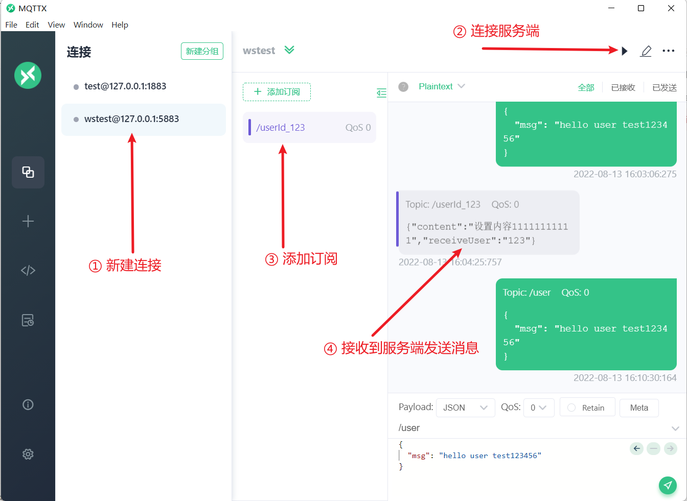

## 目录

*   [(二十六)集成websocket实时推送消息](#二十六集成websocket实时推送消息)

    *   [一、rabbitmq推送方案](#一rabbitmq推送方案)

    *   [二、websocket方案（mica-mqtt-core）](#二websocket方案mica-mqtt-core)

    *   [三、mica-mqtt方案测试](#三mica-mqtt方案测试)

# (二十七)集成websocket实时推送消息

基础项目地址:

[https://gitee.com/springzb/admin-boot](https://gitee.com/springzb/admin-boot "https://gitee.com/springzb/admin-boot")

此次整合推送消息有两种方案：

1\. 采用 rabbitmq 详细插件 rabbitmq\_web\_stomp

2.采用 websocket的方案（mica-mqtt-core底层采用 t-io 框架， mica-mqtt-core提供了 mqtt 和 websocket 两种通信协议）

方案一 适用于连接少，消息多的情况

方案二 适用于连接多，消息多的情况

rabbitmq方案具体实施查看《(二十五)集成rabbitmq消息推送》

引入依赖：

```xml
<!--整合 rabbitmq-->
<dependency>
    <groupId>org.springframework.boot</groupId>
    <artifactId>spring-boot-starter-amqp</artifactId>
</dependency>

<!--mica-mqtt依赖-->
<dependency>
    <groupId>net.dreamlu</groupId>
    <artifactId>mica-mqtt-core</artifactId>
    <version>1.2.10</version>
</dependency>
```

统一配置：

```java
package cn.mesmile.admin.modules.message;

import lombok.Data;
import org.springframework.boot.context.properties.ConfigurationProperties;

/**
 * @author zb
 * @Description
 */
@Data
@ConfigurationProperties(prefix = "admin.message")
public class MessageProperties {

    /**
     * 是否启用消息发送
     */
    private Boolean enabled = Boolean.FALSE;

    /**
     * 发送消息底层调用逻辑
     */
    private MessageServiceTypeEnum serviceType = MessageServiceTypeEnum.RABBIT_MQ;

    /**
     * mqtt配置 服务端ip
     */
    private String mqttServerIp = "0.0.0.0";

    /**
     * mqtt服务端 端口号
     */
    private Integer mqttServerPort = 1883;

    /**
     * webSocket端口号
     */
    private Integer mqttServerWebsocketPort = 5883;

}
```

```java
package cn.mesmile.admin.modules.message;

/**
 * @author zb
 * @Description 发送消息调用的底层服务
 */
public enum  MessageServiceTypeEnum {

    /**
     * rabbitMq
     */
    RABBIT_MQ,
    /**
     * rocketMq
     */
    ROCKET_MQ,
    /**
     * mqtt
     */
    MQTT
    
}

```

## 一、rabbitmq推送方案

```java
package cn.mesmile.admin.modules.message.operational;

import cn.mesmile.admin.common.rabbit.constant.RabbitConstant;
import cn.mesmile.admin.modules.message.vo.MqMessageVO;
import com.alibaba.fastjson.JSONObject;
import lombok.extern.slf4j.Slf4j;
import org.springframework.amqp.rabbit.core.RabbitTemplate;
import org.springframework.boot.autoconfigure.condition.ConditionalOnProperty;
import org.springframework.stereotype.Component;

import javax.annotation.Resource;
import java.util.List;
import java.util.Set;

/**
 * rabbitmq方式实现接口
 * 生产者-直连交换机模式
 * 此模式下路由键匹配，同一账号多处在线都可接收到消息，未登录账号无法接收推送,且再登录账号不会有推送，路由消息丢失，适用于web端
 *
 * @author zb
 * @Description
 */
@Slf4j
@Component
@ConditionalOnProperty(
  name = "admin.message.service-type",
  havingValue = "rabbit_mq"
)
public class RabbitMqSendServiceImpl implements ISendService{

  /**
     rabbitmq-plugins enable rabbitmq_web_stomp rabbitmq_web_stomp_examples
     直连交换机
  String MESSAGE_EXCHANGE_DIRECT = "message.direct.exchange";
   普通通知消息
   String MESSAGE_QUEUE_SINGLE_ROUTE_KEY = "message.single_";
   群发通知消息
  String MESSAGE_QUEUE_GROUP_ROUTE_KEY = "message.group_";
   */

    @Resource
    public RabbitTemplate rabbitTemplate;

  @Override
  public void sendSingleMessage(String receiveUserId, MqMessageVO mqMessageVO) {
    try {
      rabbitTemplate.convertAndSend(RabbitConstant.MESSAGE_EXCHANGE_DIRECT,
          RabbitConstant.MESSAGE_QUEUE_SINGLE_ROUTE_KEY + receiveUserId, JSONObject.toJSONString(mqMessageVO));
    }catch (Exception e){
      log.error("发送消息失败：",e);
    }
  }

  @Override
  public void sendGroupMessage(Set<String> userSet, MqMessageVO mqMessageVO) {
    try {
      userSet.forEach(
          userId-> rabbitTemplate.convertAndSend(RabbitConstant.MESSAGE_EXCHANGE_DIRECT,
          RabbitConstant.MESSAGE_QUEUE_SINGLE_ROUTE_KEY +userId, JSONObject.toJSONString(mqMessageVO))
      );
    }catch (Exception e){
      log.error("发送消息失败：",e);
    }
  }
}
```

**采用rabbitmq 前端需要安装插件 stomp 插件，对接rabbitmq 消息**

## 二、websocket方案（mica-mqtt-core）

mica-mqtt-core

<https://gitee.com/596392912/mica-mqtt>

```java
package cn.mesmile.admin.modules.message;

import lombok.extern.slf4j.Slf4j;
import net.dreamlu.iot.mqtt.codec.ByteBufferUtil;
import net.dreamlu.iot.mqtt.core.server.MqttServer;
import net.dreamlu.iot.mqtt.core.server.event.IMqttConnectStatusListener;
import org.springframework.boot.autoconfigure.condition.ConditionalOnProperty;
import org.springframework.boot.context.properties.EnableConfigurationProperties;
import org.springframework.context.annotation.Bean;
import org.springframework.context.annotation.Configuration;
import org.tio.core.ChannelContext;

/**
 * @author zb
 * @Description
 */
@Slf4j
@Configuration(
        proxyBeanMethods = false
)
@EnableConfigurationProperties({MessageProperties.class})
@ConditionalOnProperty(
        value = {"admin.message.enabled"},
        havingValue = "true"
)
public class MessageConfiguration {

    /**
     *  客户端工具下载： https://mqttx.app/
     *  mqtt://127.0.0.1:1883
     *  ws://127.0.0.1:5883
     *
     *  TODO 切换为 springboot 方式
     * https://gitee.com/596392912/mica-mqtt/blob/master/starter/mica-mqtt-server-spring-boot-starter/README.md
     */
    @ConditionalOnProperty(
            value = {"admin.message.service-type"},
            havingValue = "mqtt"
    )
    @Bean
    public MqttServer get(MessageProperties messageProperties) {
        // 注意：为了能接受更多链接（降低内存），请添加 jvm 参数 -Xss129k
        MqttServer mqttServer = MqttServer.create()
                // 默认：0.0.0.0
                .ip(messageProperties.getMqttServerIp())
                // 默认：1883
                .port(messageProperties.getMqttServerPort())
                .webPort(messageProperties.getMqttServerWebsocketPort())
                // 默认为： 8092（mqtt 默认最大消息大小），为了降低内存可以减小小此参数，如果消息过大 t-io 会尝试解析多次
                .readBufferSize(512)
                // 最大包体长度，如果包体过大需要设置此参数，默认为： 8092
                .maxBytesInMessage(1024 * 10)
                // 自定义认证
                .authHandler((context, uniqueId, clientId, userName, password) -> true)
                // 消息监听
                .messageListener((context, clientId, message) -> {
                    log.info("clientId:{} message:{} payload:{}", clientId, message, ByteBufferUtil.toString(message.getPayload()));
                })
                .connectStatusListener(new IMqttConnectStatusListener() {
                    @Override
                    public void online(ChannelContext channelContext, String s) {
                        log.info("--------客户端【上线】----------{}, 客户端id：{}",channelContext, s);
                    }

                    @Override
                    public void offline(ChannelContext channelContext, String s) {
                        log.info("--------客户端【下线】----------{}, 客户端id：{}",channelContext, s);
                    }
                })
                .httpEnable(true)
                .debug() // 开启 debug 信息日志
                .start();
        return mqttServer;
    }


}

```

```java
package cn.mesmile.admin.modules.message.operational;

import cn.mesmile.admin.modules.message.vo.MqMessageVO;
import com.alibaba.fastjson.JSONObject;
import lombok.extern.slf4j.Slf4j;
import net.dreamlu.iot.mqtt.core.server.MqttServer;
import org.springframework.boot.autoconfigure.condition.ConditionalOnProperty;
import org.springframework.stereotype.Component;

import javax.annotation.Resource;
import java.nio.ByteBuffer;
import java.nio.charset.StandardCharsets;
import java.util.Set;

/**
 * @author zb
 * @Description
 */
@Slf4j
@ConditionalOnProperty(
    value = {"admin.message.service-type"},
    havingValue = "mqtt"
)
@Component
public class MqttSendServiceImpl implements  ISendService{

  @Resource
  private MqttServer mqttServer;

  @Override
  public void sendSingleMessage(String receiveUserId, MqMessageVO mqMessageVO) {
    boolean b = mqttServer.publishAll("/userId_" + receiveUserId,
        ByteBuffer.wrap(JSONObject.toJSONString(mqMessageVO).getBytes(StandardCharsets.UTF_8)));
  }

  @Override
  public void sendGroupMessage(Set<String> userSet, MqMessageVO mqMessageVO) {
    userSet.forEach(
        userId-> this.sendSingleMessage(userId, mqMessageVO)
    );
  }

}
```

## 三、mica-mqtt方案测试

```java
  @Resource
  private ISendService sendService;

  /**
   *  客户端工具：https://mqttx.app/
   */
  @GetMapping("/message")
  public R message(){
      MqMessageVO mqMessageVO = new MqMessageVO();
      mqMessageVO.setReceiveUser("123");
      mqMessageVO.setContent("设置内容11111111111");
      sendService.sendSingleMessage("123",mqMessageVO);
      return R.data("test");
  }
```

客户端工具下载： <https://mqttx.app/>


&#x20;mqtt://127.0.0.1:1883
&#x20;ws\://127.0.0.1:5883


