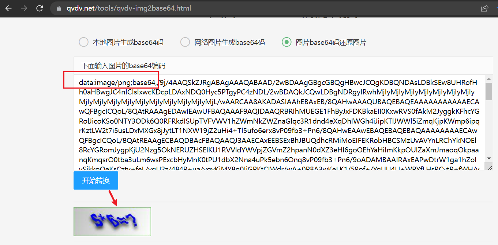

# (二十三)captcha验证码整合

## 目录

*   [一、引入依赖](#一引入依赖)

*   [二、编码](#二编码)

*   [三、测试](#三测试)

## 一、引入依赖

```xml
<!-- 验证码 -->
<dependency>
    <groupId>com.github.penggle</groupId>
    <artifactId>kaptcha</artifactId>
    <version>2.3.2</version>
</dependency>
```

## 二、编码

新增配置类CaptchaProperties

```java
package cn.mesmile.admin.common.captcha;

import lombok.Data;
import org.springframework.boot.context.properties.ConfigurationProperties;
import org.springframework.stereotype.Component;

/**
 * @author zb
 * @Description
 */
@Component
@Data
@ConfigurationProperties(prefix = "captcha")
public class CaptchaProperties {

    /**
     * 是否开启验证码
     */
    private Boolean enabled = Boolean.FALSE;

    /**
     * 验证码模式
     */
    private VerifyTypeEnum verifyType = VerifyTypeEnum.CALCULATE;

    /**
     * 过期时间，单位 秒
     */
    private Integer expire = 120;
}

```

验证码分类

```java
package cn.mesmile.admin.common.captcha;

/**
 * @author zb
 * @Description
 */
public enum VerifyTypeEnum {

    /**
     * 验证码方式， 计算
     */
    CALCULATE,
    /**
     * 随机字母和数字
     */
    RANDOM_LETTER_NUMBER
}

```

自定义生成验证方式

```java
package cn.mesmile.admin.common.captcha;

import com.google.code.kaptcha.text.impl.DefaultTextCreator;

import java.util.Random;

/**
 * @author zb
 * @Description 自定义计算结果
 */
public class CaptchaTextCreator extends DefaultTextCreator {

    private static final String[] CNUMBERS = new String[]{"0","1","2","3","4","5","6","7","8","9","10"};

    @Override
    public String getText() {
        Integer result = 0;
        Random random = new Random();
        int x = random.nextInt(10);
        int y = random.nextInt(10);
        StringBuilder suChinese = new StringBuilder();
        int randomoperands = (int) Math.round(Math.random() * 2);
        if (randomoperands == 0) {
            result = x * y;
            suChinese.append(CNUMBERS[x]);
            suChinese.append("*");
            suChinese.append(CNUMBERS[y]);
        } else if (randomoperands == 1) {
            if (!(x == 0) && y % x == 0) {
                result = y / x;
                suChinese.append(CNUMBERS[y]);
                suChinese.append("/");
                suChinese.append(CNUMBERS[x]);
            } else {
                result = x + y;
                suChinese.append(CNUMBERS[x]);
                suChinese.append("+");
                suChinese.append(CNUMBERS[y]);
            }
        } else if (randomoperands == 2) {
            if (x >= y) {
                result = x - y;
                suChinese.append(CNUMBERS[x]);
                suChinese.append("-");
                suChinese.append(CNUMBERS[y]);
            } else {
                result = y - x;
                suChinese.append(CNUMBERS[y]);
                suChinese.append("-");
                suChinese.append(CNUMBERS[x]);
            }
        } else {
            result = x + y;
            suChinese.append(CNUMBERS[x]);
            suChinese.append("+");
            suChinese.append(CNUMBERS[y]);
        }
        suChinese.append("=?@" + result);
        return suChinese.toString();
    }
}

```

配置相关方式CaptchaConfiguration&#x20;

```java
package cn.mesmile.admin.common.captcha;

import com.google.code.kaptcha.impl.DefaultKaptcha;
import com.google.code.kaptcha.impl.NoNoise;
import com.google.code.kaptcha.impl.ShadowGimpy;
import com.google.code.kaptcha.util.Config;
import org.springframework.boot.autoconfigure.condition.ConditionalOnProperty;
import org.springframework.boot.context.properties.EnableConfigurationProperties;
import org.springframework.context.annotation.Bean;
import org.springframework.context.annotation.Configuration;

import java.util.Properties;

import static com.google.code.kaptcha.Constants.*;

/**
 * @author zb
 * @Description
 */
@EnableConfigurationProperties({CaptchaProperties.class})
@Configuration
@ConditionalOnProperty(
        value = {"captcha.enabled"},
        havingValue = "true"
)
public class CaptchaConfiguration {

    @ConditionalOnProperty(
            value = {"captcha.verify-type"},
            havingValue = "random_letter_number"
    )
    @Bean(name = "captchaProducer")
    public DefaultKaptcha getKaptchaBean() {
        DefaultKaptcha defaultKaptcha = new DefaultKaptcha();
        Properties properties = new Properties();
        // 是否有边框 默认为true 我们可以自己设置yes，no
        properties.setProperty(KAPTCHA_BORDER, "yes");
        // 验证码文本字符颜色 默认为Color.BLACK
        properties.setProperty(KAPTCHA_TEXTPRODUCER_FONT_COLOR, "black");
        // 验证码图片宽度 默认为200
        properties.setProperty(KAPTCHA_IMAGE_WIDTH, "160");
        // 验证码图片高度 默认为50
        properties.setProperty(KAPTCHA_IMAGE_HEIGHT, "60");
        // 验证码文本字符大小 默认为40
        properties.setProperty(KAPTCHA_TEXTPRODUCER_FONT_SIZE, "38");
        // KAPTCHA_SESSION_KEY
        properties.setProperty(KAPTCHA_SESSION_CONFIG_KEY, "kaptchaCode");
        // 验证码文本字符长度 默认为5
        properties.setProperty(KAPTCHA_TEXTPRODUCER_CHAR_LENGTH, "4");
        // 验证码文本字体样式 默认为new Font("Arial", 1, fontSize), new Font("Courier", 1, fontSize)
        properties.setProperty(KAPTCHA_TEXTPRODUCER_FONT_NAMES, "Arial,Courier");
        // 图片样式 水纹com.google.code.kaptcha.impl.WaterRipple 鱼眼com.google.code.kaptcha.impl.FishEyeGimpy 阴影com.google.code.kaptcha.impl.ShadowGimpy
        properties.setProperty(KAPTCHA_OBSCURIFICATOR_IMPL, ShadowGimpy.class.getTypeName());
        Config config = new Config(properties);
        defaultKaptcha.setConfig(config);
        return defaultKaptcha;
    }

    /**
     * 默认使用 加减乘除
     * @return
     */
    @ConditionalOnProperty(
            value = {"captcha.verify-type"},
            havingValue = "calculate"
    )
    @Bean(name = "captchaProducerMath")
    public DefaultKaptcha getKaptchaBeanMath() {
        DefaultKaptcha defaultKaptcha = new DefaultKaptcha();
        Properties properties = new Properties();
        // 是否有边框 默认为true 我们可以自己设置yes，no
        properties.setProperty(KAPTCHA_BORDER, "yes");
        // 边框颜色 默认为Color.BLACK
        properties.setProperty(KAPTCHA_BORDER_COLOR, "105,179,90");
        // 验证码文本字符颜色 默认为Color.BLACK
        properties.setProperty(KAPTCHA_TEXTPRODUCER_FONT_COLOR, "blue");
        // 验证码图片宽度 默认为200
        properties.setProperty(KAPTCHA_IMAGE_WIDTH, "160");
        // 验证码图片高度 默认为50
        properties.setProperty(KAPTCHA_IMAGE_HEIGHT, "60");
        // 验证码文本字符大小 默认为40
        properties.setProperty(KAPTCHA_TEXTPRODUCER_FONT_SIZE, "35");
        // KAPTCHA_SESSION_KEY
        properties.setProperty(KAPTCHA_SESSION_CONFIG_KEY, "kaptchaCodeMath");
        // 验证码文本生成器
        properties.setProperty(KAPTCHA_TEXTPRODUCER_IMPL, CaptchaTextCreator.class.getTypeName());
        // 验证码文本字符间距 默认为2
        properties.setProperty(KAPTCHA_TEXTPRODUCER_CHAR_SPACE, "3");
        // 验证码文本字符长度 默认为5
        properties.setProperty(KAPTCHA_TEXTPRODUCER_CHAR_LENGTH, "6");
        // 验证码文本字体样式 默认为new Font("Arial", 1, fontSize), new Font("Courier", 1, fontSize)
        properties.setProperty(KAPTCHA_TEXTPRODUCER_FONT_NAMES, "Arial,Courier");
        // 验证码噪点颜色 默认为Color.BLACK
        properties.setProperty(KAPTCHA_NOISE_COLOR, "white");
        // 干扰实现类
        properties.setProperty(KAPTCHA_NOISE_IMPL, NoNoise.class.getTypeName());
        // 图片样式 水纹com.google.code.kaptcha.impl.WaterRipple 鱼眼com.google.code.kaptcha.impl.FishEyeGimpy 阴影com.google.code.kaptcha.impl.ShadowGimpy
        properties.setProperty(KAPTCHA_OBSCURIFICATOR_IMPL, ShadowGimpy.class.getTypeName());
        Config config = new Config(properties);
        defaultKaptcha.setConfig(config);
        return defaultKaptcha;
    }

}

```

生成以及校验工具类CaptchaUtil

```java
package cn.mesmile.admin.common.captcha;

import cn.hutool.core.util.StrUtil;
import cn.mesmile.admin.common.constant.AdminConstant;
import cn.mesmile.admin.common.exceptions.ServiceException;
import cn.mesmile.admin.common.utils.AdminRedisTemplate;
import com.baomidou.mybatisplus.core.toolkit.StringPool;
import com.google.code.kaptcha.Producer;
import org.springframework.util.FastByteArrayOutputStream;

import javax.imageio.ImageIO;
import java.awt.image.BufferedImage;
import java.time.Duration;
import java.util.Base64;

/**
 * @author zb
 * @Description
 */
public class CaptchaUtil {

    private CaptchaUtil(){}

    /**
     * 检查验证码是否有效
     * @param uuid 唯一键值
     * @param codeAnswer 验证码答案
     * @param adminRedisTemplate redis工具类
     * @return 验证成功为 TRUE  验证失败为 FALSE
     */
    public static boolean checkVerificationCode(String uuid, String codeAnswer,AdminRedisTemplate adminRedisTemplate){
        String verifyKey = AdminConstant.CAPTCHA_CODE_KEY + uuid;
        String answer = adminRedisTemplate.get(verifyKey);
        if (StrUtil.isNotEmpty(codeAnswer) && answer != null && answer.equals(codeAnswer)){
            return true;
        }
        return false;
    }

    /**
     * 获取Base64图片
     * @param captchaProducerMath 图片生成器
     * @param adminRedisTemplate redis工具类
     * @param captchaProperties 配置
     * @param uuid 唯一值
     * @return base64字符串图片
     */
    public static String getImageBase64Str(Producer captchaProducerMath, AdminRedisTemplate adminRedisTemplate,
                                           CaptchaProperties captchaProperties,String uuid){
        BufferedImage imageStream = getImageStream(captchaProducerMath, adminRedisTemplate, captchaProperties, uuid);
        try (
                FastByteArrayOutputStream outputStream = new FastByteArrayOutputStream();
                ){
            ImageIO.write(imageStream, "jpg", outputStream);
            return Base64.getEncoder().encodeToString(outputStream.toByteArray());
        }catch (Exception e) {
           throw new ServiceException("生成验证码异常", e);
        }
    }

    public static BufferedImage getImageStream(Producer captchaProducerMath, AdminRedisTemplate adminRedisTemplate,
                                        CaptchaProperties captchaProperties,String uuid){
        String verifyKey = AdminConstant.CAPTCHA_CODE_KEY + uuid;
        // 创造图形
        String capText = captchaProducerMath.createText();
        String capStr = null;
        String answer = null;
        if (captchaProperties.getVerifyType().equals(VerifyTypeEnum.CALCULATE)){
            capStr = capText.substring(0, capText.lastIndexOf(StringPool.AT));
            answer = capText.substring(capText.lastIndexOf(StringPool.AT) + 1);
        }else if (captchaProperties.getVerifyType().equals(VerifyTypeEnum.RANDOM_LETTER_NUMBER)){
            capStr = capText;
            answer = capText;
        }
        BufferedImage image = captchaProducerMath.createImage(capStr);
        // 验证码默认有效期为两分钟
        adminRedisTemplate.setEx(verifyKey, answer, Duration.ofSeconds(captchaProperties.getExpire()));
        return image;
    }

}
```

application.yml中添加相关配置

```yaml
# 验证码相关
captcha:
  enabled: true
  verify-type: calculate
  expire: 120
```

## 三、测试

```java
package cn.mesmile.admin.modules.auth.controller;

import cn.hutool.core.util.IdUtil;
import cn.mesmile.admin.common.captcha.CaptchaProperties;
import cn.mesmile.admin.common.captcha.CaptchaUtil;
import cn.mesmile.admin.common.captcha.CaptchaVO;
import cn.mesmile.admin.common.limit.LimiterModeEnum;
import cn.mesmile.admin.common.limit.RateLimiter;
import cn.mesmile.admin.common.result.R;
import cn.mesmile.admin.common.utils.AdminRedisTemplate;
import cn.mesmile.admin.modules.auth.domain.request.LoginRequest;
import cn.mesmile.admin.modules.auth.domain.vo.LoginVO;
import cn.mesmile.admin.modules.auth.service.ILoginService;
import com.google.code.kaptcha.Producer;
import io.swagger.annotations.Api;
import io.swagger.annotations.ApiOperation;
import lombok.RequiredArgsConstructor;
import org.springframework.validation.annotation.Validated;
import org.springframework.web.bind.annotation.GetMapping;
import org.springframework.web.bind.annotation.PostMapping;
import org.springframework.web.bind.annotation.RequestBody;
import org.springframework.web.bind.annotation.RestController;

import java.util.concurrent.TimeUnit;

/**
 * @author zb
 * @Description
 */
@Api(value = "登陆退出相关api", tags = {"登陆退出相关api"})
@Validated
@RestController
@RequiredArgsConstructor
public class LoginController {

    private final Producer producer;

    private final AdminRedisTemplate adminRedisTemplate;

    private final CaptchaProperties captchaProperties;

    /** 限制频率在 5 秒钟 3次 
    *
    *  若整合了 spring security需要放开 /captcha 接口
    */
    @RateLimiter(limiterMode = LimiterModeEnum.LIMITER_IP,max = 3, ttl = 6,timeUnit = TimeUnit.SECONDS)
    @ApiOperation("获取验证码")
    @GetMapping("/captcha")
    public R<CaptchaVO> getCaptcha(){
        String uuid = IdUtil.fastSimpleUUID();
        String imageBase64Str = CaptchaUtil.getImageBase64Str(producer, adminRedisTemplate, captchaProperties, uuid);
        CaptchaVO captchaVO = new CaptchaVO(uuid, imageBase64Str);
        return R.data(captchaVO);
    }

}

```

请求 localhost:8080/captcha 地址，获取到结果

```json
{
  "code": 200,
  "success": true,
  "data": {
    "key": "57e851e88ffa4a0cac5d14c9d5669ae5",
    "img": "/9j/4AAQSkZJRgABAgAAAQABAAD/2wBDAAgGBgcGBQgHBwcJCQgKDBQNDAsLDBkSEw8UHRofHh0aHBwgJC4nICIsIxwcKDcpLDAxNDQ0Hyc5PTgyPC4zNDL/2wBDAQkJCQwLDBgNDRgyIRwhMjIyMjIyMjIyMjIyMjIyMjIyMjIyMjIyMjIyMjIyMjIyMjIyMjIyMjIyMjIyMjIyMjL/wAARCAA8AKADASIAAhEBAxEB/8QAHwAAAQUBAQEBAQEAAAAAAAAAAAECAwQFBgcICQoL/8QAtRAAAgEDAwIEAwUFBAQAAAF9AQIDAAQRBRIhMUEGE1FhByJxFDKBkaEII0KxwRVS0fAkM2JyggkKFhcYGRolJicoKSo0NTY3ODk6Q0RFRkdISUpTVFVWV1hZWmNkZWZnaGlqc3R1dnd4eXqDhIWGh4iJipKTlJWWl5iZmqKjpKWmp6ipqrKztLW2t7i5usLDxMXGx8jJytLT1NXW19jZ2uHi4+Tl5ufo6erx8vP09fb3+Pn6/8QAHwEAAwEBAQEBAQEBAQAAAAAAAAECAwQFBgcICQoL/8QAtREAAgECBAQDBAcFBAQAAQJ3AAECAxEEBSExBhJBUQdhcRMiMoEIFEKRobHBCSMzUvAVYnLRChYkNOEl8RcYGRomJygpKjU2Nzg5OkNERUZHSElKU1RVVldYWVpjZGVmZ2hpanN0dXZ3eHl6goOEhYaHiImKkpOUlZaXmJmaoqOkpaanqKmqsrO0tba3uLm6wsPExcbHyMnK0tPU1dbX2Nna4uPk5ebn6Onq8vP09fb3+Pn6/9oADAMBAAIRAxEAPwDtrW1ga1hZoIySikkoOeKsCztv+feL/vgU2z/484P+ua/yqyKiMY8q0IjGPKtCIWdr/wA+0P8A3wKeLK1/59of+/YqUU4U+WPYfLHsRCytP+fWH/v2KcLG0/59YP8Av2Kh1DVLLSbR7q+uY4IF6u5/Qep9hVDQ/GGieIXePT71XlTkxOCj49QD1H0rWOFnKDqRg3Fbu2i+YrRvY2BYWf8Az6wf9+xThYWf/PpB/wB+xVXVtastDsTe38jR24YKzqhbbk4yQOcVfgmjuIUlidXjdQyspyCDyDUOlaKny6PrYfLHsNGn2X/Ppb/9+x/hThp1l/z52/8A36X/AAp5niRwjSKGPQE4Jo+126zrAZ4xMwyELDcfwpci7Byx7ANOsf8Anzt/+/S/4U4abY/8+Vv/AN+l/wAKnXmnilyx7Byx7FcaZYf8+Vt/36X/AAp40yw/58bb/v0v+FWBTtwFHLHsHLHsVxpen/8APjbf9+V/wp40rT/+fC1/78r/AIVkL428OtrQ0ldVt2vCdu0Nxu/u7umfbNdEpBrSdCVO3PG19VdAoxexWGlad/z4Wv8A35X/AApw0nTv+gfa/wDflf8ACrQp4rPlj2Dlj2Ko0nTf+gfaf9+V/wAKranpenx6Reuljaq6wOVYQqCDtPI4rWFVdW/5At//ANe8n/oJpSjHlegpRjyvQ5Kz/wCPOD/rmv8AKrIqvZ/8ecH/AFzX+VWRTj8KHH4UOFDHapNKKGXK4qijx/4rWxuJbe+XJMQMbj2J4P51zeh2q/bbO/0S6EV/AwYwztw3qAR2IyMe/WvT/FekfaoXBXKsCCK8mu/Ds9vN/o7scHkdx719XleZwnhVhKtTkavZtXi091JGE4Pm5krnpHilNS1eAeXqCwW7Q7ZbR13o7Zzyf89KxtA+Il9pdnaaK1vA00Mgj824l2II/r7dK52ZdW0CNLqO+e6tzgSRvnA/Ak/nWhounWmqXw1GABo5AVlgdQwz6fyNOEaFDC/v7VKX2XFWtJdJbO7899NQ1ctNGa3xPlmvls9Ss5yY41w3lvkYPcEVyWmadHNawaouti1u1lyXkONhHTB656V6FdeH0j00wwQLHFydijjnrXl+saVJplwVwxtmbOPQ+lbZLmCrU1gYz5Gno7J80dbxd76/8MKpCz5j6I8M6vcXmnIL4xtOqj99EcxzD+8p/pWIPi74fTW5NOnjvIERzGbiWLaoYHByv3h+I+oFea6Lf69olkJ9CuVu7F/mNtKMlT3x0/T8qtjXdO8V2k/2zS4jeAbpQijzG4xuVupxxx/OvPll1GnKdWouenteLs4u/WL2/Irnbsloz1TW/iP4c0S1WVr6O7d/uRWjLIx9+DgD6muF+Imt6hqenWuoaFezSafcrhlhJz+I6j0PuMVxENz4d0aTz7aF9TnP3EnHyJ9Rjk/h+VbujeJ9EleT7Sv9lu3MkSqTE5/vAAcN+Az78Y6Y4B4TlxGGoynyv7SWv/bvxK3fuLm5tGxNM8J6dc6DHHNFLDqDjebjcdyN1Ax0x+tdZ4V+It/pOqweHPFCFpGZY4b0H74PClvUHpn8+c10Flo1vNpyXMDrJFIgdHXkMCMgivKPGLtH4xsYro7IYmUhj027uT+lZYGvUzOtPD4v3k1JrvF/3fytsOSUEnE+l42DjIqUVlaPcGe2Vic5Fawr5k2HCqurf8gS/wD+vaT/ANBNWxVXV/8AkCX/AP17Sf8AoJqZfCyZfCzkrP8A48oP+ua/yqyKr2X/AB5Qf9c1/lVkUR+FBH4UOFOApBTxVFFa5tVnjIYV5z4z0FxaPcWbGO5iyy7f4h3FeoYyKxtY043MZAFa0arpVFUWtu4mrqx8+tqOq3Fi1q0TSJ0Zihz+ddX8MLS4XU7hpUZYWUDBHVs10k3hOSSQ/Lxn0rodA8PmyYEivZxOeKrh54enRjCMnfQzjSs02zpDYRy2+3aOlcJ4l8MLLvOzKnqMV6XEmEAqve2azxEEV4SbTujU+dI7mbwpfzWsyO9u/wA8eOtL4esLy81oakI/KjZy+PUGvTdZ8LLczjfArhTkbhnFaGjeGSjhnWvdqZ3elLkppVJq0pd15La76syVPXfRHJw+FYYruS6gtgJZCWLdcZ9PSp5vCVpqUqG/s97D+NSVYj0JHWvVoNKiRQNoqb+zIc52ivIWKrqaqKb5lpe7v95pyq1rGZo9lDZ6RFaW0CwwRrtRFHAFecfEO1eyVL+C2jlvEkCQlk3FS3oO54GK9ljt1jTAFYmraSLlwdoJByOOlFCu6dZVZK9nd+fdP16g1dWMr4aX2pXPhyIatHIl4jsrGRNpYZyDj6HH4V3y9KwNHsGtgAa31HFRWqKpUlNJK7vZbLyXkCVlYeKq6v8A8gS//wCvaT/0E1bFVdX/AOQJf/8AXtJ/6Caxl8LFL4WclZf8eVv/ANc1/lVkVzMWtXMUSRqkRCKFGQe341J/b91/zzh/75P+NZRrRsjONWNkdKKcK5n/AISG7/55wf8AfJ/xpf8AhIrv/nnB/wB8n/Gq9tEftonUCl2Buorl/wDhJLz/AJ5Qf98n/Gl/4SW8/wCeUH/fJ/xo9tEPbROnECegqVI1XoK5T/hJ73/nlb/98t/jS/8ACUXv/PK3/wC+W/xo9tEPbROvAp2M1x//AAlV9/zyt/8Avlv8aX/hK77/AJ5W3/fLf40e2iHtonWNbI5yVFTRwqnQVx3/AAlt/wD88bb/AL5b/Gl/4S/UP+eNt/3y3/xVHtoh7aJ2wFPFcP8A8JhqH/PG1/75b/4ql/4TLUf+eNr/AN8t/wDFUe2iHtondCjyw3UVw3/CZ6j/AM8bX/vhv/iqX/hNdS/54Wn/AHw3/wAVR7aIe2id4iBegqQVwH/Cbal/zwtP++G/+Kpf+E41P/nhaf8AfDf/ABVHtoh7aJ6CKq6v/wAgPUP+vaT/ANBNcV/wnOp/88LT/vhv/iqjufGeo3VrNbvDahJUZGKq2QCMcfNUyrRsxSqxsz//2Q=="
  },
  "msg": "操作成功"
}
```

校验结果成功：


