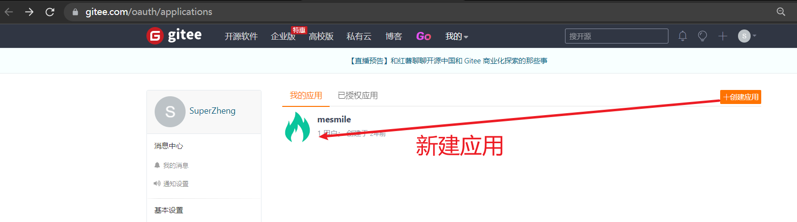

# (二十二)集成just-auth实现第三方授权登录

## 目录

*   [一、简介](#一简介)

*   [二、对接准备](#二对接准备)

    *   [2.1注册账号](#21注册账号)

    *   [2.2 创建第三方授权应用](#22-创建第三方授权应用)

*   [三、编写代码](#三编写代码)

    *   [3.1 引入maven依赖](#31-引入maven依赖)

    *   [3.2 编写代码](#32-编写代码)

*   [四、测试](#四测试)

## 一、简介

第三方登录，是基于用户在第三方平台上已有的账号和密码来快速完成己方应用的登录或者注册功能。而这里的第三方平台，一般是已经拥有大量用户的平台，国外的比如Facebook，Twitter等，国内的比如微博、微信、QQ等。

目前已有较为成熟的解决方案，名为JustAuth

JustAuth开源地址：[https://github.com/justauth/JustAuth](https://github.com/justauth/JustAuth "https://github.com/justauth/JustAuth")

> 史上最全的整合第三方登录的开源库。目前已支持Github、Gitee、微博、钉钉、百度、Coding、腾讯云开发者平台、OSChina、支付宝、QQ、微信、淘宝、Google、Facebook、抖音、领英、小米、微软、今日头条、Teambition、StackOverflow、Pinterest、人人、华为、企业微信、酷家乐、Gitlab、美团、饿了么和推特等第三方平台的授权登录。 Login, so easy!

## 二、对接准备

这里以 gitee 为例，更多示例查看justauth官方文档：

[https://justauth.wiki/guide/](https://justauth.wiki/guide/ "https://justauth.wiki/guide/")

### 2.1注册账号

注册Gitee账号：[https://gitee.com (opens new window)](https://gitee.com/ "https://gitee.com (opens new window)")。如果已有则忽略该步骤，直接进入第二步。

### 2.2 创建第三方授权应用

进入第三方应用页面（[https://gitee.com/oauth/applications (opens new window)](https://gitee.com/oauth/applications "https://gitee.com/oauth/applications (opens new window)")）



*   **应用名称** 一般填写自己的网站名称即可

*   **应用描述** 一般填写自己的应用描述即可

*   **应用主页** 填写自己的网站首页地址

*   **应用回调地址** 重点，该地址为用户授权后需要跳转到的自己网站的地址，默认携带一个code参数

*   **权限** 根据页面提示操作，默认勾选第一个就行。

以上信息输入完成后，点击确定按钮创建应用。创建完成后，点击进入应用详情页，可以看到应用的密钥等信息


记录以下三个信息：`Client ID`、`Client Secret`和`应用回调地址`，后面我们会用到

重要提示

**“应用密钥”可保护你应用程序的安全，因此请确保其不会泄露！也不要与任何人共享你的“应用密钥”！！！**

## 三、编写代码

### 3.1 引入maven依赖

```xml
<!--第三方认证包-->
<dependency>
    <groupId>me.zhyd.oauth</groupId>
    <artifactId>JustAuth</artifactId>
    <version>1.16.3</version>
</dependency>
<!--just-auth中的http工具-->
<dependency>
    <groupId>org.apache.httpcomponents</groupId>
    <artifactId>httpclient</artifactId>
    <version>4.5.12</version>
</dependency>
```

### 3.2 编写代码

新建配置类：

```java
package cn.mesmile.admin.modules.social.config;

import com.google.common.collect.Maps;
import lombok.Getter;
import lombok.Setter;
import me.zhyd.oauth.config.AuthConfig;
import me.zhyd.oauth.config.AuthDefaultSource;
import org.springframework.boot.context.properties.ConfigurationProperties;
import org.springframework.stereotype.Component;

import java.util.HashMap;
import java.util.Map;

/**
 * @author zb
 * @Description
 */
@Component
@Getter
@Setter
@ConfigurationProperties(prefix = "social")
public class SocialProperties {
    /**
     * 是否开启第三方登录
     */
    private Boolean enabled = Boolean.FALSE;
    /**
     * 当前应用回调地址domain
     */
    private String domain;
    /**
     *  数据来源
     */
    private Map<AuthDefaultSource, AuthConfig> oauth = new HashMap<>();

}

```

自定义认证缓存SocialAuthStateRedisCache

```java
package cn.mesmile.admin.modules.social.cache;

import me.zhyd.oauth.cache.AuthCacheConfig;
import me.zhyd.oauth.cache.AuthStateCache;
import org.springframework.data.redis.core.RedisTemplate;
import org.springframework.data.redis.core.ValueOperations;

import java.util.concurrent.TimeUnit;

/**
 * @author zb
 * @Description 第三方认证缓存
 */
public class SocialAuthStateRedisCache implements AuthStateCache {

    private final RedisTemplate<String, Object> redisTemplate;

    private final ValueOperations<String, Object> valueOperations;

    @Override
    public void cache(String key, String value) {
        valueOperations.set(key, value, AuthCacheConfig.timeout, TimeUnit.MILLISECONDS);
    }

    @Override
    public void cache(String key, String value, long timeout) {
        valueOperations.set(key, value, timeout, TimeUnit.MILLISECONDS);
    }

    @Override
    public String get(String key) {
        return String.valueOf(valueOperations.get(key));
    }

    @Override
    public boolean containsKey(String key) {
        return redisTemplate.hasKey(key);
    }

    public SocialAuthStateRedisCache(final RedisTemplate<String, Object> redisTemplate, final ValueOperations<String, Object> valueOperations) {
        this.redisTemplate = redisTemplate;
        this.valueOperations = valueOperations;
    }
}
```

配置文件SocialConfiguration

```java
package cn.mesmile.admin.modules.social.config;

import cn.mesmile.admin.modules.social.cache.SocialAuthStateRedisCache;
import com.xkcoding.http.HttpUtil;
import com.xkcoding.http.support.Http;
import com.xkcoding.http.support.httpclient.HttpClientImpl;
import me.zhyd.oauth.cache.AuthStateCache;
import org.springframework.boot.autoconfigure.condition.ConditionalOnMissingBean;
import org.springframework.boot.autoconfigure.condition.ConditionalOnProperty;
import org.springframework.boot.context.properties.EnableConfigurationProperties;
import org.springframework.context.annotation.Bean;
import org.springframework.context.annotation.Configuration;
import org.springframework.data.redis.core.RedisTemplate;

/**
 * @author zb
 * @Description 第三方登录
 */
@Configuration(proxyBeanMethods = false)
@EnableConfigurationProperties({SocialProperties.class})
@ConditionalOnProperty(
        value = {"social.enabled"},
        havingValue = "true"
)
public class SocialConfiguration {

    @Bean
    @ConditionalOnMissingBean({Http.class})
    public Http simpleHttp() {
        HttpClientImpl httpClient = new HttpClientImpl();
        HttpUtil.setHttp(httpClient);
        return httpClient;
    }

    @Bean
    @ConditionalOnMissingBean({AuthStateCache.class})
    public AuthStateCache authStateCache(RedisTemplate<String, Object> redisTemplate) {
        return new SocialAuthStateRedisCache(redisTemplate, redisTemplate.opsForValue());
    }

}


```

工具类SocialAuthUtil

```java
package cn.mesmile.admin.modules.social.util;

import java.util.Objects;

import cn.mesmile.admin.common.utils.SpringUtil;
import cn.mesmile.admin.modules.social.config.SocialProperties;
import me.zhyd.oauth.cache.AuthStateCache;
import me.zhyd.oauth.config.AuthConfig;
import me.zhyd.oauth.config.AuthDefaultSource;
import me.zhyd.oauth.exception.AuthException;
import me.zhyd.oauth.request.AuthAlipayRequest;
import me.zhyd.oauth.request.AuthBaiduRequest;
import me.zhyd.oauth.request.AuthCodingRequest;
import me.zhyd.oauth.request.AuthCsdnRequest;
import me.zhyd.oauth.request.AuthDingTalkRequest;
import me.zhyd.oauth.request.AuthDouyinRequest;
import me.zhyd.oauth.request.AuthElemeRequest;
import me.zhyd.oauth.request.AuthFacebookRequest;
import me.zhyd.oauth.request.AuthGiteeRequest;
import me.zhyd.oauth.request.AuthGithubRequest;
import me.zhyd.oauth.request.AuthGitlabRequest;
import me.zhyd.oauth.request.AuthGoogleRequest;
import me.zhyd.oauth.request.AuthHuaweiRequest;
import me.zhyd.oauth.request.AuthKujialeRequest;
import me.zhyd.oauth.request.AuthLinkedinRequest;
import me.zhyd.oauth.request.AuthMeituanRequest;
import me.zhyd.oauth.request.AuthMiRequest;
import me.zhyd.oauth.request.AuthMicrosoftRequest;
import me.zhyd.oauth.request.AuthOschinaRequest;
import me.zhyd.oauth.request.AuthPinterestRequest;
import me.zhyd.oauth.request.AuthQqRequest;
import me.zhyd.oauth.request.AuthRenrenRequest;
import me.zhyd.oauth.request.AuthRequest;
import me.zhyd.oauth.request.AuthStackOverflowRequest;
import me.zhyd.oauth.request.AuthTaobaoRequest;
import me.zhyd.oauth.request.AuthTeambitionRequest;
import me.zhyd.oauth.request.AuthToutiaoRequest;
import me.zhyd.oauth.request.AuthTwitterRequest;
import me.zhyd.oauth.request.AuthWeChatEnterpriseQrcodeRequest;
import me.zhyd.oauth.request.AuthWeChatEnterpriseWebRequest;
import me.zhyd.oauth.request.AuthWeChatMpRequest;
import me.zhyd.oauth.request.AuthWeChatOpenRequest;
import me.zhyd.oauth.request.AuthWeiboRequest;


/**
 * @author zb
 * @Description
 */
public class SocialAuthUtil {
    
    private SocialAuthUtil() {}

    /**
     * 获取认证客户端
     * @param source 第三方认证源类型 {@link AuthDefaultSource}
     * @param cache 缓存配置
     * @return 认证客户端
     */
    public static AuthRequest getAuthRequest(String source, SocialProperties socialProperties, AuthStateCache cache) {
        AuthDefaultSource authSource = Objects.requireNonNull(AuthDefaultSource.valueOf(source.toUpperCase()));
        AuthConfig authConfig = socialProperties.getOauth().get(authSource);
        if (authConfig == null) {
            throw new AuthException("未获取到第三方有效的Auth配置");
        } else {
            AuthRequest authRequest = getAuthRequest(authSource, authConfig, cache);
            if (null == authRequest) {
                throw new AuthException("未获取到第三方有效的Auth配置");
            } else {
                return authRequest;
            }
        }
    }

    /**
     * 获取认证客户端
     * @param authSource 认证源
     * @param authConfig 配置
     * @param cache 缓存配置
     * @return 认证客户端
     */
    private static AuthRequest getAuthRequest(AuthDefaultSource authSource, AuthConfig authConfig,AuthStateCache cache) {
        AuthRequest authRequest = null;
        switch(authSource) {
        case GITHUB:
            authRequest = new AuthGithubRequest(authConfig, cache);
            break;
        case GITEE:
            authRequest = new AuthGiteeRequest(authConfig, cache);
            break;
        case OSCHINA:
            authRequest = new AuthOschinaRequest(authConfig, cache);
            break;
        case QQ:
            authRequest = new AuthQqRequest(authConfig, cache);
            break;
        case WECHAT_OPEN:
            authRequest = new AuthWeChatOpenRequest(authConfig, cache);
            break;
        case WECHAT_ENTERPRISE:
            authRequest = new AuthWeChatEnterpriseQrcodeRequest(authConfig, cache);
            break;
        case WECHAT_ENTERPRISE_WEB:
            authRequest = new AuthWeChatEnterpriseWebRequest(authConfig, cache);
            break;
        case WECHAT_MP:
            authRequest = new AuthWeChatMpRequest(authConfig, cache);
            break;
        case DINGTALK:
            authRequest = new AuthDingTalkRequest(authConfig, cache);
            break;
        case ALIPAY:
            authRequest = new AuthAlipayRequest(authConfig, cache);
            break;
        case BAIDU:
            authRequest = new AuthBaiduRequest(authConfig, cache);
            break;
        case WEIBO:
            authRequest = new AuthWeiboRequest(authConfig, cache);
            break;
        case CODING:
            authRequest = new AuthCodingRequest(authConfig, cache);
            break;
        case CSDN:
            authRequest = new AuthCsdnRequest(authConfig, cache);
            break;
        case TAOBAO:
            authRequest = new AuthTaobaoRequest(authConfig, cache);
            break;
        case GOOGLE:
            authRequest = new AuthGoogleRequest(authConfig, cache);
            break;
        case FACEBOOK:
            authRequest = new AuthFacebookRequest(authConfig, cache);
            break;
        case DOUYIN:
            authRequest = new AuthDouyinRequest(authConfig, cache);
            break;
        case LINKEDIN:
            authRequest = new AuthLinkedinRequest(authConfig, cache);
            break;
        case MICROSOFT:
            authRequest = new AuthMicrosoftRequest(authConfig, cache);
            break;
        case MI:
            authRequest = new AuthMiRequest(authConfig, cache);
            break;
        case TOUTIAO:
            authRequest = new AuthToutiaoRequest(authConfig, cache);
            break;
        case TEAMBITION:
            authRequest = new AuthTeambitionRequest(authConfig, cache);
            break;
        case PINTEREST:
            authRequest = new AuthPinterestRequest(authConfig, cache);
            break;
        case RENREN:
            authRequest = new AuthRenrenRequest(authConfig, cache);
            break;
        case STACK_OVERFLOW:
            authRequest = new AuthStackOverflowRequest(authConfig, cache);
            break;
        case HUAWEI:
            authRequest = new AuthHuaweiRequest(authConfig, cache);
            break;
        case KUJIALE:
            authRequest = new AuthKujialeRequest(authConfig, cache);
            break;
        case GITLAB:
            authRequest = new AuthGitlabRequest(authConfig, cache);
            break;
        case MEITUAN:
            authRequest = new AuthMeituanRequest(authConfig, cache);
            break;
        case ELEME:
            authRequest = new AuthElemeRequest(authConfig, cache);
            break;
        case TWITTER:
            authRequest = new AuthTwitterRequest(authConfig, cache);
        }
        return authRequest;
    }
}
```

在application.yml中添加配置

```yaml
#第三方登陆配置
social:
  enabled: true
  domain: http://127.0.0.1:8080
  oauth:
    GITEE:
      # 这里用自己申请好的相关应用信息
      client-id: c05cfd9f79726d8427cdb52d5360a74acbf92fc8cff01fc2deb0c54ed4a84e14
      client-secret: b36c9fb4dcec933f1ae4b33ff1285cf8afc994ad7d307d1694b067e70bd19908
      redirect-uri: ${social.domain}/oauth/callback/gitee
    GITHUB:
      client-id: 123************
      client-secret: 123************************************
      redirect-uri: ${social.domain}/oauth/callback/github
```

## 四、测试

第三方认证相关Controller demo类

```java
package cn.mesmile.admin.modules.social.controller;

import cn.hutool.json.JSONUtil;
import cn.mesmile.admin.modules.social.config.SocialProperties;
import cn.mesmile.admin.modules.social.util.SocialAuthUtil;
import io.swagger.annotations.Api;
import lombok.RequiredArgsConstructor;
import lombok.extern.slf4j.Slf4j;
import me.zhyd.oauth.cache.AuthStateCache;
import me.zhyd.oauth.model.AuthCallback;
import me.zhyd.oauth.model.AuthResponse;
import me.zhyd.oauth.request.AuthRequest;
import me.zhyd.oauth.utils.AuthStateUtils;
import org.springframework.web.bind.annotation.GetMapping;
import org.springframework.web.bind.annotation.PathVariable;
import org.springframework.web.bind.annotation.RequestMapping;
import org.springframework.web.bind.annotation.RestController;

import javax.servlet.http.HttpServletResponse;
import java.io.IOException;

/**
 * @author zb
 * @Description
 */
@Api(value = "第三方认证相关",tags = {"第三方认证相关api"})
@RequiredArgsConstructor
@Slf4j
@RestController
@RequestMapping("/oauth")
public class SocialController {

    private final AuthStateCache authStateCache;

    private final SocialProperties socialProperties;

    /**
     * 登录地址
     * @param type 第三方登录类型 {@link me.zhyd.oauth.config.AuthDefaultSource}
     */
    @GetMapping("/login/{type}")
    public void login(@PathVariable String type, HttpServletResponse response) throws IOException {
        AuthRequest authRequest = SocialAuthUtil.getAuthRequest(type, socialProperties, authStateCache);
        response.sendRedirect(authRequest.authorize(AuthStateUtils.createState()));
    }

    /**
     * 回调地址
     * @param type 第三方登录类型 {@link me.zhyd.oauth.config.AuthDefaultSource}
     * @param callback 回调携带参数
     */
    @GetMapping("/callback/{type}")
    public AuthResponse login(@PathVariable String type, AuthCallback callback) {
        AuthRequest authRequest = SocialAuthUtil.getAuthRequest(type, socialProperties, authStateCache);
        AuthResponse response = authRequest.login(callback);
        log.info("【response】= {}", JSONUtil.toJsonStr(response));
        return response;
    }
}

```

如果整合了spring security，记得放开以下测试接口：

启动项目，在浏览器中输入：<http://ip:port/oauth/login/gitee>

接下来进入到第三方认证，第三方认证成功后，会调用定义好的【回调】地址

最终得到登录第三方的用户信息：测试成功

```json
{
    "code": 2000,
    "msg": null,
    "data": {
        "uuid": "666",
        "username": "springzb",
        "nickname": "SuperZheng",
        "avatar": "https://gitee.com/assets/no_portrait.png",
        "blog": null,
        "company": null,
        "location": null,
        "email": null,
        "remark": "",
        "gender": "UNKNOWN",
        "source": "GITEE",
        "token": {
            "accessToken": "7de13bc3e67aa45687",
            "expireIn": 86400,
            "refreshToken": "5c0f4208c4bcfa62b8c9aa475e56",
            "refreshTokenExpireIn": 0,
            "uid": null,
            "openId": null,
            "accessCode": null,
            "unionId": null,
            "scope": "user_info",
            "tokenType": "bearer",
            "idToken": null,
            "macAlgorithm": null,
            "macKey": null,
            "code": null,
            "oauthToken": null,
            "oauthTokenSecret": null,
            "userId": null,
            "screenName": null,
            "oauthCallbackConfirmed": null
        },
        "rawUserInfo": {
            "gists_url": "https://gitee.com/api/v5/users/springzb/gists{/gist_id}",
            "repos_url": "https://gitee.com/api/v5/users/springzb/repos",
            "following_url": "https://gitee.com/api/v5/users/springzb/following_url{/other_user}",
            "bio": "",
            "created_at": "2019-12-12T21:47:21+08:00",
            "remark": "",
            "login": "springzb",
            "type": "User",
            "blog": null,
            "subscriptions_url": "https://gitee.com/api/v5/subscriptions",
            "weibo": null,
            "updated_at": "2022-07-28T18:20:36+08:00",
            "id": 666,
            "public_repos": 18,
            "email": null,
            "organizations_url": "https://gitee.com/api/v5/users",
            "starred_url": "https://gitee.com/api/v5/users/sred{/o}",
            "followers_url": "https://gitee.com/api/v5/userers",
            "public_gists": 0,
            "url": "https://gitee.com/api/v5/u",
            "received_events_url": "https://gitee.comeived_events",
            "watched": 48,
            "followers": 0,
            "avatar_url": "https://gitee.com/asset.png",
            "events_url": "https://gitee.com/apngnts{/privacy}",
            "html_url": "https://gitee.com/springzb",
            "following": 0,
            "name": "SuperZheng",
            "stared": 2
        }
    }
}
```
