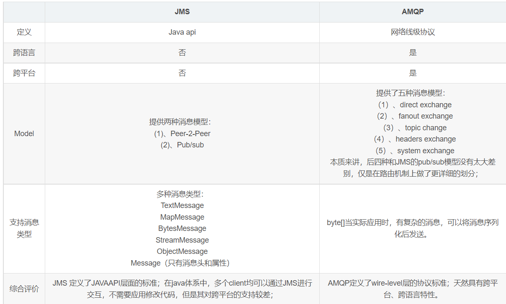
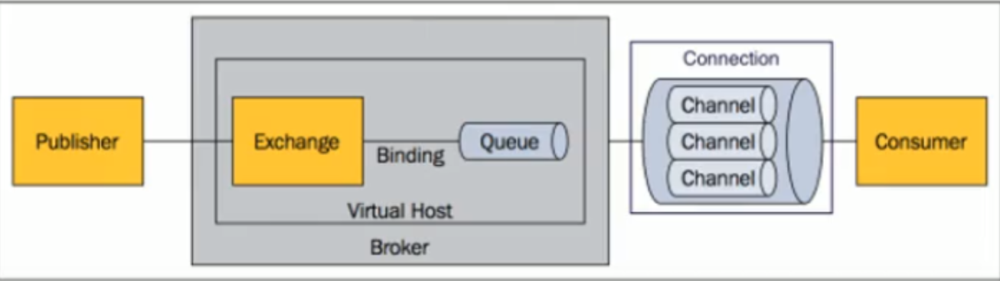
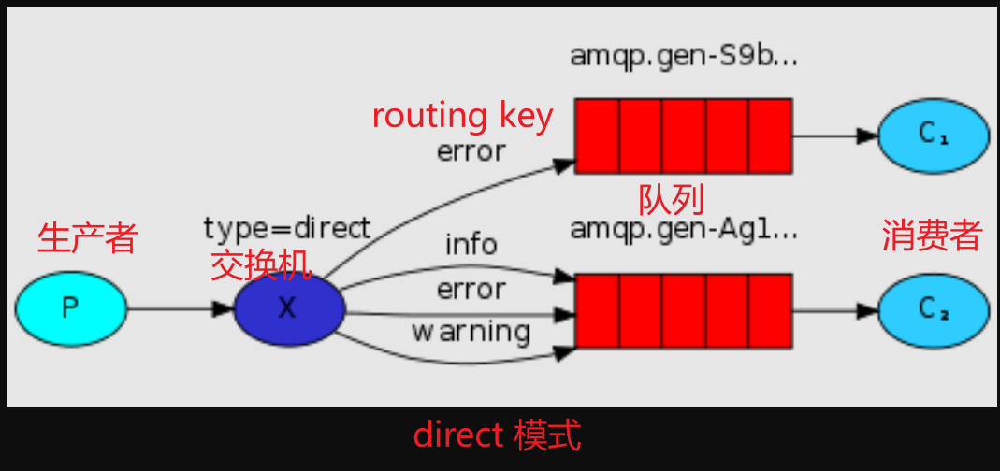
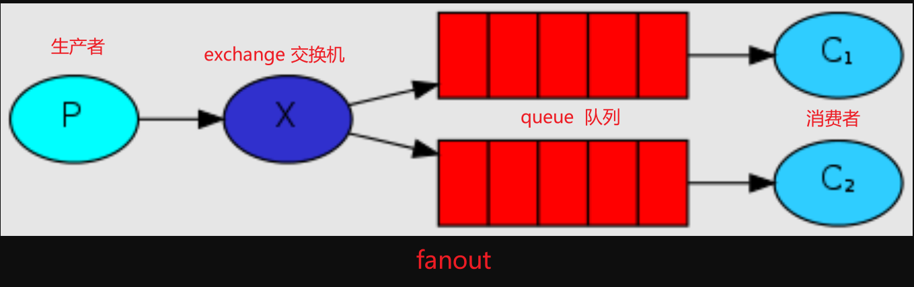
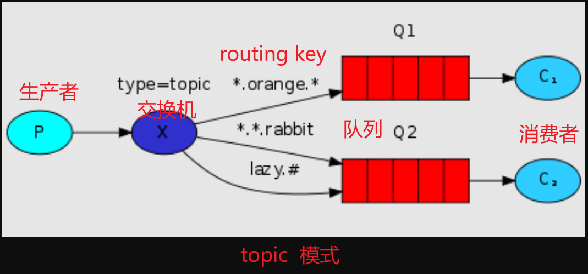
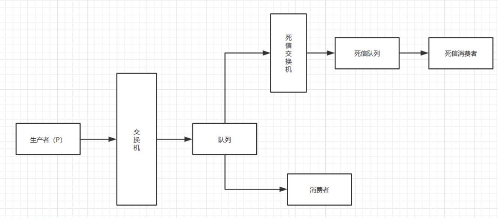
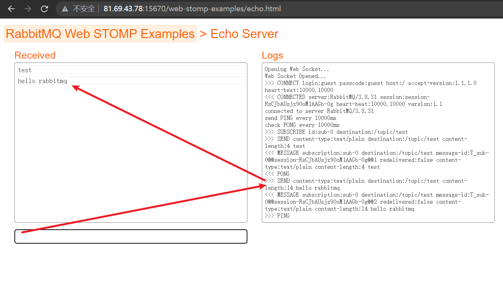
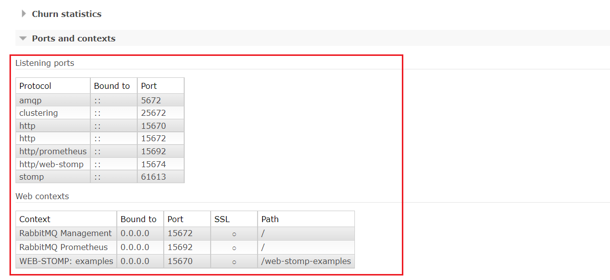

## 目录

*   [(二十五)集成消息队列Rabbitmq](#二十五集成消息队列rabbitmq)

    *   [一、概念](#一概念)

    *   [二、springboot与消息](#二springboot与消息)

        *   [direct](#direct)
        *   [fanout](#fanout)
        *   [topic](#topic)

    *   [三、springboot整合rabbitmq](#三springboot整合rabbitmq)

        *   [3.1引入maven 依赖](#31引入maven-依赖)

        *   [3.2 编写配置类](#32-编写配置类)

        *   [3.3 direct模式](#33-direct模式)

        *   [3.4 fanout模式](#34-fanout模式)

        *   [3.5 topic模式](#35-topic模式)

        *   [3.6 死信队列（高级应用）](#36-死信队列高级应用)

            *   [造成死信的三种情况](#造成死信的三种情况)
            *   [1 拒绝消息，并且禁止重新入队](#1-拒绝消息并且禁止重新入队)
            *   [2 消息TTL过期](#2-消息ttl过期)
            *   [3队列达到最大长度](#3队列达到最大长度)

        *   [3.7 延迟队列（高级应用）](#37-延迟队列高级应用)

    *   [四、插件](#四插件)

        *   [4.1消息插件rabbitmq\_web\_stomp](#41消息插件rabbitmq_web_stomp)
        *   [4.2 stomp前端实时提醒demo](#42-stomp前端实时提醒demo)

# (二十五)集成消息队列Rabbitmq

基础项目地址:

[https://gitee.com/springzb/admin-boot](https://gitee.com/springzb/admin-boot "https://gitee.com/springzb/admin-boot")

## 一、概念

1.大多应用中，可通过消息服务中间件来提升系统异步通信、扩展解耦能力
2.消息服务中两个重要概念：
消息代理（message broker）和目的地（destination）
当消息发送者发送消息以后，将由消息代理接管，消息代理保证消息传递到指定目的地。
3.消息队列主要有两种形式的目的地
&#x20;     1.队列（queue）：点对点消息通信（point-to-point）
&#x20;     2.主题（topic）：发布（publish）/订阅（subscribe）消息通信

4.点对点式：
消息发送者发送消息，消息代理将其放入一个队列中，消息接收者从队列中获取消息内容，消息读取后被移出队列-消息只有唯一的发送者和接受者，但并不是说只能有一个接收者
5.发布订阅式：-发送者（发布者）发送消息到主题，多个接收者（订阅者）监听（订阅）这个主题，那么就会在消息到达时同时收到消息
6.JMS（Java Message Service）JAVA消息服务：-基于JVM消息代理的规范。ActiveMQ、HornetMQ是JMS实现

7.AMQP（Advanced Message Queuing Protocol）-高级消息队列协议，也是一个消息代理的规范，兼容JMS-RabbitMQ是AMQP的实现



8.Spring支持

spring-jms提供了对JMS的支持
spring-rabbit提供了对AMQP的支持需要ConnectionFactory的实现来连接消息代理
提供JmsTemplate、Rabbit Template来发送消息
@JmsListener（JMS）、@RabbitListener（AMQP）注解在方法上监听消息代理发布的消息
@EnableJms、@EnableRabbit开启支持
9.Spring Boot自动配置

JmsAutoConfiguration
RabbitAutoConfiguration

## 二、springboot与消息

2.1 RabbitMQ
Message消息，消息是不县名的，它由消息头和消息体组成。消息体是不诱明的，而消息头则由一系列的可选属性组成，这些属性包括routing-key（路由键）、priority（相对于其他消息的优先权）、delivery-mode（指出该消息可能需要持久性存储）等。

*   Publisher消息的生产者，也是一个向交换器发布消息的客户端应用程序。

*   Exchange交换器，用来接收生产者发送的消息并将这些消息路由给服务器中的队列。
    Exchange有4种类型：direct（默认），fanout，topic，和headers，不同类型的Exchange转发消息的策略有所区别

*   Queue 消息队列，用来保存消息直到发送给消费者，它是消息的容器，也是消息的终点。一个消息可投入一个或多个队列。消息一直在队列里面，等待消费者连接到这个队列将其取走。

*   Binding绑定，用于消息队列和交换器之间的关联。一个绑定就是基于路由键将交换器和消息队列连接起来的路由规则，所以可议将交换器理解成一个由绑定构成的路由表。Exchange和Queue的绑定可以是多对多的关系。

*   Connection网络连接，比如一个TCP连接。

*   Channel信道，多路复用连接中的一条独立的双向数据流通道。信道是建立在真实的TCP连接内的虚拟连接，AMQP 命令都是通过信道发出去的，不管是发布消息、订阅队列还是接收消息，这是通过信道完成，因为对于操作系统来说建立和销TCP 都是非常费的开销，所大罗管造的概念，以复用一条TCP连接。

*   Consumer消息的消费者，表示一个从消息队列中取得消息的客户端应用程序。

*   Virtual Host虚拟主机，表示一批交换器、消息队列和相关对象。虚拟主机是共享相同的身份认证和加密环境的独立服务器域。每个vhost 本质上就是一个mini版的RabbitMQ服务器，拥有自己的队列、交换器、绑定和权限机制。vhost是AMQP概念的基础，必须在连接时指定，RabbitMQ默认的vhost是/。

*   Broker 表示消息队列服务器实体



AMQP 中消息的路由过程和lava 开发者熟悉的JMS存在一些差别，AMQP中增加了Exchange和Binding 的角色。生产者把消息发布到Exchange上，消息最终到达队列并被消费者接收，而Binding决定交换器的消息应该发送到那个队列。

### direct

【点对点】消息中的路由键（routing key）如果和Binding中的binding key一致，交换器就将消息发到对应的队列中。路由键与队列名完全匹配，如果一个队列绑定到交换机要求路由键为“dog"，则只转发routing key标记为“dog”的消息，不会转发“dog.puppy"，也不会转发“dog.guard”等等。它是完全匹配、单播的模式。



### fanout

【广播模式】Fanout Exchange 将消息放到指定的队列中



### topic

【高级模式】Topic Exchange 通过单词键来 模糊匹配



## 三、springboot整合rabbitmq

### 3.1引入maven 依赖

```xml
<!--整合 rabbitmq-->
<dependency>
    <groupId>org.springframework.boot</groupId>
    <artifactId>spring-boot-starter-amqp</artifactId>
</dependency>
```

### 3.2 编写配置类

```java
@Bean
    @SuppressWarnings("all")
  public RabbitTemplate rabbitTemplate(CachingConnectionFactory connectionFactory) {
        // 开启二次确认 生产者到broker的交换机    默认 none [不开启确认]
    connectionFactory.setPublisherConfirmType(CachingConnectionFactory.ConfirmType.SIMPLE);
    // 开启二次确认 交换机到队列的可靠性投递
    connectionFactory.setPublisherReturns(true);
    RabbitTemplate rabbitTemplate = new RabbitTemplate(connectionFactory);
    // 为true,则交换机处理消息到路由失败，则会返回给生产者   为false 交换机到队列不成功，则丢弃消息（默认）
    rabbitTemplate.setMandatory(true);

    rabbitTemplate.setConfirmCallback((correlationData, ack, cause) ->
                log.info("消息发送成功:correlationData({}),ack({}),cause({})", correlationData, ack, cause)
        );
    rabbitTemplate.setReturnsCallback((ReturnedMessage returned) ->
               log.info("消息丢失:exchange({}),route({}),replyCode({}),replyText({}),message:{}", returned.getExchange(),
                       returned.getRoutingKey(), returned.getReplyCode(), returned.getReplyText(), returned.getMessage())
        );
    return rabbitTemplate;
  }
```

application.yml

```yaml
# rabbitmq 配置
spring:
  rabbitmq:
#    addresses: 81.69.43.78:5672,81.69.43.78:5673,81.69.43.78:5674
    host: 81.69.43.78
    username: guest
    password: guest
    port: 5672
    virtual-host: /dev
    listener:
      simple:
        # 开启消息的手工确认，默认是 自动确认
        acknowledge-mode: manual
        # 开启重试机制
        retry:
          enabled: true # 开启消费者进行重试
          max-attempts: 5 # 最大重试次数
          initial-interval: 3000 # 重试时间间隔
      direct:
        # 开启消息的手工确认，默认是 自动确认
        acknowledge-mode: manual
        # 开启重试机制
        retry:
          enabled: true # 开启消费者进行重试
          max-attempts: 5 # 最大重试次数
          initial-interval: 3000 # 重试时间间隔
```

RabbitConstant 通用常量类

```java
package cn.mesmile.admin.common.rabbit.constant;

/**
 * @author zb
 * @Description
 */
public interface RabbitConstant {

    //////////////////////////////////////direct////////////////////////////////////////
    /**
     * direct模式队列
     */
    String DIRECT_MODE_QUEUE_ONE = "direct.mode.queue.one";

    /**
     * direct模式交换机
     */
    String DIRECT_MODE_EXCHANGE_ONE = "direct.mode.exchange.one";

    //////////////////////////////////////fanout////////////////////////////////////////
    /**
     * fanout模式队列
     */
    String FANOUT_MODE_QUEUE_ONE = "fanout.mode.queue.one";

    /**
     * fanout模式队列
     */
    String FANOUT_MODE_QUEUE_TWO = "fanout.mode.queue.two";

    /**
     * fanout模式交换机
     */
    String FANOUT_MODE_EXCHANGE_ONE = "fanout.mode.exchange.one";


    /////////////////////////////////////topic/////////////////////////////////////////////
    /**
     * topic模式队列
     */
    String TOPIC_MODE_QUEUE_ONE = "topic.mode.queue.one";

    /**
     * topic模式交换机
     */
    String TOPIC_MODE_EXCHANGE_ONE = "topic.mode.exchange.one";

    /**
     * topic模式 routingKey
     */
    String TOPIC_MODE_ROUTING_KEY = "topic.mode.#";

    /////////////////////////////////////deadLetter/////////////////////////////////////////////
    /**
     * topic模式队列
     */
    String TOPIC_MODE_QUEUE_TWO = "topic.mode.queue.two";

    /**
     * topic模式交换机
     */
    String TOPIC_MODE_EXCHANGE_TWO = "topic.mode.exchange.two";

    /**
     * topic模式 routingKey
     */
    String TOPIC_MODE_ROUTING_KEY_TWO = "topic.dead.letter.#";

    /**
     * deadLetter模式队列
     */
    String DEAD_LETTER_MODE_QUEUE_ONE= "dead.letter.mode.queue.one";

    /**
     * deadLetter模式交换机
     */
    String DEAD_LETTER_MODE_EXCHANGE_ONE = "dead.letter.mode.exchange.one";

    /**
     * deadLetter模式 routingKey
     */
    String DEAD_LETTER_MODE_ROUTING_KEY_TWO = "dead.mode.#";

    ////////////////////////////////////////delay mode////////////////////////////////////////////////
    /**
     * delay模式队列
     */
    String DELAY_MODE_QUEUE = "delay.mode.queue";
    /**
     * delay交换机
     */
    String DELAY_MODE_EXCHANGE = "delay.mode.exchange";
}

```

### 3.3 direct模式

配置队列以及交换机

```java
 /*
      direct模式是针对广播模式的一种升级，对绑定的队列进行分类，投递消息时指定一个RoutingKey，
      只有RoutingKey与BindingKey 匹配的队列，消息才会被投递进去
      此模式(direct)消费者集群情况下，同一个队列的消费者[轮巡]收到消息

      根据routingKey/BindingKey将消息投递到队列中去 BindingBuilder.bind(directOneQueue).to(directExchange).with("testRoutingKey");

                                                RoutingKey/BindingKey ------》队列1 ---> 消费者业务①
      producer  -->  exchange（direct mode） -》
                                                RoutingKey/BindingKey ------》队列2 ---> 消费者业务②

      发送消息示例：
       rabbitTemplate.convertAndSend("交换机","routingKey","direct message");
     */
    //////////////////////////////////////direct mode start///////////////////////////////////////////
    /**
     * 直接模式队列
     */
    @Bean
    public Queue directOneQueue() {
        return new Queue(RabbitConstant.DIRECT_MODE_QUEUE_ONE);
    }
    /**
     * 直接模式交换机
     */
    @Bean
    public DirectExchange directExchange() {
        return new DirectExchange(RabbitConstant.DIRECT_MODE_EXCHANGE_ONE);
    }
    /**
     * 直接模式 绑定队列与交换机
     */
    @Bean
    public Binding directBinding() {
        // 队列与交换机绑定,指定交换机与队列绑定的 RoutingKey/BindingKey [默认使用队列名称]
        return BindingBuilder.bind(directOneQueue()).to(directExchange()).withQueueName();
    }
    //////////////////////////////////////////////direct mode end////////////////////////////////////////////
```

消费者监听

```java
package cn.mesmile.admin.common.rabbit.handler;

import cn.mesmile.admin.common.rabbit.constant.RabbitConstant;
import com.rabbitmq.client.Channel;
import lombok.extern.slf4j.Slf4j;
import org.springframework.amqp.core.Message;
import org.springframework.amqp.rabbit.annotation.RabbitHandler;
import org.springframework.amqp.rabbit.annotation.RabbitListener;
import org.springframework.stereotype.Component;

/**
 * @author zb
 * @Description
 */
@Slf4j
@RabbitListener(queues = RabbitConstant.DIRECT_MODE_QUEUE_ONE)
@Component
public class DirectHandlerDemo {


    /**
     * 如果 spring.rabbitmq.listener.direct.acknowledge-mode: auto，则可以用这个方式，会自动ack
     */
    // @RabbitHandler
    public void directHandlerAutoAck(Object message) {
        log.info("direct队列处理器，接收消息：{}", message);
    }

    @RabbitHandler
    public void directHandlerManualAck(String messageStruct, Message message, Channel channel) {
        //  如果手动ACK,消息会被监听消费,但是消息在队列中依旧存在,如果 未配置 acknowledge-mode 默认是会在消费完毕后自动ACK掉
        final long deliveryTag = message.getMessageProperties().getDeliveryTag();
        log.info("direct队列，手动ACK，接收消息：{}", messageStruct);
        // 这里抛出异常才会触发重试机制
//        if (true){
//            throw new RuntimeException("测试异常");
//        }
        try {
            // 每次消费一条，消费完成后才进行下一条消费
            channel.basicQos(1);
            // 通知 MQ 消息已被成功消费,可以ACK了
            channel.basicAck(deliveryTag, false);
        } catch (Exception e) {
            try {
                /* 告诉，broker，消息拒绝确认   单条确认   重新入队（会一直重试发送到消费者）
                 channel.basicNack(deliveryTag,false,true);
                 basicNack和basicReject介绍
                 basicReject一次只能拒绝接收一个消息，可以设置是否requeue。
                 basicNack方法可以支持一次0个或多个消息的拒收，可以设置是否requeue。
                 */
                // 处理失败,重新压入MQ，（会一直重试发送到消费者）
                channel.basicRecover();
            } catch (Exception e1) {
                e1.printStackTrace();
            }
        }
    }
}

```

生产者发送消息

```java
 @Resource
    private RabbitTemplate rabbitTemplate;

    @GetMapping("/direct")
    public R send(){
        rabbitTemplate.convertAndSend(RabbitConstant.DIRECT_MODE_EXCHANGE_ONE,
                RabbitConstant.DIRECT_MODE_QUEUE_ONE,"direct message");
        return R.data("发送成功direct");
    }
```

### 3.4 fanout模式

配置生产者和消费者

```java
    /*
      fanout广播模式, 一个交换机可以绑定多个队列，交换机收到数据后会转发消息给多个绑定好的队列
      此模式(fanout)消费者集群情况下，同一个队列的消费者[轮巡]收到消息

      // 队列与交换机绑定
      return BindingBuilder.bind(fanoutOneQueue()).to(fanoutExchange());

                                                ------》队列1 ---> 消费者业务①
      producer  -->  exchange（fanout mode） -》
                                                ------》队列2 ---> 消费者业务②

      发送消息示例：fanout模式下，routingKey可以不用填写
       rabbitTemplate.convertAndSend("交换机","","direct message");
     */
    //////////////////////////////////////fanout mode start///////////////////////////////////////////
    /**
     * fanout模式队列
     */
    @Bean
    public Queue fanoutOneQueue() {
        //
        return new Queue(RabbitConstant.FANOUT_MODE_QUEUE_ONE,true, false, false);
    }
    /**
     * fanout模式队列
     */
    @Bean
    public Queue fanoutTwoQueue() {
        return new Queue(RabbitConstant.FANOUT_MODE_QUEUE_TWO);
    }
    /**
     * fanout模式交换机
     */
    @Bean
    public FanoutExchange fanoutExchange() {
        return new FanoutExchange(RabbitConstant.FANOUT_MODE_EXCHANGE_ONE);
    }
    /**
     * fanout模式 绑定队列与交换机
     */
    @Bean
    public Binding fanoutOneBinding() {
        // 队列与交换机绑定
        return BindingBuilder.bind(fanoutOneQueue()).to(fanoutExchange());
    }
    /**
     * fanout模式 绑定队列与交换机
     */
    @Bean
    public Binding fanoutTwoBinding() {
        // 队列与交换机绑定
        return BindingBuilder.bind(fanoutTwoQueue()).to(fanoutExchange());
    }
    //////////////////////////////////////////////fanout mode end////////////////////////////////////////////
```

消费者监听

```java
package cn.mesmile.admin.common.rabbit.handler;

import cn.mesmile.admin.common.rabbit.constant.RabbitConstant;
import com.rabbitmq.client.Channel;
import lombok.extern.slf4j.Slf4j;
import org.springframework.amqp.core.Message;
import org.springframework.amqp.rabbit.annotation.RabbitHandler;
import org.springframework.amqp.rabbit.annotation.RabbitListener;
import org.springframework.stereotype.Component;

/**
 * @author zb
 * @Description
 */
@Slf4j
@RabbitListener(queues = {RabbitConstant.FANOUT_MODE_QUEUE_ONE, RabbitConstant.FANOUT_MODE_QUEUE_TWO})
@Component
public class FanoutHandlerDemo {


    @RabbitHandler
    public void directHandlerManualAck(String messageStruct, Message message, Channel channel) {
        //  如果手动ACK,消息会被监听消费,但是消息在队列中依旧存在,如果 未配置 acknowledge-mode 默认是会在消费完毕后自动ACK掉
        final long deliveryTag = message.getMessageProperties().getDeliveryTag();
        log.info("fanout队列，手动ACK，接收消息：{}", messageStruct);
        // 这里抛出异常才会触发重试机制
//        if (true){
//            throw new RuntimeException("测试异常");
//        }
        try {
            // 每次消费一条，消费完成后才进行下一条消费
            channel.basicQos(1);
            // 通知 MQ 消息已被成功消费,可以ACK了
            channel.basicAck(deliveryTag, false);
        } catch (Exception e) {
            try {
                /* 告诉，broker，消息拒绝确认   单条确认   重新入队（会一直重试发送到消费者）
                 channel.basicNack(deliveryTag,false,true);
                 basicNack和basicReject介绍
                 basicReject一次只能拒绝接收一个消息，可以设置是否requeue。
                 basicNack方法可以支持一次0个或多个消息的拒收，可以设置是否requeue。
                 */
                // 处理失败,重新压入MQ，（会一直重试发送到消费者）
                channel.basicRecover();
            } catch (Exception e1) {
                e1.printStackTrace();
            }
        }
    }
}

```

生产者发送消息

```java
@GetMapping("/fanout")
    public R fanout(){
        rabbitTemplate.convertAndSend(RabbitConstant.FANOUT_MODE_EXCHANGE_ONE,
                "","fanout message");
        return R.data("发送成功fanout");
    }
```

### 3.5 topic模式

配置生产者和消费者

```java
/*
       topic模式是针对direct模式的一种升级，对绑定的队列进行分类(并且可以通过 routingKey 模糊匹配)，投递消息时指定一个RoutingKey，
      只有RoutingKey与BindingKey匹配的队列，消息才会被投递进去
      此模式(topic)消费者集群情况下，同一个队列的消费者[轮巡]收到消息

      // 队列与交换机绑定
      return BindingBuilder.bind(topicOneQueue()).to(topicOneExchange()).with(RabbitConstant.TOPIC_MODE_ROUTING_KEY);

                                                RoutingKey/BindingKey ------》队列1 ---> 消费者业务①
      producer  -->  exchange（direct mode） -》
                                                RoutingKey/BindingKey ------》队列2 ---> 消费者业务②

      发送消息示例：fanout模式下, routingKey可通过模糊匹配的方式匹配消息
       rabbitTemplate.convertAndSend("交换机","routingKey","direct message");

      主题模式 RoutingKey 说明
        <li>路由格式必须以 . 分隔，比如 user.email 或者 user.aaa.email</li>
        <li>通配符 * ，代表一个占位符，或者说一个单词，比如路由为 user.*，那么 user.email 可以匹配，但是 user.aaa.email 就匹配不了</li>
        <li>通配符 # ，代表一个或多个占位符，或者说一个或多个单词，比如路由为 user.#，那么 user.email 可以匹配，user.aaa.email 也可以匹配</li>

     */
    /////////////////////////////////////topic mode start///////////////////////////////////////////
    /**
     *  topic模式队列
     */
    @Bean
    public Queue topicOneQueue() {
        return new Queue(RabbitConstant.TOPIC_MODE_QUEUE_ONE);
    }
    /**
     * topic模式交换机
     */
    @Bean
    public TopicExchange topicOneExchange() {
        return new TopicExchange(RabbitConstant.TOPIC_MODE_EXCHANGE_ONE);
    }
    /**
     * topic模式 绑定队列与交换机
     *
     *  主题模式 RoutingKey 说明
     *   <li>路由格式必须以 . 分隔，比如 user.email 或者 user.aaa.email</li>
     *   <li>通配符 * ，代表一个占位符，或者说一个单词，比如路由为 user.*，那么 user.email 可以匹配，但是 user.aaa.email 就匹配不了</li>
     *   <li>通配符 # ，代表一个或多个占位符，或者说一个或多个单词，比如路由为 user.#，那么 user.email 可以匹配，user.aaa.email 也可以匹配</li>
     *
     */
    @Bean
    public Binding topicOneBinding() {
        // 队列与交换机绑定
        return BindingBuilder.bind(topicOneQueue()).to(topicOneExchange()).with(RabbitConstant.TOPIC_MODE_ROUTING_KEY);
    }
    //////////////////////////////////////////////topic mode end////////////////////////////////////////////


```

消费者监听

```java
package cn.mesmile.admin.common.rabbit.handler;

import cn.mesmile.admin.common.rabbit.constant.RabbitConstant;
import com.rabbitmq.client.Channel;
import lombok.extern.slf4j.Slf4j;
import org.springframework.amqp.core.Message;
import org.springframework.amqp.rabbit.annotation.RabbitHandler;
import org.springframework.amqp.rabbit.annotation.RabbitListener;
import org.springframework.stereotype.Component;

/**
 * @author zb
 * @Description
 */
@Slf4j
@RabbitListener(queues = {RabbitConstant.TOPIC_MODE_QUEUE_ONE})
@Component
public class TopicHandlerDemo {


    @RabbitHandler
    public void directHandlerManualAck(String messageStruct, Message message, Channel channel) {
        //  如果手动ACK,消息会被监听消费,但是消息在队列中依旧存在,如果 未配置 acknowledge-mode 默认是会在消费完毕后自动ACK掉
        final long deliveryTag = message.getMessageProperties().getDeliveryTag();
        log.info("topic队列，手动ACK，接收消息：{}", messageStruct);
        // 这里抛出异常才会触发重试机制
//        if (true){
//            throw new RuntimeException("测试异常");
//        }
        try {
            // 每次消费一条，消费完成后才进行下一条消费
            channel.basicQos(1);
            // 通知 MQ 消息已被成功消费,可以ACK了
            channel.basicAck(deliveryTag, false);
        } catch (Exception e) {
            try {
                /* 告诉，broker，消息拒绝确认   单条确认   重新入队（会一直重试发送到消费者）
                 channel.basicNack(deliveryTag,false,true);
                 basicNack和basicReject介绍
                 basicReject一次只能拒绝接收一个消息，可以设置是否requeue。
                 basicNack方法可以支持一次0个或多个消息的拒收，可以设置是否requeue。
                 */
                // 处理失败,重新压入MQ，（会一直重试发送到消费者）
                channel.basicRecover();
            } catch (Exception e1) {
                e1.printStackTrace();
            }
        }
    }
}

```

生产者发送消息

```java
 @GetMapping("/topic")
    public R topic(){
        rabbitTemplate.convertAndSend(RabbitConstant.TOPIC_MODE_EXCHANGE_ONE,
                "topic.mode.test.multi","topic message");
        return R.data("发送成功topic");
    }
```

### 3.6 死信队列（高级应用）



#### 造成死信的三种情况

#### 1 拒绝消息，并且禁止重新入队

1.  设置yml为手动签收模式

```yaml
spring:
  rabbitmq:
    listener:
      simple:
        acknowledge-mode: manual
```

设置**拒绝消息并禁止重新入队**

```java
Long deliverTag = (Long) headers.get(AmqpHeaders.DELIVERY_TAG);
channel.basicNack(deliverTag,false,false);
```

绑定死信队列

```java
@RabbitListener(bindings = {
    @QueueBinding(
        value = @Queue(value = "javatripDead"),
        exchange = @Exchange(value = "deadExchange"),
        key = "deadKey"
    )
})
public void receive2(String message){
    System.out.println("我是一条死信:"+message);
}
```

#### 2 消息TTL过期

绑定业务队列的时候，增加消息的过期时长，当消息过期后，消息将被转发到死信队列中

```java
@RabbitListener(bindings = {
            @QueueBinding(value = @Queue(value = "javatrip",arguments =
                    {@Argument(name="x-dead-letter-exchange",value = "deadExchange"),
                     @Argument(name="x-dead-letter-routing-key",value = "deadKey"),
                     @Argument(name = "x-message-ttl",value = "3000")
                    }),
                    exchange = @Exchange(value="javatripDirect"),
                    key = {"info","error","warning"}
            )
    })
public void receive1(String message, @Headers Map<String,Object> headers, Channel channel)throws Exception{
    System.out.println("消费者1"+message);
}

```

#### 3队列达到最大长度

设置消息队列长度，当队列中的消息达到最大长度后，继续发送消息，消息将被转发到死信队列中

```java
@RabbitListener(bindings = {
            @QueueBinding(value = @Queue(value = "javatrip",arguments =
                    {@Argument(name="x-dead-letter-exchange",value = "deadExchange"),
                     @Argument(name="x-dead-letter-routing-key",value = "deadKey"),
                     @Argument(name = "x-max-length",value = "3")
                    }),
                    exchange = @Exchange(value="javatripDirect"),
                    key = {"info","error","warning"}
            )
    })
public void receive1(String message, @Headers Map<String,Object> headers, Channel channel)throws Exception{
    System.out.println("消费者1"+message);
}

```

这里以 2,3 情况做示例：

配置生产者与消费者

```java
/*
       deadLetter模式死信队列

      producer  -->  exchange1（topic mode） -》RoutingKey/BindingKey ----》队列1 【队列1无消费者】，队列1 绑定死信交换机2以及死信路由key

      producer  -->  exchange2（topic mode） -》RoutingKey/BindingKey ------》队列2 ---> 消费者业务②

     */
    /////////////////////////////////////deadLetter mode start///////////////////////////////////////////
    /**
     *  topic模式队列
     */
    @Bean
    public Queue topicTwoQueue() {
        return QueueBuilder.durable(RabbitConstant.TOPIC_MODE_QUEUE_TWO)
                // 设置死信队列绑定的交换机
                .deadLetterExchange(RabbitConstant.DEAD_LETTER_MODE_EXCHANGE_ONE)
                // 设置死信路由key，即 发送到 死信队列 的路由key
                .deadLetterRoutingKey("dead.mode.topic1")
                // 队列消息的过期时间，单位 ms，超过指定以时间未被消费的消息就会转发到死信队列中去
                .ttl(10000)
                // 声明该队列最多能存放的消息个数,超过该消息个数并且未被消费就会转发到死信队列中去
                .maxLength(600).build();
    }
    /**
     * topic模式交换机
     */
    @Bean
    public TopicExchange topicTwoExchange() {
        return new TopicExchange(RabbitConstant.TOPIC_MODE_EXCHANGE_TWO);
    }
    /**
     * topic模式 绑定队列与交换机
     */
    @Bean
    public Binding topicTwoBinding() {
        // 队列与交换机绑定
        return BindingBuilder.bind(topicTwoQueue()).to(topicTwoExchange()).with(RabbitConstant.TOPIC_MODE_ROUTING_KEY_TWO);
    }
    /**
     *  deadLetter模式队列, 用于接收 RabbitConstant.TOPIC_MODE_QUEUE_TWO 未消费的消息
     */
    @Bean
    public Queue deadLetterOneQueue() {
        return new Queue(RabbitConstant.DEAD_LETTER_MODE_QUEUE_ONE);
    }
    /**
     * deadLetter模式交换机
     */
    @Bean
    public TopicExchange deadLetterOneExchange() {
        return new TopicExchange(RabbitConstant.DEAD_LETTER_MODE_EXCHANGE_ONE);
    }
    /**
     * deadLetter模式 绑定队列与交换机
     */
    @Bean
    public Binding deadLetterOneBinding() {
        // 队列与交换机绑定
        return BindingBuilder.bind(deadLetterOneQueue()).to(deadLetterOneExchange())
                .with(RabbitConstant.DEAD_LETTER_MODE_ROUTING_KEY_TWO);
    }
    //////////////////////////////////////////////deadLetter mode end////////////////////////////////////////////
```

消费者配置

```java
package cn.mesmile.admin.common.rabbit.handler;

import cn.mesmile.admin.common.rabbit.constant.RabbitConstant;
import com.rabbitmq.client.Channel;
import lombok.extern.slf4j.Slf4j;
import org.springframework.amqp.core.Message;
import org.springframework.amqp.rabbit.annotation.RabbitHandler;
import org.springframework.amqp.rabbit.annotation.RabbitListener;
import org.springframework.stereotype.Component;

/**
 * @author zb
 * @Description
 */
@Slf4j
@RabbitListener(queues = {RabbitConstant.DEAD_LETTER_MODE_QUEUE_ONE})
@Component
public class DeadLetterHandlerDemo {


    @RabbitHandler
    public void directHandlerManualAck(String messageStruct, Message message, Channel channel) {
        //  如果手动ACK,消息会被监听消费,但是消息在队列中依旧存在,如果 未配置 acknowledge-mode 默认是会在消费完毕后自动ACK掉
        final long deliveryTag = message.getMessageProperties().getDeliveryTag();
        log.info("deadLetter队列，手动ACK，接收消息：{}", messageStruct);
        // 这里抛出异常才会触发重试机制
//        if (true){
//            throw new RuntimeException("测试异常");
//        }
        try {
            // 每次消费一条，消费完成后才进行下一条消费
            channel.basicQos(1);
            // 通知 MQ 消息已被成功消费,可以ACK了
            channel.basicAck(deliveryTag, false);
        } catch (Exception e) {
            try {
                /* 告诉，broker，消息拒绝确认   单条确认   重新入队（会一直重试发送到消费者）
                 channel.basicNack(deliveryTag,false,true);
                 basicNack和basicReject介绍
                 basicReject一次只能拒绝接收一个消息，可以设置是否requeue。
                 basicNack方法可以支持一次0个或多个消息的拒收，可以设置是否requeue。
                 */
                // 处理失败,重新压入MQ，（会一直重试发送到消费者）
                channel.basicRecover();
            } catch (Exception e1) {
                e1.printStackTrace();
            }
        }
    }
}

```

生产者配置

```java
@GetMapping("/deadLetter")
public R deadLetter(){
    rabbitTemplate.convertAndSend(RabbitConstant.TOPIC_MODE_EXCHANGE_TWO,
            "topic.dead.letter.test","deadLetter message "+ DateUtil.now());
    return R.data("发送成功topic");
}
```

### 3.7 延迟队列（高级应用）

安装延迟消息插件：

```java
 /**
   * 延迟消息，需要安装插件
   * https://www.rabbitmq.com/community-plugins.html
   *
   * #下载插件 rabbitmq_delayed_message_exchange-3.9.0.ez
   * https://github.com/rabbitmq/rabbitmq-delayed-message-exchange/releases
   
   * # 拷贝插件
   * docker cp ./rabbitmq_delayed_message_exchange-3.9.0.ez  rabbitmq:/opt/rabbitmq/plugins/
   * # 进入容器内
   * docker exec -it rabbitmq /bin/bash
   
   * # 查看插件列表
   * rabbitmq-plugins list
   
   * # 开启插件支持
   * rabbitmq-plugins enable rabbitmq_delayed_message_exchange
   
   * # 退出容器
   * exit
   * # 重启容器
   * docker restart rabbitmq
   */
```

配置交换机和队列

```java
/////////////////////////////////////delay mode start///////////////////////////////////////////

  /**
   * 延迟队列
   */
  @Bean
  public Queue delayQueue() {
      return new Queue(RabbitConstant.DELAY_MODE_QUEUE, true);
  }

  /**
   * 延迟队列交换器, x-delayed-type 和 x-delayed-message 固定
   */
  @Bean
  public CustomExchange delayExchange() {
      Map<String, Object> args = Maps.newHashMap();
      args.put("x-delayed-type", "direct");
      return new CustomExchange(RabbitConstant.DELAY_MODE_EXCHANGE, "x-delayed-message", true, false, args);
  }

  /**
   * 延迟队列绑定自定义交换器
   */
  @Bean
  public Binding delayBinding() {
      return BindingBuilder.bind(delayQueue()).to(delayExchange()).with(RabbitConstant.DELAY_MODE_QUEUE).noargs();
  }
 /////////////////////////////////////delay mode end///////////////////////////////////////////
```

配置消费者

```java
package cn.mesmile.admin.common.rabbit.handler;

import cn.mesmile.admin.common.rabbit.constant.RabbitConstant;
import com.rabbitmq.client.Channel;
import lombok.extern.slf4j.Slf4j;
import org.springframework.amqp.core.Message;
import org.springframework.amqp.rabbit.annotation.RabbitHandler;
import org.springframework.amqp.rabbit.annotation.RabbitListener;
import org.springframework.stereotype.Component;

/**
 * @author zb
 * @Description
 */
@Slf4j
@RabbitListener(queues = {RabbitConstant.DELAY_MODE_QUEUE})
@Component
public class DelayHandlerDemo {


    @RabbitHandler
    public void directHandlerManualAck(String messageStruct, Message message, Channel channel) {
        //  如果手动ACK,消息会被监听消费,但是消息在队列中依旧存在,如果 未配置 acknowledge-mode 默认是会在消费完毕后自动ACK掉
        final long deliveryTag = message.getMessageProperties().getDeliveryTag();
        log.info("delay队列，手动ACK，接收消息：{}", messageStruct);
        // 这里抛出异常才会触发重试机制
//        if (true){
//            throw new RuntimeException("测试异常");
//        }
        try {
            // 每次消费一条，消费完成后才进行下一条消费
            channel.basicQos(1);
            // 通知 MQ 消息已被成功消费,可以ACK了
            channel.basicAck(deliveryTag, false);
        } catch (Exception e) {
            try {
                /* 告诉，broker，消息拒绝确认   单条确认   重新入队（会一直重试发送到消费者）
                 channel.basicNack(deliveryTag,false,true);
                 basicNack和basicReject介绍
                 basicReject一次只能拒绝接收一个消息，可以设置是否requeue。
                 basicNack方法可以支持一次0个或多个消息的拒收，可以设置是否requeue。
                 */
                // 处理失败,重新压入MQ，（会一直重试发送到消费者）
                channel.basicRecover();
            } catch (Exception e1) {
                e1.printStackTrace();
            }
        }
    }
}

```

配置生产者

```java
@GetMapping("/delay")
public R delay(){
    rabbitTemplate.convertAndSend(RabbitConstant.DELAY_MODE_EXCHANGE,
            RabbitConstant.DELAY_MODE_QUEUE, "delay message, delay 8s, " + DateUtil.now(),
                message -> {
                    // 这里设置延迟发送时间，单位 毫秒
                    message.getMessageProperties().setHeader("x-delay", 8000);
                    return message;
                }
            );
    return R.data("发送成功delay");
}
```

## 四、插件

### 4.1消息插件rabbitmq\_web\_stomp

```bash
# 进入容器内
docker exec -it rabbitmq /bin/bash
# 开启消息插件
rabbitmq-plugins enable rabbitmq_web_stomp rabbitmq_web_stomp_examples

# rabbitmq_web_stomp              对应 15674 端口
# rabbitmq_web_stomp_examples     对应 15670 端口

# 退出重启rabbitmq
docker restart rabbitmq
```

可以看见：消息插件开启成功

http://ip:15670





### 4.2 stomp前端实时提醒demo

安装 stompjs

```bash
npm install stompjs
```

随机消费消息DEMO

```javascript
<template>
  <div class="hello">
    <h1>{{ msg }}</h1>
  </div>
</template>

<script>
import Stomp from "stompjs";
export const MQTT_SERVICE = "ws://ip:15674/ws"; // mqtt服务地址
export const MQTT_USERNAME = "guest"; // 连接用户名
export const MQTT_PASSWORD = "guest"; //  连接密码
export const Virtual_host = "/"; //  侦听器端口
export default {
  name: "HelloWorld",
  data() {
    return {
      msg: "Welcome to Your Vue.js App",
      client: Stomp.client(MQTT_SERVICE),
    };
  },
  created() {
    this.mqtthuoquMsg();
  },
  methods: {
    // 消息队列获取
    mqtthuoquMsg() {
      //初始化连接
      const headers = {
        login: MQTT_USERNAME,
        passcode: MQTT_PASSWORD,
      };
      //进行连接
      this.client.connect(
        headers.login,
        headers.passcode,
        this.onConnected,
        this.onFailed,
        Virtual_host
      );
    },
    onConnected: function () {
      //订阅频道
      const topic = localStorage.getItem("personId");
      this.client.subscribe("message", this.responseCallback, this.onFailed);
    },
    onFailed: function (frame) {
      console.log("MQ Failed: " + frame);
      this.$message.error("连接失败");
    },
    // 回传消息
    responseCallback: function (frame) {
      console.log("MQ msg=>" + frame.body);
      this.msg=frame.body
      //接收消息处理
    },
    // 断开相应的连接
    close: function () {
      this.client.disconnect(function () {
        console.log("已退出账号");
      });
    },
  },
};
</script>

<!-- Add "scoped" attribute to limit CSS to this component only -->
<style scoped>
h1,
h2 {
  font-weight: normal;
}
ul {
  list-style-type: none;
  padding: 0;
}
li {
  display: inline-block;
  margin: 0 10px;
}
a {
  color: #42b983;
}
</style>


```
