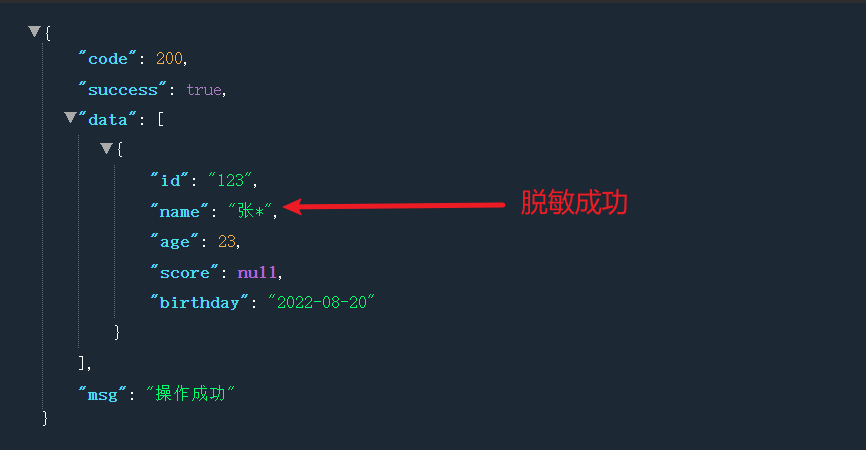

## 目录

*   [(二十六)基于注解的数据字段脱敏](#二十六基于注解的数据字段脱敏)

    *   [一、整体思路](#一整体思路)

    *   [二、具体实现](#二具体实现)

        *   [PrivacyTypeEnum 定义脱敏数据类型](#privacytypeenum-定义脱敏数据类型)

        *   [PrivacyEncrypt 定义数据脱敏注解](#privacyencrypt-定义数据脱敏注解)

        *   [PrivacyUtil 数据脱敏工具类](#privacyutil-数据脱敏工具类)

        *   [PrivacySerializer 具体脱敏序列化实现(AOP)](#privacyserializer-具体脱敏序列化实现aop)

        *   [注意事项](#注意事项)

    *   [三、测试](#三测试)

# (二十六)基于注解的数据字段脱敏

基础项目地址:

[https://gitee.com/springzb/admin-boot](https://gitee.com/springzb/admin-boot "https://gitee.com/springzb/admin-boot")

## 一、整体思路

基于字段注解的方式，确定字段是否需要脱敏以及字段数据脱敏类型，最终通过AOP的方式也就是返回数据之前序列化的时候进行数据脱敏

## 二、具体实现

### PrivacyTypeEnum 定义脱敏数据类型

```java
package cn.mesmile.admin.common.desensitization;

/**
 * @author zb
 * @Description 脱敏数据字段类型
 */
public enum  PrivacyTypeEnum {

    /** 自定义（此项需设置脱敏的范围）*/
    CUSTOMER,

    /** 姓名 */
    NAME,

    /** 身份证号 */
    ID_CARD,

    /** 手机号 */
    PHONE,

    /** 邮箱 */
    EMAIL

}

```

### PrivacyEncrypt 定义数据脱敏注解

```java
package cn.mesmile.admin.common.desensitization;

import com.fasterxml.jackson.annotation.JacksonAnnotationsInside;
import com.fasterxml.jackson.databind.annotation.JsonSerialize;

import java.lang.annotation.ElementType;
import java.lang.annotation.Retention;
import java.lang.annotation.RetentionPolicy;
import java.lang.annotation.Target;

/**
 * @author zb
 * @Description 数据脱敏注解
 */
@Target(ElementType.FIELD)
@Retention(RetentionPolicy.RUNTIME)
// 表示自定义自己的注解PrivacyEncrypt
@JacksonAnnotationsInside
// 该注解使用序列化的方式
@JsonSerialize(using = PrivacySerializer.class)
public @interface PrivacyEncrypt {

    /**
     * 脱敏数据类型（没给默认值，所以使用时必须指定type）
     */
    PrivacyTypeEnum type();

    /**
     * 前置不需要打码的长度
     */
    int prefixNoMaskLen() default 1;

    /**
     * 后置不需要打码的长度
     */
    int suffixNoMaskLen() default 1;

    /**
     * 用什么打码
     */
    String symbol() default "*";
}

```

### PrivacyUtil 数据脱敏工具类

```java
package cn.mesmile.admin.common.desensitization;

/**
 * @author zb
 * @Description 脱敏工具类
 */
public class PrivacyUtil {

    /**
     * 隐藏手机号中间四位
     */
    public static String hidePhone(String phone) {
        return phone.replaceAll("(\\\\d{3})\\\\d{4}(\\\\d{4})", "$1****$2");
    }

    /**
     * 隐藏邮箱
     */
    public static String hideEmail(String email) {
        return email.replaceAll("(\\\\w?)(\\\\w+)(\\\\w)(@\\\\w+\\\\.[a-z]+(\\\\.[a-z]+)?)", "$1****$3$4");
    }

    /**
     * 隐藏身份证
     */
    public static String hideIDCard(String idCard) {
        return idCard.replaceAll("(\\\\d{4})\\\\d{10}(\\\\w{2})", "$1*****$2");
    }

    /**
     * 【中文姓名】只显示第一个汉字，其他隐藏为星号，比如：任**
     */
    public static String hideChineseName(String chineseName) {
        if (chineseName == null) {
            return null;
        }
        return desValue(chineseName, 1, 0, "*");
    }


    /**
     * 对字符串进行脱敏操作
     * @param origin          原始字符串
     * @param prefixNoMaskLen 左侧需要保留几位明文字段
     * @param suffixNoMaskLen 右侧需要保留几位明文字段
     * @param maskStr         用于遮罩的字符串, 如'*'
     * @return 脱敏后结果
     */
    public static String desValue(String origin, int prefixNoMaskLen, int suffixNoMaskLen, String maskStr) {
        if (origin == null) {
            return null;
        }
        StringBuilder sb = new StringBuilder();
        for (int i = 0, n = origin.length(); i < n; i++) {
            if (i < prefixNoMaskLen) {
                sb.append(origin.charAt(i));
                continue;
            }
            if (i > (n - suffixNoMaskLen - 1)) {
                sb.append(origin.charAt(i));
                continue;
            }
            sb.append(maskStr);
        }
        return sb.toString();
    }

}

```

### PrivacySerializer 具体脱敏序列化实现(AOP)

```java
package cn.mesmile.admin.common.desensitization;

import cn.mesmile.admin.common.exceptions.ServiceException;
import com.fasterxml.jackson.core.JsonGenerator;
import com.fasterxml.jackson.databind.BeanProperty;
import com.fasterxml.jackson.databind.JsonMappingException;
import com.fasterxml.jackson.databind.JsonSerializer;
import com.fasterxml.jackson.databind.SerializerProvider;
import com.fasterxml.jackson.databind.ser.ContextualSerializer;
import lombok.AllArgsConstructor;
import lombok.NoArgsConstructor;
import org.apache.commons.lang3.StringUtils;

import java.io.IOException;
import java.util.Objects;

/**
 * @author zb
 * @Description aop的方式序列化的时候进行脱敏
 *      如果在保存数据的时候使用此注解的类会把处理好的数据保存到数据库从而导致数据不准确
 *      有时候查询的数据需要部署脱敏的数据而是原数据 解决：可以多声明一个类的字段，
 *      如idCardNumber2代表脱敏数据，而idCardNumber代表原数据即可
 */
@NoArgsConstructor
@AllArgsConstructor
public class PrivacySerializer extends JsonSerializer<String> implements ContextualSerializer {

    /** 脱敏类型 */
    private PrivacyTypeEnum privacyTypeEnum;
    /** 前几位不脱敏 */
    private Integer prefixNoMaskLen;
    /** 最后几位不脱敏 */
    private Integer suffixNoMaskLen;
    /** 用什么打码 */
    private String symbol;

    @Override
    public void serialize(final String origin, final JsonGenerator jsonGenerator,
                          final SerializerProvider serializerProvider) throws IOException {
        if (StringUtils.isNotBlank(origin) && null != privacyTypeEnum) {
            switch (privacyTypeEnum) {
                case CUSTOMER:
                    jsonGenerator.writeString(PrivacyUtil.desValue(origin, prefixNoMaskLen, suffixNoMaskLen, symbol));
                    break;
                case NAME:
                    jsonGenerator.writeString(PrivacyUtil.hideChineseName(origin));
                    break;
                case ID_CARD:
                    jsonGenerator.writeString(PrivacyUtil.hideIDCard(origin));
                    break;
                case PHONE:
                    jsonGenerator.writeString(PrivacyUtil.hidePhone(origin));
                    break;
                case EMAIL:
                    jsonGenerator.writeString(PrivacyUtil.hideEmail(origin));
                    break;
                default:
                    throw new ServiceException("unknown privacy type enum " + privacyTypeEnum);
            }
        }
    }

    @Override
    public JsonSerializer<?> createContextual(final SerializerProvider serializerProvider,
                                              final BeanProperty beanProperty) throws JsonMappingException {
        if (beanProperty != null) {
            if (Objects.equals(beanProperty.getType().getRawClass(), String.class)) {
                PrivacyEncrypt privacyEncrypt = beanProperty.getAnnotation(PrivacyEncrypt.class);
                if (privacyEncrypt == null) {
                    privacyEncrypt = beanProperty.getContextAnnotation(PrivacyEncrypt.class);
                }
                if (privacyEncrypt != null) {
                    return new PrivacySerializer(privacyEncrypt.type(), privacyEncrypt.prefixNoMaskLen(),
                            privacyEncrypt.suffixNoMaskLen(), privacyEncrypt.symbol());
                }
            }
            return serializerProvider.findValueSerializer(beanProperty.getType(), beanProperty);
        }
        return serializerProvider.findNullValueSerializer(null);
    }
}

```

### 注意事项

*   如果在保存数据的时候使用此注解的类会把处理好的数据保存到数据库从而导致数据不准确

*   有时候查询的数据需要部署脱敏的数据而是原数据 解决：可以多声明一个类的字段， 如idCardNumber2代表脱敏数据，而idCardNumber代表原数据即可

## 三、测试

```java
public class Student implements Serializable {

    private String id;

    /***
     *  测试数据脱敏
     */
    @PrivacyEncrypt(type = PrivacyTypeEnum.NAME)
    private String name;

    private Integer age;

    private Double score;

    private LocalDate birthday;
}
```

```java
@GetMapping("/get")
public R get(){
    List<Student> test6 = new ArrayList<>();
    Student student = new Student();
    student.setAge(23);
    student.setBirthday(LocalDate.now());
    student.setId("123");
    student.setName("张三");
    test6.add(student);
    return R.data(test6);
}
```

脱敏数据成功：


