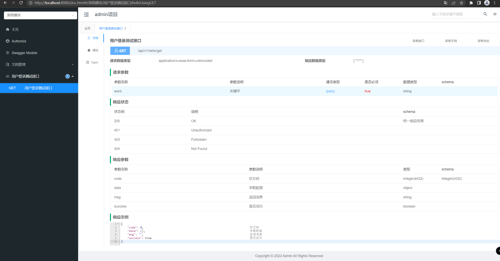
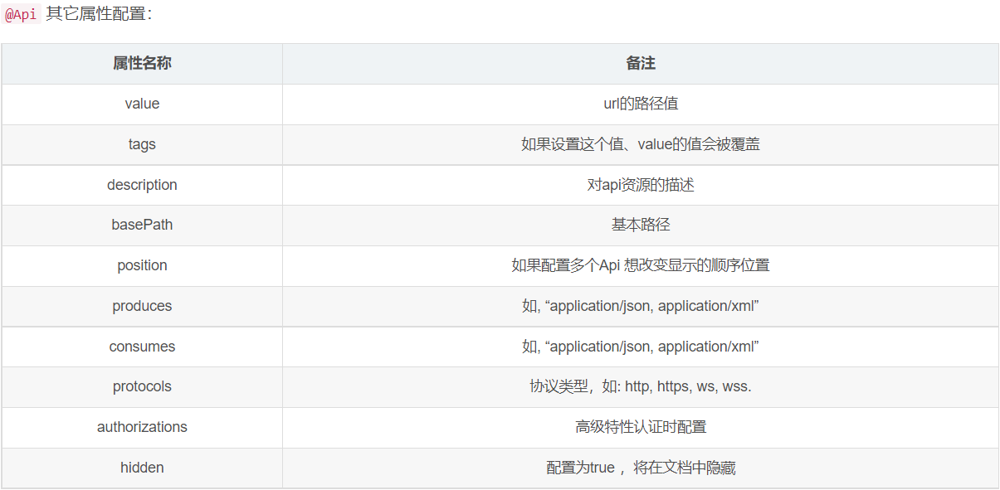

# (八)knife4j接口文档组件

## 目录

*   [一、引入maven依赖](#一引入maven依赖)

    *   [swagger配置类SwaggerProperties.java](#swagger配置类swaggerpropertiesjava)

    *   [SwaggerConfiguration 配置](#swaggerconfiguration-配置)

    *   [SwaggerUtil 工具类型，新增请求头](#swaggerutil-工具类型新增请求头)

    *   [application.yml中新增swagger配置](#applicationyml中新增swagger配置)

*   [二、测试](#二测试)

*   [三、Swagger注解参数说明](#三swagger注解参数说明)

    *   [@Api说明](#api说明)

    *   [@ApiOperation：controller方法上说明](#apioperationcontroller方法上说明)

    *   [@ApiImplicitParams、@ApiImplicitParam：controller方法参数的说明](#apiimplicitparamsapiimplicitparamcontroller方法参数的说明)

    *   [@ApiResponses、@ApiResponse：controller响应状态状态的说明](#apiresponsesapiresponsecontroller响应状态状态的说明)

## 一、引入maven依赖

```xml
        <!--swagger  knife4j 最新的稳定版本-->
        <dependency>
            <groupId>com.github.xiaoymin</groupId>
            <artifactId>knife4j-spring-boot-starter</artifactId>
            <version>2.0.9</version>
        </dependency>
         <!--google工具类-->
        <dependency>
            <groupId>com.google.guava</groupId>
            <artifactId>guava</artifactId>
            <version>30.0-jre</version>
        </dependency>
```

### swagger配置类SwaggerProperties.java

```java
package cn.mesmile.admin.common.config.swagger;

import cn.mesmile.admin.common.constant.AdminConstant;
import lombok.Data;
import org.springframework.boot.context.properties.ConfigurationProperties;

import java.util.ArrayList;
import java.util.Collections;
import java.util.List;

/**
 * Swagger配置类
 *
 * @author zb
 * @Description
 */
@ConfigurationProperties("swagger")
public class SwaggerProperties {

    private List<String> basePackages = new ArrayList(Collections.singletonList(AdminConstant.BASE_PACKAGE));
    private List<String> basePath = new ArrayList();
    private List<String> excludePath = new ArrayList();
    private String title = "Admin 接口文档系统";
    private String description = "Admin 接口文档系统";
    private String version = "1.0.0.RELEASE";
    private String license = "Powered By Admin";
    private String licenseUrl = "https://www.mesmile.cn";
    private String termsOfServiceUrl = "https://www.mesmile.cn";
    private String host = "";
    private SwaggerProperties.Contact contact = new SwaggerProperties.Contact();
    private SwaggerProperties.Authorization authorization = new SwaggerProperties.Authorization();


    public List<String> getBasePackages() {
        return this.basePackages;
    }

    public List<String> getBasePath() {
        return this.basePath;
    }

    public List<String> getExcludePath() {
        return this.excludePath;
    }

    public String getTitle() {
        return this.title;
    }

    public String getDescription() {
        return this.description;
    }

    public String getVersion() {
        return this.version;
    }

    public String getLicense() {
        return this.license;
    }

    public String getLicenseUrl() {
        return this.licenseUrl;
    }

    public String getTermsOfServiceUrl() {
        return this.termsOfServiceUrl;
    }

    public String getHost() {
        return this.host;
    }

    public SwaggerProperties.Contact getContact() {
        return this.contact;
    }

    public SwaggerProperties.Authorization getAuthorization() {
        return this.authorization;
    }

    public void setBasePackages(final List<String> basePackages) {
        this.basePackages = basePackages;
    }

    public void setBasePath(final List<String> basePath) {
        this.basePath = basePath;
    }

    public void setExcludePath(final List<String> excludePath) {
        this.excludePath = excludePath;
    }

    public void setTitle(final String title) {
        this.title = title;
    }

    public void setDescription(final String description) {
        this.description = description;
    }

    public void setVersion(final String version) {
        this.version = version;
    }

    public void setLicense(final String license) {
        this.license = license;
    }

    public void setLicenseUrl(final String licenseUrl) {
        this.licenseUrl = licenseUrl;
    }

    public void setTermsOfServiceUrl(final String termsOfServiceUrl) {
        this.termsOfServiceUrl = termsOfServiceUrl;
    }

    public void setHost(final String host) {
        this.host = host;
    }

    public void setContact(final SwaggerProperties.Contact contact) {
        this.contact = contact;
    }

    public void setAuthorization(final SwaggerProperties.Authorization authorization) {
        this.authorization = authorization;
    }

    @Data
    public static class AuthorizationApiKey {
        private String name = "";
        private String keyName = "";
        private String passAs = "";
    }

    @Data
    public static class AuthorizationScope {
        private String name = "";
        private String scope = "";
        private String description = "";
    }

    public static class Authorization {
        private String name = "";
        private String authRegex = "^.*$";
        private List<SwaggerProperties.AuthorizationScope> authorizationScopeList = new ArrayList();
        private List<SwaggerProperties.AuthorizationApiKey> authorizationApiKeyList = new ArrayList();
        private List<String> tokenUrlList = new ArrayList();

        public String getName() {
            return this.name;
        }

        public String getAuthRegex() {
            return this.authRegex;
        }

        public List<SwaggerProperties.AuthorizationScope> getAuthorizationScopeList() {
            return this.authorizationScopeList;
        }

        public List<SwaggerProperties.AuthorizationApiKey> getAuthorizationApiKeyList() {
            return this.authorizationApiKeyList;
        }

        public List<String> getTokenUrlList() {
            return this.tokenUrlList;
        }

        public void setName(final String name) {
            this.name = name;
        }

        public void setAuthRegex(final String authRegex) {
            this.authRegex = authRegex;
        }

        public void setAuthorizationScopeList(final List<SwaggerProperties.AuthorizationScope> authorizationScopeList) {
            this.authorizationScopeList = authorizationScopeList;
        }

        public void setAuthorizationApiKeyList(final List<SwaggerProperties.AuthorizationApiKey> authorizationApiKeyList) {
            this.authorizationApiKeyList = authorizationApiKeyList;
        }

        public void setTokenUrlList(final List<String> tokenUrlList) {
            this.tokenUrlList = tokenUrlList;
        }

    }

    @Data
    public static class Contact {
        private String name = "admin";
        private String url = "https://gitee.com/springzb/admin-boot";
        private String email = "admin@163.com";
    }
}
```

### SwaggerConfiguration 配置

```java
package cn.mesmile.admin.common.config.swagger;

import cn.mesmile.admin.common.constant.AdminConstant;
import com.github.xiaoymin.knife4j.spring.annotations.EnableKnife4j;
import com.github.xiaoymin.knife4j.spring.extension.OpenApiExtensionResolver;
import com.google.common.collect.Lists;
import lombok.RequiredArgsConstructor;
import org.springframework.boot.context.properties.EnableConfigurationProperties;
import org.springframework.context.annotation.Bean;
import org.springframework.context.annotation.Configuration;
import springfox.documentation.builders.ApiInfoBuilder;
import springfox.documentation.builders.PathSelectors;
import springfox.documentation.service.*;
import springfox.documentation.spi.DocumentationType;
import springfox.documentation.spi.service.contexts.SecurityContext;
import springfox.documentation.spring.web.plugins.Docket;
import springfox.documentation.swagger2.annotations.EnableSwagger2WebMvc;

import java.util.Arrays;
import java.util.Collections;
import java.util.List;

/**
 * Swagger配置类
 *
 * @author zb
 * @Description
 */
@EnableConfigurationProperties({SwaggerProperties.class})
@Configuration
@EnableSwagger2WebMvc
@EnableKnife4j
@RequiredArgsConstructor
public class SwaggerConfiguration {

    /**
     * 引入swagger配置类
     */
    private final SwaggerProperties swaggerProperties;

    /**
     * 引入Knife4j扩展类
     */
    private final OpenApiExtensionResolver openApiExtensionResolver;


    @Bean
    public Docket sysDocket() {
        return docket("系统模块",
                Arrays.asList(AdminConstant.BASE_PACKAGE + ".admin.modules.system"));
    }

//  @Bean
//  public Docket flowDocket() {
//    return docket("工作流模块", Collections.singletonList(AdminConstant.BASE_PACKAGE + ".flow"));
//  }

    private Docket docket(String groupName, List<String> basePackages) {
        return new Docket(DocumentationType.SWAGGER_2)
                .groupName(groupName)
                .apiInfo(apiInfo())
//      .ignoredParameterTypes(AdminUser.class)
                .select()
                .apis(SwaggerUtil.basePackages(basePackages))
                .paths(PathSelectors.any())
                .build().securityContexts(securityContexts()).securitySchemes(securitySchemas())
                .extensions(openApiExtensionResolver.buildExtensions(groupName));
    }

    private List<SecurityContext> securityContexts() {
        return Collections.singletonList(SecurityContext.builder()
                .securityReferences(defaultAuth())
                .forPaths(PathSelectors.regex("^.*$"))
                .build());
    }

    List<SecurityReference> defaultAuth() {
        AuthorizationScope authorizationScope = new AuthorizationScope("global", "accessEverywhere");
        AuthorizationScope[] authorizationScopes = new AuthorizationScope[1];
        authorizationScopes[0] = authorizationScope;
        return Lists.newArrayList(new SecurityReference(SwaggerUtil.clientInfo().getName(), authorizationScopes),
                new SecurityReference(SwaggerUtil.adminAuth().getName(), authorizationScopes),
                new SecurityReference(SwaggerUtil.adminTenant().getName(), authorizationScopes));
    }

    private List<SecurityScheme> securitySchemas() {
        return Lists.newArrayList(SwaggerUtil.clientInfo(), SwaggerUtil.adminAuth(), SwaggerUtil.adminTenant());
    }

    private ApiInfo apiInfo() {
        return new ApiInfoBuilder()
                .title(swaggerProperties.getTitle())
                .description(swaggerProperties.getDescription())
                .license(swaggerProperties.getLicense())
                .licenseUrl(swaggerProperties.getLicenseUrl())
                .termsOfServiceUrl(swaggerProperties.getTermsOfServiceUrl())
                .contact(new Contact(swaggerProperties.getContact().getName(), swaggerProperties.getContact().getUrl(), swaggerProperties.getContact().getEmail()))
                .version(swaggerProperties.getVersion())
                .build();
    }

}

```

### SwaggerUtil 工具类型，新增请求头

```java
package cn.mesmile.admin.common.config.swagger;

import com.google.common.base.Function;
import com.google.common.base.Optional;
import springfox.documentation.RequestHandler;
import springfox.documentation.service.ApiKey;

import java.util.Iterator;
import java.util.List;
import java.util.function.Predicate;

/**
 * Swagger工具类
 *
 * @author zb
 * @Description
 */
public class SwaggerUtil {

    public static Predicate<RequestHandler> basePackages(final List<String> basePackages) {
        return (input) -> {
            return (Boolean) declaringClass(input).transform(handlerPackage(basePackages)).or(true);
        };
    }

    private static Function<Class<?>, Boolean> handlerPackage(final List<String> basePackages) {
        return (input) -> {
            Iterator iterator = basePackages.iterator();
            boolean isMatch;
            do {
                if (!iterator.hasNext()) {
                    return false;
                }
                String strPackage = (String) iterator.next();
                isMatch = input.getPackage().getName().startsWith(strPackage);
            } while (!isMatch);
            return true;
        };
    }

    private static Optional<? extends Class<?>> declaringClass(RequestHandler input) {
        return Optional.fromNullable(input.declaringClass());
    }

    public static ApiKey clientInfo() {
        return new ApiKey("ClientInfo", "Authorization", "header");
    }

    public static ApiKey adminAuth() {
        return new ApiKey("AdminAuth", "Admin-Auth", "header");
    }

    public static ApiKey adminTenant() {
        return new ApiKey("TenantId", "Tenant-Id", "header");
    }
}
```

### application.yml中新增swagger配置

```yaml
#swagger公共信息
swagger:
  title: admin项目
  description: admin项目
  version: 1.0.0.RELEASE
  license: Powered By Admin
  license-url: https://www.mesmile.cn
  terms-of-service-url: https://www.mesmile.cn
  contact:
    name: admin
    email: admin@163.com
    url: https://gitee.com/springzb/admin-boot
    
    

spring:
  # Failed to start bean 'documentationPluginsBootstrapper'; nested exception is java.lang.NullPointerException
  # 因为Springfox 使用的路径匹配是基于AntPathMatcher的，而Spring Boot 2.6.X使用的是PathPatternMatcher
  mvc:
    pathmatch:
      matching-strategy: ant_path_matcher

```

application-dev.yml中新增 knife4j配置

```yaml
#knife4j配置
knife4j:
  #启用
  enable: true
  #基础认证
  basic:
    enable: false
    username: admin
    password: admin
  #增强配置
  setting:
    enableSwaggerModels: true
    enableDocumentManage: true
    enableHost: false
    enableHostText: http://localhost
    enableRequestCache: true
    enableFilterMultipartApis: false
    enableFilterMultipartApiMethodType: POST
    language: zh-CN
    enableFooter: false
    enableFooterCustom: true
    footerCustomContent: Copyright © 2022 Admin All Rights Reserved
```

## 二、测试

```java
package cn.mesmile.admin.modules.system.controller;

import cn.mesmile.admin.common.result.R;
import io.swagger.annotations.Api;
import io.swagger.annotations.ApiImplicitParam;
import io.swagger.annotations.ApiImplicitParams;
import io.swagger.annotations.ApiOperation;
import lombok.extern.slf4j.Slf4j;
import org.springframework.web.bind.annotation.GetMapping;
import org.springframework.web.bind.annotation.RequestMapping;
import org.springframework.web.bind.annotation.RequestParam;
import org.springframework.web.bind.annotation.RestController;
import sun.net.www.protocol.http.HttpURLConnection;

/**
 * @author zb
 * @Description
 */
@Api(tags = "用户登录测试接口")
@Slf4j
@RequestMapping("/api/v1/hello")
@RestController
public class HelloController {

    @ApiOperation(value = "用户登录测试接口")
    @ApiImplicitParams({
            @ApiImplicitParam(name="word",value="关键字备注",required = true,type="Integer")
    })
    @GetMapping("/get")
    public R hello (@RequestParam("word") String word) {
        return R.data(word);
    }

}

```

输入 [http://localhost:8080/doc.html](http://localhost:8080/doc.html "http://localhost:8080/doc.html") 访问文档



此处得到接口文档

## 三、Swagger注解参数说明

| 作用范围      | API                | 使用位置                      |
| --------- | ------------------ | ------------------------- |
| 对象属性      | @ApiModelProperty  | 用在出入参数对象的字段上              |
| 协议集描述     | @Api               | 用于controller类上            |
| 协议描述      | @ApiOperation      | 用在contrller的方法上           |
| Response集 | @ApiResponses      | 用在controller的方法上          |
| Response  | @ApiResponse       | 用在@ApiResponses里边         |
| 非对象参数集    | @ApilmplicitParams | 用在controller的方法上          |
| 非对象参数描述   | @ApilmplicitParam  | 用在@ApilmplicitParams的方法里边 |
| 描述返回对象的意义 | @ApiModel          | 用在返回对象类上                  |

### @Api说明



### @ApiOperation：controller方法上说明

@ApiOperation："用在请求的方法上，说明方法的作用"

value="说明方法的作用"

notes="方法的备注说明"

### @ApiImplicitParams、@ApiImplicitParam：controller方法参数的说明

@ApiImplicitParams：用在请求的方法上，包含一组参数说明

@ApiImplicitParam：对单个参数的说明     &#x20;

name：参数名

value：参数的说明、描述

required：参数是否必须必填

paramType：参数放在哪个地方

· query --> 请求参数的获取：@RequestParam

· header --> 请求参数的获取：@RequestHeader       &#x20;

· path（用于restful接口）--> 请求参数的获取：@PathVariable

· body（请求体）-->  @RequestBody User user

· form（普通表单提交）    &#x20;

dataType：参数类型，默认String，其它值dataType="Integer"    &#x20;

defaultValue：参数的默认值

### @ApiResponses、@ApiResponse：controller响应状态状态的说明

@ApiResponses：响应状态的说明。是个数组，可包含多个 @ApiResponse

@ApiResponse：每个参数的说明

code：数字，例如400

message：信息，例如"请求参数没填好"

response：抛出异常的类
