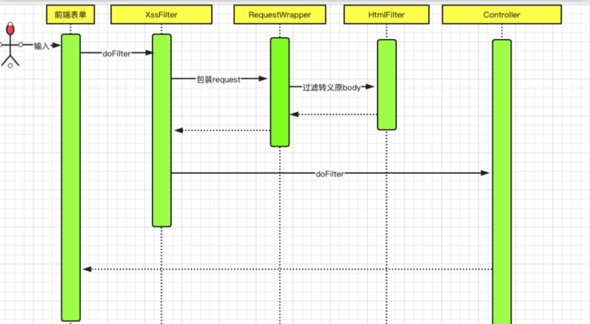
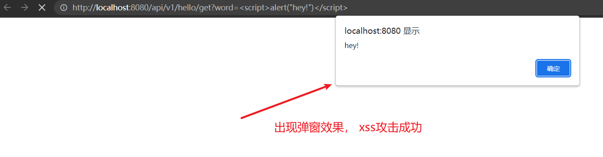
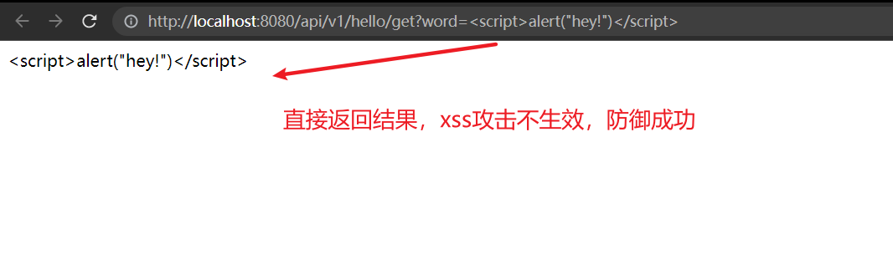

# (六)全局处理预防xss攻击

## 目录

*   [一、xss攻击简介](#一xss攻击简介)

*   [二、springboot预防xss攻击原理](#二springboot预防xss攻击原理)

*   [三、相关代码](#三相关代码)

    *   [XssProperties.java配置](#xsspropertiesjava配置)

    *   [XssHttpServletRequestWrapper.java 过滤包装器](#xsshttpservletrequestwrapperjava-过滤包装器)

    *   [XssRequestFilter.java xss 过滤器](#xssrequestfilterjava-xss-过滤器)

    *   [注册xss过滤器](#注册xss过滤器)

    *   [工具类：](#工具类)
    
    *   [xss过滤器](#xss过滤器)

*   [四、测试](#四测试)

## 一、xss攻击简介

XSS攻击方式很多，这里只介绍一些常用的XSS攻击手段以及其目的，为提出Springboot项目防止XSS攻击解决方案做说明。例如：

盗用cookie，获取敏感信息。

利用植入Flash，通过crossdomain权限设置进一步获取更高权限；或者利用Java等得到类似的操作。

利用iframe、frame、XMLHttpRequest或上述Flash等方式，以（被攻击）用户的身份执行一些管理动作，或执行一些一般的如发微博、加好友、发私信等操作。

利用可被攻击的域受到其他域信任的特点，以受信任来源的身份请求一些平时不允许的操作，如进行不当的投票活动。

在访问量极大的一些页面上的XSS可以攻击一些小型网站，实现DDoS攻击的效果。

许多初级Springboot开发人员经常中此招，最近在测试个人项目时，也出现了这个问题。那么在Springboot项目中，我们该如何防止XSS攻击呢？

## 二、springboot预防xss攻击原理



1、前端请求进入到XssFilter

2、包装request

3、过滤转义原来的body

4、进入其他过滤器，后到达controller

5、返回数据给前端

## 三、相关代码

引入maven  pom.xml

```xml
  <!-- https://mvnrepository.com/artifact/org.apache.commons/commons-text -->
   <!-- 用于转义html字符 -->
        <dependency>
            <groupId>org.apache.commons</groupId>
            <artifactId>commons-text</artifactId>
            <version>1.9</version>
        </dependency>
```

### XssProperties.java配置

```java
package cn.mesmile.admin.common.filter.xss;

import lombok.Data;
import org.springframework.boot.context.properties.ConfigurationProperties;

import java.util.HashSet;
import java.util.Set;

/**
 * 预防xss攻击设置
 * @author zb
 */
@ConfigurationProperties("security.xss")
@Data
public class XssProperties {

    /**
     *  是否开启xss拦截
     */
    private Boolean enabled = true;

    /**
     *  放行拦截的路径
     */
    private Set<String> skipUrl = new HashSet<>();
    
}
```

### XssHttpServletRequestWrapper.java 过滤包装器

```java
package cn.mesmile.admin.common.filter.xss;

import cn.hutool.core.util.StrUtil;
import cn.mesmile.admin.common.utils.WebUtil;import com.alibaba.fastjson.JSONObject;
import lombok.extern.slf4j.Slf4j;
import org.apache.commons.text.StringEscapeUtils;

import javax.servlet.ReadListener;
import javax.servlet.ServletInputStream;
import javax.servlet.http.HttpServletRequest;
import javax.servlet.http.HttpServletRequestWrapper;
import java.io.BufferedReader;
import java.io.ByteArrayInputStream;
import java.io.IOException;
import java.io.InputStreamReader;
import java.util.Iterator;
import java.util.LinkedHashMap;
import java.util.Map;

/**
 * xss过滤包装器
 *
 * @author zb
 * @Description 
 */
@Slf4j
public class XssHttpServletRequestWrapper extends HttpServletRequestWrapper {
    private final HttpServletRequest orgRequest;
    private byte[] body;
//    private static final XssHtmlFilter HTML_FILTER = new XssHtmlFilter();

    public XssHttpServletRequestWrapper(HttpServletRequest request) {
        super(request);
        this.orgRequest = request;
    }

    @Override
    public BufferedReader getReader() throws IOException {
        return new BufferedReader(new InputStreamReader(this.getInputStream()));
    }

    @Override
    public ServletInputStream getInputStream() throws IOException {
        if (super.getHeader("Content-Type") == null) {
            return super.getInputStream();
        } else if (super.getHeader("Content-Type").startsWith("multipart/form-data")) {
            return super.getInputStream();
        } else {
            if (this.body == null) {
                String requestBody = WebUtil.getRequestBody(super.getInputStream());
                if (StrUtil.isNotEmpty(requestBody)) {
                    // 去除json字符串中所有类型为string两边的空格
                    Map<String, Object> stringObjectMap = StringJsonUtils.
                            jsonStringToMapAndTrim(requestBody, true, false);
                    requestBody = JSONObject.toJSONString(stringObjectMap);
                } else {
                    // 为空则直接返回
                    return super.getInputStream();
                }
                this.body = requestBody.getBytes();
            }
            final ByteArrayInputStream byteArrayInputStream = new ByteArrayInputStream(this.body);
            return new ServletInputStream() {
                @Override
                public int read() {
                    return byteArrayInputStream.read();
                }

                @Override
                public boolean isFinished() {
                    return false;
                }

                @Override
                public boolean isReady() {
                    return false;
                }

                @Override
                public void setReadListener(ReadListener readListener) {
                }
            };
        }
    }

    @Override
    public String getParameter(String name) {
        String value = super.getParameter(this.xssEncode(name));
        if (StrUtil.isNotBlank(value)) {
            value = this.xssEncode(value);
        }
        return value;
    }

    @Override
    public String[] getParameterValues(String name) {
        String[] parameters = super.getParameterValues(name);
        if (parameters != null && parameters.length != 0) {
            for (int i = 0; i < parameters.length; ++i) {
                parameters[i] = this.xssEncode(parameters[i]);
            }
            return parameters;
        } else {
            return null;
        }
    }

    @Override
    public Map<String, String[]> getParameterMap() {
        Map<String, String[]> map = new LinkedHashMap();
        Map<String, String[]> parameters = super.getParameterMap();
        Iterator iterator = parameters.keySet().iterator();
        while (iterator.hasNext()) {
            String key = (String) iterator.next();
            String[] values = (String[]) parameters.get(key);
            for (int i = 0; i < values.length; ++i) {
                values[i] = this.xssEncode(values[i]);
            }
            map.put(key, values);
        }
        return map;
    }

    @Override
    public String getHeader(String name) {
        String value = super.getHeader(this.xssEncode(name));
        if (StrUtil.isNotBlank(value)) {
            value = this.xssEncode(value);
        }
        return value;
    }


    private String xssEncode(String input) {
        // 转义成 html 4
        return StringEscapeUtils.escapeHtml4(input);
//        return HTML_FILTER.filter(input);
    }

    public HttpServletRequest getOrgRequest() {
        return this.orgRequest;
    }

    public static HttpServletRequest getOrgRequest(HttpServletRequest request) {
        return request instanceof XssHttpServletRequestWrapper ? ((XssHttpServletRequestWrapper) request).getOrgRequest() : request;
    }
}

```

### XssRequestFilter.java xss 过滤器

```java
package cn.mesmile.admin.common.filter.xss;

import org.springframework.util.AntPathMatcher;

import javax.servlet.*;
import javax.servlet.http.HttpServletRequest;
import java.io.IOException;

/***
 * 自定义xss过滤器
 * @author zb
 * @Description
 */
public class XssRequestFilter implements Filter {

    private final XssProperties xssProperties;
    private final AntPathMatcher antPathMatcher = new AntPathMatcher();

    @Override
    public void init(FilterConfig config) {
    }

    @Override
    public void doFilter(ServletRequest request, ServletResponse response, FilterChain chain) throws IOException, ServletException {
        String path = ((HttpServletRequest) request).getServletPath();
        if (this.xssProperties.getEnabled() && !this.isXssSkip(path)) {
            XssHttpServletRequestWrapper xssRequest = new XssHttpServletRequestWrapper((HttpServletRequest) request);
            chain.doFilter(xssRequest, response);
        } else {
            chain.doFilter(request, response);
        }
    }

    /**
     * 判断是否跳过路径
     * @param path
     * @return
     */
    private boolean isXssSkip(String path) {
        return this.xssProperties.getSkipUrl().stream().anyMatch((pattern) -> {
            return this.antPathMatcher.match(pattern, path);
        });
    }

    @Override
    public void destroy() {
    }

    public XssRequestFilter(final XssProperties xssProperties) {
        this.xssProperties = xssProperties;
    }
}
```

### 注册xss过滤器

```java
package cn.mesmile.admin.common.filter;

import cn.mesmile.admin.common.filter.xss.XssProperties;
import cn.mesmile.admin.common.filter.xss.XssRequestFilter;
import org.springframework.boot.context.properties.EnableConfigurationProperties;
import org.springframework.boot.web.servlet.FilterRegistrationBean;
import org.springframework.context.annotation.Bean;
import org.springframework.context.annotation.Configuration;

import javax.servlet.DispatcherType;

/**
 * @author zb
 * @Description 配置注册过滤器
 */
@Configuration(
        proxyBeanMethods = false
)
@EnableConfigurationProperties({XssProperties.class})
public class RequestConfiguration {

    private final XssProperties xssProperties;

    @Bean
    public FilterRegistrationBean<XssRequestFilter> xssFilterRegistration() {
        FilterRegistrationBean<XssRequestFilter> registration = new FilterRegistrationBean();
        registration.setDispatcherTypes(DispatcherType.REQUEST, new DispatcherType[0]);
        registration.setFilter(new XssRequestFilter(this.xssProperties));
        registration.addUrlPatterns(new String[]{"/*"});
        registration.setName("xssRequestFilter");
        registration.setOrder(Integer.MAX_VALUE);
        return registration;
    }

    public RequestConfiguration(final XssProperties xssProperties) {
        this.xssProperties = xssProperties;
    }

}
```

### 工具类：

```java
package cn.mesmile.admin.common.filter.xss;

import cn.hutool.core.util.StrUtil;
import com.alibaba.fastjson.JSONArray;
import com.alibaba.fastjson.JSONObject;
import org.apache.commons.text.StringEscapeUtils;

import java.util.*;

/**
 * @author zb
 * @Description
 */
public class StringJsonUtils {

    /**
     * 去除json字符串中所有类型为string两边的空格
     * @param jsonString 需要处理的json字符串
     * @param escapeHtml 是否转义html符号
     * @param trim 是否去除两个空格
     */
    public static Map<String, Object> jsonStringToMapAndTrim(String jsonString,boolean escapeHtml ,boolean trim) {
        Map<String, Object> map = new HashMap<>();
        JSONObject jsonObject = JSONObject.parseObject(jsonString);
        for (Object k : jsonObject.keySet()) {
            Object o = jsonObject.get(k);
            if (o instanceof JSONArray) {
                List<Map<String, Object>> list = new ArrayList<>();
                Iterator<Object> it = ((JSONArray) o).iterator();
                while (it.hasNext()) {
                    Object obj = it.next();
                    list.add(jsonStringToMapAndTrim(obj.toString(), escapeHtml , trim));
                }
                map.put(k.toString(), list);
            } else if (o instanceof JSONObject) {
                // 如果内层是json对象的话，继续解析
                map.put(k.toString(), jsonStringToMapAndTrim(o.toString(), escapeHtml, trim));
            } else {
                // 如果内层是普通对象的话，直接放入map中
                if (o instanceof String) {
                    String s = o.toString();
                    if (escapeHtml){
                        // 转义成 html 4
                        s = StringEscapeUtils.escapeHtml4(s);
                    }
                    if (trim){
                        // 去除字符串两边空格
                        s = StrUtil.trim(s);
                    }
                    map.put(k.toString(), s);
                } else {
                    map.put(k.toString(), o);
                }
            }
        }
        return map;
    }
}
```

```java
package cn.mesmile.admin.common.filter.xss;

import javax.servlet.ServletInputStream;
import javax.servlet.http.HttpServletResponse;
import java.io.BufferedReader;
import java.io.IOException;
import java.io.InputStreamReader;
import java.nio.charset.StandardCharsets;

/**
 * @author zb
 * @Description
 */
public class WebUtil {

    /**
     * springmvc中的 @RequestBody 获取body中的数据
     * @param servletInputStream 输入流
     * @return body字符串
     */
    public static String getRequestBody(ServletInputStream servletInputStream) {
        StringBuilder sb = new StringBuilder();
        BufferedReader reader = null;
        try {
            reader = new BufferedReader(new InputStreamReader(servletInputStream, StandardCharsets.UTF_8));
            String line;
            while((line = reader.readLine()) != null) {
                sb.append(line);
            }
        } catch (IOException e) {
            e.printStackTrace();
        } finally {
            if (servletInputStream != null) {
                try {
                    servletInputStream.close();
                } catch (IOException e) {
                    e.printStackTrace();
                }
            }
            if (reader != null) {
                try {
                    reader.close();
                } catch (IOException e) {
                    e.printStackTrace();
                }
            }
        }
        return sb.toString();
    }

}

```

### xss过滤器
```java
package cn.mesmile.admin.common.filter.xss;

import java.util.*;
import java.util.concurrent.ConcurrentHashMap;
import java.util.concurrent.ConcurrentMap;
import java.util.logging.Logger;
import java.util.regex.Matcher;
import java.util.regex.Pattern;

/**
 * @author zb
 * @Description
 */
public final class XssHtmlFilter {

    private static final int REGEX_FLAGS_SI = 34;
    private static final Pattern P_COMMENTS = Pattern.compile("<!--(.*?)-->", 32);
    private static final Pattern P_COMMENT = Pattern.compile("^!--(.*)--$", 34);
    private static final Pattern P_TAGS = Pattern.compile("<(.*?)>", 32);
    private static final Pattern P_END_TAG = Pattern.compile("^/([a-z0-9]+)", 34);
    private static final Pattern P_START_TAG = Pattern.compile("^([a-z0-9]+)(.*?)(/?)$", 34);
    private static final Pattern P_QUOTED_ATTRIBUTES = Pattern.compile("([a-z0-9]+)=([\"'])(.*?)\\2", 34);
    private static final Pattern P_UNQUOTED_ATTRIBUTES = Pattern.compile("([a-z0-9]+)(=)([^\"\\s']+)", 34);
    private static final Pattern P_PROTOCOL = Pattern.compile("^([^:]+):", 34);
    private static final Pattern P_ENTITY = Pattern.compile("&#(\\d+);?");
    private static final Pattern P_ENTITY_UNICODE = Pattern.compile("&#x([0-9a-f]+);?");
    private static final Pattern P_ENCODE = Pattern.compile("%([0-9a-f]{2});?");
    private static final Pattern P_VALID_ENTITIES = Pattern.compile("&([^&;]*)(?=(;|&|$))");
    private static final Pattern P_VALID_QUOTES = Pattern.compile("(>|^)([^<]+?)(<|$)", 32);
    private static final Pattern P_END_ARROW = Pattern.compile("^>");
    private static final Pattern P_BODY_TO_END = Pattern.compile("<([^>]*?)(?=<|$)");
    private static final Pattern P_XML_CONTENT = Pattern.compile("(^|>)([^<]*?)(?=>)");
    private static final Pattern P_STRAY_LEFT_ARROW = Pattern.compile("<([^>]*?)(?=<|$)");
    private static final Pattern P_STRAY_RIGHT_ARROW = Pattern.compile("(^|>)([^<]*?)(?=>)");
    private static final Pattern P_AMP = Pattern.compile("&");
    private static final Pattern P_QUOTE = Pattern.compile("<");
    private static final Pattern P_LEFT_ARROW = Pattern.compile("<");
    private static final Pattern P_RIGHT_ARROW = Pattern.compile(">");
    private static final Pattern P_BOTH_ARROWS = Pattern.compile("<>");
    private static final ConcurrentMap<String, Pattern> P_REMOVE_PAIR_BLANKS = new ConcurrentHashMap();
    private static final ConcurrentMap<String, Pattern> P_REMOVE_SELF_BLANKS = new ConcurrentHashMap();
    private final Map<String, List<String>> vAllowed;
    private final Map<String, Integer> vTagCounts;
    private final String[] vSelfClosingTags;
    private final String[] vNeedClosingTags;
    private final String[] vDisallowed;
    private final String[] vProtocolAtts;
    private final String[] vAllowedProtocols;
    private final String[] vRemoveBlanks;
    private final String[] vAllowedEntities;
    private final boolean stripComment;
    private final boolean encodeQuotes;
    private boolean vDebug;
    private final boolean alwaysMakeTags;

    public XssHtmlFilter() {
        this.vTagCounts = new HashMap();
        this.vDebug = false;
        this.vAllowed = new HashMap();
        ArrayList<String> aAtts = new ArrayList();
        aAtts.add("href");
        aAtts.add("target");
        this.vAllowed.put("a", aAtts);
        ArrayList<String> imgAtts = new ArrayList();
        imgAtts.add("src");
        imgAtts.add("width");
        imgAtts.add("height");
        imgAtts.add("alt");
        this.vAllowed.put("img", imgAtts);
        ArrayList<String> noAtts = new ArrayList();
        this.vAllowed.put("b", noAtts);
        this.vAllowed.put("strong", noAtts);
        this.vAllowed.put("i", noAtts);
        this.vAllowed.put("em", noAtts);
        this.vSelfClosingTags = new String[]{"img"};
        this.vNeedClosingTags = new String[]{"a", "b", "strong", "i", "em"};
        this.vDisallowed = new String[0];
        this.vAllowedProtocols = new String[]{"http", "mailto", "https"};
        this.vProtocolAtts = new String[]{"src", "href"};
        this.vRemoveBlanks = new String[]{"a", "b", "strong", "i", "em"};
        this.vAllowedEntities = new String[]{"amp", "gt", "lt", "quot"};
        this.stripComment = true;
        this.encodeQuotes = true;
        this.alwaysMakeTags = false;
    }

    public XssHtmlFilter(final boolean debug) {
        this();
        this.vDebug = debug;
    }

    public XssHtmlFilter(final Map<String, Object> conf) {
        this.vTagCounts = new HashMap();
        this.vDebug = false;

        assert conf.containsKey("vAllowed") : "configuration requires vAllowed";

        assert conf.containsKey("vSelfClosingTags") : "configuration requires vSelfClosingTags";

        assert conf.containsKey("vNeedClosingTags") : "configuration requires vNeedClosingTags";

        assert conf.containsKey("vDisallowed") : "configuration requires vDisallowed";

        assert conf.containsKey("vAllowedProtocols") : "configuration requires vAllowedProtocols";

        assert conf.containsKey("vProtocolAtts") : "configuration requires vProtocolAtts";

        assert conf.containsKey("vRemoveBlanks") : "configuration requires vRemoveBlanks";

        assert conf.containsKey("vAllowedEntities") : "configuration requires vAllowedEntities";

        this.vAllowed = Collections.unmodifiableMap((HashMap)conf.get("vAllowed"));
        this.vSelfClosingTags = (String[])((String[])conf.get("vSelfClosingTags"));
        this.vNeedClosingTags = (String[])((String[])conf.get("vNeedClosingTags"));
        this.vDisallowed = (String[])((String[])conf.get("vDisallowed"));
        this.vAllowedProtocols = (String[])((String[])conf.get("vAllowedProtocols"));
        this.vProtocolAtts = (String[])((String[])conf.get("vProtocolAtts"));
        this.vRemoveBlanks = (String[])((String[])conf.get("vRemoveBlanks"));
        this.vAllowedEntities = (String[])((String[])conf.get("vAllowedEntities"));
        this.stripComment = conf.containsKey("stripComment") ? (Boolean)conf.get("stripComment") : true;
        this.encodeQuotes = conf.containsKey("encodeQuotes") ? (Boolean)conf.get("encodeQuotes") : true;
        this.alwaysMakeTags = conf.containsKey("alwaysMakeTags") ? (Boolean)conf.get("alwaysMakeTags") : true;
    }

    private void reset() {
        this.vTagCounts.clear();
    }

    private void debug(final String msg) {
        if (this.vDebug) {
            Logger.getAnonymousLogger().info(msg);
        }

    }

    public static String chr(final int decimal) {
        return String.valueOf((char)decimal);
    }

    public static String htmlSpecialChars(final String s) {
        String result = regexReplace(P_AMP, "&amp;", s);
        result = regexReplace(P_QUOTE, "&quot;", result);
        result = regexReplace(P_LEFT_ARROW, "&lt;", result);
        result = regexReplace(P_RIGHT_ARROW, "&gt;", result);
        return result;
    }

    public String filter(final String input) {
        this.reset();
        this.debug("************************************************");
        this.debug("              INPUT: " + input);
        String s = this.escapeComments(input);
        this.debug("     escapeComments: " + s);
        s = this.balanceHtml(s);
        this.debug("        balanceHtml: " + s);
        s = this.checkTags(s);
        this.debug("          checkTags: " + s);
        s = this.processRemoveBlanks(s);
        this.debug("processRemoveBlanks: " + s);
        s = this.validateEntities(s);
        this.debug("    validateEntites: " + s);
        this.debug("************************************************\n\n");
        // 去除两边空格
//        s = StringUtils.trimWhitespace(s);
//        s = StrUtil.trim(s);
        return s;
    }

    public boolean isAlwaysMakeTags() {
        return this.alwaysMakeTags;
    }

    public boolean isStripComments() {
        return this.stripComment;
    }

    private String escapeComments(final String s) {
        Matcher m = P_COMMENTS.matcher(s);
        StringBuffer buf = new StringBuffer();
        if (m.find()) {
            String match = m.group(1);
            m.appendReplacement(buf, Matcher.quoteReplacement("<!--" + htmlSpecialChars(match) + "-->"));
        }

        m.appendTail(buf);
        return buf.toString();
    }

    private String balanceHtml(String s) {
        if (this.alwaysMakeTags) {
            s = regexReplace(P_END_ARROW, "", s);
            s = regexReplace(P_BODY_TO_END, "<$1>", s);
            s = regexReplace(P_XML_CONTENT, "$1<$2", s);
        } else {
            s = regexReplace(P_STRAY_LEFT_ARROW, "&lt;$1", s);
            s = regexReplace(P_STRAY_RIGHT_ARROW, "$1$2&gt;<", s);
            s = regexReplace(P_BOTH_ARROWS, "", s);
        }

        return s;
    }

    private String checkTags(String s) {
        Matcher m = P_TAGS.matcher(s);
        StringBuffer buf = new StringBuffer();

        while(m.find()) {
            String replaceStr = m.group(1);
            replaceStr = this.processTag(replaceStr);
            m.appendReplacement(buf, Matcher.quoteReplacement(replaceStr));
        }

        m.appendTail(buf);
        s = buf.toString();
        Iterator iterator = this.vTagCounts.keySet().iterator();

        while(iterator.hasNext()) {
            String key = (String)iterator.next();
            for(int ii = 0; ii < (Integer)this.vTagCounts.get(key); ++ii) {
                s = s + "</" + key + ">";
            }
        }
        return s;
    }

    private String processRemoveBlanks(final String s) {
        String result = s;
        String[] blanks = this.vRemoveBlanks;
        int length = blanks.length;
        for(int i = 0; i < length; ++i) {
            String tag = blanks[i];
            if (!P_REMOVE_PAIR_BLANKS.containsKey(tag)) {
                P_REMOVE_PAIR_BLANKS.putIfAbsent(tag, Pattern.compile("<" + tag + "(\\s[^>]*)?></" + tag + ">"));
            }

            result = regexReplace((Pattern)P_REMOVE_PAIR_BLANKS.get(tag), "", result);
            if (!P_REMOVE_SELF_BLANKS.containsKey(tag)) {
                P_REMOVE_SELF_BLANKS.putIfAbsent(tag, Pattern.compile("<" + tag + "(\\s[^>]*)?/>"));
            }

            result = regexReplace((Pattern)P_REMOVE_SELF_BLANKS.get(tag), "", result);
        }

        return result;
    }

    private static String regexReplace(final Pattern regexPattern, final String replacement, final String s) {
        Matcher m = regexPattern.matcher(s);
        return m.replaceAll(replacement);
    }

    private String processTag(final String s) {
        Matcher m = P_END_TAG.matcher(s);
        String name;
        if (m.find()) {
            name = m.group(1).toLowerCase();
            if (this.allowed(name) && !inArray(name, this.vSelfClosingTags) && this.vTagCounts.containsKey(name)) {
                this.vTagCounts.put(name, (Integer)this.vTagCounts.get(name) - 1);
                return "</" + name + ">";
            }
        }

        m = P_START_TAG.matcher(s);
        if (!m.find()) {
            m = P_COMMENT.matcher(s);
            return !this.stripComment && m.find() ? "<" + m.group() + ">" : "";
        } else {
            name = m.group(1).toLowerCase();
            String body = m.group(2);
            String ending = m.group(3);
            if (!this.allowed(name)) {
                return "";
            } else {
                String params = "";
                Matcher m2 = P_QUOTED_ATTRIBUTES.matcher(body);
                Matcher m3 = P_UNQUOTED_ATTRIBUTES.matcher(body);
                List<String> paramNames = new ArrayList();
                ArrayList paramValues = new ArrayList();

                while(m2.find()) {
                    paramNames.add(m2.group(1));
                    paramValues.add(m2.group(3));
                }

                while(m3.find()) {
                    paramNames.add(m3.group(1));
                    paramValues.add(m3.group(3));
                }

                for(int ii = 0; ii < paramNames.size(); ++ii) {
                    String paramName = ((String)paramNames.get(ii)).toLowerCase();
                    String paramValue = (String)paramValues.get(ii);
                    if (this.allowedAttribute(name, paramName)) {
                        if (inArray(paramName, this.vProtocolAtts)) {
                            paramValue = this.processParamProtocol(paramValue);
                        }

                        params = params + " " + paramName + "=\"" + paramValue + "\"";
                    }
                }

                if (inArray(name, this.vSelfClosingTags)) {
                    ending = " /";
                }

                if (inArray(name, this.vNeedClosingTags)) {
                    ending = "";
                }

                if (ending != null && ending.length() >= 1) {
                    ending = " /";
                } else if (this.vTagCounts.containsKey(name)) {
                    this.vTagCounts.put(name, (Integer)this.vTagCounts.get(name) + 1);
                } else {
                    this.vTagCounts.put(name, 1);
                }

                return "<" + name + params + ending + ">";
            }
        }
    }

    private String processParamProtocol(String s) {
        s = this.decodeEntities(s);
        Matcher m = P_PROTOCOL.matcher(s);
        if (m.find()) {
            String protocol = m.group(1);
            if (!inArray(protocol, this.vAllowedProtocols)) {
                s = "#" + s.substring(protocol.length() + 1);
                if (s.startsWith("#//")) {
                    s = "#" + s.substring(3);
                }
            }
        }

        return s;
    }

    private String decodeEntities(String s) {
        StringBuffer buf = new StringBuffer();
        Matcher m = P_ENTITY.matcher(s);

        String match;
        int decimal;
        while(m.find()) {
            match = m.group(1);
            decimal = Integer.decode(match);
            m.appendReplacement(buf, Matcher.quoteReplacement(chr(decimal)));
        }

        m.appendTail(buf);
        s = buf.toString();
        buf = new StringBuffer();
        m = P_ENTITY_UNICODE.matcher(s);

        while(m.find()) {
            match = m.group(1);
            decimal = Integer.valueOf(match, 16);
            m.appendReplacement(buf, Matcher.quoteReplacement(chr(decimal)));
        }

        m.appendTail(buf);
        s = buf.toString();
        buf = new StringBuffer();
        m = P_ENCODE.matcher(s);

        while(m.find()) {
            match = m.group(1);
            decimal = Integer.valueOf(match, 16);
            m.appendReplacement(buf, Matcher.quoteReplacement(chr(decimal)));
        }

        m.appendTail(buf);
        s = buf.toString();
        s = this.validateEntities(s);
        return s;
    }

    private String validateEntities(final String s) {
        StringBuffer buf = new StringBuffer();
        Matcher m = P_VALID_ENTITIES.matcher(s);

        while(m.find()) {
            String one = m.group(1);
            String two = m.group(2);
            m.appendReplacement(buf, Matcher.quoteReplacement(this.checkEntity(one, two)));
        }

        m.appendTail(buf);
        return this.encodeQuotes(buf.toString());
    }

    private String encodeQuotes(final String s) {
        if (!this.encodeQuotes) {
            return s;
        } else {
            StringBuffer buf = new StringBuffer();
            Matcher m = P_VALID_QUOTES.matcher(s);

            while(m.find()) {
                String one = m.group(1);
                String two = m.group(2);
                String three = m.group(3);
                m.appendReplacement(buf, Matcher.quoteReplacement(one + regexReplace(P_QUOTE, "&quot;", two) + three));
            }

            m.appendTail(buf);
            return buf.toString();
        }
    }

    private String checkEntity(final String preamble, final String term) {
        return ";".equals(term) && this.isValidEntity(preamble) ? '&' + preamble : "&amp;" + preamble;
    }

    private boolean isValidEntity(final String entity) {
        return inArray(entity, this.vAllowedEntities);
    }

    private static boolean inArray(final String s, final String[] array) {
        String[] newArray = array;
        int length = array.length;
        for(int i = 0; i < length; ++i) {
            String item = newArray[i];
            if (item != null && item.equals(s)) {
                return true;
            }
        }
        return false;
    }

    private boolean allowed(final String name) {
        return (this.vAllowed.isEmpty() || this.vAllowed.containsKey(name)) && !inArray(name, this.vDisallowed);
    }

    private boolean allowedAttribute(final String name, final String paramName) {
        return this.allowed(name) && (this.vAllowed.isEmpty() || ((List)this.vAllowed.get(name)).contains(paramName));
    }
}


```
## 四、测试

```java
package cn.mesmile.admin.modules.system.controller;

import lombok.extern.slf4j.Slf4j;
import org.springframework.web.bind.annotation.GetMapping;
import org.springframework.web.bind.annotation.RequestMapping;
import org.springframework.web.bind.annotation.RequestParam;
import org.springframework.web.bind.annotation.RestController;

/**
 * @author zb
 * @Description
 */
@Slf4j
@RequestMapping("/api/v1/hello")
@RestController
public class HelloController {

    @GetMapping("/get")
    public String hello (@RequestParam("word") String word) {
        return word;
    }

}

```

启动  cn.mesmile.admin.AdminApplication 应用启动类

访问：[http://localhost:8080/api/v1/hello/get?word=\<script>alert("hey!")\</script>](http://localhost:8080/api/v1/hello/get?word=<script>alert\("hey!"\)</script> "http://localhost:8080/api/v1/hello/get?word=<script>alert(\"hey!\")</script>")

application-dev.yml

```yaml
# xss相关配置
security:
  xss:
    enabled: true
    # 跳过检查路径
    skip-url:
      - /api/v1/hello/**
```

1、先将要测试的路径跳过xss检查



2、修改配置文件中的跳过路径

```yaml
# xss相关配置
security:
  xss:
    enabled: true
    # 跳过检查路径
    skip-url:
      - /api
```


