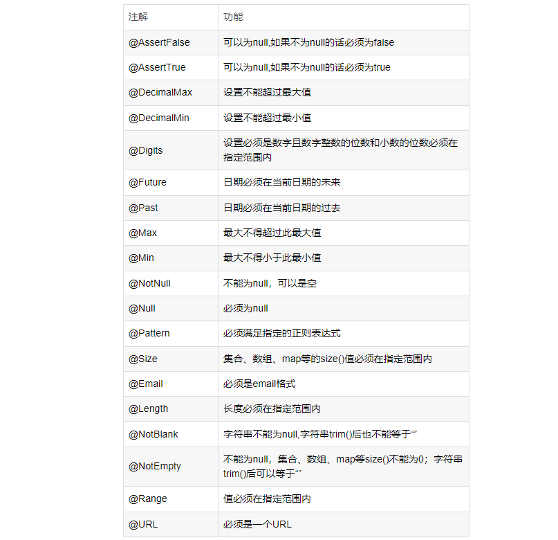

# (十)validation验证入参规则

## 目录

*   [一、引入maven依赖](#一引入maven依赖)

*   [二、编写样例](#二编写样例)

    *   [验证嵌套验证](#验证嵌套验证)

    *   [验证分组验证](#验证分组验证)

    *   [自定义验证注解](#自定义验证注解)

## 一、引入maven依赖

```java
<!--注：从springboot-2.3开始，校验包被独立成了一个starter组件，所以需要引入validation和web，
       而springboot-2.3之前的版本只需要引入 web 依赖就可以了。-->
    <dependency>
        <groupId>org.springframework.boot</groupId>
        <artifactId>spring-boot-starter-validation</artifactId>
    </dependency>
```



## 二、编写样例

全局异常新增捕获，参数验证异常：

```java
package cn.mesmile.admin.common.handler;

import cn.mesmile.admin.common.constant.AdminConstant;
import cn.mesmile.admin.common.exceptions.*;
import cn.mesmile.admin.common.result.R;
import lombok.extern.slf4j.Slf4j;
import org.springframework.validation.BindException;
import org.springframework.validation.BindingResult;
import org.springframework.validation.FieldError;
import org.springframework.web.bind.MethodArgumentNotValidException;
import org.springframework.web.bind.annotation.ExceptionHandler;
import org.springframework.web.bind.annotation.RestControllerAdvice;

import javax.validation.ConstraintViolation;
import javax.validation.ConstraintViolationException;
import java.util.stream.Collectors;

/**
 * @author zb
 * @Description 全局异常拦截
 * <p>
 * 如果我同时捕获了父类和子类，那么到底能够被那个异常处理器捕获呢？比如 Exception 和 BusinessException
 * 当然是 BusinessException 的异常处理器捕获了，精确匹配，如果没有 BusinessException 的异常处理器才会轮到它的 父亲 ，
 * 父亲 没有才会到 祖父 。总之一句话， 精准匹配，找那个关系最近的
 * </p>
 */
@Slf4j
@RestControllerAdvice
public class GlobalExceptionHandler {

    /**
     * @param businessException 业务异常
     * @return @ResponseBody
     * @ExceptionHandler相当于controller的@RequestMapping 如果抛出的的是BusinessException，则调用该方法
     */
    @ExceptionHandler(BusinessException.class)
    public R handle(BusinessException businessException) {
        // 获取指定包名前缀的异常信息，减少不必要的日志
        String stackTraceByPn = getStackTraceByPn(businessException, AdminConstant.BASE_PACKAGE);
        log.error("记录业务异常信息: 消息{} 编码{} {}", businessException.getMessage(), businessException.getCode(), stackTraceByPn);
        return R.fail(businessException.getCode(), businessException.getMessage());
    }

    @ExceptionHandler(ServiceException.class)
    public R handle(ServiceException serviceException) {
        // 这里记录所有堆栈信息
        log.error("记录业务异常信息: 消息{} 编码{}", serviceException.getMessage(), serviceException.getCode(), serviceException);
        return R.fail(serviceException.getCode(), serviceException.getMessage());
    }

    private String getStackTraceByPn(Throwable e, String packagePrefix) {
        StringBuilder append = new StringBuilder("\n").append(e);
        for (StackTraceElement stackTraceElement : e.getStackTrace()) {
            if (stackTraceElement.getClassName().startsWith(packagePrefix)) {
                append.append("\n\tat ").append(stackTraceElement);
            }
        }
        return append.toString();
    }

    // 捕获参数验证异常
    @ExceptionHandler(value = {BindException.class, ValidationException.class, MethodArgumentNotValidException.class})
    public R handleValidatedException(Exception exception) {
        BindingResult bindingResult = null;
         if (exception instanceof MethodArgumentNotValidException){
             MethodArgumentNotValidException e = (MethodArgumentNotValidException) exception;
             bindingResult = e.getBindingResult();
             if (bindingResult.hasErrors()) {
//            String collect = bindingResult.getAllErrors().stream()
//                    .map(ObjectError::getDefaultMessage)
//                    .collect(Collectors.joining(";"));
                 FieldError fieldError = bindingResult.getFieldError();
                 if (fieldError != null) {
                     return R.fail(fieldError.getField()+ "：" + fieldError.getDefaultMessage());
                 }
             }
         }else if (exception instanceof ConstraintViolationException){
             ConstraintViolationException e = (ConstraintViolationException) exception;
             String collect = e.getConstraintViolations().stream()
                     .map(ConstraintViolation::getMessage)
                     .collect(Collectors.joining(";"));
             return R.fail(collect);
         }else if (exception instanceof BindException){
             BindException e = (BindException) exception;
             bindingResult = e.getBindingResult();
             if (bindingResult.hasErrors()) {
//            String collect = bindingResult.getAllErrors().stream()
//                    .map(ObjectError::getDefaultMessage)
//                    .collect(Collectors.joining(";"));
                 FieldError fieldError = bindingResult.getFieldError();
                 if (fieldError != null) {
                     return R.fail(fieldError.getField()+ "：" + fieldError.getDefaultMessage());
                 }
             }
         }
        return R.fail(exception.getMessage());
    }


    /**
     * 捕获空指针异常
     **/
    @ExceptionHandler(value = NullPointerException.class)
    public R handlerBindException(NullPointerException exception) {
        String message = exception.getMessage();
        log.error("全局捕获null错误信息: {}", exception.toString(), exception);
        return R.fail(message);
    }

    /**
     * 捕获最大异常
     **/
    @ExceptionHandler(value = Exception.class)
    public R handlerBindException(Exception exception) {
        String message = exception.getMessage();
        log.error("全局捕获错误信息: {}", exception.toString(), exception);
        return R.fail(message);
    }
}
```

### 验证嵌套验证

```java
/**
 * @author zb
 * @Description 测试验证
 */
@Data
public class Student {

    @Length(min = 6,max = 12,message = "username长度必须位于6到12之间")
    private String username;

    @NotBlank(message = "密码不允许为空")
    private String password;

    @NotNull(message = "年龄不允许为空")
    private Integer age;

    @Pattern(regexp = "1[3,4,5,8]{1}\\d{9}",message = "请输入正确的手机号码")
    private String mobile;

    @Email(message = "请填写正确的邮箱地址")
    private String email;

    // @Valid 支持嵌套查询,会去检查 Test 类内部字段是否符合预期
    @Valid
    @NotNull(message = "测试数据不允许为空")
    private Test test;

}

/**
 * @author zb
 * @Description
 */
@Data
public class Test {

    @NotBlank(message = "uav不允许为空")
    private String uav;

}

```

```java
/**
 * @author zb
 * @Description
 */
@Validated
@Slf4j
@RestController
@RequestMapping("/api/v1")
public class ValidationController {

    /**
     * 注解  功能
     * @AssertFalse 可以为null, 如果不为null的话必须为false
     * @AssertTrue 可以为null, 如果不为null的话必须为true
     * @DecimalMax 设置不能超过最大值
     * @DecimalMin 设置不能超过最小值
     * @Digits 设置必须是数字且数字整数的位数和小数的位数必须在指定范围内
     * @Future 日期必须在当前日期的未来
     * @Past 日期必须在当前日期的过去
     * @Max 最大不得超过此最大值
     * @Min 最大不得小于此最小值
     * @NotNull 不能为null，可以是空
     * @Null 必须为null
     * @Pattern 必须满足指定的正则表达式
     * @Size 集合、数组、map等的size()值必须在指定范围内
     * @Email 必须是email格式
     * @Length 长度必须在指定范围内
     * @NotBlank 字符串不能为null, 字符串trim()后也不能等于“”
     * @NotEmpty 不能为null，集合、数组、map等size()不能为0；字符串trim()后可以等于“”
     * @Range 值必须在指定范围内
     * @URL 必须是一个URL
     */

    /*
        @Valid是使用Hibernate validation的时候使用
        @Validated是只用Spring Validator校验机制使用

        说明：java的JSR303声明了@Valid这类接口，而Hibernate-validator对其进行了实现。

        @Validated与@Valid区别：

        [@Validated]：可以用在类型、方法和方法参数上。但是不能用在成员属性（字段）上，[不支持嵌套检测]
        [@Valid]：可以用在方法、构造函数、方法参数和成员属性（字段）上，[支持嵌套检测]\

        public class LoginUser {
            @NotBlank(message = "手机号码不能为空")
            private String phone;

            // 【@Valid 支持 嵌套检查】
            @Valid
            @NotNull(message = "ageBean不能为null")
            private AgeBean ageBean;
        }
     */

    @PostMapping("/valid/test1")
    public Object get(@RequestBody @Validated Student student){
        System.out.println("student = " + student);
        return student;
    }

    @GetMapping(value = "/valid/test2")
    public String test2(@Validated Student student){
        // http://localhost:8090/api/v1/valid/test2?username=12345678&age=10&password=2342&test.uav=2

        // 当email  为空的时候，将不会纳入检查
        // 当mobile 为空的时候，将不会纳入检查
        log.info("Student is {}", student);
        return "test2 valid success";
    }

    /**
     * 注意，当使用单参数校验时需要在Controller上加上@Validated注解，否则不生效
     *
     * 当邮件为空的时候将不会检查
     */
    @PostMapping(value = "/valid/test3")
    public String test3(@Email(message = "这是一个不合法的邮件") String email){
        log.info("email is {}", email);
        return "email valid success";
    }

}
```

### 验证分组验证

```java
/**
 * @author zb
 * @Description
 *
 *  id 和 appId 属性在新增操作时都是非必填，而在编辑操作时都为必填，
 *  name在新增操作时为必填
 */
@Data
public class StudentGroup {

    @Null(groups = ValidGroup.Crud.Create.class, message = "id必须为空")
    @NotBlank(groups = ValidGroup.Crud.Update.class, message = "id不能为空")
    private String id;

//    @Null(groups = ValidGroup.Crud.Create.class, message = "appId必须为空")
    @NotBlank(groups = ValidGroup.Crud.Update.class, message = "appId不能为空")
    private String appId;

    @NotBlank(groups = ValidGroup.Crud.Create.class, message = "名称不允许为空")
    private String name;

    @Email(message = "请填写正确的邮箱地址")
    private String email;

}

/**
 * ValidGroup让其继承javax.validation.groups.Default，
 * 再在分组接口中定义出多个不同的操作类型，Create，Update，Query，Delete
 * @author zb
 */
public interface ValidGroup extends Default {
  
    interface Crud extends ValidGroup{

        interface Create extends Crud{

        }

        interface Update extends Crud{

        }

        interface Query extends Crud{

        }

        interface Delete extends Crud{

        }

    }
}

```

```java
/**
 * @author zb
 * @Description 验证分组校验
 */
@Validated
@Slf4j
@RestController
@RequestMapping("/api/v1/group")
public class ValidationGroupController {

    /**
     * 注解  功能
     * @AssertFalse 可以为null, 如果不为null的话必须为false
     * @AssertTrue 可以为null, 如果不为null的话必须为true
     * @DecimalMax 设置不能超过最大值
     * @DecimalMin 设置不能超过最小值
     * @Digits 设置必须是数字且数字整数的位数和小数的位数必须在指定范围内
     * @Future 日期必须在当前日期的未来
     * @Past 日期必须在当前日期的过去
     * @Max 最大不得超过此最大值
     * @Min 最大不得小于此最小值
     * @NotNull 不能为null，可以是空
     * @Null 必须为null
     * @Pattern 必须满足指定的正则表达式
     * @Size 集合、数组、map等的size()值必须在指定范围内
     * @Email 必须是email格式
     * @Length 长度必须在指定范围内
     * @NotBlank 字符串不能为null, 字符串trim()后也不能等于“”
     * @NotEmpty 不能为null，集合、数组、map等size()不能为0；字符串trim()后可以等于“”
     * @Range 值必须在指定范围内
     * @URL 必须是一个URL
     */

    @PostMapping(value = "/valid/add")
    public String add(@RequestBody @Validated(value = ValidGroup.Crud.Create.class) StudentGroup studentGroup){
        log.info("validEntity is {}", studentGroup);
        return "test3 valid success";
    }


    @PostMapping(value = "/valid/update")
    public String update(@RequestBody @Validated(value = ValidGroup.Crud.Update.class) StudentGroup studentGroup){
        log.info("validEntity is {}", studentGroup);
        return "test4 valid success";
    }

}
```

### 自定义验证注解

```java

import javax.validation.Constraint;
import javax.validation.Payload;
import java.lang.annotation.Documented;
import java.lang.annotation.Repeatable;
import java.lang.annotation.Retention;
import java.lang.annotation.Target;
import static java.lang.annotation.ElementType.*;
import static java.lang.annotation.RetentionPolicy.RUNTIME;

/**
 * @author zb
 * @Description 自定义验证注解
 */
@Target({METHOD, FIELD, ANNOTATION_TYPE, CONSTRUCTOR, PARAMETER, TYPE_USE})
@Retention(RUNTIME)
@Repeatable(EnumString.List.class)
@Documented
@Constraint(validatedBy = EnumStringValidator.class)//标明由哪个类执行校验逻辑
public @interface EnumString {

    String message() default "值不在枚举值中";

    Class<?>[] groups() default {};

    Class<? extends Payload>[] payload() default {};

    /**
     * @return 数据必须在这个值数组中
     */
    String[] value();

    /**
     * Defines several {@link EnumString} annotations on the same element.
     *
     * @see EnumString
     */
    @Target({METHOD, FIELD, ANNOTATION_TYPE, CONSTRUCTOR, PARAMETER, TYPE_USE})
    @Retention(RUNTIME)
    @Documented
    @interface List {

        EnumString[] value();
    }
}
```

```java

import javax.validation.ConstraintValidator;
import javax.validation.ConstraintValidatorContext;
import java.util.Arrays;
import java.util.List;

/**
 * @author zb
 * @Description 自定义注解验证，实现逻辑
 *
 *      使用示例：
 *      @EnumString(value = {"F","M"}, message="性别只允许为F或M")
 *      private String sex;
 */
public class EnumStringValidator implements ConstraintValidator<EnumString, String> {

    private List<String> enumStringList;

    @Override
    public void initialize(EnumString constraintAnnotation) {
        enumStringList = Arrays.asList(constraintAnnotation.value());
    }

    @Override
    public boolean isValid(String value, ConstraintValidatorContext context) {
        if(value == null){
            return true;
        }
        return enumStringList.contains(value);
    }
}

```
