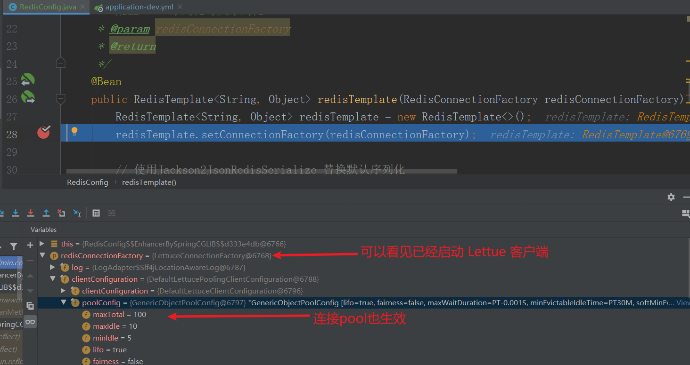

# (十一)整合redis

## 目录

*   [一、maven引入依赖](#一maven引入依赖)

*   [二、新增redis配置内容](#二新增redis配置内容)

*   [三、配置redis序列化与发序列化方式](#三配置redis序列化与发序列化方式)

*   [四、编写redis通用工具类](#四编写redis通用工具类)

## 一、maven引入依赖

```xml
<!--redis 操作-->
  <dependency>
      <groupId>org.springframework.boot</groupId>
      <artifactId>spring-boot-starter-data-redis</artifactId>
  </dependency>
  <!--启用redis+lettuce客户端+pool连接池-->
  <dependency>
      <groupId>org.apache.commons</groupId>
      <artifactId>commons-pool2</artifactId>
  </dependency>
```

## 二、新增redis配置内容

application-dev.yml添加配置文件

```yaml
#  redis相关配置
spring:
  redis:
    host: 81.69.43.78
    database: 0
    port: 6379
    password:
    lettuce:
      pool:
        # 连接池最大连接数，负值表示没有限制
        max-active: 100
        # 连接池最大阻塞等待时间 -1 表示没有限制
        max-wait: -1ms
        # 连接池中最大空闲连接
        max-idle: 10
        # 连接池中最小空闲连接
        min-idle: 5
    # 连接超时时间（毫秒）
    timeout: 2000
    # 指定客户端
    client-type: lettuce
```

## 三、配置redis序列化与发序列化方式

```java
package cn.mesmile.admin.common.config.redis;

import com.fasterxml.jackson.annotation.JsonAutoDetect;
import com.fasterxml.jackson.annotation.PropertyAccessor;
import com.fasterxml.jackson.databind.ObjectMapper;
import org.springframework.context.annotation.Bean;
import org.springframework.context.annotation.Configuration;
import org.springframework.data.redis.connection.RedisConnectionFactory;
import org.springframework.data.redis.core.RedisTemplate;
import org.springframework.data.redis.serializer.Jackson2JsonRedisSerializer;
import org.springframework.data.redis.serializer.StringRedisSerializer;

/**
 * @author zb
 * @Description 配置redis序列化与反序列化
 */
@Configuration
public class RedisConfig {

    /**
     *  配置redis序列化与反序列化
     * @param redisConnectionFactory
     * @return
     */
    @Bean
    public RedisTemplate<String, Object> redisTemplate(RedisConnectionFactory redisConnectionFactory) {
        RedisTemplate<String, Object> redisTemplate = new RedisTemplate<>();
        redisTemplate.setConnectionFactory(redisConnectionFactory);

        // 使用Jackson2JsonRedisSerialize 替换默认序列化
        Jackson2JsonRedisSerializer jackson2JsonRedisSerializer = new Jackson2JsonRedisSerializer(Object.class);
        ObjectMapper objectMapper = new ObjectMapper();
        objectMapper.setVisibility(PropertyAccessor.ALL, JsonAutoDetect.Visibility.ANY);
        jackson2JsonRedisSerializer.setObjectMapper(objectMapper);

        // 设置key和value的序列化规则
        redisTemplate.setKeySerializer(new StringRedisSerializer());
        redisTemplate.setValueSerializer(jackson2JsonRedisSerializer);

        // 设置hashKey和hashValue的序列化规则
        redisTemplate.setHashKeySerializer(new StringRedisSerializer());
        redisTemplate.setHashValueSerializer(jackson2JsonRedisSerializer);

        // 设置支持事物
        //redisTemplate.setEnableTransactionSupport(true);

        redisTemplate.afterPropertiesSet();

        return redisTemplate;
    }
}

```



## 四、编写redis通用工具类

```java
package cn.mesmile.admin.common.utils;

import org.springframework.data.redis.core.*;
import org.springframework.data.redis.core.ZSetOperations.TypedTuple;
import org.springframework.lang.Nullable;
import org.springframework.stereotype.Component;
import org.springframework.util.Assert;

import java.time.Duration;
import java.util.*;
import java.util.concurrent.TimeUnit;
import java.util.function.Supplier;

/**
 * @author zb
 * @Description redis 工具类
 */
@Component
public class AdminRedisTemplate {

    private final RedisTemplate<String, Object> redisTemplate;
    private final ValueOperations<String, Object> valueOps;
    private final HashOperations<String, Object, Object> hashOps;
    private final ListOperations<String, Object> listOps;
    private final SetOperations<String, Object> setOps;
    private final ZSetOperations<String, Object> zSetOps;

    public AdminRedisTemplate(RedisTemplate<String, Object> redisTemplate) {
        this.redisTemplate = redisTemplate;
        Assert.notNull(redisTemplate, "redisTemplate is null");
        this.valueOps = redisTemplate.opsForValue();
        this.hashOps = redisTemplate.opsForHash();
        this.listOps = redisTemplate.opsForList();
        this.setOps = redisTemplate.opsForSet();
        this.zSetOps = redisTemplate.opsForZSet();
    }

    /* ============================== 全局操作 ============================== */

    /**
     * 删除单个键值对
     *
     * @param key key
     * @return
     */
    public Boolean del(String key) {
        return this.redisTemplate.delete(key);
    }

    /**
     * 删除多个键值对
     *
     * @param keys 多个键值
     * @return 删除个数
     */
    public Long del(String... keys) {
        return this.del(Arrays.asList(keys));
    }

    /**
     * 删除多个键值对
     *
     * @param keys 多个键值
     * @return 删除个数
     */
    public Long del(Collection<String> keys) {
        return this.redisTemplate.delete(keys);
    }

    /**
     * 匹配 键值
     *
     * @param pattern 多个键值
     * @return 匹配到的键值
     */
    public Set<String> keys(String pattern) {
        return this.redisTemplate.keys(pattern);
    }

    /**
     * 判断是否存在某个key
     *
     * @param key key
     * @return 返回是否存在key
     */
    public Boolean exists(String key) {
        return this.redisTemplate.hasKey(key);
    }

    /**
     * 随机的返回一个key
     *
     * @return
     */
    public String randomKey() {
        return (String) this.redisTemplate.randomKey();
    }

    /**
     * 重命名 一个key名称
     *
     * @param oldKey 旧的key名称
     * @param newKey 新的key名称
     */
    public void rename(String oldKey, String newKey) {
        this.redisTemplate.rename(oldKey, newKey);
    }

    /**
     * 删除指定数据库中的指定key
     *
     * @param key     key
     * @param dbIndex 数据库下标
     * @return 返回是否删除成功
     */
    public Boolean move(String key, int dbIndex) {
        return this.redisTemplate.move(key, dbIndex);
    }

    /**
     * 设置某个key的过期时间
     *
     * @param key     key
     * @param seconds 过期时间单位 秒
     * @return 返回是否操作成功
     */
    public Boolean expire(String key, long seconds) {
        return this.redisTemplate.expire(key, seconds, TimeUnit.SECONDS);
    }

    /**
     * 设置某个key的过期时间
     *
     * @param key     key
     * @param timeout 过期时间
     * @return 返回是否操作成功
     */
    public Boolean expire(String key, Duration timeout) {
        return this.expire(key, timeout.getSeconds());
    }

    /**
     * 设置某个key在什么时候过期
     *
     * @param key  key
     * @param date 过期时间
     * @return 返回是否操作成功
     */
    public Boolean expireAt(String key, Date date) {
        return this.redisTemplate.expireAt(key, date);
    }

    /**
     * 设置某个key在什么时候过期
     *
     * @param key      key
     * @param unixTime 1970年1月1日到现在的秒数，过期时间
     * @return 返回是否操作成功
     */
    public Boolean expireAt(String key, long unixTime) {
        return this.expireAt(key, new Date(unixTime));
    }

    /**
     * 设置某个key的过期时间
     *
     * @param key          key
     * @param milliseconds 过期时间，单位毫秒
     * @return 返回是否操作成功
     */
    public Boolean pExpire(String key, long milliseconds) {
        return this.redisTemplate.expire(key, milliseconds, TimeUnit.MILLISECONDS);
    }

    /**
     * 用于删除键所指定的过期时间,将原来有过期时间的键 变为没有过期时间
     *
     * @param key key
     * @return 操作结果
     */
    public Boolean persist(String key) {
        return this.redisTemplate.persist(key);
    }

    /**
     * 获取键对应的值，存储的类型，存储在键中的值的数据类型
     *
     * @param key key
     * @return value存储类型
     */
    public String type(String key) {
        return this.redisTemplate.type(key).code();
    }

    /**
     * 获取key的过期时间，单位 秒
     *
     * @param key key
     * @return 过期时间
     */
    public Long ttl(String key) {
        return this.redisTemplate.getExpire(key);
    }

    /**
     * 键值
     *
     * @param key key
     * @return 过期时间
     */
    public Long millisecondsTtl(String key) {
        return this.redisTemplate.getExpire(key, TimeUnit.MILLISECONDS);
    }


    /* ============================== string字符串相关操作 =============================== */

    /**
     * 设置值
     *
     * @param key   key
     * @param value value
     */
    public void set(String key, Object value) {
        this.valueOps.set(key, value);
    }

    /**
     * 设置值的同时设置过期时间
     *
     * @param key     key
     * @param value   value
     * @param timeout 过期时间
     */
    public void setEx(String key, Object value, Duration timeout) {
        this.valueOps.set(key, value, timeout);
    }

    /**
     * 设置值的同时设置过期时间
     *
     * @param key     key
     * @param value   value
     * @param seconds 过期时间单位 秒
     */
    public void setEx(String key, Object value, Long seconds) {
        this.valueOps.set(key, value, seconds, TimeUnit.SECONDS);
    }

    /**
     * 获取值
     *
     * @param key key
     * @return T 返回值
     */
    @Nullable
    public <T> T get(String key) {
        return (T) this.valueOps.get(key);
    }

    /**
     * 获取值
     *
     * @param key    key
     * @param loader 若获取不到值则执行此语句
     */
    @Nullable
    public <T> T get(String key, Supplier<T> loader) {
        T value = this.get(key);
        if (value != null) {
            return value;
        } else {
            value = loader.get();
            if (value == null) {
                return null;
            } else {
                this.set(key, value);
                return value;
            }
        }
    }

    /**
     * 一次性设置多个键值对
     *
     * @param keyValueMap 多个键值对
     */
    public void mSet(Map<String, Object> keyValueMap) {
        this.valueOps.multiSet(keyValueMap);
    }

    /**
     * 一次性获取多个key对应的value
     *
     * @param keys 多个key
     * @return 返回结果
     */
    public List<Object> mGet(String... keys) {
        return this.mGet(Arrays.asList(keys));
    }

    /**
     * 一次性获取多个key对应的value
     *
     * @param keys 多个key
     * @return 返回结果
     */
    public List<Object> mGet(Collection<String> keys) {
        return this.valueOps.multiGet(keys);
    }

    /**
     * 对指定key对应的value值递减,默认每次递减 1
     *
     * @param key key
     * @return 对指定key对应的value值递减后的值
     */
    public Long decr(String key) {
        return this.valueOps.decrement(key);
    }

    /**
     * 对指定key对应的value值递减，指定递减区间
     *
     * @param key       key
     * @param longValue 每次递减的区间
     * @return 对指定key对应的value值递减后的值
     */
    public Long decrBy(String key, long longValue) {
        return this.valueOps.decrement(key, longValue);
    }

    /**
     * 对指定key对应的value值递增，默认每次递增 1
     *
     * @param key key
     * @return 对指定key对应的value值递增后的值
     */
    public Long incr(String key) {
        return this.valueOps.increment(key);
    }

    /**
     * 对指定key对应的value值递增，指定递增区间
     *
     * @param key       key
     * @param longValue 每次递增的区间
     * @return 对指定key对应的value值递增后的值
     */
    public Long incrBy(String key, long longValue) {
        return this.valueOps.increment(key, longValue);
    }

    /**
     * 获取原来的值的同时将新的值设置进去
     *
     * @param key   key
     * @param value value
     * @return 返回值
     */
    public <T> T getSet(String key, Object value) {
        return (T) this.valueOps.getAndSet(key, value);
    }

    /* ============================== hash相关操作 =============================== */

    /**
     * 设置hash值
     *
     * @param key   key
     * @param field 属性
     * @param value value
     */
    public void hSet(String key, Object field, Object value) {
        this.hashOps.put(key, field, value);
    }

    /**
     * 一次性设置多个 hash值
     *
     * @param key  key
     * @param hash 多个键值对
     */
    public void hMset(String key, Map<Object, Object> hash) {
        this.hashOps.putAll(key, hash);
    }

    /**
     * 获取指定key对应，指定属性对应的值
     *
     * @param key   key
     * @param field 属性
     * @return value
     */
    public <T> T hGet(String key, Object field) {
        return (T) this.hashOps.get(key, field);
    }

    /**
     * 获取指定key对应，指定多个属性对应的多个值
     *
     * @param key    key
     * @param fields 多个属性
     * @return value
     */
    public List hmGet(String key, Object... fields) {
        return this.hmGet(key, Arrays.asList(fields));
    }

    /**
     * 获取指定key对应，指定多个属性对应的多个值
     *
     * @param key      key
     * @param hashKeys 多个属性
     * @return value
     */
    public List hmGet(String key, Collection<Object> hashKeys) {
        return this.hashOps.multiGet(key, hashKeys);
    }

    /**
     * 删除指定key对应指定多个属性键值对
     *
     * @param key    key
     * @param fields 多个属性
     * @return value
     */
    public Long hDel(String key, Object... fields) {
        return this.hashOps.delete(key, fields);
    }

    /**
     * 判断某个key，是否存在某个属性
     *
     * @param key   key
     * @param field 属性
     * @return 是否存在
     */
    public Boolean hExists(String key, Object field) {
        return this.hashOps.hasKey(key, field);
    }

    /**
     * 获取某个key对应的 所有键值对
     *
     * @param key key
     * @return 自定义key对应的所有键值对
     */
    public Map hGetAll(String key) {
        return this.hashOps.entries(key);
    }

    /**
     * 获取指定key，对应的所有 value值
     *
     * @param key key
     * @return 多个value值
     */
    public List hVals(String key) {
        return this.hashOps.values(key);
    }

    /**
     * 获取指定key，对应的所有 字段属性
     *
     * @param key key
     * @return 多个value字段属性
     */
    public Set<Object> hKeys(String key) {
        return this.hashOps.keys(key);
    }

    /**
     * 获取指定key,对应的 键值对 个数
     *
     * @param key key
     * @return key对应的 键值对 个数
     */
    public Long hLen(String key) {
        return this.hashOps.size(key);
    }

    /**
     * 将哈希字段的整数值按给定数字增加
     *
     * @param key   key
     * @param field 属性
     * @param value value
     * @return 增加后的value
     */
    public Long hIncrBy(String key, Object field, long value) {
        return this.hashOps.increment(key, field, value);
    }

    /**
     * 将哈希字段的浮点值按给定数值增加
     *
     * @param key   key
     * @param field 属性
     * @param value value
     * @return 增加后的value
     */
    public Double hIncrByFloat(String key, Object field, double value) {
        return this.hashOps.increment(key, field, value);
    }

    /* ============================== list相关操作 =============================== */

    /**
     * 通过其索引从列表获取元素
     *
     * @param key   key
     * @param index index
     * @return 通过其索引从列表获取元素
     */
    public <T> T lIndex(String key, long index) {
        return (T) this.listOps.index(key, index);
    }

    /**
     * 获取列表的长度
     *
     * @param key key
     * @return 列表的长度
     */
    public Long lLen(String key) {
        return this.listOps.size(key);
    }

    /**
     * 删除并获取列表中的第一个元素
     *
     * @param key key
     * @return value
     */
    public <T> T lPop(String key) {
        return (T) this.listOps.leftPop(key);
    }

    /**
     * 将一个或多个值添加到列表
     *
     * @param key    key
     * @param values values
     * @return 此次添加成功个数
     */
    public Long lPush(String key, Object... values) {
        return this.listOps.leftPush(key, values);
    }

    /**
     * 通过索引在列表中设置元素的值
     *
     * @param key   key
     * @param index 下标
     * @param value value
     */
    public void lSet(String key, long index, Object value) {
        this.listOps.set(key, index, value);
    }

    /**
     * 删除集合中值等于value的元素
     *
     * @param key   key
     * @param count count=0, 删除所有值等于value的元素;
     *              count>0, 从头部开始删除第一个值等于value的元素;
     *              count<0, 从尾部开始删除第一个值等于value的元素;
     * @param value value
     * @return 删除个数
     */
    public Long lRem(String key, long count, Object value) {
        return this.listOps.remove(key, count, value);
    }

    /**
     * 从列表中获取一系列元素
     *
     * @param key   key
     * @param start 开始下标, 0是开始位置
     * @param end   结束下标   -1返回所有
     * @return
     */
    public List lRange(String key, long start, long end) {
        return this.listOps.range(key, start, end);
    }

    /**
     * 裁剪list
     *
     * @param key   key
     * @param start 开始下标, 0是开始位置
     * @param end   结束下标   -1所有
     */
    public void lTrim(String key, long start, long end) {
        this.listOps.trim(key, start, end);
    }

    /**
     * 移除并获取列表最后一个元素
     *
     * @param key key
     * @return 列表最后一个元素
     */
    public <T> T rPop(String key) {
        return (T) this.listOps.rightPop(key);
    }

    /**
     * 将一个或多个值附加到列表
     *
     * @param key    key
     * @param values values
     * @return 添加成功的个数
     */
    public Long rPush(String key, Object... values) {
        return this.listOps.rightPush(key, values);
    }

    /**
     * 删除列表中的最后一个元素，将其附加到另一个列表并返回
     *
     * @param srcKey
     * @param dstKey
     * @return
     */
    public <T> T rPopLPush(String srcKey, String dstKey) {
        return (T) this.listOps.rightPopAndLeftPush(srcKey, dstKey);
    }

    /* ============================== set相关操作 =============================== */

    /**
     * 将一个或多个成员添加到集合
     *
     * @param key     key
     * @param members 一个或多个value值
     * @return
     */
    public Long sAdd(String key, Object... members) {
        return this.setOps.add(key, members);
    }

    /**
     * 从集合中删除并返回随机成员
     *
     * @param key key
     * @return 从集合中删除并返回随机成员
     */
    public <T> T sPop(String key) {
        return (T) this.setOps.pop(key);
    }

    /**
     * 返回集合中的所有成员
     *
     * @param key key
     * @return 返回集合中的所有成员
     */
    public Set sMembers(String key) {
        return this.setOps.members(key);
    }

    /**
     * 判断 member 元素是否是集合 key 的成员
     *
     * @param key    key
     * @param member member
     * @return 判断 member 元素是否是集合 key 的成员
     */
    public boolean sIsMember(String key, Object member) {
        return this.setOps.isMember(key, member);
    }

    /**
     * 返回给定所有给定集合的交集
     *
     * @param key      key
     * @param otherKey otherKey
     * @return 交集
     */
    public Set sInter(String key, String otherKey) {
        return this.setOps.intersect(key, otherKey);
    }

    /**
     * 返回集合中给定所有集合的交集 并存储在 key 对应的集合中
     *
     * @param key       key
     * @param otherKeys otherKeys
     * @return 返回集合中给定所有集合的交集 并存储在 key 对应的集合中
     */
    public Set sInter(String key, Collection<String> otherKeys) {
        return this.setOps.intersect(key, otherKeys);
    }

    /**
     * 返回集合中一个随机数
     *
     * @param key key
     * @return 返回集合中一个随机数
     */
    public <T> T sRandMember(String key) {
        return (T) this.setOps.randomMember(key);
    }

    /**
     * 返回集合中多个随机数
     *
     * @param key   key
     * @param count 返回个数
     * @return 返回集合中多个随机数
     */
    public List sRandMember(String key, int count) {
        return this.setOps.randomMembers(key, (long) count);
    }

    /**
     * 移除集合中一个或多个成员
     *
     * @param key     key
     * @param members members
     * @return 移除成功个数
     */
    public Long sRem(String key, Object... members) {
        return this.setOps.remove(key, members);
    }

    /**
     * 返回所有给定集合的并集
     *
     * @param key      key
     * @param otherKey otherKey
     * @return 返回所有给定集合的并集
     */
    public Set sUnion(String key, String otherKey) {
        return this.setOps.union(key, otherKey);
    }

    /**
     * 返回集合中给定所有集合的并集 并存储在 key 对应的集合中
     *
     * @param key       key
     * @param otherKeys otherKeys
     * @return 返回集合中给定所有集合的并集 并存储在 key 对应的集合中
     */
    public Set sUnion(String key, Collection<String> otherKeys) {
        return this.setOps.union(key, otherKeys);
    }

    /**
     * 返回第一个集合与其他集合之间的差异
     *
     * @param key      key
     * @param otherKey otherKey
     * @return 返回第一个集合与其他集合之间的差异
     */
    public Set sDiff(String key, String otherKey) {
        return this.setOps.difference(key, otherKey);
    }

    /**
     * 返回给定所有集合的差集并存储在 key 中
     *
     * @param key       key
     * @param otherKeys otherKeys
     * @return 返回给定所有集合的差集并存储在 key 中
     */
    public Set sDiff(String key, Collection<String> otherKeys) {
        return this.setOps.difference(key, otherKeys);
    }


    /* ============================== zSet相关操作 =============================== */

    /**
     * 获取有序集合的成员数
     *
     * @param key    key
     * @param member member
     * @param score  分数
     * @return 是否添加成功
     */
    public Boolean zAdd(String key, Object member, double score) {
        return this.zSetOps.add(key, member, score);
    }

    /**
     * 向有序集合添加一个或多个成员，或者更新已存在成员的分数
     *
     * @param key          key
     * @param scoreMembers scoreMembers
     * @return 添加成功的个数
     */
    public Long zAdd(String key, Map<Object, Double> scoreMembers) {
        Set<TypedTuple<Object>> tuples = new HashSet();
        scoreMembers.forEach((k, v) -> {
            tuples.add(new DefaultTypedTuple(k, v));
        });
        return this.zSetOps.add(key, tuples);
    }

    /**
     * 获取有序集合的成员数
     *
     * @param key key
     * @return 获取有序集合的成员数
     */
    public Long zCard(String key) {
        return this.zSetOps.zCard(key);
    }

    /**
     * 计算在有序集合中指定区间分数的成员数
     *
     * @param key key
     * @param min 最小值
     * @param max 最大值
     * @return 计算在有序集合中指定区间分数的成员数
     */
    public Long zCount(String key, double min, double max) {
        return this.zSetOps.count(key, min, max);
    }

    /**
     * 有序集合中对指定成员的分数加上增量 score
     *
     * @param key    key
     * @param member 成员
     * @param score  分数
     * @return 增加后的分数
     */
    public Double zIncrBy(String key, Object member, double score) {
        return this.zSetOps.incrementScore(key, member, score);
    }

    /**
     * 通过索引区间返回有序集合指定区间内的成员
     * start 和 stop 都以 0 为底，也就是说，以 0 表示有序集第一个成员，以 1 表示有序集第二个成员，以此类推。
     * 你也可以使用负数下标，以 -1 表示最后一个成员， -2 表示倒数第二个成员，以此类推。
     *
     * @param key   key
     * @param start 开始
     * @param end   结束
     * @return 区间成员
     */
    public Set zRange(String key, long start, long end) {
        return this.zSetOps.range(key, start, end);
    }

    /**
     * 返回有序集中指定区间内的成员，通过索引，分数从高到低
     *
     * @param key   key
     * @param start 开始
     * @param end   结束
     * @return 区间成员
     */
    public Set zRevrange(String key, long start, long end) {
        return this.zSetOps.reverseRange(key, start, end);
    }

    /**
     * 通过分数返回有序集合指定区间内的成员
     *
     * @param key key
     * @param min 最小分数
     * @param max 最大分数
     * @return 区间成员
     */
    public Set zRangeByScore(String key, double min, double max) {
        return this.zSetOps.rangeByScore(key, min, max);
    }

    /**
     * 返回有序集合中指定成员的索引，默认按分数递增（从小到大）
     *
     * @param key    key
     * @param member 成员
     * @return 排序索引
     */
    public Long zRank(String key, Object member) {
        return this.zSetOps.rank(key, member);
    }

    /**
     * 返回有序集合中指定成员的排名，有序集成员按分数值递减(从大到小)排序
     *
     * @param key    key
     * @param member 成员
     * @return 排序索引
     */
    public Long zRevrank(String key, Object member) {
        return this.zSetOps.reverseRank(key, member);
    }

    /**
     * 移除有序集合中的一个或多个成员
     *
     * @param key     key
     * @param members 一个或多个成员
     * @return 移除成功个数
     */
    public Long zRem(String key, Object... members) {
        return this.zSetOps.remove(key, members);
    }

    /**
     * 返回有序集中，成员的分数值
     *
     * @param key    key
     * @param member 成员
     * @return 成员的分数值
     */
    public Double zScore(String key, Object member) {
        return this.zSetOps.score(key, member);
    }

    public RedisTemplate<String, Object> getRedisTemplate() {
        return this.redisTemplate;
    }

    public ValueOperations<String, Object> getValueOps() {
        return this.valueOps;
    }

    public HashOperations<String, Object, Object> getHashOps() {
        return this.hashOps;
    }

    public ListOperations<String, Object> getListOps() {
        return this.listOps;
    }

    public SetOperations<String, Object> getSetOps() {
        return this.setOps;
    }

    public ZSetOperations<String, Object> getZSetOps() {
        return this.zSetOps;
    }
}
```
