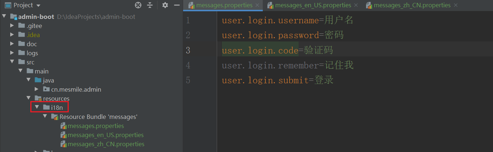
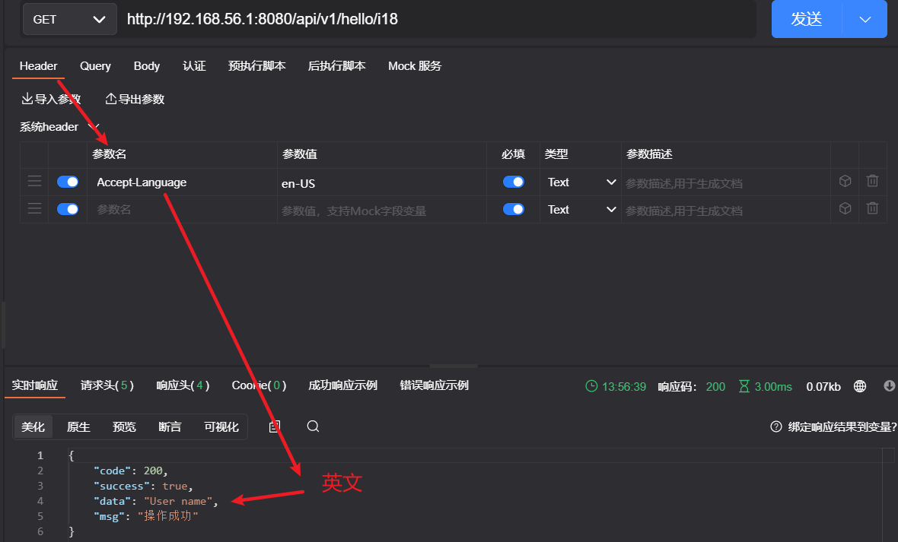
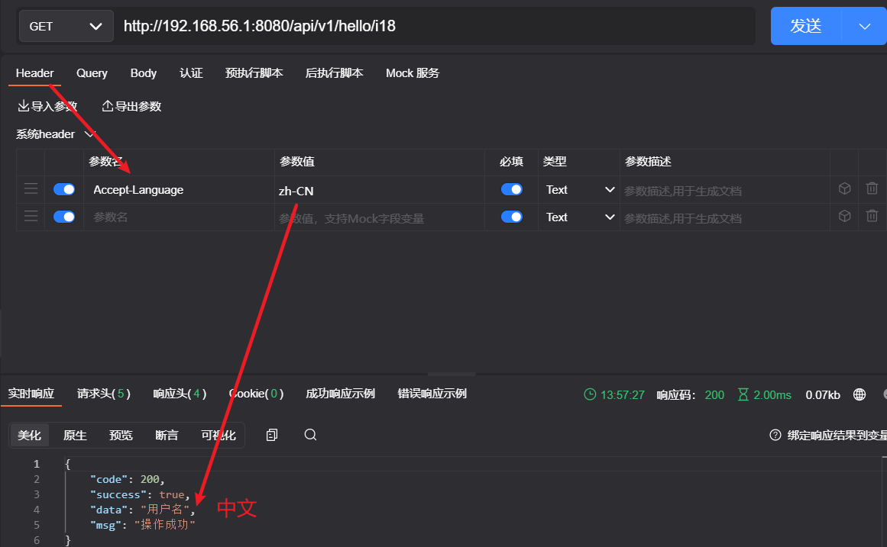
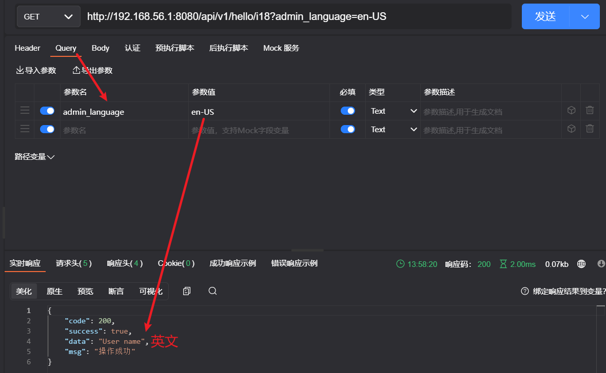
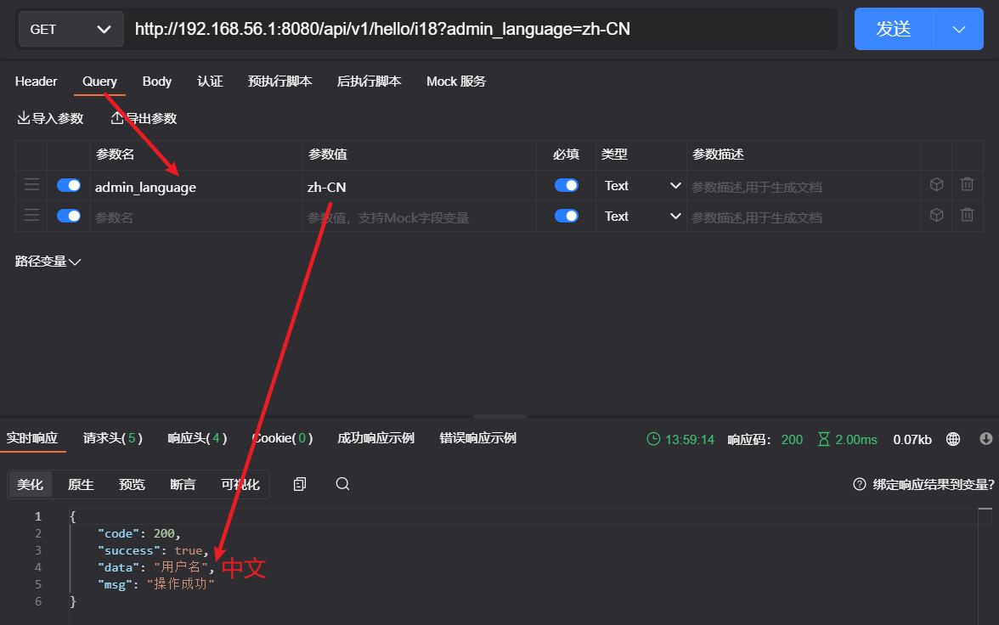

# (十七)国际化支持

## 目录

*   [一、代码实现](#一代码实现)

    *   [MyLocaleResolver自定义解析器](#mylocaleresolver自定义解析器)

    *   [I18nConfig 配置解析器](#i18nconfig-配置解析器)

    *   [ResourceI18nUtil工具类](#resourcei18nutil工具类)

    *   [编写对应配置文件](#编写对应配置文件)

    *   [修改application.yml配置文件](#修改applicationyml配置文件)

*   [二、测试](#二测试)
### 国际化支持原理

WebMvcAutoConfiguration 类中

1、WebMvcAutoConfiguration 是SpringBoot中的 Web方面的自动配置类。
2、当用户没有创建自己的 localeResolver 时，这个配置方法就会生效，从而产生一个localeResolver。（配置自己的localeResolver时，Bean名必须为localeResolver）。
3、spring.web.locale-resolver、spring.mvc.locale-resolver 的配置属性都有两个值可供选择。（fixed、accept_header）。
4、选择属性值 fixed，表示 Locale 区域对象是 固定的。
5、当属性值为fixed，应该搭配spring.web.locale、spring.mvc.locale 这两个配置属性一起使用，给出固定的Locale 区域对象。
6、假如属性值为fixed，又没有搭配上面两个属性之一，则因为上面两个属性没有默认值，则Locale 区域对象将会使用运行主机的默认语言环境生成一个Locale 区域对象。
6、从以下的方法的执行流程可以看出，spring.web.locale-resolver 优先级比 spring.mvc.locale-resolver 高一些。
7、因为spring.web.locale-resolver、spring.mvc.locale-resolver 它们的 默认值 都为 accept_header，所以，只要不更改配置，默认就不是固定的Locale 区域对象。就会继续执行最下面的部分。

8、此时spring.web.locale、spring.mvc.locale 这两个配置属性，假如存在，就会成为AcceptHeaderLocaleResolver 的默认的Locale 区域对象。 并在请求响应的请求头中没有Accept-Language这个属性时，成为AcceptHeaderLocaleResolver返回的Locale 区域对象。

9、AcceptHeaderLocaleResolver 会根据请求响应的请求头中的Accept-Language属性，来返回特定的Locale 区域对象。

## 一、代码实现

### MyLocaleResolver自定义解析器

```java
package cn.mesmile.admin.common.i18n;

import cn.hutool.core.util.StrUtil;
import cn.mesmile.admin.common.constant.AdminConstant;
import org.springframework.web.servlet.LocaleResolver;

import javax.servlet.http.HttpServletRequest;
import javax.servlet.http.HttpServletResponse;
import java.util.Locale;

/**
 *
 * @author zb
 * @description 自定义 语言解析器
 */
public class MyLocaleResolver implements LocaleResolver {

    /**
     * 自定义国际化解析，优先以 链接参数为准
     * 然后 Accept-Language 请求头为二级优先
     */
    @Override
    public Locale resolveLocale(HttpServletRequest request) {
        int languageArraySize = 2;
        // 从请求头上获取
        Locale locale = request.getLocale();
        //获取请求中的语言参数  admin_language
        String language = request.getParameter(AdminConstant.ADMIN_LANGUAGE);
        //如果请求的链接中携带了 国际化的参数
        if (StrUtil.isNotEmpty(language)){
            // zh-CN   en-US
            String[] languageArray = language.split("-");
            if (languageArray.length == languageArraySize){
                // 国家 地区
                locale = new Locale(languageArray[0], languageArray[1]);
            }
        }
        return locale == null ? Locale.getDefault() : locale;
    }

    @Override
    public void setLocale(HttpServletRequest request, HttpServletResponse httpServletResponse, Locale locale) {
        
    }
}
```

### I18nConfig 配置解析器

```java
package cn.mesmile.admin.common.i18n;

import org.springframework.context.annotation.Bean;
import org.springframework.context.annotation.Configuration;
import org.springframework.web.servlet.LocaleResolver;

/**
 * @author zb
 * @Description
 */
@Configuration
public class I18nConfig {

    @Bean
    public LocaleResolver localeResolver(){
        return new MyLocaleResolver();
    }

}

```

### ResourceI18nUtil工具类

```java
package cn.mesmile.admin.common.utils;

import cn.hutool.extra.spring.SpringUtil;
import org.springframework.context.MessageSource;
import org.springframework.context.MessageSourceResolvable;
import org.springframework.context.i18n.LocaleContextHolder;

/**
 * @author zb
 * @Description
 */
public class ResourceI18nUtil {

    public static MessageSource getMessageSource() {
        return SpringUtil.getBean(MessageSource.class);
    }

    /**
     * 通过定义key 获取value
     * @param key key
     * @return value
     */
    public static String getValueByKey(String key){
        return getMessageSource().getMessage(key, null, LocaleContextHolder.getLocale());
    }

    /**
     * 通过定义key 获取value
     * @param key key
     * @param args 填补参数
     * @return value
     */
    public static String getValueByKey(String key, Object... args){
        return getMessageSource().getMessage(key, args, LocaleContextHolder.getLocale());
    }

    /**
     * 通过定义key 获取value
     * @param key key
     * @param defaultMessage 默认消息
     * @param args 填补参数
     * @return value
     */
    public static String getValueDefaultByKey(String key,String defaultMessage,Object... args){
        return getMessageSource().getMessage(key, args, defaultMessage, LocaleContextHolder.getLocale());
    }

    /**
     * 通过定义key 获取value
     * @param key key
     * @param defaultMessage 默认消息
     * @return value
     */
    public static String getValueDefaultByKey(String key,String defaultMessage){
        return getMessageSource().getMessage(key, null, defaultMessage,LocaleContextHolder.getLocale());
    }

    /**
     * 通过定义key 获取value
     * @param resolvable resolvable
     * @return value
     */
    public static String getValueByResolvable(MessageSourceResolvable resolvable){
        return getMessageSource().getMessage(resolvable, LocaleContextHolder.getLocale());
    }

}

```

### 编写对应配置文件



### 修改application.yml配置文件

```yaml
  # 资源信息
spring:
  messages:
    # 国际化资源文件路径
    basename: i18n.messages
    encoding: UTF-8

```

## 二、测试

```java
package cn.mesmile.admin.modules.system.controller;

import cn.mesmile.admin.common.result.R;
import cn.mesmile.admin.common.utils.ResourceI18nUtil;
import io.swagger.annotations.Api;
import io.swagger.annotations.ApiImplicitParam;
import io.swagger.annotations.ApiImplicitParams;
import io.swagger.annotations.ApiOperation;
import lombok.extern.slf4j.Slf4j;
import org.checkerframework.checker.i18nformatter.I18nFormatUtil;
import org.springframework.context.i18n.LocaleContextHolder;
import org.springframework.web.bind.annotation.*;

import javax.servlet.http.HttpServletRequest;
import java.util.Locale;

/**
 * @author zb
 * @Description
 */
@Api(tags = "用户登录测试接口")
@Slf4j
@RequestMapping("/api/v1/hello")
@RestController
public class HelloController {

    @GetMapping("/i18")
    public R get(){
        // 参数优先 admin_language   默认根据请求头判断 Accept-Language
        String username = ResourceI18nUtil.getValueByKey("user.login.username");
        return R.data(username);
    }
}

```








