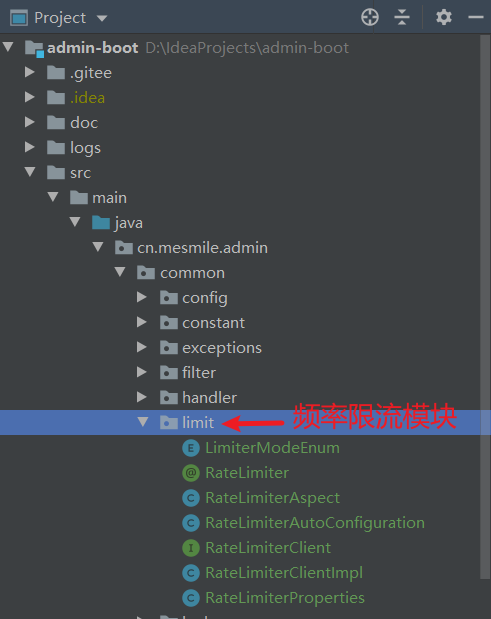
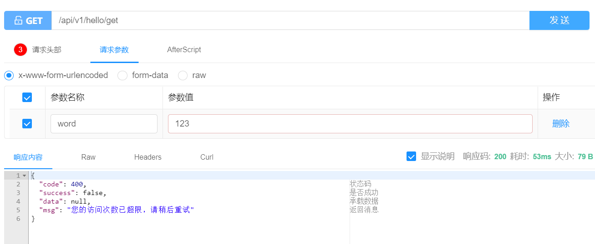

# (十三)redis注解实现接口限流

## 目录

*   [一、接口限流注解配置](#一接口限流注解配置)

    *   [RateLimiterProperties 配置类](#ratelimiterproperties-配置类)

    *   [RateLimiter 频率限制注解](#ratelimiter-频率限制注解)

    *   [RateLimiterAutoConfiguration 自动配置类](#ratelimiterautoconfiguration-自动配置类)

    *   [RateLimiterAspect  拦截切面](#ratelimiteraspect--拦截切面)

    *   [RateLimiterClientImpl 核心判断类](#ratelimiterclientimpl-核心判断类)

    *   [RateLimiterException 自定义频率异常](#ratelimiterexception-自定义频率异常)

    *   [GlobalExceptionHandler 全局拦截处理频率异常](#globalexceptionhandler-全局拦截处理频率异常)

    *   [项目结构](#项目结构)

*   [二、Lua脚本文件](#二lua脚本文件)

*   [三、测试及其用法](#三测试及其用法)

    *   [限流注解  @RateLimiter](#限流注解--ratelimiter)

    *   [测试结果](#测试结果)

## 一、接口限流注解配置

### RateLimiterProperties 配置类

```java
package cn.mesmile.admin.common.limit;

import lombok.Data;
import org.springframework.boot.context.properties.ConfigurationProperties;

/**
 * @author zb
 * @Description
 */
@Data
@ConfigurationProperties("rate-limiter.redis")
public class RateLimiterProperties {

    /**
     *  是否开启限流注解
     */
    private Boolean enabled;

    public RateLimiterProperties(){
        // 默认不开启
        this.enabled = Boolean.FALSE;
    }

}
```

### RateLimiter 频率限制注解

```java
package cn.mesmile.admin.common.limit;

import java.lang.annotation.*;
import java.util.concurrent.TimeUnit;

/**
 * @author zb
 * @Description 请求频率限制器
 */
@Retention(RetentionPolicy.RUNTIME)
@Target({ElementType.METHOD})
@Documented
public @interface RateLimiter {

    /**
     * 限流的key，唯一
     */
    String value();

    /**
     * 限流key，前缀
     */
    String prefix() default "limit";

    /**
     * 方法参数
     */
    String param() default "";

    /**
     * 默认提示消息
     */
    String msg() default "您的访问次数已超限，请稍后重试";

    /**
     * 单位时间内的最大访问量，默认100次
     */
    long max() default 100L;

    /**
     * 超时时间，默认 1 分钟
     */
    long ttl() default 1L;

    /**
     * 时间单位,默认单位 分钟
     */
    TimeUnit timeUnit() default TimeUnit.MINUTES;

    /**
     * 限制模式,默认：同一个接口针对所有ip进行限制
     */
    LimiterModeEnum limiterMode() default LimiterModeEnum.LIMITER_ALL;

}

```

### RateLimiterAutoConfiguration 自动配置类

```java
package cn.mesmile.admin.common.limit;

import org.springframework.boot.autoconfigure.condition.ConditionalOnMissingBean;
import org.springframework.boot.autoconfigure.condition.ConditionalOnProperty;
import org.springframework.boot.context.properties.EnableConfigurationProperties;
import org.springframework.context.annotation.Bean;
import org.springframework.context.annotation.Configuration;
import org.springframework.core.io.ClassPathResource;
import org.springframework.data.redis.core.StringRedisTemplate;
import org.springframework.data.redis.core.script.DefaultRedisScript;
import org.springframework.data.redis.core.script.RedisScript;
import org.springframework.scripting.support.ResourceScriptSource;

import java.io.IOException;
import java.io.InputStream;
import java.util.List;

/**
 * @author zb
 * @Description
 */
@Configuration(
        proxyBeanMethods = false
)
@EnableConfigurationProperties({RateLimiterProperties.class})
@ConditionalOnProperty(
        value = {"rate-limiter.redis.enabled"},
        havingValue = "true"
)
public class RateLimiterAutoConfiguration {

    @Bean
    @ConditionalOnMissingBean
    public RateLimiterClient rateLimiterClient(StringRedisTemplate redisTemplate) {
        RedisScript<List<Long>> listRedisScript = redisRateLimiterScript();
        return new RateLimiterClientImpl(redisTemplate, listRedisScript);
    }

    @Bean
    @ConditionalOnMissingBean
    public RateLimiterAspect rateLimiterAspect(RateLimiterClient rateLimiterClient) {
        return new RateLimiterAspect(rateLimiterClient);
    }

    private RedisScript<List<Long>> redisRateLimiterScript() {
        DefaultRedisScript redisScript = new DefaultRedisScript();
        redisScript.setScriptSource(new ResourceScriptSource(new ClassPathResource("/scripts/admin_rate_limiter.lua")));
        redisScript.setResultType(List.class);
        return redisScript;
    }

}

```

### RateLimiterAspect  拦截切面

```java
package cn.mesmile.admin.common.limit;

import cn.hutool.core.util.StrUtil;
import cn.mesmile.admin.common.exceptions.RateLimiterException;
import cn.mesmile.admin.common.lock.AdminExpressionEvaluator;
import cn.mesmile.admin.common.result.ResultCode;
import cn.mesmile.admin.common.utils.IpUtil;
import lombok.extern.slf4j.Slf4j;
import org.aspectj.lang.ProceedingJoinPoint;
import org.aspectj.lang.annotation.Around;
import org.aspectj.lang.annotation.Aspect;
import org.springframework.beans.BeansException;
import org.springframework.context.ApplicationContext;
import org.springframework.context.ApplicationContextAware;
import org.springframework.util.Assert;
import org.springframework.web.context.request.RequestContextHolder;
import org.springframework.web.context.request.ServletRequestAttributes;

import javax.servlet.http.HttpServletRequest;
import java.util.concurrent.TimeUnit;

/**
 * @author zb
 * @Description 限流拦截器
 */
@Slf4j
@Aspect
public class RateLimiterAspect implements ApplicationContextAware {

    private final AdminExpressionEvaluator EVALUATOR = new AdminExpressionEvaluator();
    private final RateLimiterClient rateLimiterClient;
    private ApplicationContext applicationContext;

    public RateLimiterAspect(RateLimiterClient rateLimiterClient) {
        this.rateLimiterClient = rateLimiterClient;
    }

    @Around("@annotation(rateLimiter)")
    public Object aroundRedisLock(ProceedingJoinPoint point, RateLimiter rateLimiter) throws Throwable {
        String prefix = rateLimiter.prefix();
        String keyName = rateLimiter.value();
        Assert.hasText(keyName, "@RateLimiter 中value不允许为空或为null");
        String param = rateLimiter.param();
        keyName = prefix + ":" + keyName;
        if (StrUtil.isNotBlank(param)) {
            String evalLockParam = EVALUATOR.evalLockParam(point, param, applicationContext);
            keyName = keyName + ":" +evalLockParam ;
        }
        long max = rateLimiter.max();
        long ttl = rateLimiter.ttl();
        TimeUnit timeUnit = rateLimiter.timeUnit();
        ServletRequestAttributes requestAttributes = ((ServletRequestAttributes) RequestContextHolder.getRequestAttributes());
        if (LimiterModeEnum.LIMITER_IP.equals(rateLimiter.limiterMode())) {
            if (requestAttributes != null){
                HttpServletRequest request = requestAttributes.getRequest();
                String ipAddr = IpUtil.getIpAddr(request);
                // 将ip地址加入到键值中
                keyName = keyName +":"+ ipAddr;
            }
        }
        // 判断是否允许访问
        boolean allow = rateLimiterClient.isAllow(keyName, max, ttl , timeUnit);
        if (allow){
            return point.proceed();
        }else {
            if (requestAttributes != null){
                HttpServletRequest request = requestAttributes.getRequest();
                // 请求路径
                String requestUrl = request.getRequestURL().toString();
                // 请求ip
                String ipAddr = IpUtil.getIpAddr(request);
                log.error("访问次数超限制：url:{} , ip:{}", requestUrl, ipAddr);
            }
            // 您的访问次数已超限：%s，速率：%d/%ds
            throw new RateLimiterException(ResultCode.FAILURE, rateLimiter.msg());
        }
    }

    @Override
    public void setApplicationContext(ApplicationContext applicationContext) throws BeansException {
        this.applicationContext = applicationContext;
    }

}

```

### RateLimiterClientImpl 核心判断类

```java
package cn.mesmile.admin.common.limit;

import cn.hutool.core.collection.CollUtil;
import org.springframework.data.redis.core.StringRedisTemplate;
import org.springframework.data.redis.core.script.RedisScript;

import java.time.Instant;
import java.util.Collections;
import java.util.List;
import java.util.concurrent.TimeUnit;

/**
 * @author zb
 * @Description
 */
public class RateLimiterClientImpl implements RateLimiterClient {

    private final StringRedisTemplate redisTemplate;
    private final RedisScript<List<Long>> script;

    public RateLimiterClientImpl(StringRedisTemplate redisTemplate, RedisScript<List<Long>> script) {
        this.redisTemplate = redisTemplate;
        this.script = script;
    }

    @Override
    public boolean isAllow(String keyName, long max, long ttl, TimeUnit timeUnit) {
        List<String> keys = Collections.singletonList(keyName);
        // 当前时间毫秒数
        long now = Instant.now().toEpochMilli();
        // 超时时间
        long ttlMillis = timeUnit.toMillis(ttl);
        // 过期时间点
        long expired = now - ttlMillis;
        List<Long> results = (List)redisTemplate
                // 注意这里必须转为 String,否则会报错 java.lang.Long cannot be cast to java.lang.String
                .execute(script, keys, new Object[]{now + "", ttlMillis + "", expired + "", max + ""});
        if (results != null && results.size() > 0) {
            Long result = (Long)results.get(0);
            return result != 0L;
        } else {
            return false;
        }
    }
}

```

### RateLimiterException 自定义频率异常

```java
package cn.mesmile.admin.common.exceptions;


import cn.mesmile.admin.common.result.IResultCode;
import cn.mesmile.admin.common.result.ResultCode;

/**
 * @author zb
 * @Description 频率限制异常
 */
public class RateLimiterException extends RuntimeException {

    private final long serialVersionUID = 1L;

    private int code = ResultCode.FAILURE.getCode();

    private String msg = ResultCode.FAILURE.getMessage();

    public RateLimiterException() {
        super();
    }

    public RateLimiterException(String msg) {
        super(msg);
        this.msg = msg;
    }

    public RateLimiterException(IResultCode resultCode, String msg) {
        super(msg);
        this.code = resultCode.getCode();
        this.msg = msg;
    }

    public RateLimiterException(String msg, Throwable cause) {
        super(msg, cause);
        this.msg = msg;
    }

    public RateLimiterException(IResultCode resultCode, String msg, Throwable cause) {
        super(msg, cause);
        this.code = resultCode.getCode();
        this.msg = msg;
    }

    public RateLimiterException(Throwable cause) {
        super(cause);
    }

    public int getCode() {
        return code;
    }

    public void setCode(int code) {
        this.code = code;
    }

    public String getMsg() {
        return msg;
    }

    public void setMsg(String msg) {
        this.msg = msg;
    }
}

```

### GlobalExceptionHandler 全局拦截处理频率异常

```java
package cn.mesmile.admin.common.handler;

import cn.mesmile.admin.common.constant.AdminConstant;
import cn.mesmile.admin.common.exceptions.*;
import cn.mesmile.admin.common.result.R;
import lombok.extern.slf4j.Slf4j;
import org.springframework.validation.BindException;
import org.springframework.validation.BindingResult;
import org.springframework.validation.FieldError;
import org.springframework.web.bind.MethodArgumentNotValidException;
import org.springframework.web.bind.annotation.ExceptionHandler;
import org.springframework.web.bind.annotation.RestControllerAdvice;

import javax.validation.ConstraintViolation;
import javax.validation.ConstraintViolationException;
import javax.validation.ValidationException;
import java.util.stream.Collectors;

/**
 * @author zb
 * @Description 全局异常拦截
 * <p>
 * 如果我同时捕获了父类和子类，那么到底能够被那个异常处理器捕获呢？比如 Exception 和 BusinessException
 * 当然是 BusinessException 的异常处理器捕获了，精确匹配，如果没有 BusinessException 的异常处理器才会轮到它的 父亲 ，
 * 父亲 没有才会到 祖父 。总之一句话， 精准匹配，找那个关系最近的
 * </p>
 */
@Slf4j
@RestControllerAdvice
public class GlobalExceptionHandler {

    /**
     * @param businessException 业务异常
     * @return @ResponseBody
     * @ExceptionHandler相当于controller的@RequestMapping 如果抛出的的是BusinessException，则调用该方法
     */
    @ExceptionHandler(BusinessException.class)
    public R handle(BusinessException businessException) {
        // 获取指定包名前缀的异常信息，减少不必要的日志
        String stackTraceByPn = getStackTraceByPn(businessException, AdminConstant.BASE_PACKAGE);
        log.error("记录业务异常信息: 消息{} 编码{} {}", businessException.getMessage(), businessException.getCode(), stackTraceByPn);
        return R.fail(businessException.getCode(), businessException.getMessage());
    }

    /**
     * 拦截限流异常信息
     * */
    @ExceptionHandler(RateLimiterException.class)
    public R handle(RateLimiterException rateLimiterException) {
        // 获取指定包名前缀的异常信息，减少不必要的日志
        String stackTraceByPn = getStackTraceByPn(rateLimiterException, AdminConstant.BASE_PACKAGE);
        log.error("拦截限流异常信息: 消息{} 编码{} {}", rateLimiterException.getMessage(), rateLimiterException.getCode(), stackTraceByPn);
        return R.fail(rateLimiterException.getCode(), rateLimiterException.getMessage());
    }

    @ExceptionHandler(ServiceException.class)
    public R handle(ServiceException serviceException) {
        // 这里记录所有堆栈信息
        log.error("记录业务异常信息: 消息{} 编码{}", serviceException.getMessage(), serviceException.getCode(), serviceException);
        return R.fail(serviceException.getCode(), serviceException.getMessage());
    }

    private String getStackTraceByPn(Throwable e, String packagePrefix) {
        StringBuilder append = new StringBuilder("\n").append(e);
        for (StackTraceElement stackTraceElement : e.getStackTrace()) {
            if (stackTraceElement.getClassName().startsWith(packagePrefix)) {
                append.append("\n\tat ").append(stackTraceElement);
            }
        }
        return append.toString();
    }

    @ExceptionHandler(value = {BindException.class, ValidationException.class, MethodArgumentNotValidException.class})
    public R handleValidatedException(Exception exception) {
        BindingResult bindingResult = null;
         if (exception instanceof MethodArgumentNotValidException){
             MethodArgumentNotValidException e = (MethodArgumentNotValidException) exception;
             bindingResult = e.getBindingResult();
             if (bindingResult.hasErrors()) {
//            String collect = bindingResult.getAllErrors().stream()
//                    .map(ObjectError::getDefaultMessage)
//                    .collect(Collectors.joining(";"));
                 FieldError fieldError = bindingResult.getFieldError();
                 if (fieldError != null) {
                     return R.fail(fieldError.getField()+ "：" + fieldError.getDefaultMessage());
                 }
             }
         }else if (exception instanceof ConstraintViolationException){
             ConstraintViolationException e = (ConstraintViolationException) exception;
             String collect = e.getConstraintViolations().stream()
                     .map(ConstraintViolation::getMessage)
                     .collect(Collectors.joining(";"));
             return R.fail(collect);
         }else if (exception instanceof BindException){
             BindException e = (BindException) exception;
             bindingResult = e.getBindingResult();
             if (bindingResult.hasErrors()) {
//            String collect = bindingResult.getAllErrors().stream()
//                    .map(ObjectError::getDefaultMessage)
//                    .collect(Collectors.joining(";"));
                 FieldError fieldError = bindingResult.getFieldError();
                 if (fieldError != null) {
                     return R.fail(fieldError.getField()+ "：" + fieldError.getDefaultMessage());
                 }
             }
         }
        return R.fail(exception.getMessage());
    }


    /**
     * 捕获空指针异常
     **/
    @ExceptionHandler(value = NullPointerException.class)
    public R handlerBindException(NullPointerException exception) {
        String message = exception.getMessage();
        log.error("全局捕获null错误信息: {}", exception.toString(), exception);
        return R.fail(message);
    }

    /**
     * 捕获最大异常
     **/
    @ExceptionHandler(value = Exception.class)
    public R handlerBindException(Exception exception) {
        String message = exception.getMessage();
        log.error("全局捕获错误信息: {}", exception.toString(), exception);
        return R.fail(message);
    }
}
```

### 项目结构



## 二、Lua脚本文件

admin\_rate\_limiter.lua

```java
-- 下标从 1 开始
local key = KEYS[1]
-- 当前时间
local now = tonumber(ARGV[1])
-- 超时时间
local ttl = tonumber(ARGV[2])
-- 即已经过期的时间点
local expired = tonumber(ARGV[3])
-- 最大访问量
local max = tonumber(ARGV[4])

-- 清除过期的数据
-- 移除指定分数区间内的所有元素，expired 即已经过期的 score
-- 根据当前时间毫秒数 - 超时毫秒数，得到过期时间 expired
redis.call('zremrangebyscore', key, 0, expired)

-- 获取 zset 中的当前元素个数
local current = tonumber(redis.call('zcard', key))
local next = current + 1

if next > max then
  -- 达到限流大小 返回 0
  return 0;
else
  -- 往 zset 中添加一个值、得分均为当前时间戳的元素，[value,score]
  redis.call("zadd", key, now, now)
  -- 每次访问均重新设置 zset 的过期时间，单位毫秒
  redis.call("pexpire", key, ttl)
  return next
end
```

## 三、测试及其用法

### 限流注解  @RateLimiter

@RateLimiter(value = "word",max = 3,limiterMode = LimiterModeEnum.LIMITER\_ALL)

```java
package cn.mesmile.admin.modules.system.controller;

import cn.mesmile.admin.common.limit.LimiterModeEnum;
import cn.mesmile.admin.common.limit.RateLimiter;
import cn.mesmile.admin.common.lock.RedisLock;
import cn.mesmile.admin.common.result.R;
import cn.mesmile.admin.common.utils.AdminRedisTemplate;
import io.swagger.annotations.Api;
import io.swagger.annotations.ApiImplicitParam;
import io.swagger.annotations.ApiImplicitParams;
import io.swagger.annotations.ApiOperation;
import lombok.extern.slf4j.Slf4j;
import org.springframework.web.bind.annotation.GetMapping;
import org.springframework.web.bind.annotation.RequestMapping;
import org.springframework.web.bind.annotation.RequestParam;
import org.springframework.web.bind.annotation.RestController;

import javax.annotation.Resource;
import javax.servlet.http.HttpServletRequest;

/**
 * @author zb
 * @Description
 */
@Api(tags = "用户登录测试接口")
@Slf4j
@RequestMapping("/api/v1/hello")
@RestController
public class HelloController {

    @Resource
    private AdminRedisTemplate adminRedisTemplate;

    @RateLimiter(value = "word",max = 3,limiterMode = LimiterModeEnum.LIMITER_ALL)
    @ApiOperation(value = "用户登录测试接口")
    @ApiImplicitParams({
            @ApiImplicitParam(name="word",value="关键字备注",required = true,type="Integer")
    })
    @GetMapping("/get")
    public R hello (@RequestParam("word") String word) {
        return R.data(word);
    }

}
```

### 测试结果

@RateLimiter(value = "word",max = 3,limiterMode = LimiterModeEnum.LIMITER\_ALL)

在一定时间内，请求次数大于设定次数，则会触发频率限制异常


