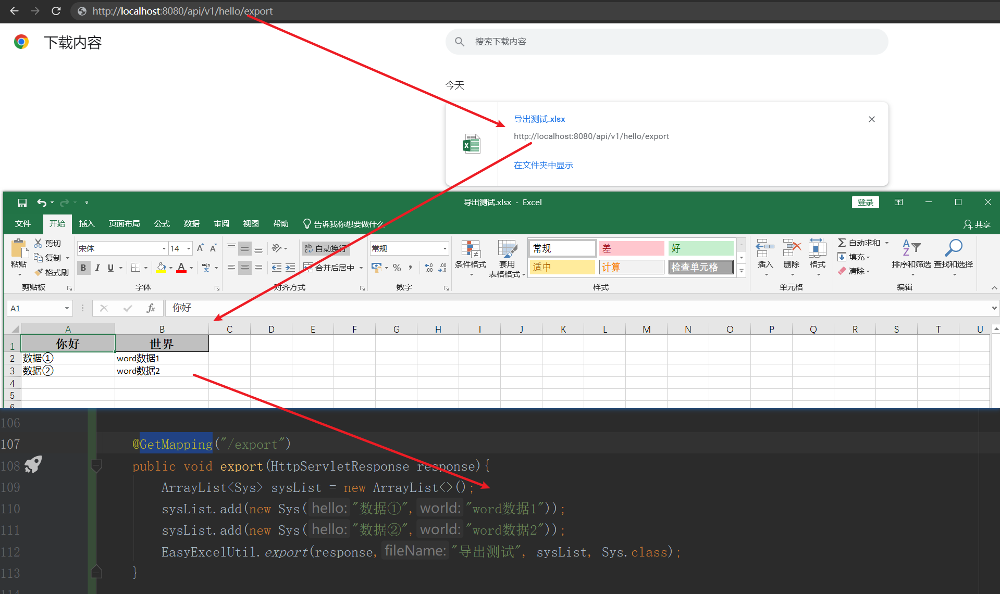

# (十九)集成easyexcel表格导入导出

## 目录

*   [一、简介](#一简介)

*   [二、编码](#二编码)

    *   [导入maven依赖](#导入maven依赖)

    *   [EasyExcelUtil 导入导出工具类](#easyexcelutil-导入导出工具类)

*   [三、测试](#三测试)

    *   [测试类](#测试类)

    *   [测试结果](#测试结果)

    *   [测试上传](#测试上传)

    *   [测试导出数据](#测试导出数据)

## 一、简介

EasyExcel是一个基于Java的、快速、简洁、解决大文件内存溢出的Excel处理工具。 &#x20;
他能让你在不用考虑性能、内存的等因素的情况下，快速完成Excel的读、写等功能

**官方文档：**

<https://easyexcel.opensource.alibaba.com/>

## 二、编码

### 导入maven依赖

```xml
<!--easy-excel 表格导入导出-->
  <dependency>
      <groupId>com.alibaba</groupId>
      <artifactId>easyexcel</artifactId>
      <version>2.3.1</version>
  </dependency>
```

### EasyExcelUtil 导入导出工具类

```java
package cn.mesmile.admin.common.excel;

import cn.hutool.core.date.DateUtil;
import cn.hutool.core.util.StrUtil;
import cn.hutool.http.ContentType;
import cn.mesmile.admin.common.exceptions.EasyExcelException;
import com.alibaba.excel.EasyExcel;
import com.alibaba.excel.read.builder.ExcelReaderBuilder;
import com.alibaba.excel.read.listener.PageReadListener;
import com.alibaba.excel.read.listener.ReadListener;
import lombok.extern.slf4j.Slf4j;
import org.springframework.http.MediaType;
import org.springframework.web.multipart.MultipartFile;

import javax.servlet.http.HttpServletResponse;
import java.awt.*;
import java.io.BufferedInputStream;
import java.io.InputStream;
import java.net.URLEncoder;
import java.nio.charset.StandardCharsets;
import java.util.Date;
import java.util.List;
import java.util.function.Consumer;

/**
 * @author zb
 * @description excel 导入导出工具
 */
@Slf4j
public class EasyExcelUtil {

    private EasyExcelUtil() {
    }

    /**
     * 一次性读取所有数据
     *
     * @param excel excel 文件
     * @param clazz 读取类的class
     * @return 数据
     */
    public static <T> List<T> read(MultipartFile excel, Class<T> clazz) {
        uploadCheck(excel);
        try (
                InputStream inputStream = new BufferedInputStream(excel.getInputStream());
        ) {
            return EasyExcel.read(inputStream).sheet().head(clazz).doReadSync();
        } catch (Exception e) {
            throw new EasyExcelException("读取文件未知异常", e);
        }
    }


    /**
     * 一次性读取所有数据
     *
     * @param excel excel 文件
     * @param sheetNo 读取第几个表格
     * @param clazz 读取类的class
     * @return 数据
     */
    public static <T> List<T> read(MultipartFile excel, int sheetNo, Class<T> clazz) {
        return read(excel, sheetNo, 1, clazz);
    }

    /**
     * 一次性读取所有数据
     *
     * @param excel excel 文件
     * @param sheetNo 读取第几个表格
     * @param headRowNumber 标题行在第几行
     * @param clazz 读取类的class
     * @return 数据
     */
    public static <T> List<T> read(MultipartFile excel, int sheetNo, int headRowNumber, Class<T> clazz) {
        uploadCheck(excel);
        try (
                InputStream inputStream = new BufferedInputStream(excel.getInputStream());
        ) {
            return EasyExcel.read(inputStream).sheet(sheetNo).headRowNumber(headRowNumber).head(clazz).doReadSync();
        } catch (Exception e) {
            throw new EasyExcelException("读取文件未知异常", e);
        }
    }

    /**
     * 读取所有数据并保存，默认每次读取 100 条数据
     *
     * @param excel    excel 文件
     * @param consumer 执行保存动作
     * @param clazz    映射类
     */
    public static <T> void readAndSave(MultipartFile excel, Consumer<List<T>> consumer, Class<T> clazz) {
        uploadCheck(excel);
        try (
                InputStream inputStream = new BufferedInputStream(excel.getInputStream());
        ) {
            // 默认每次读取 100 条数据
            EasyExcel.read(inputStream, clazz, new PageReadListener<T>(consumer)).sheet().headRowNumber(1).doRead();
        } catch (Exception e) {
            throw new EasyExcelException("读取文件未知异常", e);
        }
    }

    /**
     * 检查上传文件
     *
     * @param excel 上传文件
     */
    private static void uploadCheck(MultipartFile excel) {
        String filename = excel.getOriginalFilename();
        if (StrUtil.isEmpty(filename)) {
            throw new EasyExcelException("请上传文件");
        } else if (!StrUtil.endWithAnyIgnoreCase(filename, ".xls", ".xlsx")) {
            throw new EasyExcelException("请上传正确的excel文件");
        }
    }


    /**
     * 导出文件
     *
     * @param response 返回体
     * @param dataList 数据体
     * @param clazz    映射类
     */
    public static <T> void export(HttpServletResponse response, List<T> dataList, Class<T> clazz) {
        export(response, DateUtil.format(new Date(), "yyyyMMddHHmmss"), "导出数据", dataList, clazz);
    }


    /**
     * 导出文件
     *
     * @param response 返回体
     * @param fileName 文件名，不包含后缀
     * @param dataList 数据体
     * @param clazz    映射类
     */
    public static <T> void export(HttpServletResponse response, String fileName, List<T> dataList, Class<T> clazz) {
        try {
            response.setContentType("application/vnd.ms-excel");
            response.setCharacterEncoding(StandardCharsets.UTF_8.name());
            fileName = URLEncoder.encode(fileName, StandardCharsets.UTF_8.name());
            response.setHeader("Content-disposition", "attachment;filename=" + fileName + ".xlsx");
            EasyExcel.write(response.getOutputStream(), clazz).sheet("Sheet1").doWrite(dataList);
        } catch (Exception e) {
            throw new EasyExcelException("导出文件未知异常", e);
        }
    }

    /**
     * 导出文件
     *
     * @param response  返回体
     * @param fileName  文件名，不包含后缀
     * @param sheetName sheet名称
     * @param dataList  数据体
     * @param clazz     映射类
     */
    public static <T> void export(HttpServletResponse response, String fileName, String sheetName, List<T> dataList, Class<T> clazz) {
        try {
            response.setContentType("application/vnd.ms-excel");
            response.setCharacterEncoding(StandardCharsets.UTF_8.name());
            fileName = URLEncoder.encode(fileName, StandardCharsets.UTF_8.name());
            response.setHeader("Content-disposition", "attachment;filename=" + fileName + ".xlsx");
            EasyExcel.write(response.getOutputStream(), clazz).sheet(sheetName).doWrite(dataList);
        } catch (Exception e) {
            throw new EasyExcelException("导出文件未知异常", e);
        }
    }

}

```

## 三、测试

```java
package cn.mesmile.admin.modules.system.entity;

import com.alibaba.excel.annotation.ExcelProperty;
import com.alibaba.excel.annotation.write.style.ColumnWidth;
import com.alibaba.excel.annotation.write.style.HeadRowHeight;
import lombok.Data;

/**
 * @author zb
 * @Description
 */
@ColumnWidth(value = 20)
@HeadRowHeight(value = 15)
@Data
public class Sys {

    @ExcelProperty("你好")
    private String hello;

    @ExcelProperty("世界")
    private String world;

    public Sys(){}

    public Sys(String hello,String world){
        this.hello = hello;
        this.world = world;
    }

    /**
     * 忽略这个字段
     * @ExcelIgnore
     */
}

```

### 测试类

```java
package cn.mesmile.admin.modules.system.controller;

import cn.mesmile.admin.common.result.R;
import cn.mesmile.admin.common.utils.AdminRedisTemplate;
import cn.mesmile.admin.common.utils.ResourceI18nUtil;
import cn.mesmile.admin.modules.system.entity.Sys;
import io.swagger.annotations.Api;
import io.swagger.annotations.ApiImplicitParam;
import io.swagger.annotations.ApiImplicitParams;
import io.swagger.annotations.ApiOperation;
import lombok.extern.slf4j.Slf4j;
import org.checkerframework.checker.i18nformatter.I18nFormatUtil;
import org.springframework.context.i18n.LocaleContextHolder;
import org.springframework.context.support.ResourceBundleMessageSource;
import org.springframework.web.bind.annotation.*;
import org.springframework.web.multipart.MultipartFile;

import javax.annotation.Resource;
import javax.servlet.http.HttpServletRequest;
import javax.servlet.http.HttpServletResponse;
import java.util.ArrayList;
import java.util.List;

/**
 * @author zb
 * @Description
 */
@Api(tags = "用户登录测试接口")
@Slf4j
@RequestMapping("/api/v1/hello")
@RestController
public class HelloController {

    @PostMapping("/excel")
    public R excel(@RequestParam("file") MultipartFile file){
        EasyExcelUtil.readAndSave(file,System.out::println,Sys.class);
        return R.data("success");
    }

    @PostMapping("/read")
    public R read(@RequestParam("file") MultipartFile file){
        List<Sys> read = EasyExcelUtil.read(file, Sys.class);
        return R.data(read);
    }

    @GetMapping("/export")
    public void export(HttpServletResponse response){
        ArrayList<Sys> sysList = new ArrayList<>();
        sysList.add(new Sys("数据①","word数据1"));
        sysList.add(new Sys("数据②","word数据2"));
        EasyExcelUtil.export(response,"导出测试", sysList, Sys.class);
    }

}

```

### 测试结果

### 测试上传

localhost:8080/api/v1/hello/excel


localhost:8080/api/v1/hello/read


### 测试导出数据

localhost:8080/api/v1/hello/export


