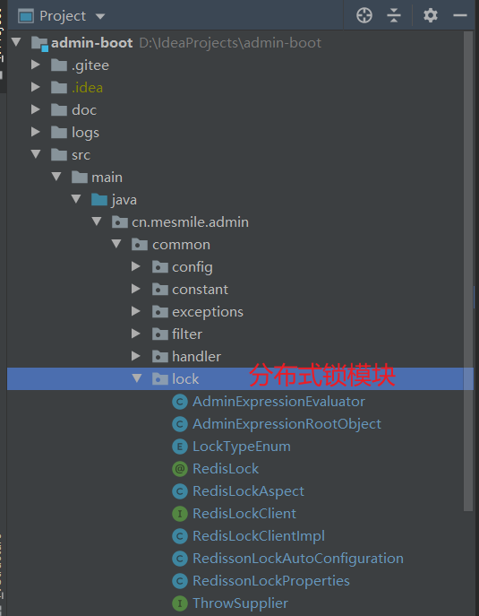
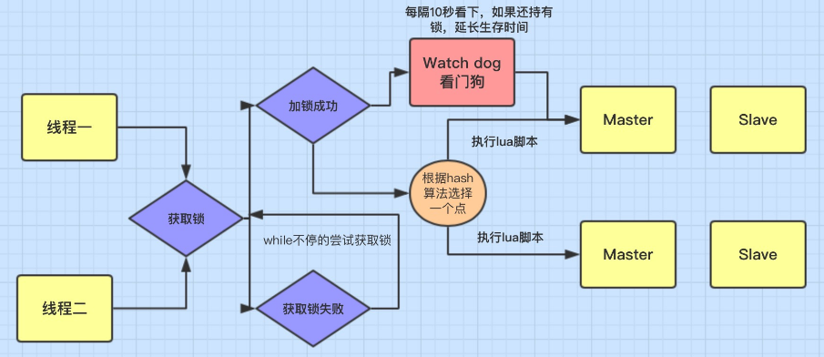
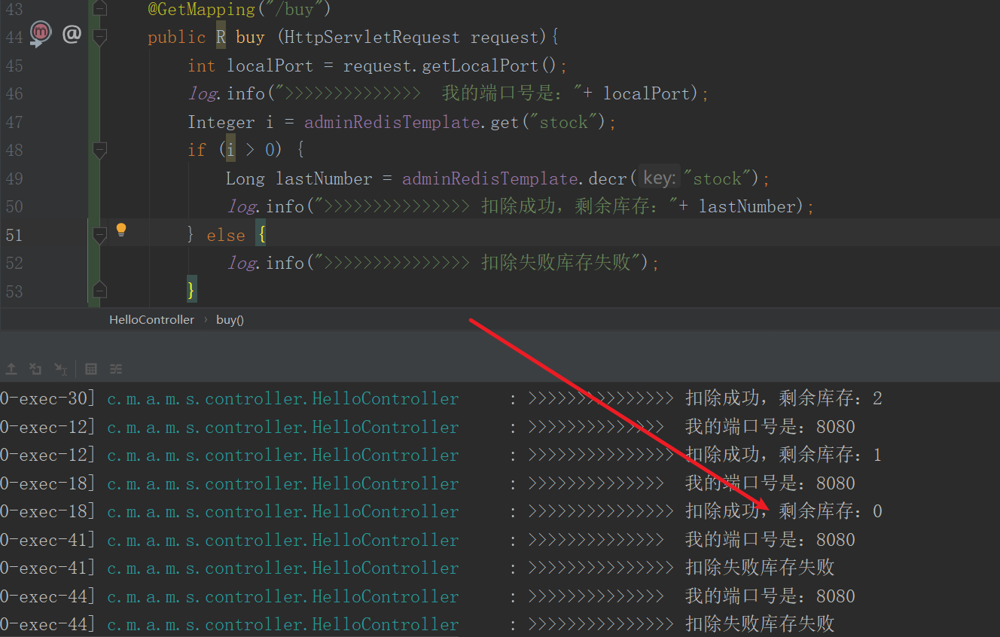

# (十二)redisson实现分布式锁

## 目录

*   [一、引入maven依赖](#一引入maven依赖)

*   [二、redisson分布式锁示例代码](#二redisson分布式锁示例代码)

    *   [redisson配置:](#redisson配置)

    *   [redisson分布式锁配置](#redisson分布式锁配置)

    *   [分布式锁注解](#分布式锁注解)

    *   [分布式锁核心](#分布式锁核心)

    *   [项目结构 分布式锁相关代码](#项目结构-分布式锁相关代码)

    *   [redisson分布式锁原理图](#redisson分布式锁原理图)

    *   [三、测试使用](#三测试使用)

    *   [jemter并发测试，并没有出现超卖情况](#jemter并发测试并没有出现超卖情况)

## 一、引入maven依赖

```xml
<!-- redisson 实现分布式锁 -->
  <dependency>
      <groupId>org.redisson</groupId>
      <artifactId>redisson</artifactId>
      <version>3.17.6</version>
  </dependency>

  <!--aop切面-->
  <dependency>
      <groupId>org.springframework.boot</groupId>
      <artifactId>spring-boot-starter-aop</artifactId>
  </dependency>
```

## 二、redisson分布式锁示例代码

### redisson配置:

```java
package cn.mesmile.admin.common.lock;

import lombok.Data;
import org.springframework.boot.context.properties.ConfigurationProperties;

/**
 * @author zb
 * @Description
 */
@Data
@ConfigurationProperties("redisson.lock")
public class RedissonLockProperties {

    /**
     * 是否开启 redisson 分布式锁，默认 false
     */
    private Boolean enabled;
    /**
     * redis 地址，默认 redis://127.0.0.1:6379
     */
    private String address;
    /**
     * redis 密码
     */
    private String password;
    /**
     * 数据库下标
     */
    private Integer database;
    /**
     * 连接池大小
     */
    private Integer poolSize;
    /**
     * 最小空闲连接数
     */
    private Integer idleSize;
    /**
     * 连接空闲超时时间，单位 毫秒
     * 如果池连接在timeout时间内未使用并且当前连接量大于最小空闲连接池大小，
     * 则它将关闭并从池中删除。
     */
    private Integer idleTimeout;
    /**
     * 连接超时时间，单位 毫秒
     */
    private Integer connectionTimeout;
    /**
     * 执行命令等待超时时间，单位 毫秒
     * Redis 服务器响应超时。 Redis 命令发送成功后开始倒计时
     */
    private Integer timeout;
    /**
     * redisson 连接redis 的模式
     */
    private RedissonLockProperties.Mode mode;

    /**
     * 主从模式配置
     */
    private String masterAddress;
    private String[] slaveAddress;

    /**
     * 哨兵模式配置
     */
    private String masterName;
    /** 一个或多个哨兵地址和端口号 [ip:port] */
    private String[] sentinelAddress;

    /**
     * 集群模式配置
     * 一个或多个集群节点地址和端口号 [ip:port]
     */
    private String[] nodeAddress;

    public RedissonLockProperties() {
        this.enabled = Boolean.FALSE;
        this.address = "redis://127.0.0.1:6379";
        this.database = 0;
        this.poolSize = 20;
        this.idleSize = 5;
        this.idleTimeout = 60000;
        this.connectionTimeout = 3000;
        this.timeout = 10000;
        this.mode = RedissonLockProperties.Mode.single;
    }


    public static enum Mode {
        /**
         * redis不同部署模式
         * single 单机
         * master 主从
         * sentinel 哨兵
         * cluster 集群
         */
        single,
        master,
        sentinel,
        cluster;
    }
}
```

### redisson分布式锁配置

```java
package cn.mesmile.admin.common.lock;

import cn.hutool.core.util.StrUtil;
import org.redisson.Redisson;
import org.redisson.api.RedissonClient;
import org.redisson.config.*;
import org.springframework.boot.autoconfigure.condition.ConditionalOnClass;
import org.springframework.boot.autoconfigure.condition.ConditionalOnMissingBean;
import org.springframework.boot.autoconfigure.condition.ConditionalOnProperty;
import org.springframework.boot.context.properties.EnableConfigurationProperties;
import org.springframework.context.annotation.Bean;
import org.springframework.context.annotation.Configuration;

/**
 * @author zb
 * @Description
 */
@Configuration(
        proxyBeanMethods = false
)
@ConditionalOnClass({RedissonClient.class})
@EnableConfigurationProperties({RedissonLockProperties.class})
@ConditionalOnProperty(
        value = {"redisson.lock.enabled"},
        havingValue = "true"
)
public class RedissonLockAutoConfiguration {

    /**
     * 单机配置
     */
    private static Config singleConfig(RedissonLockProperties properties) {
        Config config = new Config();
        SingleServerConfig serversConfig = config.useSingleServer();
        serversConfig.setAddress(properties.getAddress());
        String password = properties.getPassword();
        if (StrUtil.isNotBlank(password)) {
            serversConfig.setPassword(password);
        }
        serversConfig.setDatabase(properties.getDatabase());
        serversConfig.setConnectionPoolSize(properties.getPoolSize());
        serversConfig.setConnectionMinimumIdleSize(properties.getIdleSize());
        serversConfig.setIdleConnectionTimeout(properties.getIdleTimeout());
        serversConfig.setConnectTimeout(properties.getConnectionTimeout());
        serversConfig.setTimeout(properties.getTimeout());
        return config;
    }

    /**
     * 主从配置
     */
    private static Config masterSlaveConfig(RedissonLockProperties properties) {
        Config config = new Config();
        MasterSlaveServersConfig serversConfig = config.useMasterSlaveServers();
        serversConfig.setMasterAddress(properties.getMasterAddress());
        serversConfig.addSlaveAddress(properties.getSlaveAddress());
        String password = properties.getPassword();
        if (StrUtil.isNotBlank(password)) {
            serversConfig.setPassword(password);
        }
        serversConfig.setDatabase(properties.getDatabase());
        serversConfig.setMasterConnectionPoolSize(properties.getPoolSize());
        serversConfig.setMasterConnectionMinimumIdleSize(properties.getIdleSize());
        serversConfig.setSlaveConnectionPoolSize(properties.getPoolSize());
        serversConfig.setSlaveConnectionMinimumIdleSize(properties.getIdleSize());
        serversConfig.setIdleConnectionTimeout(properties.getIdleTimeout());
        serversConfig.setConnectTimeout(properties.getConnectionTimeout());
        serversConfig.setTimeout(properties.getTimeout());
        return config;
    }

    /**
     * 哨兵配置
     */
    private static Config sentinelConfig(RedissonLockProperties properties) {
        Config config = new Config();
        SentinelServersConfig serversConfig = config.useSentinelServers();
        serversConfig.setMasterName(properties.getMasterName());
        serversConfig.addSentinelAddress(properties.getSentinelAddress());
        String password = properties.getPassword();
        if (StrUtil.isNotBlank(password)) {
            serversConfig.setPassword(password);
        }
        serversConfig.setDatabase(properties.getDatabase());
        serversConfig.setMasterConnectionPoolSize(properties.getPoolSize());
        serversConfig.setMasterConnectionMinimumIdleSize(properties.getIdleSize());
        serversConfig.setSlaveConnectionPoolSize(properties.getPoolSize());
        serversConfig.setSlaveConnectionMinimumIdleSize(properties.getIdleSize());
        serversConfig.setIdleConnectionTimeout(properties.getIdleTimeout());
        serversConfig.setConnectTimeout(properties.getConnectionTimeout());
        serversConfig.setTimeout(properties.getTimeout());
        return config;
    }

    /**
     * 集群配置
     */
    private static Config clusterConfig(RedissonLockProperties properties) {
        Config config = new Config();
        ClusterServersConfig serversConfig = config.useClusterServers();
        serversConfig.addNodeAddress(properties.getNodeAddress());
        String password = properties.getPassword();
        if (StrUtil.isNotBlank(password)) {
            serversConfig.setPassword(password);
        }
        serversConfig.setMasterConnectionPoolSize(properties.getPoolSize());
        serversConfig.setMasterConnectionMinimumIdleSize(properties.getIdleSize());
        serversConfig.setSlaveConnectionPoolSize(properties.getPoolSize());
        serversConfig.setSlaveConnectionMinimumIdleSize(properties.getIdleSize());
        serversConfig.setIdleConnectionTimeout(properties.getConnectionTimeout());
        serversConfig.setConnectTimeout(properties.getConnectionTimeout());
        serversConfig.setTimeout(properties.getTimeout());
        return config;
    }

    @Bean
    @ConditionalOnMissingBean
    public RedisLockClient redisLockClient(RedissonLockProperties properties) {
        return new RedisLockClientImpl(redissonClient(properties));
    }

    @Bean
    @ConditionalOnMissingBean
    public RedisLockAspect redisLockAspect(RedisLockClient redisLockClient) {
        return new RedisLockAspect(redisLockClient);
    }

    private static RedissonClient redissonClient(RedissonLockProperties properties) {
        RedissonLockProperties.Mode mode = properties.getMode();
        Config config;
        switch (mode) {
            case sentinel:
                config = sentinelConfig(properties);
                break;
            case cluster:
                config = clusterConfig(properties);
                break;
            case master:
                config = masterSlaveConfig(properties);
                break;
            case single:
                config = singleConfig(properties);
                break;
            default:
                config = new Config();
        }
        return Redisson.create(config);
    }
}

```

### 分布式锁注解

```java
package cn.mesmile.admin.common.lock;

import java.lang.annotation.Documented;
import java.lang.annotation.ElementType;
import java.lang.annotation.Retention;
import java.lang.annotation.RetentionPolicy;
import java.lang.annotation.Target;
import java.util.concurrent.TimeUnit;

/**
 * @author zb
 * @Description 分布式锁注解
 */
@Retention(RetentionPolicy.RUNTIME)
@Target({ElementType.METHOD})
@Documented
public @interface RedisLock {

    /**
     * 锁的key，唯一
     */
    String value();

    /**
     * 参数，支持 spring el表达式 #读取方法参数和@读取spring bean
     * 例如 @RedisLock(value = "buy",param = "#request.getLocalPort()")
     */
    String param() default "";

    /**
     * 等待锁超时时间，默认 30 秒
     */
    long waitTime() default 30L;

    /**
     *   Redisson 默认的是 30秒
     *  自动解锁时间，自动解锁时间一定得大于方法执行时间，否则会导致锁提前释放，默认100 秒
     */
    long leaseTime() default 100L;

    /**
     * 时间单位，默认为 秒
     */
    TimeUnit timeUnit() default TimeUnit.SECONDS;

    /**
     *  默认：可重入锁
     */
    LockTypeEnum type() default LockTypeEnum.REENTRANT_LOCK;

}
```

### 分布式锁核心

```java
package cn.mesmile.admin.common.lock;

import org.redisson.api.RLock;
import org.redisson.api.RedissonClient;

import java.util.concurrent.TimeUnit;

/**
 * @author zb
 * @Description 分布式锁redisson核心 tryLock   unlock
 */
public class RedisLockClientImpl implements RedisLockClient {

    private final RedissonClient redissonClient;

    public RedisLockClientImpl(final RedissonClient redissonClient) {
        this.redissonClient = redissonClient;
    }

    @Override
    public boolean tryLock(String lockName, LockTypeEnum lockType, long waitTime, long leaseTime, TimeUnit timeUnit) throws InterruptedException {
        RLock lock = this.getLock(lockName, lockType);
        return lock.tryLock(waitTime, leaseTime, timeUnit);
    }

    @Override
    public void unLock(String lockName, LockTypeEnum lockType) {
        RLock lock = this.getLock(lockName, lockType);
        // 判断是否持有锁，若持有锁才进行解锁
        if (lock.isLocked() && lock.isHeldByCurrentThread()) {
            lock.unlock();
        }
    }

    /**
     *  通过锁名称和锁类型，获取锁
     * @param lockName 锁名称
     * @param lockType 锁类型
     * @return 锁
     */
    private RLock getLock(String lockName, LockTypeEnum lockType) {
        RLock lock;
        if (LockTypeEnum.REENTRANT_LOCK == lockType) {
            lock = this.redissonClient.getLock(lockName);
        } else {
            lock = this.redissonClient.getFairLock(lockName);
        }
        return lock;
    }

    @Override
    public <T> T lock(String lockName, LockTypeEnum lockType, long waitTime, long leaseTime, TimeUnit timeUnit, ThrowSupplier<T> supplier) {
        try {
            boolean result = this.tryLock(lockName, lockType, waitTime, leaseTime, timeUnit);
            if (!result) {
                return null;
            }
            // 执行方法
            return supplier.get();
        } catch (Throwable e) {
            throw new RuntimeException(e);
        } finally {
            this.unLock(lockName, lockType);
        }
    }

}


```

### 项目结构 分布式锁相关代码



### redisson分布式锁原理图



### 三、测试使用

```java
package cn.mesmile.admin.modules.system.controller;

import cn.mesmile.admin.common.lock.RedisLock;
import cn.mesmile.admin.common.result.R;
import cn.mesmile.admin.common.utils.AdminRedisTemplate;
import io.swagger.annotations.Api;
import io.swagger.annotations.ApiImplicitParam;
import io.swagger.annotations.ApiImplicitParams;
import io.swagger.annotations.ApiOperation;
import lombok.extern.slf4j.Slf4j;
import org.springframework.web.bind.annotation.GetMapping;
import org.springframework.web.bind.annotation.RequestMapping;
import org.springframework.web.bind.annotation.RequestParam;
import org.springframework.web.bind.annotation.RestController;

import javax.annotation.Resource;
import javax.servlet.http.HttpServletRequest;

/**
 * @author zb
 * @Description
 */
@Api(tags = "用户登录测试接口")
@Slf4j
@RequestMapping("/api/v1/hello")
@RestController
public class HelloController {

    @Resource
    private AdminRedisTemplate adminRedisTemplate;

    // 模拟抢购情况
    @RedisLock(value = "buy")
    @GetMapping("/buy")
    public R buy (HttpServletRequest request){
        int localPort = request.getLocalPort();
        log.info(">>>>>>>>>>>>>>  我的端口号是："+ localPort);
        Integer i = adminRedisTemplate.get("stock");
        if (i > 0) {
            Long lastNumber = adminRedisTemplate.decr("stock");
            log.info(">>>>>>>>>>>>>>> 扣除成功，剩余库存："+ lastNumber);
        } else {
            log.info(">>>>>>>>>>>>>>> 扣除失败库存失败");
        }
        return R.data("success "+ localPort);
    }

}

```

### jemter并发测试，并没有出现超卖情况


