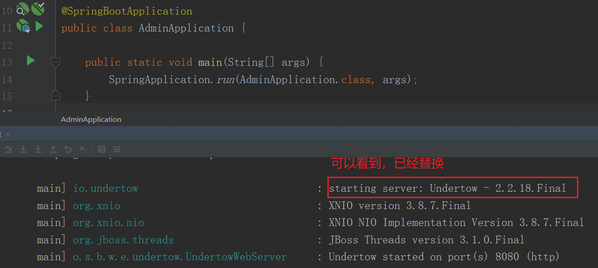

# (十五)使用undertow来替代tomcat容器

## 目录

*   [一、简介](#一简介)

*   [二、引入maven依赖替换Tomcat](#二引入maven依赖替换tomcat)

*   [三、自定义undertow配置](#三自定义undertow配置)

    *   [启动项目，可以看见已经将Tomcat替换为Undertow](#启动项目可以看见已经将tomcat替换为undertow)

## 一、简介

SpringBoot中我们既可以使用Tomcat作为Http服务，也可以用Undertow来代替。Undertow在高并发业务场景中，性能优于Tomcat

## 二、引入maven依赖替换Tomcat

```xml
<dependency>
    <groupId>org.springframework.boot</groupId>
    <artifactId>spring-boot-starter-web</artifactId>
    <exclusions>
        <!-- 排除tomcat依赖-->
        <exclusion>
            <artifactId>spring-boot-starter-tomcat</artifactId>
            <groupId>org.springframework.boot</groupId>
        </exclusion>
    </exclusions>
</dependency>

<!-- web 容器使用 undertow 代替 tomcat-->
<dependency>
    <groupId>org.springframework.boot</groupId>
    <artifactId>spring-boot-starter-undertow</artifactId>
</dependency>
```

## 三、自定义undertow配置

新增application.yml配置

```yaml
server:
  # SpringBoot中我们既可以使用Tomcat作为Http服务，也可以用Undertow来代替。Undertow在高并发业务场景中，性能优于Tomcat
  undertow:
    threads:
      # 设置IO线程数, 它主要执行非阻塞的任务,它们会负责多个连接, 默认设置每个CPU核心一个线程
      io: 16
      # 阻塞任务线程池, 当执行类似servlet请求阻塞操作, undertow会从这个线程池中取得线程,它的值设置取决于系统的负载
      worker: 400
    # 以下的配置会影响buffer,这些buffer会用于服务器连接的IO操作,有点类似netty的池化内存管理
    # 每块buffer的空间大小,越小的空间被利用越充分
    buffer-size: 1024
    # HTTP post内容的最大大小。当值为-1时，默认值为大小是无限的
    max-http-post-size: -1
    # 是否分配的直接内存
    direct-buffers: true
```

### 启动项目，可以看见已经将Tomcat替换为Undertow


