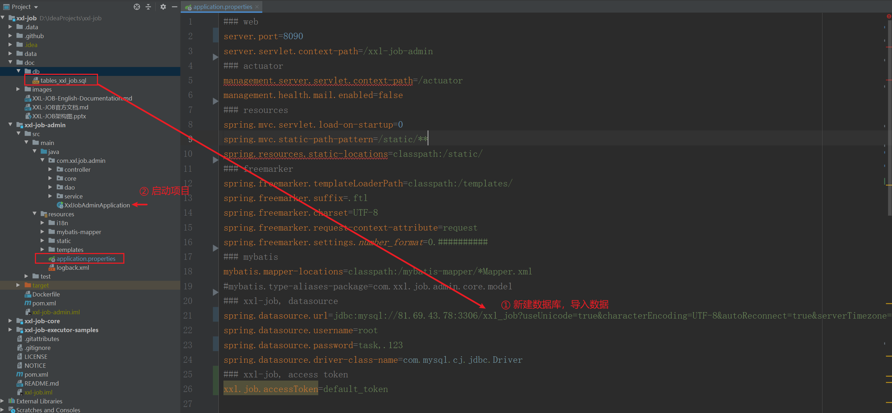
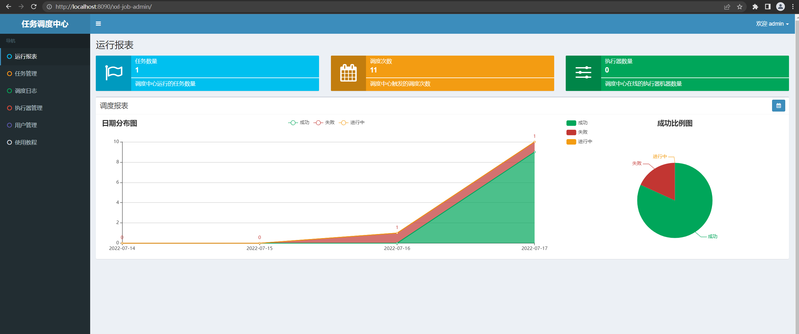
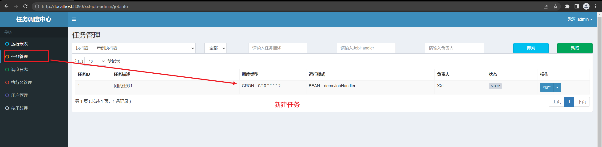
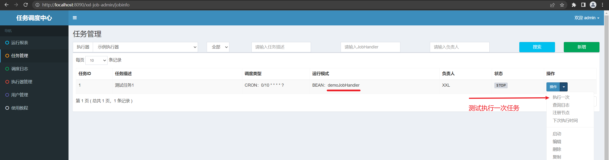
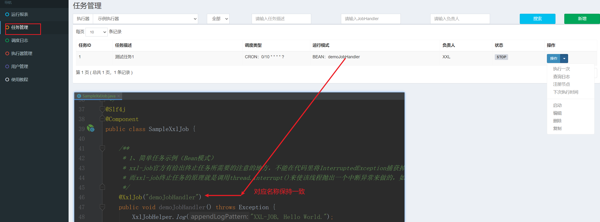
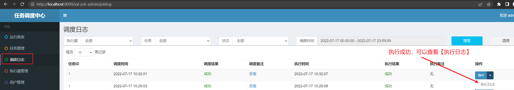
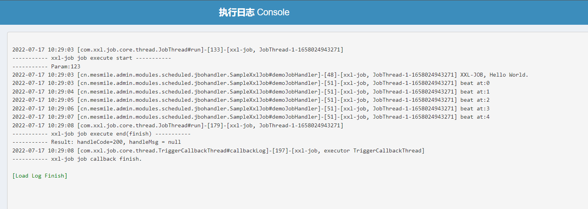

# (十八)整合xxl-job分布式定时任务

## 目录

*   [一、拉取官方服务端代码](#一拉取官方服务端代码)

*   [二、客户端引入依赖](#二客户端引入依赖)

*   [三、客户端代码实现](#三客户端代码实现)

    *   [XxlJobProperties 新建客户端配置](#xxljobproperties-新建客户端配置)

    *   [XxlJobConfiguration 配置](#xxljobconfiguration-配置)

*   [三、测试](#三测试)

    *   [SampleXxlJob 测试定时任务](#samplexxljob-测试定时任务)

    *   [服务端新建定时任务](#服务端新建定时任务)

    *   [启动客户端后，服务端运行任务](#启动客户端后服务端运行任务)

## 一、拉取官方服务端代码

<https://gitee.com/xuxueli0323/xxl-job/>

**官方文档地址：**

<https://www.xuxueli.com/xxl-job/>



输入网址 [http://localhost:8090/xxl-job-admin](http://localhost:8090/xxl-job-admin "http://localhost:8090/xxl-job-admin") 访问后台

注意这里修改了服务端的端口号，默认端口号为8080

默认登录名  admin  默认密码 123456



## 二、客户端引入依赖

这里选用 2.3.1 版本，注意客户端的版本 和 服务端的版本 保持一致

```xml
<!--分布式定时任务-->
  <dependency>
      <groupId>com.xuxueli</groupId>
      <artifactId>xxl-job-core</artifactId>
      <version>2.3.1</version>
  </dependency>
```

## 三、客户端代码实现

### XxlJobProperties 新建客户端配置

```java
package cn.mesmile.admin.modules.scheduled;

import lombok.Data;
import org.springframework.boot.context.properties.ConfigurationProperties;

/**
 * @author zb
 * @Description
 *   官网: https://www.xuxueli.com/xxl-job/
 */
@Data
@ConfigurationProperties(prefix = "xxl.job")
public class XxlJobProperties {

    /**
     * 调度中心部署根地址 [选填]：如调度中心集群部署存在多个地址则用逗号分隔
     */
    private String serviceAddresses;
    /**
     * 执行器通讯TOKEN [选填]：非空时启用
     */
    private String accessToken;

    /**
     * 执行器AppName [选填]：执行器心跳注册分组依据；为空则关闭自动注册
     * 扩展：这里可以配置为 map -> 不同的服务器ip 用不同的 appname
     */
    private String appName;

    /**
     * 执行器IP [选填]：默认为空表示自动获取IP，多网卡时可手动设置指定IP，该IP不会绑定Host仅作为通讯实用
     */
    private String clientAddress;

    /**
     * 执行器IP [选填]：默认为空表示自动获取IP，多网卡时可手动设置指定IP，该IP不会绑定Host仅作为通讯实用
     */
    private String clientIp;

    /**
     * 执行器IP [选填]：默认为空表示自动获取IP，多网卡时可手动设置指定IP，该IP不会绑定Host仅作为通讯实用
     */
    private Integer clientPort;

    /**
     * 执行器运行日志文件存储磁盘路径 [选填] ：需要对该路径拥有读写权限；为空则使用默认路径；
     */
    private String clientLogPath;

    /**
     * 执行器运行日志文件存储磁盘路径 [选填] ：需要对该路径拥有读写权限；为空则使用默认路径；
     */
    private Integer clientLogRetentionDays;

}

/*
 * 针对多网卡、容器内部署等情况，可借助 "spring-cloud-commons" 提供的 "InetUtils" 组件灵活定制注册IP；
 *
 *      1、引入依赖：
 *          <dependency>
 *             <groupId>org.springframework.cloud</groupId>
 *             <artifactId>spring-cloud-commons</artifactId>
 *             <version>${version}</version>
 *         </dependency>
 *
 *      2、配置文件，或者容器启动变量
 *          spring.cloud.inetutils.preferred-networks: 'xxx.xxx.xxx.'
 *
 *      3、获取IP
 *          String ip_ = inetUtils.findFirstNonLoopbackHostInfo().getIpAddress();
 */

/*
### 调度中心部署根地址 [选填]：如调度中心集群部署存在多个地址则用逗号分隔。执行器将会使用该地址进行"执行器心跳注册"和"任务结果回调"；为空则关闭自动注册；
xxl.job.admin.addresses=http://127.0.0.1:8080/xxl-job-admin
### 执行器通讯TOKEN [选填]：非空时启用；
xxl.job.accessToken=
### 执行器AppName [选填]：执行器心跳注册分组依据；为空则关闭自动注册
xxl.job.executor.appname=xxl-job-executor-sample
### 执行器注册 [选填]：优先使用该配置作为注册地址，为空时使用内嵌服务 ”IP:PORT“ 作为注册地址。从而更灵活的支持容器类型执行器动态IP和动态映射端口问题。
xxl.job.executor.address=
### 执行器IP [选填]：默认为空表示自动获取IP，多网卡时可手动设置指定IP，该IP不会绑定Host仅作为通讯实用；地址信息用于 "执行器注册" 和 "调度中心请求并触发任务"；
xxl.job.executor.ip=
### 执行器端口号 [选填]：小于等于0则自动获取；默认端口为9999，单机部署多个执行器时，注意要配置不同执行器端口；
xxl.job.executor.port=9999
### 执行器运行日志文件存储磁盘路径 [选填] ：需要对该路径拥有读写权限；为空则使用默认路径；
xxl.job.executor.logpath=/data/applogs/xxl-job/jobhandler
### 执行器日志文件保存天数 [选填] ： 过期日志自动清理, 限制值大于等于3时生效; 否则, 如-1, 关闭自动清理功能；
xxl.job.executor.logretentiondays=30
 */
```

### XxlJobConfiguration 配置

```java
package cn.mesmile.admin.modules.scheduled;

import com.xxl.job.core.executor.impl.XxlJobSpringExecutor;
import lombok.extern.slf4j.Slf4j;
import org.springframework.boot.context.properties.EnableConfigurationProperties;
import org.springframework.context.annotation.Bean;
import org.springframework.context.annotation.Configuration;

import javax.annotation.Resource;

/**
 * @author zb
 * @Description
 */
@Slf4j
@EnableConfigurationProperties({XxlJobProperties.class})
@Configuration
public class XxlJobConfiguration {

    @Resource
    private XxlJobProperties xxlJobProperties;

    @Bean
    public XxlJobSpringExecutor xxlJobExecutor() {
        log.info(">>>>>>>>>>> xxl-job config init.");
        XxlJobSpringExecutor xxlJobSpringExecutor = new XxlJobSpringExecutor();
        xxlJobSpringExecutor.setAdminAddresses(xxlJobProperties.getServiceAddresses());
        xxlJobSpringExecutor.setAppname(xxlJobProperties.getAppName());
        xxlJobSpringExecutor.setAddress(xxlJobProperties.getClientAddress());
        xxlJobSpringExecutor.setIp(xxlJobProperties.getClientIp());
        xxlJobSpringExecutor.setPort(xxlJobProperties.getClientPort());
        xxlJobSpringExecutor.setAccessToken(xxlJobProperties.getAccessToken());
        xxlJobSpringExecutor.setLogPath(xxlJobProperties.getClientLogPath());
        xxlJobSpringExecutor.setLogRetentionDays(xxlJobProperties.getClientLogRetentionDays());
        return xxlJobSpringExecutor;
    }

    /*
     *                  默认用户名：admin
     *                  默认密码：123456
     *                  服务端版本：2.3.1      http://127.0.0.1:8090/xxl-job-admin/
     *                  文档以及学习： https://www.xuxueli.com/xxl-job
     *
     *                  钉钉外网映射：
     *                  git clone https://github.com/open-dingtalk/pierced.git
     *                  打开项目的目录  cd windows_64
     *                  ding -config=ding.cfg -subdomain=mesmile 9999
     *                  映射结果  http://mesmile.vaiwan.com -> 127.0.0.1:9999
     */

}

```

修改 application-dev.yaml 配置

```yaml
# xxl-job 相关配置
xxl:
  job:
    service-addresses: http://127.0.0.1:8090/xxl-job-admin
    app-name: xxl-job-executor-sample
    access-token: default_token
    client-address:
    client-ip: 127.0.0.1
    client-port: 9999
    client-log-path: logs/xxl-job/jobhandler
    client-log-retention-days: 30
```

## 三、测试

### SampleXxlJob 测试定时任务

```java
package cn.mesmile.admin.modules.scheduled.jbohandler;

import com.xxl.job.core.biz.model.ReturnT;
import com.xxl.job.core.context.XxlJobHelper;
import com.xxl.job.core.handler.annotation.XxlJob;
import lombok.extern.slf4j.Slf4j;
import org.springframework.stereotype.Component;

import java.io.BufferedInputStream;
import java.io.BufferedReader;
import java.io.DataOutputStream;
import java.io.InputStreamReader;
import java.net.HttpURLConnection;
import java.net.URL;
import java.time.LocalDate;
import java.util.ArrayList;
import java.util.Arrays;
import java.util.List;
import java.util.concurrent.*;

/**
 * XxlJob开发示例（Bean模式）
 * <p>
 * 开发步骤：
 * 1、任务开发：在Spring Bean实例中，开发Job方法；
 *
 * 2、注解配置：为Job方法添加注解 "@XxlJob(value="自定义jobhandler名称", init = "JobHandler初始化方法", destroy = "JobHandler销毁方法")"，
 *    注解value值对应的是调度中心新建任务的JobHandler属性的值。
 *
 * 3、执行日志：需要通过 "XxlJobHelper.log" 打印执行日志；
 *
 * 4、任务结果：默认任务结果为 "成功" 状态，不需要主动设置；如有诉求，比如设置任务结果为失败，
 *    可以通过 "XxlJobHelper.handleFail/handleSuccess" 自主设置任务结果；
 *
 * @author xxl-job
 */
@Slf4j
@Component
public class SampleXxlJob {

    /**
     * 1、简单任务示例（Bean模式）
     * xxl-job官方有给出终止任务所需要的注意的地方，不能在代码里将InterruptedException捕获掉，因为那将导致终止任务失败。
     * 而xxl-job终止任务的原理就是调用thread.interrupt()来使该线程抛出一个中断异常来做的，如果内部将这个异消化了将不能成功的终止任务
     */
    @XxlJob("demoJobHandler")
    public void demoJobHandler() throws Exception {
        XxlJobHelper.log("XXL-JOB, Hello World.");
        try {
            for (int i = 0; i < 5; i++) {
                XxlJobHelper.log("beat at:" + i);
                TimeUnit.SECONDS.sleep(1);
            }
        } catch (Exception e) {
            if (e instanceof InterruptedException) {
                XxlJobHelper.log("------任务响应中断请求，停止执行");
                throw e;
            }
            XxlJobHelper.handleFail(">>>>>>> 任务失败了哈");
        }
        if (Thread.interrupted()) {
            XxlJobHelper.log("任务响应中断请求，停止执行");
            throw new InterruptedException();
        }
        // default success
    }

    /**
     * xxl-job官方有给出终止任务所需要的注意的地方，不能在代码里将InterruptedException捕获掉，因为那将导致终止任务失败。
     *
     * 而xxl-job终止任务的原理就是调用thread.interrupt()来使该线程抛出一个中断异常来做的，如果内部将这个异消化了将不能成功的终止任务
     */
    @XxlJob("demoJobHandler3")
    public void demoJobHandler3() throws InterruptedException {
        ExecutorService executor = new ThreadPoolExecutor(1, 10, 1, TimeUnit.SECONDS, new SynchronousQueue<>());
        List<CompletableFuture> result = new ArrayList<>();
        LocalDate date = LocalDate.now().minusDays(15);
        try {
            for (int i = 0; i < 10; i++) {
                LocalDate date1 = date.plusDays(i);
                result.add(CompletableFuture.runAsync(new Runnable() {
                    @Override
                    public void run() {
                        for (int j = 0; j < 5; j++) {
                            try {
                                // todo 业务

                            } catch (Exception e) {
                                if (e instanceof InterruptedException) {
                                    XxlJobHelper.log(",完成机构id为{}的任务,日期：{} ，线程被打断，后面的日期将不再执行", j, date1);
                                    return;
                                }
                            }
                            if (Thread.interrupted()) {
                                XxlJobHelper.log(",完成机构id为{}的任务,日期：{} ，线程被打断，后面的日期将不再执行", j, date1);
                                return;
                            }
                        }
                    }
                }, executor));
            }
            CompletableFuture[] arr = new CompletableFuture[result.size()];
            result.toArray(arr);
            CompletableFuture.allOf(arr).get();
            XxlJobHelper.log("完成");
            if (Thread.interrupted()) {
                XxlJobHelper.log("主线程被打断，开始中断所有线程");
                executor.shutdownNow();
                while (!executor.awaitTermination(10, TimeUnit.SECONDS)) {

                }
            }
        } catch (Exception e) {
            if (e instanceof InterruptedException) {
                XxlJobHelper.log("主线程被打断，开始中断所有线程");
                executor.shutdownNow();
                while (!executor.awaitTermination(10, TimeUnit.SECONDS)) {

                }
            }
        }
        XxlJobHelper.log("任务全部终止");
    }


    /**
     * 2、分片广播任务
     */
    @XxlJob("shardingJobHandler")
    public void shardingJobHandler() throws Exception {
        // 分片参数
        int shardIndex = XxlJobHelper.getShardIndex();
        int shardTotal = XxlJobHelper.getShardTotal();

        XxlJobHelper.log("分片参数：当前分片序号 = {}, 总分片数 = {}", shardIndex, shardTotal);

        // 业务逻辑
        for (int i = 0; i < shardTotal; i++) {
            if (i == shardIndex) {
                XxlJobHelper.log("第 {} 片, 命中分片开始处理", i);
            } else {
                XxlJobHelper.log("第 {} 片, 忽略", i);
            }
        }

    }


    /**
     * 3、命令行任务
     */
    @XxlJob("commandJobHandler")
    public void commandJobHandler() throws Exception {
        String command = XxlJobHelper.getJobParam();
        int exitValue = -1;
        BufferedReader bufferedReader = null;
        try {
            // command process
            ProcessBuilder processBuilder = new ProcessBuilder();
            processBuilder.command(command);
            processBuilder.redirectErrorStream(true);

            Process process = processBuilder.start();
            //Process process = Runtime.getRuntime().exec(command);

            BufferedInputStream bufferedInputStream = new BufferedInputStream(process.getInputStream());
            bufferedReader = new BufferedReader(new InputStreamReader(bufferedInputStream));

            // command log
            String line;
            while ((line = bufferedReader.readLine()) != null) {
                XxlJobHelper.log(line);
            }

            // command exit
            process.waitFor();
            exitValue = process.exitValue();
        } catch (Exception e) {
            XxlJobHelper.log(e);
        } finally {
            if (bufferedReader != null) {
                bufferedReader.close();
            }
        }

        if (exitValue == 0) {
            // default success
        } else {
            XxlJobHelper.handleFail("command exit value(" + exitValue + ") is failed");
        }

    }


    /**
     * 4、跨平台Http任务
     * 参数示例：
     * "url: http://www.baidu.com\n" +
     * "method: get\n" +
     * "data: content\n";
     */
    @XxlJob("httpJobHandler")
    public void httpJobHandler() throws Exception {

        // param parse
        String param = XxlJobHelper.getJobParam();
        if (param == null || param.trim().length() == 0) {
            XxlJobHelper.log("param[" + param + "] invalid.");

            XxlJobHelper.handleFail();
            return;
        }

        String[] httpParams = param.split("\n");
        String url = null;
        String method = null;
        String data = null;
        for (String httpParam : httpParams) {
            if (httpParam.startsWith("url:")) {
                url = httpParam.substring(httpParam.indexOf("url:") + 4).trim();
            }
            if (httpParam.startsWith("method:")) {
                method = httpParam.substring(httpParam.indexOf("method:") + 7).trim().toUpperCase();
            }
            if (httpParam.startsWith("data:")) {
                data = httpParam.substring(httpParam.indexOf("data:") + 5).trim();
            }
        }

        // param valid
        if (url == null || url.trim().length() == 0) {
            XxlJobHelper.log("url[" + url + "] invalid.");

            XxlJobHelper.handleFail();
            return;
        }
        if (method == null || !Arrays.asList("GET", "POST").contains(method)) {
            XxlJobHelper.log("method[" + method + "] invalid.");

            XxlJobHelper.handleFail();
            return;
        }
        boolean isPostMethod = method.equals("POST");

        // request
        HttpURLConnection connection = null;
        BufferedReader bufferedReader = null;
        try {
            // connection
            URL realUrl = new URL(url);
            connection = (HttpURLConnection) realUrl.openConnection();

            // connection setting
            connection.setRequestMethod(method);
            connection.setDoOutput(isPostMethod);
            connection.setDoInput(true);
            connection.setUseCaches(false);
            connection.setReadTimeout(5 * 1000);
            connection.setConnectTimeout(3 * 1000);
            connection.setRequestProperty("connection", "Keep-Alive");
            connection.setRequestProperty("Content-Type", "application/json;charset=UTF-8");
            connection.setRequestProperty("Accept-Charset", "application/json;charset=UTF-8");

            // do connection
            connection.connect();

            // data
            if (isPostMethod && data != null && data.trim().length() > 0) {
                DataOutputStream dataOutputStream = new DataOutputStream(connection.getOutputStream());
                dataOutputStream.write(data.getBytes("UTF-8"));
                dataOutputStream.flush();
                dataOutputStream.close();
            }

            // valid StatusCode
            int statusCode = connection.getResponseCode();
            if (statusCode != 200) {
                throw new RuntimeException("Http Request StatusCode(" + statusCode + ") Invalid.");
            }

            // result
            bufferedReader = new BufferedReader(new InputStreamReader(connection.getInputStream(), "UTF-8"));
            StringBuilder result = new StringBuilder();
            String line;
            while ((line = bufferedReader.readLine()) != null) {
                result.append(line);
            }
            String responseMsg = result.toString();

            XxlJobHelper.log(responseMsg);

            return;
        } catch (Exception e) {
            XxlJobHelper.log(e);

            XxlJobHelper.handleFail();
            return;
        } finally {
            try {
                if (bufferedReader != null) {
                    bufferedReader.close();
                }
                if (connection != null) {
                    connection.disconnect();
                }
            } catch (Exception e2) {
                XxlJobHelper.log(e2);
            }
        }

    }

    /**
     * 5、生命周期任务示例：任务初始化与销毁时，支持自定义相关逻辑；
     */
    @XxlJob(value = "demoJobHandler2", init = "init", destroy = "destroy")
    public void demoJobHandler2() throws Exception {
        XxlJobHelper.log("XXL-JOB, Hello World.");
    }

    public void init() {
        log.info("-----init-------");
    }

    public void destroy() {
        log.info("-------destroy--------");
    }


}

```

### 服务端新建定时任务



### 启动客户端后，服务端运行任务







**执行日志**


