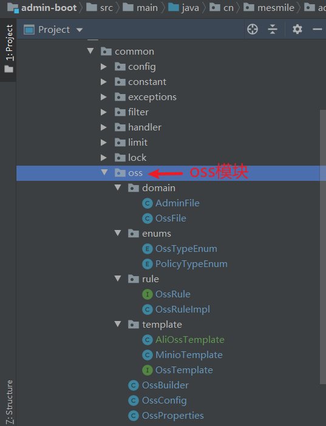
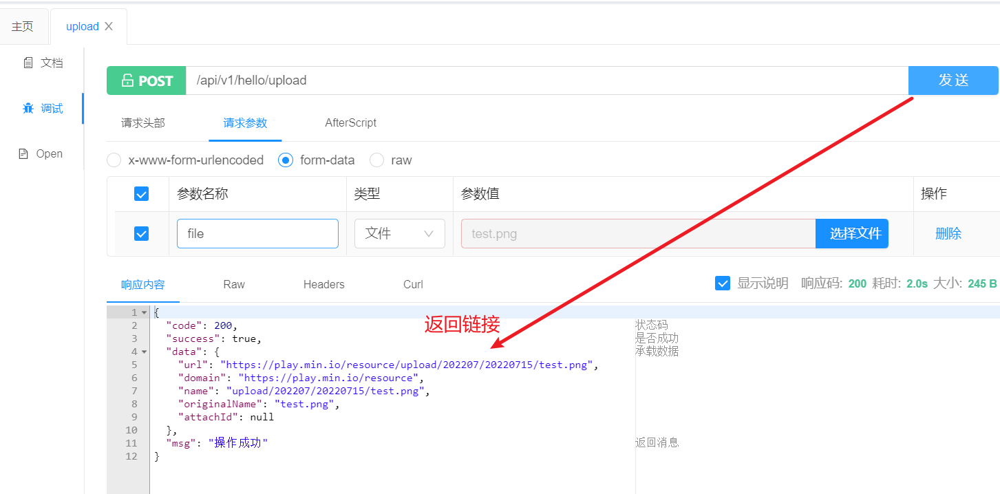
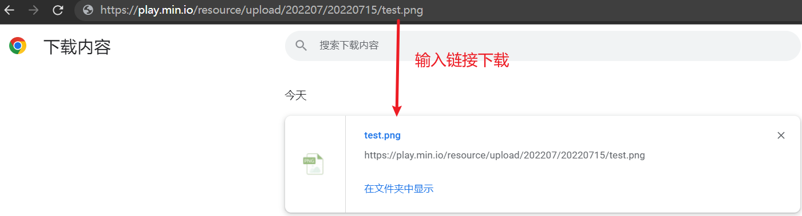

# (十六)文件存储上传与下载

## 目录

*   [一、简介](#一简介)

*   [二、编码设计](#二编码设计)

    *   [OssProperties 配置](#ossproperties-配置)
    *   [OssTemplate 所有存储系统的顶级类](#osstemplate-所有存储系统的顶级类)
    *   [MinioTemplate 具体存储系统的实现](#miniotemplate-具体存储系统的实现)
    *   [Oss全局配置](#oss全局配置)
    *   [OssException 自定义异常](#ossexception-自定义异常)
    *   [GlobalExceptionHandler 全局拦截处理Oss异常](#globalexceptionhandler-全局拦截处理oss异常)
    *   [Oss模块结构](#oss模块结构)

*   [三、测试与使用](#三测试与使用)

*   [四、文件下载](#四文件下载)

## 一、简介

此处采用分布式存储系统，这里以minio为例

官方文档地址

<https://docs.min.io/docs/java-client-quickstart-guide.html>

## 二、编码设计

### OssProperties 配置

```java
package cn.mesmile.admin.common.oss;

import cn.mesmile.admin.common.oss.enums.OssTypeEnum;
import lombok.Data;
import org.springframework.boot.context.properties.ConfigurationProperties;

/**
 * @author zb
 * @Description oss 配置
 */
@Data
@ConfigurationProperties(prefix = "oss")
public class OssProperties {

    /**
     * 是否启用 Oss 文件存储
     */
    private Boolean enabled = Boolean.FALSE;

    /**
     * 文件存储系统类型
     */
    private OssTypeEnum type;

    /**
     * oss对外开放的地址
     */
    private String endpoint;

    /**
     * accessKey
     */
    private String accessKey;

    /**
     * secretKey
     */
    private String secretKey;

    /**
     * 桶名称
     */
    private String bucketName = "resource";
}

```

### OssTemplate 所有存储系统的顶级类

```java
package cn.mesmile.admin.common.oss.template;

import cn.mesmile.admin.common.oss.domain.AdminFile;
import cn.mesmile.admin.common.oss.domain.OssFile;
import org.springframework.web.multipart.MultipartFile;

import java.io.InputStream;
import java.util.List;

/**
 * Oss操作模板
 * @author zb
 * @Description  Oss统一操作方法
 */
public interface OssTemplate {

    /**
     * 创建桶
     * @param bucketName 桶名称
     */
    void makeBucket(String bucketName);

    /**
     * 根据桶名称 删除桶
     * @param bucketName 桶名称
     */
    void removeBucket(String bucketName);

    /**
     * 根据桶名称，判断桶是否存在
     * @param bucketName 桶名称
     * @return 是否存在
     */
    boolean bucketExists(String bucketName);

    /**
     * 把一个桶里面的文件，拷贝到另外一个桶
     * @param bucketName 源桶名称
     * @param fileName 文件名
     * @param destBucketName 目标桶名称
     */
    void copyFile(String bucketName, String fileName, String destBucketName);

    /**
     * 把一个桶里面的文件，拷贝到另外一个桶
     * @param bucketName 源桶名称
     * @param fileName 文件名
     * @param destBucketName 目标桶名称
     * @param destFileName 目标文件名
     */
    void copyFile(String bucketName, String fileName, String destBucketName, String destFileName);

    /**
     * 统计文件
     * @param fileName 文件名
     * @return 文件相关信息
     */
    OssFile statFile(String fileName);

    /**
     * 统计文件
     * @param bucketName 桶名称
     * @param fileName 文件名
     * @return 文件相关信息
     */
    OssFile statFile(String bucketName, String fileName);

    /**
     * 获取文件路径
     * @param fileName 文件名
     * @return 文件路径
     */
    String filePath(String fileName);

    /**
     * 获取文件路径
     * @param bucketName 桶名称
     * @param fileName 文件名
     * @return 文件路径
     */
    String filePath(String bucketName, String fileName);

    /**
     * 获取文件下载链接
     * @param fileName 文件名
     * @return 文件下载链接
     */
    String fileLink(String fileName);

    /**
     * 获取文件下载链接
     * @param bucketName 桶名称
     * @param originalFilename 文件名
     * @return 文件下载链接
     */
    String fileLink(String bucketName, String originalFilename);

    /**
     * 上传文件
     * @param file 文件
     * @return 上传结果
     */
    AdminFile putFile(MultipartFile file);

    /**
     * 上传文件
     * @param originalFilename 文件名称
     * @param file 文件
     * @return 上传结果
     */
    AdminFile putFile(String originalFilename, MultipartFile file);

    /**
     * 上传文件
     * @param bucketName 桶名称
     * @param originalFilename 文件名称
     * @param file 文件
     * @return 上传结果
     */
    AdminFile putFile(String bucketName, String originalFilename, MultipartFile file);

    /**
     * 上传文件
     * @param originalFilename 文件名称
     * @param stream 输入流
     * @return 上传结果
     */
    AdminFile putFile(String originalFilename, InputStream stream);

    /**
     * 上传文件
     * @param bucketName 桶名称
     * @param originalFilename 文件名称
     * @param stream 输入流
     * @return 上传结果
     */
    AdminFile putFile(String bucketName, String originalFilename, InputStream stream);

    /**
     * 删除文件
     * @param originalFilename 文件名称
     */
    void removeFile(String originalFilename);

    /**
     * 删除文件
     * @param bucketName 桶名称
     * @param fileName 文件名称
     */
    void removeFile(String bucketName, String fileName);

    /**
     * 删除一个或多个文件
     * @param fileNames 一个或多个文件名称
     */
    void removeFiles(List<String> fileNames);

    /**
     * 删除文件
     * @param bucketName 桶名称
     * @param fileNames 一个或多个文件名称
     */
    void removeFiles(String bucketName, List<String> fileNames);
}
```

### MinioTemplate 具体存储系统的实现

```java
package cn.mesmile.admin.common.oss.template;

import cn.hutool.core.util.StrUtil;
import cn.mesmile.admin.common.exceptions.OssException;
import cn.mesmile.admin.common.oss.OssProperties;
import cn.mesmile.admin.common.oss.domain.AdminFile;
import cn.mesmile.admin.common.oss.domain.OssFile;
import cn.mesmile.admin.common.oss.enums.PolicyTypeEnum;
import cn.mesmile.admin.common.oss.rule.OssRule;
import cn.mesmile.admin.common.result.ResultCode;
import io.minio.*;
import io.minio.http.Method;
import io.minio.messages.Bucket;
import io.minio.messages.DeleteObject;
import org.springframework.http.MediaType;
import org.springframework.web.multipart.MultipartFile;

import java.awt.*;
import java.io.InputStream;
import java.time.LocalDateTime;
import java.util.List;
import java.util.Optional;
import java.util.stream.Stream;

/**
 * @author zb
 * @Description mini操作模板
 */
public class MinioTemplate implements OssTemplate {

    private final OssRule ossRule;

    private final MinioClient minioClient;

    private final OssProperties ossProperties;

    public MinioTemplate(OssRule ossRule, MinioClient minioClient,OssProperties ossProperties) {
        this.ossRule = ossRule;
        this.minioClient = minioClient;
        this.ossProperties = ossProperties;
    }

    @Override
    public void makeBucket(String bucketName) {
        try {
            BucketExistsArgs build = BucketExistsArgs.builder()
                    .bucket(bucketName).build();
            if (!minioClient.bucketExists(build)) {
                MakeBucketArgs makeBucketArgs = MakeBucketArgs.builder().bucket(bucketName).build();
                minioClient.makeBucket(makeBucketArgs);
                String policyTypeEnum = getPolicyTypeEnum(bucketName, PolicyTypeEnum.READ);
                minioClient.setBucketPolicy(SetBucketPolicyArgs.builder().bucket(bucketName).config(policyTypeEnum).build());
            }
        } catch (Exception e) {
            throw new OssException(ResultCode.FAILURE, "minio异常", e);
        }
    }

    public Bucket getBucket() {
        return getBucket(ossProperties.getBucketName());
    }

    public Bucket getBucket(String bucketName) {
        try {
            Optional<Bucket> bucketOptional = minioClient.listBuckets().stream().filter((bucket) -> {
                return bucket.name().equals(bucketName);
            }).findFirst();
            return bucketOptional.orElse(null);
        } catch (Exception e) {
            throw new OssException(ResultCode.FAILURE, "minio异常", e);
        }
    }

    public List<Bucket> listBuckets() {
        try {
            return minioClient.listBuckets();
        } catch (Exception e) {
            throw new OssException(ResultCode.FAILURE, "minio异常", e);
        }
    }

    @Override
    public void removeBucket(String bucketName) {
        try {
            minioClient.removeBucket(RemoveBucketArgs.builder().bucket(bucketName).build());
        } catch (Exception e) {
            throw new OssException(ResultCode.FAILURE, "minio异常", e);
        }
    }

    @Override
    public boolean bucketExists(String bucketName) {
        try {
            BucketExistsArgs build = BucketExistsArgs.builder().bucket(bucketName).build();
            return minioClient.bucketExists(build);
        } catch (Exception e) {
            throw new OssException(ResultCode.FAILURE, "minio异常", e);
        }
    }

    @Override
    public void copyFile(String bucketName, String fileName, String destBucketName) {
        try {
            this.copyFile(bucketName, fileName, destBucketName, fileName);
        } catch (Exception e) {
            throw new OssException(ResultCode.FAILURE, "minio异常", e);
        }
    }

    @Override
    public void copyFile(String bucketName, String fileName, String destBucketName, String destFileName) {
        try {
            CopySource copySource = CopySource.builder()
                    .bucket(bucketName).object(fileName).build();
            CopyObjectArgs copyObjectArgs = CopyObjectArgs.builder()
                    .source(copySource)
                    .bucket(destBucketName)
                    .object(destFileName).build();
            minioClient.copyObject(copyObjectArgs);
        } catch (Exception e) {
            throw new OssException(ResultCode.FAILURE, "minio异常", e);
        }
    }

    @Override
    public OssFile statFile(String fileName) {
        try {
            return statFile(ossProperties.getBucketName(), fileName);
        } catch (Exception e) {
            throw new OssException(ResultCode.FAILURE, "minio异常", e);
        }
    }

    @Override
    public OssFile statFile(String bucketName, String fileName) {
        try {
            StatObjectResponse stat = minioClient.statObject(((StatObjectArgs.builder().bucket(bucketName)).object(fileName)).build());
            OssFile ossFile = new OssFile();
            ossFile.setName(StrUtil.isEmpty(stat.object()) ? fileName : stat.object());
            ossFile.setUrl(fileLink(ossFile.getName()));
            ossFile.setHash(String.valueOf(stat.hashCode()));
            ossFile.setLength(stat.size());
            LocalDateTime localDateTime = stat.lastModified().toLocalDateTime();
            ossFile.setPutTime(localDateTime);
            ossFile.setContentType(stat.contentType());
            return ossFile;
        } catch (Exception e) {
            throw new OssException(ResultCode.FAILURE, "minio异常", e);
        }
    }

    @Override
    public String filePath(String fileName) {
        return ossProperties.getBucketName().concat("/").concat(fileName);
    }

    @Override
    public String filePath(String bucketName, String fileName) {
        return bucketName.concat("/").concat(fileName);
    }

    @Override
    public String fileLink(String fileName) {
            return ossProperties.getEndpoint().concat("/")
                    .concat(ossProperties.getBucketName()).concat("/")
                    .concat(fileName);
    }

    @Override
    public String fileLink(String bucketName, String originalFilename) {
            return ossProperties.getEndpoint().concat("/")
                    .concat(ossProperties.getBucketName()).concat("/")
                    .concat(originalFilename);
    }

    @Override
    public AdminFile putFile(MultipartFile file) {
        return putFile(ossProperties.getBucketName(), file.getOriginalFilename(), file);
    }

    @Override
    public AdminFile putFile(String fileName, MultipartFile file) {
        return putFile(ossProperties.getBucketName(), fileName, file);
    }

    @Override
    public AdminFile putFile(String bucketName, String originalFilename, MultipartFile file) {
        try {
            return putFile(bucketName, file.getOriginalFilename(), file.getInputStream());
        } catch (Exception e) {
            throw new OssException(ResultCode.FAILURE, "minio异常", e);
        }
    }

    @Override
    public AdminFile putFile(String originalFilename, InputStream stream) {
        return putFile(ossProperties.getBucketName(), originalFilename, stream);
    }

    @Override
    public AdminFile putFile(String bucketName, String originalFilename, InputStream stream) {
        return putFile(bucketName, originalFilename, stream, MediaType.APPLICATION_OCTET_STREAM_VALUE);
    }

    public AdminFile putFile(String bucketName, String originalFilename, InputStream stream, String contentType) {
        try {
            makeBucket(bucketName);
            String fileName = getFileName(originalFilename);
            PutObjectArgs putObjectArgs = PutObjectArgs.builder()
                    .bucket(bucketName).object(fileName)
                    .stream(stream, stream.available(), -1L)
                    .contentType(contentType)
                    .build();
            minioClient.putObject(putObjectArgs);
            return new AdminFile(fileLink(bucketName, fileName), getOssHost(bucketName)
                    , fileName, originalFilename);
        } catch (Exception e) {
            throw new OssException(ResultCode.FAILURE, "minio异常", e);
        }
    }

    @Override
    public void removeFile(String fileName) {
        removeFile(ossProperties.getBucketName(), fileName);
    }

    @Override
    public void removeFile(String bucketName, String fileName) {
        try {
            RemoveObjectArgs removeObjectArgs = RemoveObjectArgs.builder()
                    .bucket(bucketName).object(fileName).build();
            minioClient.removeObject(removeObjectArgs);
        } catch (Exception e) {
            throw new OssException(ResultCode.FAILURE, "minio异常", e);
        }
    }

    @Override
    public void removeFiles(List<String> fileNames) {
        removeFiles(ossProperties.getBucketName(), fileNames);
    }

    @Override
    public void removeFiles(String bucketName, List<String> fileNames) {
        try {
            Stream<DeleteObject> stream = fileNames.stream().map(DeleteObject::new);
            RemoveObjectsArgs removeObjectsArgs = RemoveObjectsArgs.builder()
                    .bucket(bucketName)
                    .objects(stream::iterator).build();
            minioClient.removeObjects(removeObjectsArgs);
        } catch (Exception e) {
            throw new OssException(ResultCode.FAILURE, "minio异常", e);
        }
    }

    private String getFileName(String originalFilename) {
        return ossRule.setName(originalFilename);
    }

    public String getPresignedObjectUrl(String bucketName, String fileName, Integer expires) {
        try {
            GetPresignedObjectUrlArgs getPresignedObjectUrlArgs = GetPresignedObjectUrlArgs.builder()
                    .method(Method.GET)
                    .bucket(bucketName)
                    .object(fileName)
                    .expiry(expires).build();
            return minioClient.getPresignedObjectUrl(getPresignedObjectUrlArgs);
        } catch (Exception e) {
            throw new OssException(ResultCode.FAILURE, "minio异常", e);
        }
    }

    public String getPolicyTypeEnum(PolicyTypeEnum policyType) {
        return getPolicyTypeEnum(ossProperties.getBucketName(), policyType);
    }

    public static String getPolicyTypeEnum(String bucketName, PolicyTypeEnum policyType) {
        StringBuilder builder = new StringBuilder();
        builder.append("{\n");
        builder.append("    \"Statement\": [\n");
        builder.append("        {\n");
        builder.append("            \"Action\": [\n");
        switch(policyType) {
            case WRITE:
                builder.append("                \"s3:GetBucketLocation\",\n");
                builder.append("                \"s3:ListBucketMultipartUploads\"\n");
                break;
            case READ_WRITE:
                builder.append("                \"s3:GetBucketLocation\",\n");
                builder.append("                \"s3:ListBucket\",\n");
                builder.append("                \"s3:ListBucketMultipartUploads\"\n");
                break;
            default:
                builder.append("                \"s3:GetBucketLocation\"\n");
        }

        builder.append("            ],\n");
        builder.append("            \"Effect\": \"Allow\",\n");
        builder.append("            \"Principal\": \"*\",\n");
        builder.append("            \"Resource\": \"arn:aws:s3:::");
        builder.append(bucketName);
        builder.append("\"\n");
        builder.append("        },\n");
        if (PolicyTypeEnum.READ.equals(policyType)) {
            builder.append("        {\n");
            builder.append("            \"Action\": [\n");
            builder.append("                \"s3:ListBucket\"\n");
            builder.append("            ],\n");
            builder.append("            \"Effect\": \"Deny\",\n");
            builder.append("            \"Principal\": \"*\",\n");
            builder.append("            \"Resource\": \"arn:aws:s3:::");
            builder.append(bucketName);
            builder.append("\"\n");
            builder.append("        },\n");
        }

        builder.append("        {\n");
        builder.append("            \"Action\": ");
        switch(policyType) {
            case WRITE:
                builder.append("[\n");
                builder.append("                \"s3:AbortMultipartUpload\",\n");
                builder.append("                \"s3:DeleteObject\",\n");
                builder.append("                \"s3:ListMultipartUploadParts\",\n");
                builder.append("                \"s3:PutObject\"\n");
                builder.append("            ],\n");
                break;
            case READ_WRITE:
                builder.append("[\n");
                builder.append("                \"s3:AbortMultipartUpload\",\n");
                builder.append("                \"s3:DeleteObject\",\n");
                builder.append("                \"s3:GetObject\",\n");
                builder.append("                \"s3:ListMultipartUploadParts\",\n");
                builder.append("                \"s3:PutObject\"\n");
                builder.append("            ],\n");
                break;
            default:
                builder.append("\"s3:GetObject\",\n");
        }

        builder.append("            \"Effect\": \"Allow\",\n");
        builder.append("            \"Principal\": \"*\",\n");
        builder.append("            \"Resource\": \"arn:aws:s3:::");
        builder.append(bucketName);
        builder.append("/*\"\n");
        builder.append("        }\n");
        builder.append("    ],\n");
        builder.append("    \"Version\": \"2012-10-17\"\n");
        builder.append("}\n");
        return builder.toString();
    }

    public String getOssHost(String bucketName) {
        return ossProperties.getEndpoint() + "/" + bucketName;
    }

    public String getOssHost() {
        return getOssHost(ossProperties.getBucketName());
    }

}

```

### Oss全局配置

```java
package cn.mesmile.admin.common.oss;

import cn.mesmile.admin.common.exceptions.OssException;
import cn.mesmile.admin.common.exceptions.ServiceException;
import cn.mesmile.admin.common.oss.enums.OssTypeEnum;
import cn.mesmile.admin.common.oss.template.MinioTemplate;
import cn.mesmile.admin.common.oss.template.OssTemplate;
import cn.mesmile.admin.common.result.ResultCode;
import cn.mesmile.admin.common.utils.SpringUtil;

/**
 * @author zb
 * @Description Oss客户端操作对象统一调度
 */
public class OssBuilder {

    private OssBuilder(){}

    /**
     *  获取 Oss 统一调度对象
     * @return Oss客户端操作对象
     */
    public static OssTemplate build () {
        OssProperties ossProperties = SpringUtil.getBean(OssProperties.class);
        Boolean enabled = ossProperties.getEnabled();
        if (enabled == null || !enabled){
            throw new OssException(ResultCode.FAILURE, "Oss存储系统未开启");
        }
        OssTypeEnum type = ossProperties.getType();
        if (OssTypeEnum.MINIO_OSS.equals(type)){
            return SpringUtil.getBean(MinioTemplate.class);
        }else if (OssTypeEnum.ALI_OSS.equals(type)){
            // todo 扩展其他oss

        }else if (OssTypeEnum.QIANNIU_OSS.equals(type)) {

        }else if (OssTypeEnum.TENCENT_OSS.equals(type)){

        }
        throw new OssException(ResultCode.FAILURE, "构建oss客户端异常");
    }


}

```

### OssException 自定义异常

```java
package cn.mesmile.admin.common.exceptions;


import cn.mesmile.admin.common.result.IResultCode;
import cn.mesmile.admin.common.result.ResultCode;

/**
 * @author zb
 * @Description oss存储服务异常
 */
public class OssException extends RuntimeException {

    private final long serialVersionUID = 1L;

    private int code = ResultCode.FAILURE.getCode();

    private String msg = ResultCode.FAILURE.getMessage();

    public OssException() {
        super();
    }

    public OssException(String msg) {
        super(msg);
        this.msg = msg;
    }

    public OssException(IResultCode resultCode, String msg) {
        super(msg);
        this.code = resultCode.getCode();
        this.msg = msg;
    }

    public OssException(String msg, Throwable cause) {
        super(msg, cause);
        this.msg = msg;
    }

    public OssException(IResultCode resultCode, String msg, Throwable cause) {
        super(msg, cause);
        this.code = resultCode.getCode();
        this.msg = msg;
    }

    public OssException(Throwable cause) {
        super(cause);
    }

    public int getCode() {
        return code;
    }

    public void setCode(int code) {
        this.code = code;
    }

    public String getMsg() {
        return msg;
    }

    public void setMsg(String msg) {
        this.msg = msg;
    }
}

```

### GlobalExceptionHandler 全局拦截处理Oss异常

```java
package cn.mesmile.admin.common.handler;

import cn.mesmile.admin.common.constant.AdminConstant;
import cn.mesmile.admin.common.exceptions.*;
import cn.mesmile.admin.common.result.R;
import lombok.extern.slf4j.Slf4j;
import org.springframework.http.HttpStatus;
import org.springframework.validation.BindException;
import org.springframework.validation.BindingResult;
import org.springframework.validation.FieldError;
import org.springframework.web.bind.MethodArgumentNotValidException;
import org.springframework.web.bind.annotation.ExceptionHandler;
import org.springframework.web.bind.annotation.ResponseStatus;
import org.springframework.web.bind.annotation.RestControllerAdvice;

import javax.validation.ConstraintViolation;
import javax.validation.ConstraintViolationException;
import javax.validation.ValidationException;
import java.util.stream.Collectors;

/**
 * @author zb
 * @Description 全局异常拦截
 * <p>
 * 如果我同时捕获了父类和子类，那么到底能够被那个异常处理器捕获呢？比如 Exception 和 BusinessException
 * 当然是 BusinessException 的异常处理器捕获了，精确匹配，如果没有 BusinessException 的异常处理器才会轮到它的 父亲 ，
 * 父亲 没有才会到 祖父 。总之一句话， 精准匹配，找那个关系最近的
 * </p>
 */
@Slf4j
@RestControllerAdvice
public class GlobalExceptionHandler {

    @ExceptionHandler(OssException.class)
    @ResponseStatus(HttpStatus.BAD_REQUEST)
    public R handle(OssException ossException) {
        // 这里记录所有堆栈信息
        log.error("oss异常信息, 消息:{} 编码:{}", ossException.getMessage(), ossException.getCode(), ossException);
        return R.fail(ossException.getCode(), ossException.getMessage());
    }
}
```

### Oss模块结构



## 三、测试与使用

Oss统一上传方法： OssBuilder.build().putFile(file);

```java
package cn.mesmile.admin.modules.system.controller;


import cn.mesmile.admin.common.oss.OssBuilder;
import cn.mesmile.admin.common.oss.domain.AdminFile;
import cn.mesmile.admin.common.oss.template.OssTemplate;
import cn.mesmile.admin.common.result.R;
import io.swagger.annotations.Api;
import io.swagger.annotations.ApiImplicitParam;
import io.swagger.annotations.ApiImplicitParams;
import io.swagger.annotations.ApiOperation;
import lombok.extern.slf4j.Slf4j;
import org.springframework.web.bind.annotation.*;
import org.springframework.web.multipart.MultipartFile;
import javax.servlet.http.HttpServletRequest;

/**
 * @author zb
 * @Description
 */
@Api(tags = "测试接口")
@Slf4j
@RequestMapping("/api/v1/hello")
@RestController
public class HelloController {

    @PostMapping("/upload")
    public R upload(@RequestParam("file") MultipartFile file){
        AdminFile adminFile = OssBuilder.build().putFile(file);
        return R.data(adminFile);
    }
}
```

在application-dev.yaml中新增配置

```yaml
# oss 相关配置
oss:
  enabled: true
  type: minio_oss
  endpoint: https://play.min.io
  access-key: Q3AM3UQ867SPQQA43P2F
  secret-key: zuf+tfteSlswRu7BJ86wekitnifILbZam1KYY3TG
  bucket-name: resource
```

上传成功，返回链接



## 四、文件下载

输入上传成功后返回的链接：


