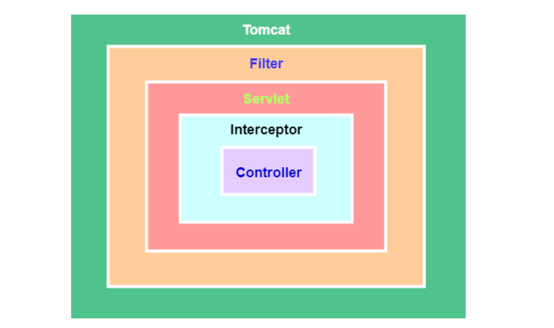
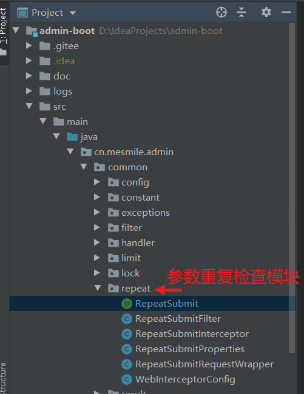
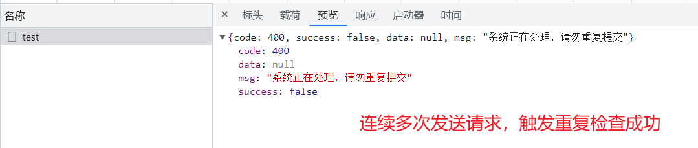

# (十四)redis注解实现限制重复提交

## 目录

*   [一、实现思路与原理](#一实现思路与原理)

    *   [过滤器原理](#过滤器原理)

    *   [拦截器原理](#拦截器原理)

*   [二、具体实现](#二具体实现)

    *   [自定义注解 RepeatSubmit ](#自定义注解-repeatsubmit-)

    *   [定义配置开关RepeatSubmitProperties ](#定义配置开关repeatsubmitproperties-)

    *   [定义拦截器RepeatSubmitInterceptor ](#定义拦截器repeatsubmitinterceptor-)

    *   [注册拦截器WebInterceptorConfig ](#注册拦截器webinterceptorconfig-)

    *   [定义过滤器包装RepeatSubmitRequestWrapper ](#定义过滤器包装repeatsubmitrequestwrapper-)

    *   [定义过滤器RepeatSubmitFilter ](#定义过滤器repeatsubmitfilter-)

    *   [注册过滤器RequestConfiguration ](#注册过滤器requestconfiguration-)

    *   [注意：这里 repeatSubmitRequestFilter 配置时 order 一定要设置为最大](#注意这里-repeatsubmitrequestfilter-配置时-order-一定要设置为最大)

    *   [定义重复检查异常](#定义重复检查异常)

    *   [全局拦截参数重复异常](#全局拦截参数重复异常)

    *   [项目结构](#项目结构)

*   [三、结果测试](#三结果测试)

## 一、实现思路与原理

这里主要采用 拦截器 的思想去做

### 过滤器原理

**过滤器几乎可以对所有进入容器的请求起作用，**

**而拦截器只会对**​**中请求或访问****目录下的资源请求起作用**​



\*\*init() \*\*：该方法在容器启动初始化过滤器时被调用，它在 **Filter 的整个生命周期只会被调用一次**。注意：这个方法必须执行成功，否则过滤器会不起作用。

\*\*doFilter() \*\*：**容器中的每一次请求都会调用该方法**， FilterChain 用来调用下一个过滤器 Filter。

**destroy()：** **当容器销毁 过滤器实例时调用该方法，一般在方法中销毁或关闭资源**，在过滤器 Filter 的整个生命周期也**只会被调用一次**

```java
public class RepeatSubmitFilter implements Filter {
    
    @Override
    public void init(FilterConfig filterConfig) throws ServletException {

        System.out.println("Filter 前置");
    }

    @Override
    public void doFilter(ServletRequest servletRequest, ServletResponse servletResponse, FilterChain filterChain) throws IOException, ServletException {

        System.out.println("Filter 处理中");
        filterChain.doFilter(servletRequest, servletResponse);
    }

    @Override
    public void destroy() {

        System.out.println("Filter 后置");
    }
}

@Bean
public FilterRegistrationBean<RepeatSubmitFilter> xssFilterRegistration() {
    FilterRegistrationBean<RepeatSubmitFilter> registration = new FilterRegistrationBean();
    registration.setDispatcherTypes(DispatcherType.REQUEST, new DispatcherType[0]);
    registration.setFilter(new RepeatSubmitFilter());
    registration.addUrlPatterns(new String[]{"/*"});
    registration.setName("xssRequestFilter");
    registration.setOrder(Integer.MAX_VALUE);
    return registration;
}

```

### 拦截器原理

`拦截器`加载的时间点在`springcontext`之前，而`Bean`又是由`spring`进行管理

**preHandle() ：**这个方法将在**请求处理之前**进行调用。注意：**如果该方法的返回值为false ，将视为当前请求结束**，不仅自身的拦截器会失效，还会导致其他的拦截器也不再执行。

**postHandle()：** 只有在 preHandle() 方法返回值为true 时才会执行。会在Controller 中的方法调用之后，**DispatcherServlet 返回渲染视图之前被调用**。 有意思的是：postHandle() 方法被调用的顺序跟 preHandle() 是相反的，先声明的拦截器 preHandle() 方法先执行，而postHandle()方法反而会后执行。

**afterCompletion()：** 只有在 preHandle() 方法返回值为true 时才会执行。**在整个请求结束之后， DispatcherServlet 渲染了对应的视图之后执行**。

```java
public class MyInterceptor implements HandlerInterceptor {

    @Override
    public boolean preHandle(HttpServletRequest request, HttpServletResponse response, Object handler) throws Exception {

        System.out.println("Interceptor 前置");
        return true;
    }

    @Override
    public void postHandle(HttpServletRequest request, HttpServletResponse response, Object handler, ModelAndView modelAndView) throws Exception {

        System.out.println("Interceptor 处理中");
    }

    @Override
    public void afterCompletion(HttpServletRequest request, HttpServletResponse response, Object handler, Exception ex) throws Exception {

        System.out.println("Interceptor 后置");
    }
}


@Configuration
public class MyMvcConfig implements WebMvcConfigurer {

    @Override
    public void addInterceptors(InterceptorRegistry registry) {
        registry.addInterceptor(new MyInterceptor()).addPathPatterns("/**");
        registry.addInterceptor(new MyInterceptor1()).addPathPatterns("/**");
    }
}

```

## 二、具体实现

### 自定义注解 RepeatSubmit&#x20;

```java
package cn.mesmile.admin.common.repeat;

import cn.mesmile.admin.common.constant.AdminConstant;

import java.lang.annotation.*;
import java.util.concurrent.TimeUnit;

/**
 * @author zb
 * @Description 检查重复提交
 */
@Target(ElementType.METHOD)
@Retention(RetentionPolicy.RUNTIME)
@Documented
public @interface RepeatSubmit {

    /**
     * 间隔时间，小于此时间视为重复提交
     */
    long interval() default 5000;

    /**
     * 默认时间单位 毫秒
     */
    TimeUnit timeUnit() default TimeUnit.MILLISECONDS;

    /**
     * 自定义判断重复的标识 支持 spring el 例如  #user.getName()
     * 当有多个表达式的时候中间用 ; 分割
     * 当此参数不为空的时候，就根据此处表达式获取的值来判断是否重复提交
     */
    String param() default "";

    /**
     * 默认缓存key的前缀
     */
    String prefix() default AdminConstant.REPEAT_SUBMIT_PREFIX;

    /**
     * 提示消息
     */
    String msg() default "系统正在处理，请勿重复提交";

}
```

### 定义配置开关RepeatSubmitProperties&#x20;

```java
package cn.mesmile.admin.common.repeat;

import lombok.Data;
import org.springframework.boot.context.properties.ConfigurationProperties;

import java.util.ArrayList;
import java.util.List;

/**
 * @author zb
 * @Description
 */
@Data
@ConfigurationProperties("repeat.submit")
public class RepeatSubmitProperties {

    /**
     * 是否开启重复检查，注解，默认 false
     */
    private Boolean enabled = Boolean.FALSE;
    /**
     * 放行路径
     */
    private List<String> skipUrl = new ArrayList<>();

}
```

### 定义拦截器RepeatSubmitInterceptor&#x20;

```java
package cn.mesmile.admin.common.repeat;

import cn.hutool.core.util.StrUtil;
import cn.hutool.crypto.digest.MD5;
import cn.mesmile.admin.common.exceptions.RepeatSubmitException;
import cn.mesmile.admin.common.filter.xss.WebUtil;
import cn.mesmile.admin.common.lock.AdminExpressionEvaluator;
import cn.mesmile.admin.common.result.ResultCode;
import cn.mesmile.admin.common.utils.AdminRedisTemplate;
import com.alibaba.fastjson.JSONObject;
import lombok.extern.slf4j.Slf4j;
import org.springframework.beans.BeansException;
import org.springframework.context.ApplicationContext;
import org.springframework.context.ApplicationContextAware;
import org.springframework.core.MethodParameter;
import org.springframework.http.MediaType;
import org.springframework.web.method.HandlerMethod;
import org.springframework.web.servlet.HandlerInterceptor;
import org.springframework.web.servlet.ModelAndView;

import javax.servlet.http.HttpServletRequest;
import javax.servlet.http.HttpServletResponse;
import java.io.IOException;
import java.lang.reflect.Method;
import java.lang.reflect.Parameter;
import java.nio.charset.StandardCharsets;
import java.util.*;

/**
 * @author zb
 * @Description
 */
@Slf4j
public class RepeatSubmitInterceptor implements HandlerInterceptor, ApplicationContextAware {

    private final AdminRedisTemplate adminRedisTemplate;

    private ApplicationContext applicationContext;

    public RepeatSubmitInterceptor(AdminRedisTemplate adminRedisTemplate) {
        this.adminRedisTemplate = adminRedisTemplate;
    }

    @Override
    public boolean preHandle(HttpServletRequest request, HttpServletResponse response, Object handler) throws Exception {
        if (handler instanceof HandlerMethod) {
            HandlerMethod handlerMethod = (HandlerMethod) handler;
            Method method = handlerMethod.getMethod();
            RepeatSubmit annotation = method.getAnnotation(RepeatSubmit.class);
            if (annotation != null) {
                if (this.isRepeatSubmit(request, annotation, handlerMethod)) {
                    throw new RepeatSubmitException(ResultCode.FAILURE, annotation.msg());
                }
            }
        }
        return true;
    }

    private static final AdminExpressionEvaluator EVALUATOR = new AdminExpressionEvaluator();

    /**
     * 是否是 重复提交
     * @param request 请求体
     * @param annotation 注解
     * @param handlerMethod 拦截方法
     * @return
     */
    private boolean isRepeatSubmit(HttpServletRequest request, RepeatSubmit annotation, HandlerMethod handlerMethod) {
        Method method = handlerMethod.getMethod();
        List<Object> objects = new ArrayList<>();
        String jsonValue = null;
        Map<String, String[]> parameterMap = null;
        if (request instanceof RepeatSubmitRequestWrapper) {
            RepeatSubmitRequestWrapper requestWrapper = (RepeatSubmitRequestWrapper) request;
            jsonValue = requestWrapper.getRequestBody();
            Parameter[] parameters = method.getParameters();
            if (parameters != null && parameters.length > 0 && StrUtil.isNotEmpty(jsonValue)) {
                for (Parameter parameter : parameters) {
                    Class<?> type = parameter.getType();
                    Object object = JSONObject.parseObject(jsonValue, type);
                    objects.add(object);
                }
            }
        } else {
            parameterMap = request.getParameterMap();
            if (parameterMap != null && parameterMap.size() > 0) {
                Collection<String[]> values = parameterMap.values();
                objects.addAll(values);
            }
        }
        String param = annotation.param();
        String value = "";
        // 提取自定义参数
        if (StrUtil.isNotBlank(param)) {
            value = EVALUATOR.evalLockParam(method, objects.toArray(), handlerMethod.getBean(), param, applicationContext);
        } else {
            if (request instanceof RepeatSubmitRequestWrapper) {
                // 提取json数据
                value = jsonValue;
            } else {
                // 读取 get 请求数据
                if (parameterMap != null && parameterMap.size() > 0) {
                    String parameters = JSONObject.toJSONString(parameterMap);
                    value = value + parameters;
                }
            }
        }
        String uri = request.getRequestURI();
        String key = annotation.prefix() + ":" + uri;
        if (StrUtil.isNotBlank(value)) {
            String md5Str = MD5.create().digestHex(value, StandardCharsets.UTF_8);
            key = key + ":" + md5Str;
        }
        boolean result = adminRedisTemplate.setIfAbsentExpire(key, value, annotation.interval(), annotation.timeUnit());
        if (!result) {
            log.error("重复提交异常：uri:{}, param:{}", uri, value);
        }
        return !result;
    }

    @Override
    public void postHandle(HttpServletRequest request, HttpServletResponse response, Object handler, ModelAndView modelAndView) throws Exception {

    }

    @Override
    public void afterCompletion(HttpServletRequest request, HttpServletResponse response, Object handler, Exception ex) throws Exception {

    }

    @Override
    public void setApplicationContext(ApplicationContext applicationContext) throws BeansException {
        this.applicationContext = applicationContext;
    }
}

```

### 注册拦截器WebInterceptorConfig&#x20;

```java
package cn.mesmile.admin.common.repeat;

import cn.mesmile.admin.common.utils.AdminRedisTemplate;
import org.springframework.boot.autoconfigure.condition.ConditionalOnProperty;
import org.springframework.boot.context.properties.EnableConfigurationProperties;
import org.springframework.context.annotation.Configuration;
import org.springframework.web.servlet.config.annotation.InterceptorRegistry;
import org.springframework.web.servlet.config.annotation.WebMvcConfigurer;

import javax.annotation.Resource;
import java.util.List;

/**
 * @author zb
 * @Description
 */
@EnableConfigurationProperties({RepeatSubmitProperties.class})
@Configuration(
        proxyBeanMethods = false
)
@ConditionalOnProperty(
        value = {"repeat.submit.enabled"},
        havingValue = "true"
)
public class WebInterceptorConfig implements WebMvcConfigurer {

    @Resource
    private RepeatSubmitProperties repeatSubmitProperties;

    @Resource
    private AdminRedisTemplate adminRedisTemplate;

    @Override
    public void addInterceptors(InterceptorRegistry registry) {
        RepeatSubmitInterceptor repeatSubmitInterceptor = new RepeatSubmitInterceptor(adminRedisTemplate);
        List<String> skipUrl = repeatSubmitProperties.getSkipUrl();
        // 注册过滤器，并且放行某些路径
        registry.addInterceptor(repeatSubmitInterceptor).excludePathPatterns(skipUrl);
    }
}
```

由于在拦截 @RequestBody 请求的json数据的时候，流不能够重复读，所以需要构建 可重复读的流，

这里用过滤器实现

### 定义过滤器包装RepeatSubmitRequestWrapper&#x20;

```java
package cn.mesmile.admin.common.repeat;

import cn.mesmile.admin.common.filter.xss.WebUtil;

import javax.servlet.ReadListener;
import javax.servlet.ServletInputStream;
import javax.servlet.ServletResponse;
import javax.servlet.http.HttpServletRequest;
import javax.servlet.http.HttpServletRequestWrapper;
import java.io.BufferedReader;
import java.io.ByteArrayInputStream;
import java.io.IOException;
import java.io.InputStreamReader;
import java.nio.charset.StandardCharsets;

/**
 * @author zb
 * @Description 构建可重复读的 InputStream
 */
public class RepeatSubmitRequestWrapper extends HttpServletRequestWrapper {

    private final byte[] body;

    public String getRequestBody() {
        return requestBody;
    }

    private final String requestBody;

    public RepeatSubmitRequestWrapper(HttpServletRequest request, ServletResponse response) throws IOException {
        super(request);
        request.setCharacterEncoding("UTF-8");
        response.setCharacterEncoding("UTF-8");

        requestBody = WebUtil.getRequestBody(request.getInputStream());
        body = requestBody.getBytes(StandardCharsets.UTF_8);
    }

    @Override
    public BufferedReader getReader() throws IOException {
        return new BufferedReader(new InputStreamReader(getInputStream()));
    }

    @Override
    public ServletInputStream getInputStream() throws IOException {
        final ByteArrayInputStream byteArrayInputStream = new ByteArrayInputStream(body);
        return new ServletInputStream() {
            @Override
            public int read() throws IOException {
                return byteArrayInputStream.read();
            }

            @Override
            public int available() throws IOException {
                return body.length;
            }

            @Override
            public boolean isFinished() {
                return false;
            }

            @Override
            public boolean isReady() {
                return false;
            }

            @Override
            public void setReadListener(ReadListener readListener) {

            }
        };
    }
}

```

### 定义过滤器RepeatSubmitFilter&#x20;

```java
package cn.mesmile.admin.common.repeat;

import cn.hutool.core.util.StrUtil;
import org.springframework.http.MediaType;

import javax.servlet.*;
import javax.servlet.http.HttpServletRequest;
import java.io.IOException;

/**
 * @author zb
 * @Description 包装可重复读的 inputStream
 */
public class RepeatSubmitFilter implements Filter {

    @Override
    public void init(FilterConfig filterConfig) throws ServletException {

    }

    @Override
    public void doFilter(ServletRequest request, ServletResponse response, FilterChain chain) throws IOException, ServletException {
        if (request instanceof HttpServletRequest
                // 只拦截 contentType 为 "application/json" 的请求头 做处理，可重复读
                && StrUtil.startWithIgnoreCase(request.getContentType(), MediaType.APPLICATION_JSON_VALUE)) {
            ServletRequest requestWrapper = new RepeatSubmitRequestWrapper((HttpServletRequest) request, response);
            chain.doFilter(requestWrapper, response);
        } else {
            chain.doFilter(request, response);
        }
    }

    @Override
    public void destroy() {

    }

}
```

### 注册过滤器RequestConfiguration&#x20;

### 注意：这里 repeatSubmitRequestFilter 配置时 order 一定要设置为最大

order越大优先级越低，最后执行

```java
package cn.mesmile.admin.common.filter;

import cn.mesmile.admin.common.filter.space.SpaceProperties;
import cn.mesmile.admin.common.filter.space.SpaceRequestFilter;
import cn.mesmile.admin.common.filter.xss.XssProperties;
import cn.mesmile.admin.common.filter.xss.XssRequestFilter;
import cn.mesmile.admin.common.repeat.RepeatSubmitFilter;
import org.springframework.boot.context.properties.EnableConfigurationProperties;
import org.springframework.boot.web.servlet.FilterRegistrationBean;
import org.springframework.context.annotation.Bean;
import org.springframework.context.annotation.Configuration;

import javax.servlet.DispatcherType;

/**
 * @author zb
 * @Description 配置注册过滤器
 */
@Configuration(
        proxyBeanMethods = false
)
@EnableConfigurationProperties({XssProperties.class, SpaceProperties.class})
public class RequestConfiguration {

    private final SpaceProperties spaceProperties;
    private final XssProperties xssProperties;

    @Bean
    public FilterRegistrationBean<XssRequestFilter> xssFilterRegistration() {
        FilterRegistrationBean<XssRequestFilter> registration = new FilterRegistrationBean();
        registration.setDispatcherTypes(DispatcherType.REQUEST, new DispatcherType[0]);
        registration.setFilter(new XssRequestFilter(this.xssProperties));
        registration.addUrlPatterns(new String[]{"/*"});
        registration.setName("xssRequestFilter");
        registration.setOrder(Integer.MAX_VALUE - 1);
        return registration;
    }

    @Bean
    public FilterRegistrationBean<SpaceRequestFilter> spaceFilterRegistration() {
        FilterRegistrationBean<SpaceRequestFilter> registration = new FilterRegistrationBean();
        registration.setDispatcherTypes(DispatcherType.REQUEST, new DispatcherType[0]);
        registration.setFilter(new SpaceRequestFilter(this.spaceProperties));
        registration.addUrlPatterns(new String[]{"/*"});
        registration.setName("spaceRequestFilter");
        registration.setOrder(Integer.MAX_VALUE - 2);
        return registration;
    }

    /**
     * 注意这里  RepeatSubmitFilter 需要放在最后，即  setOrder 最大
     */
    @Bean
    public FilterRegistrationBean<RepeatSubmitFilter> repeatSubmitFilterRegistration() {
        FilterRegistrationBean<RepeatSubmitFilter> registration = new FilterRegistrationBean();
        registration.setDispatcherTypes(DispatcherType.REQUEST, new DispatcherType[0]);
        registration.setFilter(new RepeatSubmitFilter());
        registration.addUrlPatterns(new String[]{"/*"});
        registration.setName("repeatSubmitRequestFilter");
        registration.setOrder(Integer.MAX_VALUE);
        return registration;
    }

    public RequestConfiguration(final XssProperties xssProperties, final SpaceProperties spaceProperties) {
        this.xssProperties = xssProperties;
        this.spaceProperties = spaceProperties;
    }

}

```

### 定义重复检查异常

```java
package cn.mesmile.admin.common.exceptions;


import cn.mesmile.admin.common.result.IResultCode;
import cn.mesmile.admin.common.result.ResultCode;

/**
 * @author zb
 * @Description 频率限制异常
 */
public class RepeatSubmitException extends RuntimeException {

    private final long serialVersionUID = 1L;

    private int code = ResultCode.FAILURE.getCode();

    private String msg = ResultCode.FAILURE.getMessage();

    public RepeatSubmitException() {
        super();
    }

    public RepeatSubmitException(String msg) {
        super(msg);
        this.msg = msg;
    }

    public RepeatSubmitException(IResultCode resultCode, String msg) {
        super(msg);
        this.code = resultCode.getCode();
        this.msg = msg;
    }

    public RepeatSubmitException(String msg, Throwable cause) {
        super(msg, cause);
        this.msg = msg;
    }

    public RepeatSubmitException(IResultCode resultCode, String msg, Throwable cause) {
        super(msg, cause);
        this.code = resultCode.getCode();
        this.msg = msg;
    }

    public RepeatSubmitException(Throwable cause) {
        super(cause);
    }

    public int getCode() {
        return code;
    }

    public void setCode(int code) {
        this.code = code;
    }

    public String getMsg() {
        return msg;
    }

    public void setMsg(String msg) {
        this.msg = msg;
    }
}

```

### 全局拦截参数重复异常

```java
package cn.mesmile.admin.common.handler;

import cn.mesmile.admin.common.constant.AdminConstant;
import cn.mesmile.admin.common.exceptions.*;
import cn.mesmile.admin.common.result.R;
import lombok.extern.slf4j.Slf4j;
import org.springframework.validation.BindException;
import org.springframework.validation.BindingResult;
import org.springframework.validation.FieldError;
import org.springframework.web.bind.MethodArgumentNotValidException;
import org.springframework.web.bind.annotation.ExceptionHandler;
import org.springframework.web.bind.annotation.RestControllerAdvice;

import javax.validation.ConstraintViolation;
import javax.validation.ConstraintViolationException;
import javax.validation.ValidationException;
import java.util.stream.Collectors;

/**
 * @author zb
 * @Description 全局异常拦截
 * <p>
 * 如果我同时捕获了父类和子类，那么到底能够被那个异常处理器捕获呢？比如 Exception 和 BusinessException
 * 当然是 BusinessException 的异常处理器捕获了，精确匹配，如果没有 BusinessException 的异常处理器才会轮到它的 父亲 ，
 * 父亲 没有才会到 祖父 。总之一句话， 精准匹配，找那个关系最近的
 * </p>
 */
@Slf4j
@RestControllerAdvice
public class GlobalExceptionHandler {

    /**
     * 重复提交异常信息
     * */
    @ExceptionHandler(RepeatSubmitException.class)
    public R handle(RepeatSubmitException repeatSubmitException) {
        // 获取指定包名前缀的异常信息，减少不必要的日志
//        String stackTraceByPn = getStackTraceByPn(rateLimiterException, AdminConstant.BASE_PACKAGE);
        log.error("重复提交异常信息, 消息:{} 编码:{}", repeatSubmitException.getMessage(), repeatSubmitException.getCode());
        return R.fail(repeatSubmitException.getCode(), repeatSubmitException.getMessage());
    }
}
```

### 项目结构



## 三、结果测试

```java
package cn.mesmile.admin.modules.system.controller;

import cn.mesmile.admin.common.repeat.RepeatSubmit;
import cn.mesmile.admin.common.result.R;
import cn.mesmile.admin.common.utils.AdminRedisTemplate;
import cn.mesmile.admin.modules.system.entity.Sys;
import io.swagger.annotations.Api;
import io.swagger.annotations.ApiImplicitParam;
import io.swagger.annotations.ApiImplicitParams;
import io.swagger.annotations.ApiOperation;
import lombok.extern.slf4j.Slf4j;
import org.springframework.web.bind.annotation.*;

import javax.annotation.Resource;
import javax.servlet.http.HttpServletRequest;

/**
 * @author zb
 * @Description
 */
@Api(tags = "用户登录测试接口")
@Slf4j
@RequestMapping("/api/v1/hello")
@RestController
public class HelloController {

    @Resource
    private AdminRedisTemplate adminRedisTemplate;

    /**
    * 这里自定义 两个字段来验证 验证是否重复
    */
    @RepeatSubmit(interval = 5000, param = "#s.hello;#s.world")
    @PostMapping("/test")
    public R submit(@RequestBody Sys s){
        System.out.println("s = " + s);
        return R.data(s);
    }

}

@Data
public class Sys {

    private String hello;

    private String world;
    
    private String test;
}

```


