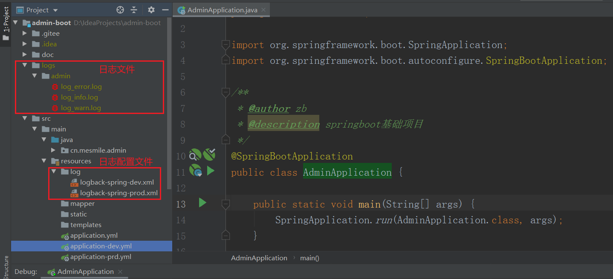

# (四)整合日志框架logback

## 目录

*   [一、编写logback 日志配置文件](#一编写logback-日志配置文件)

*   [二、修改项目配置文件](#二修改项目配置文件)

*   [二、启动项目验证](#二启动项目验证)

## 一、编写logback 日志配置文件

配置文件均在  \admin-boot\src\main\resources 目录下

在resources目录下新建 log 文件夹，在此目录下新建 logback-spring-dev.xml 日志配置文件

```xml
<?xml version="1.0" encoding="UTF-8"?>
<!-- 日志级别从低到高分为TRACE < DEBUG < INFO < WARN < ERROR < FATAL，比如: 如果设置为WARN，则低于WARN的信息都不会输出 -->
<!-- scan:当此属性设置为true时，配置文档如果发生改变，将会被重新加载，默认值为true -->
<!-- scanPeriod:设置监测配置文档是否有修改的时间间隔，如果没有给出时间单位，默认单位是毫秒。当scan为true时，此属性生效。默认的时间间隔为1分钟。 -->
<!-- debug:当此属性设置为true时，将打印出logback内部日志信息，实时查看logback运行状态。默认值为false。 -->
<configuration scan="true" scanPeriod="60 seconds" debug="false">
    <springProperty scope="context" name="app_name" source="spring.application.name" />
    <!--<include resource="org/springframework/boot/logging/logback/base.xml" />-->

    <contextName>logback</contextName>
    <!-- name的值是变量的名称，value的值时变量定义的值。通过定义的值会被插入到logger上下文中。定义变量后，可以使“${}”来使用变量。 -->
    <!--定义日志存放跟目录-->
    <property name="logPath" value="logs/${app_name}" />
    <!--每个日志文件最大100MB，超过就重新生成-->
    <property name="log.max.file.size" value="100MB"/>
    <!--只保留最近60天的日志-->
    <property name="log.max.history" value="60"/>
    <!--用来指定总的日志文件的上限大小，那么到了这个值，就会删除旧的日志-->
    <property name="log.total.size" value="3GB"/>

    <conversionRule conversionWord="clr" converterClass="org.springframework.boot.logging.logback.ColorConverter" />
    <conversionRule conversionWord="wex" converterClass="org.springframework.boot.logging.logback.WhitespaceThrowableProxyConverter" />
    <conversionRule conversionWord="wEx" converterClass="org.springframework.boot.logging.logback.ExtendedWhitespaceThrowableProxyConverter" />
    <!--控制台日志格式-->
    <property name="CONSOLE_LOG_PATTERN" value="${CONSOLE_LOG_PATTERN:-%clr(%d{${LOG_DATEFORMAT_PATTERN:-yyyy-MM-dd HH:mm:ss.SSS}}){faint} %clr(${LOG_LEVEL_PATTERN:-%5p}) %clr(${PID:- }){magenta} %clr(---){faint} %clr([%15.15t]){faint} %clr(%-40.40logger{39}){cyan} %clr(:){faint} %m%n${LOG_EXCEPTION_CONVERSION_WORD:-%wEx}}"/>
    <!--文件日志格式-->
    <property name="FILE_LOG_PATTERN" value="${FILE_LOG_PATTERN:-%d{${LOG_DATEFORMAT_PATTERN:-yyyy-MM-dd HH:mm:ss.SSS}} ${LOG_LEVEL_PATTERN:-%5p} ${PID:- } --- [%t] %-40.40logger{39} : %m%n${LOG_EXCEPTION_CONVERSION_WORD:-%wEx}}"/>

      <!-- 日志输出的格式-->
    <!--   <property name="PATTERN" value="%d{yyyy-MM-dd HH:mm:ss.SSS} [%t-%L] %-5level %logger{36} %L %M - %msg%xEx%n"/>-->
    <contextName>logback</contextName>
      <!--输出到控制台 ConsoleAppender-->
    <appender name="consoleLog" class="ch.qos.logback.core.ConsoleAppender">
        <!--展示格式 layout-->
        <layout class="ch.qos.logback.classic.PatternLayout">
            <pattern>${CONSOLE_LOG_PATTERN}</pattern>
        </layout>
    </appender>

    <!--正常的info日志文件，输出到文件中-->
    <appender name="INFO_FILE" class="ch.qos.logback.core.rolling.RollingFileAppender">
            <!--如果只是想要 Info 级别的日志，只是过滤 info 还是会输出 Error 日志，因为 Error 的级别高，
    所以我们使用下面的策略，可以避免输出 Error 的日志,级别的其它高于DEBUG的-->
        <filter class="ch.qos.logback.classic.filter.LevelFilter">
            <!--过滤 info-->
            <level>INFO</level>
            <!--匹配到就运行-->
            <onMatch>ACCEPT</onMatch>
            <!--没有匹配到就禁止-->
            <onMismatch>DENY</onMismatch>
        </filter>
            <!--日志名称，如果没有File 属性，那么只会使用FileNamePattern的文件路径规则
      如果同时有<File>和<FileNamePattern>，那么当天日志是<File>，明天会自动把今天
      的日志改名为今天的日期。即，<File> 的日志都是当天的。-->
        <File>${logPath}/log_info.log</File>
            <!--滚动策略，按照时间滚动 TimeBasedRollingPolicy-->
        <rollingPolicy class="ch.qos.logback.core.rolling.SizeAndTimeBasedRollingPolicy">
            <!--文件路径,定义了日志的切分方式——把每一天的日志归档到一个文件中,
            以防止日志填满整个磁盘空间-->
            <FileNamePattern>${logPath}/info/%d{yyyy-MM-dd}/log-info-%i.gz</FileNamePattern>
            <!--每个日志文件最大100MB，超过就重新生成-->
            <maxFileSize>${log.max.file.size}</maxFileSize>
            <!--只保留最近60天的日志-->
            <maxHistory>${log.max.history}</maxHistory>
            <!--用来指定总的日志文件的上限大小，那么到了这个值，就会删除旧的日志-->
            <totalSizeCap>${log.total.size}</totalSizeCap>
        </rollingPolicy>
            <!--日志输出编码格式化-->
        <encoder>
            <charset>UTF-8</charset>
            <pattern>${FILE_LOG_PATTERN}</pattern>
        </encoder>
    </appender>

    <!--正常的warn日志文件，输出到文件中-->
    <appender name="WARN_FILE" class="ch.qos.logback.core.rolling.RollingFileAppender">
            <!--如果只是想要 Info 级别的日志，只是过滤 info 还是会输出 Error 日志，因为 Error 的级别高，
    所以我们使用下面的策略，可以避免输出 Error 的日志,级别的其它高于DEBUG的-->
        <filter class="ch.qos.logback.classic.filter.LevelFilter">
            <!--过滤 warn-->
            <level>WARN</level>
            <!--匹配到就运行-->
            <onMatch>ACCEPT</onMatch>
            <!--没有匹配到就禁止-->
            <onMismatch>DENY</onMismatch>
        </filter>
        <File>${logPath}/log_warn.log</File>
            <!--滚动策略，按照时间滚动 TimeBasedRollingPolicy-->
        <rollingPolicy class="ch.qos.logback.core.rolling.SizeAndTimeBasedRollingPolicy">
            <!--文件路径,定义了日志的切分方式——把每一天的日志归档到一个文件中,
            以防止日志填满整个磁盘空间-->
            <FileNamePattern>${logPath}/warn/%d{yyyy-MM-dd}/log-warn-%i.gz</FileNamePattern>
            <!--每个日志文件最大100MB，超过就重新生成-->
            <maxFileSize>${log.max.file.size}</maxFileSize>
            <!--只保留最近60天的日志-->
            <maxHistory>${log.max.history}</maxHistory>
            <!--用来指定总的日志文件的上限大小，那么到了这个值，就会删除旧的日志-->
            <totalSizeCap>${log.total.size}</totalSizeCap>
        </rollingPolicy>
            <!--日志输出编码格式化-->
        <encoder>
            <charset>UTF-8</charset>
            <pattern>${FILE_LOG_PATTERN}</pattern>
        </encoder>
    </appender>


    <!--正常的error日志文件，输出到文件中-->
    <appender name="ERROR_FILE" class="ch.qos.logback.core.rolling.RollingFileAppender">
            <!--如果只是想要 Info 级别的日志，只是过滤 info 还是会输出 Error 日志，因为 Error 的级别高，
    所以我们使用下面的策略，可以避免输出 Error 的日志,级别的其它高于DEBUG的-->
        <filter class="ch.qos.logback.classic.filter.LevelFilter">
            <!--过滤 error-->
            <level>ERROR</level>
            <!--匹配到就运行-->
            <onMatch>ACCEPT</onMatch>
            <!--没有匹配到就禁止-->
            <onMismatch>DENY</onMismatch>
        </filter>
        <File>${logPath}/log_error.log</File>
            <!--滚动策略，按照时间滚动 TimeBasedRollingPolicy-->
        <rollingPolicy class="ch.qos.logback.core.rolling.SizeAndTimeBasedRollingPolicy">
            <!--文件路径,定义了日志的切分方式——把每一天的日志归档到一个文件中,
            以防止日志填满整个磁盘空间-->
            <FileNamePattern>${logPath}/error/%d{yyyy-MM-dd}/log-error-%i.gz</FileNamePattern>
            <!--每个日志文件最大100MB，超过就重新生成-->
            <maxFileSize>${log.max.file.size}</maxFileSize>
            <!--只保留最近60天的日志-->
            <maxHistory>${log.max.history}</maxHistory>
            <!--用来指定总的日志文件的上限大小，那么到了这个值，就会删除旧的日志-->
            <totalSizeCap>${log.total.size}</totalSizeCap>
        </rollingPolicy>
            <!--日志输出编码格式化-->
        <encoder>
            <charset>UTF-8</charset>
            <pattern>${FILE_LOG_PATTERN}</pattern>
        </encoder>
    </appender>


    <!--开启异步日志记录 异步输出，异步的log片段必须在同步段后面，否则不起作用 -->
    <appender name="INFO_FILE_ASYNC" class="ch.qos.logback.classic.AsyncAppender">
        <!-- 不丢失日志.默认的,如果队列的80%已满,则会丢弃TRACT、DEBUG、INFO级别的日志 -->
        <discardingThreshold >0</discardingThreshold>
        <!-- 更改默认的队列的深度,该值会影响性能.默认值为256 -->
        <queueSize>1024</queueSize>
        <!-- 不设置neverBolck的话调用的是put方法是阻塞的，设置后调用offer方法是不阻塞的-->
        <neverBlock>true</neverBlock>
        <appender-ref ref="INFO_FILE"/>
    </appender>

    <!--开启异步日志记录 异步输出，异步的log片段必须在同步段后面，否则不起作用 -->
    <appender name="WARN_FILE_ASYNC" class="ch.qos.logback.classic.AsyncAppender">
        <discardingThreshold >0</discardingThreshold>
        <queueSize>1024</queueSize>
        <neverBlock>true</neverBlock>
        <appender-ref ref="WARN_FILE"/>
    </appender>

    <!--开启异步日志记录 异步输出，异步的log片段必须在同步段后面，否则不起作用 -->
    <appender name="ERROR_FILE_ASYNC" class="ch.qos.logback.classic.AsyncAppender">
        <discardingThreshold >0</discardingThreshold>
        <queueSize>1024</queueSize>
        <neverBlock>true</neverBlock>
        <appender-ref ref="ERROR_FILE"/>
    </appender>

    <!--指定最基础的日志输出级别  INFO DEBUG-->
    <root level="INFO">
        <!--appender将会添加到这个loger-->
        <appender-ref ref="consoleLog"/>
        <appender-ref ref="INFO_FILE_ASYNC"/>
        <appender-ref ref="WARN_FILE_ASYNC"/>
        <appender-ref ref="ERROR_FILE_ASYNC"/>
    </root>

</configuration>
```

## 二、修改项目配置文件

配置文件均在  \admin-boot\src\main\resources 目录下

修改配置文件 application-dev.yml ，在配置中指定日志配置文件所在位置

application-dev.yml

```yaml
spring:
  datasource:
    driver-class-name: com.mysql.cj.jdbc.Driver
    url: jdbc:mysql://81.69.43.78:3306/admin-boot?useUnicode=true&characterEncoding=utf-8&useSSL=false&serverTimezone=GMT%2B8
    username: root
    password: task,.123

# 指定日志配置文件位置
logging:
  config: classpath:log/logback-spring-dev.xml
```

## 二、启动项目验证

运行项目启动类 cn.mesmile.admin.AdminApplication



可以看到在项目根目录下，已经生成 日志文件
